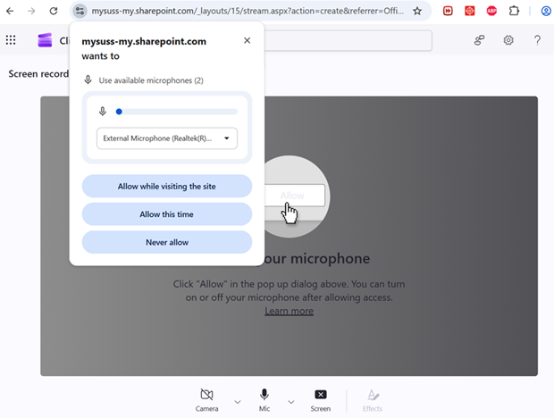
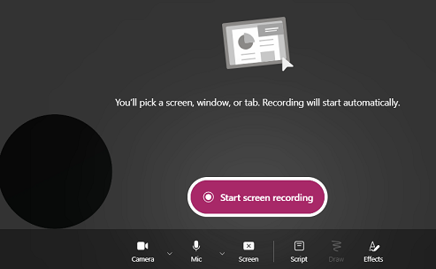
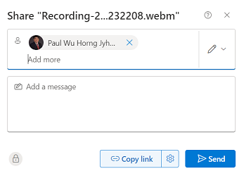
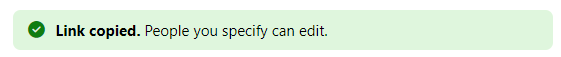

## Assignments

In this course, there are group based and individual assignments. 

For the group based assignment, you will be working within your group of 4-5 members. Everyone in the team is expected to contribute to the assignment. The elected group leader will be the one responsible to upload the report on behalf of the group.

For individual assignments such as TMA and ECA, you are expected to complete the assignment on your own.

## GBA
For GBA, please take note of the following:

-   There is no restriction on the drawing tools you can use. You can consider hand drawn or using free tools such as [draw.io](https://app.diagrams.net/) or [Mermaid](https://mermaid.js.org/).

-   Submit the group Word report in Canvas T group under **GBA01**.

-   For your word report, it should contain the following **2** questions.

    - Question 1
        -   You are expected to draw a class diagram and include it in the word report.

    - Question 2
        -   For part (a), you are required to submit your work (`README.md` file) in your group GitHub repository. Each member must collaborate, contribute and approve portions of the content in the scenario during the creation process.

        -   For the remaining parts, you are expected to include it in the word report.

---

- Question 3
    -   Use Jira to create your sprints and user stories.
    -   **NOTE:** Please enroll your instructor to your Jira project to allow access for grading.

- Question 4
    -   Navigate to Canvas T group under **PE01** assignment which uses the **Peerceptiv** system.
    -   Each student will be required to complete individual evaluation of their team members.
    -   Choose **1** of the team members evaluation to include your self assessment.

**References:**
* [Creating UML Class Diagram](https://www.drawio.com/blog/uml-class-diagrams)
* [Creating Sequence Diagram](https://www.drawio.com/blog/sequence-diagrams)
* [Mermaid Diagram Examples](https://mermaid.js.org/syntax/examples.html)

## TMA

For TMA, this is an individual based assignment.

Please ensure you have access to your **StaycationX** GitHub assignment repository.

For Question 1, create a Word report with your solutions and submit it in Canvas T group under **TMA01** assignment.

For Question 2, complete and submit your work in your `StaycationX` GitHub assignment repository, including the `README.md` file specified in part (d) of the question. 

For part (d), you may take reference from [OneMap API documentation](https://www.onemap.gov.sg/apidocs/search).

## ECA

For ECA, this is an individual based assignment as well.

We will continue to use the GitHub repositories from TMA.

Please submit your work for Questions 1 and 4 in a Word document on Canvas T group **ECA** assignment.

For Questions 2 and 3, submit your work in the GitHub repository. Additionally, for question 3, record the program run using **Microsoft Stream**, share the recording, and place the recording link in your GitHub repository README file.

Please follow the steps below to use Microsoft Stream for recording:

1. Visit [Microsoft Stream website](https://www.microsoft.com/en-sg/microsoft-365/microsoft-stream) and sign in using your SUSS credentials.

2. On the main page, click **Screen recording**.

   

3. A new browser will open. Please allow access to your camera and microphone by clicking on the **Allow** button.

   

4. On the bottom left, there is circle. This is the camera output. You can click on it and press the X icon to delete it.

   

5. Click **Start screen recording** to start recording.

6. There are three options. Please pick the one that fits you and click **Share**.

    * Chrome Tab
    * Window
    * Entire Screen

7. Perfom your screen recording.
   
8. Once you have completed, click on the **Stop Sharing** button.

9.  A preview of the recording is shown in the browser.

10. Click **Finish** button to save the recording.

11. At the top menu bar, click on the **Share** button.

12. Add your instructor name into the box and click **Copy link**.

    Sample screenshot:

    

13. You should see the success message.

    

14. Close the prompt box.

15. Place the recording link into the `README` file.

## Assignment Deadlines

Each assignment has its own deadline. Once the deadline is over, you will lose write access to the respective assignment GitHub repositories. Please ensure that you submit all your assignments before the deadline. Late submissions will not be entertained.

