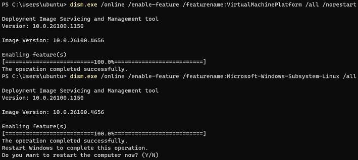
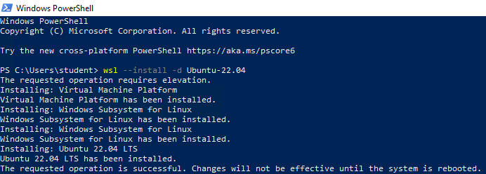
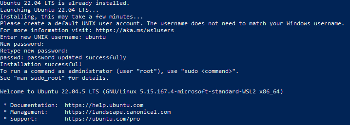
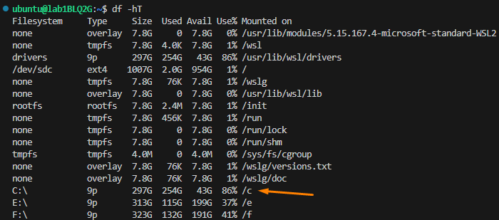
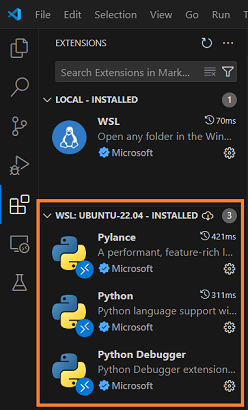
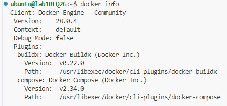

# Lab - Preparing the local lab environment (Windows)

This lab will guide you through the setup of your local machine to prepare for the subsequent lab exercises.

## Pre-requisite
- You have administrative rights to your computer.
- Your system meets the requirements for running WSL (Windows Subsystem for Linux).

## Instructions
The tasks for this lab are as follows:

#### Tasks for WSL:
* Installing WSL
* Configuring accesssing Windows files in WSL

#### Common Tasks between WSL and ALS:
* Installing python pip and virtual environment in WSL
* Installing Firefox in WSL
* Installing MongoDB Community Edition in WSL
* Starting MongoDB and enabling it to start on boot
* Downloading and installing MongoDB Compass
* Downloading and installing VSCode
* Installing extensions in VSCode IDE
* Downloading and installing Docker Engine in WSL

#### Tasks for Windows:
* Downloading and installing Putty
* Downloading and installing Windows X Server

**NOTE:** These instructions assume the default WSL username is `ubuntu`. It is highly recommended to use the default WSL username. If yours is different, substitute your username accordingly.

## Task 1: Installing WSL

WSL (Windows Subsystem for Linux) allows you to run a Linux environment directly on Windows without the need for a virtual machine. This is essential for running Linux-based tools and applications.

Pre-requisite: You must be running Windows 10 version 2004 and higher (Build 19041 and higher) or Windows 11.

For older versions of Windows, you can refer to the [Microsoft documentation](https://learn.microsoft.com/en-us/windows/wsl/install-manual) for manual install.

#### For Windows 11:
1. Open **Terminal** in Admin mode:
   -  Right click on the Windows Start Menu and select **Terminal (Admin)**.

2. Run the following commands to enable WSL and enter **y** when prompted to reboot.

   ```powershell
   dism.exe /online /enable-feature /featurename:VirtualMachinePlatform /all /norestart
   dism.exe /online /enable-feature /featurename:Microsoft-Windows-Subsystem-Linux /all
   ```

   Sample Screenshot:

   

   > NOTE: The computer restarts immediately when **y** is pressed.

3. Run the following command to install Ubuntu 22.04 distribution in Windows Subsystem for Linux (WSL) after the reboot of the machine.

     -  Right-click on the Windows Start Menu and select **Terminal (Admin)**.

         ```powershell
         wsl --install -d Ubuntu-22.04
         ```

#### For Windows 10:
1. Open **Windows Powershell** in Admin mode:
   -  Right click on the Windows Start Menu and select **Windows Powershell (Admin)**.

2. Install Ubuntu 22.04 on WSL:
   -  Run the following command to install Ubuntu 22.04 distribution in Windows Subsystem for Linux (WSL). Click **Yes** if there are prompts from User Account Control.

      ```powershell
      wsl --install -d Ubuntu-22.04
      ```

      

3. Reboot your computer when prompted.

---

4. The Ubuntu 22.04 LTS window will appear and display the message **"Installing, this may take a few minutes..."**.

5. You will be prompted to enter a username and password. This will be your default user account for WSL.

   |Field|Value|
   |---|---|
   |new UNIX username| ubuntu|
   |New Password| Your preferred password|
   |Retype new password| Re-enter your preferred password|

6. After user creation, you should see the following sample screen.

   

## Task 2: Configuring accessing Windows files in WSL

Configuring WSL to access Windows files allows seamless interaction between the Linux and Windows environments.

### Steps:

1. Open WSL Terminal.

2. Create a configuration file at **/etc/wsl.conf**.

   ```bash
   sudo nano /etc/wsl.conf
   ```

3. Add the following content to the file on a new line.

    ```bash
    [automount]
    root = /
    options = "metadata"
    ```
4. Save the file:
   - Press `Ctrl+O` first, then `Enter`.
   - Exit by pressing `Ctrl+X`.

5. Navigate back to Windows Terminal or Windows Powershell to run the command to shutdown WSL.

   ```powershell
   wsl --shutdown
   ```

6. Restart WSL by launching the Ubuntu WSL.

7. Verify access to Windows drives.

   ```bash
   df -hT
   ```

   
    
9. Notice that you can now access your local drives by navigating to the `<drive letter>`.
 
   ```bash
   # For instance, to access your C drive.
   cd /c
   ```    

## Task 3: Installing python pip and virtual environment in WSL

Installing Python pip and virtual environment in WSL allows you to manage Python packages and create isolated environments for your projects.

### Steps:

1. Open WSL Terminal.

2. Update package list and install Python tools:

   ```bash
   sudo apt-get update
   sudo apt-get install python3-pip python3-venv -y
   ```

## Task 4: Installing Firefox in WSL

Firefox is packaged as a Snap app rather than a traditional DEB version to provide better isolation and security. However, there are some drawbacks to using Snap, including potential issues with certain features not functioning properly within its sandboxed environment. Specifically, for compatibility with Selenium testing, the DEB version of Firefox is recommended, as the Snap version may not work as expected for this purpose due to sandboxing restrictions.

### Steps:

1. Open Terminal.

2. Create an APT keyring.

   ```bash
   sudo install -d -m 0755 /etc/apt/keyrings
   ```

3. Import the Mozilla APT repo signing key.
   
   ```bash
   wget -q https://packages.mozilla.org/apt/repo-signing-key.gpg -O- | \
   sudo tee /etc/apt/keyrings/packages.mozilla.org.asc > /dev/null
   ```

4. Add the Mozilla signing key to your sources.list file.

   ```bash
   echo "deb [signed-by=/etc/apt/keyrings/packages.mozilla.org.asc] \
   https://packages.mozilla.org/apt mozilla main" | sudo tee -a /etc/apt/sources.list.d/mozilla.list > /dev/null
   ```

5. Set the Firefox package priority to ensure Mozilla’s Deb version is always preferred. If you don’t do this the Ubuntu transition package could replace it, reinstalling the Firefox Snap.

    ```bash
    echo -e 'Package: *\nPin: origin packages.mozilla.org\nPin-Priority: 1000'  \
    | sudo tee /etc/apt/preferences.d/mozilla
    ```
6. Reload the local package database.

   ```bash
   sudo apt-get update
   ```

7. Install the Firefox DEB in Ubuntu.

   ```bash
   sudo apt-get install firefox --allow-downgrades -y
   ```

## Task 5: Installing MongoDB Community Edition in WSL

MongoDB is a NoSQL database required for storing and managing data.

### Steps:

1. Open Terminal.

2. Import the public key.

   ```bash
   # Install gnupg and curl if not available.
   sudo apt-get install gnupg curl -y
   ```

   To import the MongoDB public GPG Key, run the following command:

   ```bash
   curl -fsSL https://www.mongodb.org/static/pgp/server-7.0.asc | \
   sudo gpg -o /usr/share/keyrings/mongodb-server-7.0.gpg --dearmor
   ```

3. Create a list file for MongoDB.

   ```bash
   echo "deb [ arch=amd64,arm64 signed-by=/usr/share/keyrings/mongodb-server-7.0.gpg ] \
   https://repo.mongodb.org/apt/ubuntu jammy/mongodb-org/7.0 multiverse" | \
   sudo tee /etc/apt/sources.list.d/mongodb-org-7.0.list
   ```

4. Reload the package database.

   ```bash
   sudo apt-get update
   ```

5. Install the MongoDB Community Server.

   ```bash
   sudo apt-get install -y mongodb-org
   ```

## Task 6: Starting MongoDB and enabling it to start on boot

1. In WSL, enter the following command to start MongoDB.

   ```bash
   sudo systemctl start mongod
   ```

2. To enable MongoDB to start on boot, enter the following command.

   ```bash
   sudo systemctl enable mongod
   ```

## Task 7: Downloading and installing MongoDB Compass

MongoDB Compass is a graphical user interface (GUI) for MongoDB that allows you to visualize and interact with your database. Kindly note that this application is installed on the host machine (Windows) and not in WSL.

1. Navigate to the [MongoDB Compass](https://www.mongodb.com/try/download/compass) website.

2. Click on the green **Download** button.

3. Run the installer and follow on-screen instructions to install MongoDB Compass.


## Task 8: Downloading and installing VSCode

1. Navigate to the [Visual Studio Code](https://code.visualstudio.com/) website.

2. Click on **Download for Windows**.

3. Run the installer and follow on-screen instructions to install VSCode.

## Task 9: Installing extensions in VSCode IDE

### Steps:

1. Launch VSCode.

2. Open a remote WSL window:
   -  Click on the >< icon on the bottom left corner to open a remote Window.
   -  Choose **WSL** from the dropdown list.

3. Install Python extension:
   -  Click **Extensions** on the left menu bar.
   -  Search for **Python** and click **Install**.

4. Verify the Python extension is installed under WSL Ubuntu 22.04:
   -  You should see the Python extension under the **Installed Extensions**.
   -  Refer to the screenshot for reference.

      

5. Install Jupyter extension:
      -  Click **Extensions** on the left menu bar.
      -  Search for **Jupyter** and click **Install**.

6. (Optional) You may consider installing other extensions that may assist you in the subsequent labs.

    -   [Live Share by Microsoft](https://marketplace.visualstudio.com/items?itemName=MS-vsliveshare.vsliveshare)
    -   [YAML by Red Hat](https://marketplace.visualstudio.com/items?itemName=redhat.vscode-yaml)
    -   [Ansible by Red Hat](https://marketplace.visualstudio.com/items?itemName=redhat.ansible)
    -   [HashiCorp Terraform by HashiCorp](https://marketplace.visualstudio.com/items?itemName=HashiCorp.terraform)
    -   [Git Graph by mhutchie](https://marketplace.visualstudio.com/items?itemName=mhutchie.git-graph)
    -   [GitHub Pull Requests by Github](https://marketplace.visualstudio.com/items?itemName=GitHub.vscode-pull-request-github)

## Task 10: Downloading and installing Putty

Putty is a free SSH client for Windows that allows you to connect to remote servers securely. It should be installed on the host machine (Windows).

### Steps:

1. Navigate to the [Putty Download Page](https://www.chiark.greenend.org.uk/~sgtatham/putty/latest.html) website.

2. Download the **64 bit x86 MSI Windows Installer** (latest version at the time of writing is `0.83`)

3. Run the installer and follow on-screen instructions to install Putty.

4. Verify the installation:
   -  Open Putty and ensure the application launches without errors.

## Task 11: Downloading and installing Windows X Server

Windows X Server allows you to run GUI based Linux application from WSL.

If you're using Windows 11 with WSLg, you can skip this step, as WSLg automatically supports graphical Linux applications, allowing them to run seamlessly on your Windows desktop without any additional setup.

### Steps:

1. Download the Windows X Server Installer:
   -  Click on this [link](https://github.com/marchaesen/vcxsrv/releases/download/21.1.10/vcxsrv-64.21.1.10.0.installer.exe) to download Windows X Server.

2. Run the installer and follow on-screen instructions to install Windows X Server.

3. Launch the X server:
   -  Click on the **XLaunch** shortcut in the Windows Start Menu.

4. Configure X Server settings:
   -  Under **Display Settings**, leave everything as default and click **Next**.
   -  Under **Client startup**, leave everything as default and click **Next**.
   -  Under **Extra settings**, leave everything as default and click **Next**.
   -  Under **Configuration complete**, click **Finish**.

5. Allow access in the **Windows Security Alert** prompt.
   -  Click **Allow access** when prompted.

## Task 12: Downloading and Installing Docker Engine in WSL

Docker allows you to create and manage containers, which are essential for running isolated applications and services.

### Steps:

1. Open **Terminal**.

2. Install Docker using the convenience script:

   ```bash
   curl -fsSL https://get.docker.com -o get-docker.sh
   sudo sh get-docker.sh
   rm -rfv get-docker.sh
   ```

3. Add `ubuntu` user to the docker group.

   ```bash
   sudo usermod -aG docker ubuntu
   ```

4. Restart WSL to apply changes:
   -  Open Windows Powershell and run:

      ```powershell
      wsl --shutdown
      ```

5. Launch WSL again by searching for **WSL** in the Windows Start Menu.

6. Verify the Docker installation:
   -  Run the following command in the terminal:

      ```bash
      docker --version
      ```

      

## Task 13: Installing Nginx in WSL

1. Open **Terminal**.

2. Run the following to install Nginx.

   ```bash
   sudo apt-get install nginx -y
   ```

3. To verify that Nginx has been installed, enter the following:

   ```bash
   nginx -v
   ```

   It should return the version of Nginx installed.

## Need help in troubleshooting WSL?
If you encounter any issues during the setup, please refer to [WSL Troubleshooting Guide](https://learn.microsoft.com/en-us/windows/wsl/troubleshooting).


**Congratulations!** 
You have completed the lab exercise. Your environment is now ready for the next lab exercises.