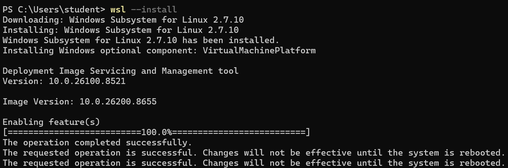
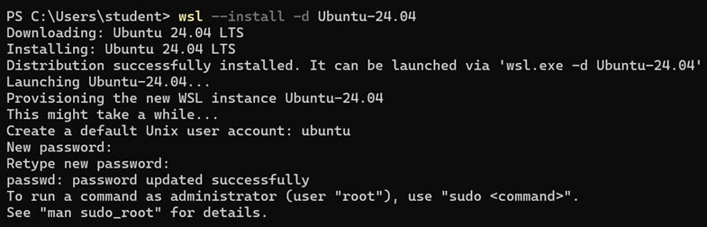
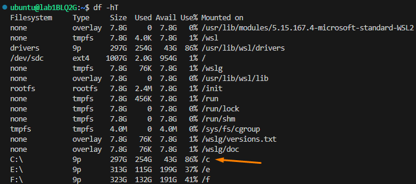
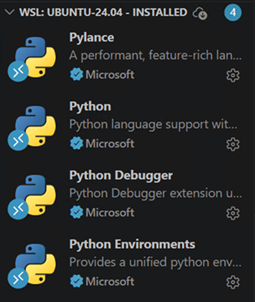

# Lab - Preparing the local lab environment (Windows)

This lab will guide you through the setup of your local machine to prepare for the subsequent lab exercises.

## Prerequisites

Before starting this lab, verify that:
- You have administrative rights to your computer.
- You are running Windows 11.
- Your system has virtualization enabled in BIOS (required for WSL and Docker).
- You are using **WSL2**.

> **NOTE:** These instructions assume the default WSL username is `ubuntu`. If you use a different username, substitute it throughout these tasks and subsequent lab exercises.

## Lab Tasks Overview

This lab consists of 12 tasks organized in five phases:

| Phase | Tasks | Details |
|-------|-------|----------|
| **WSL Foundation** | 1–2 | Install WSL and configure Windows file access |
| **Development Tools** | 3–9 | Install Python, Firefox, MongoDB, VSCode, and extensions |
| **Connectivity** | 10 | Install Putty (for remote access) |
| **Containerization** | 11 | Install Docker |
| **Web Server** | 12 | Install Nginx |

## Task 1: Installing WSL

**Overview:** WSL (Windows Subsystem for Linux) enables you to run a native Linux environment directly on Windows without a virtual machine, eliminating the overhead of traditional virtualization.

> ⚠️ **REQUIREMENT**: This lab uses **WSL2** (not WSL1). Docker requires WSL2 to function. Verify your system supports Hyper-V.

### For Windows 11:

1. Open **Windows Terminal** in Administrator mode:
   - Right-click the Windows Start Menu and select **Terminal (Admin)**.

2. Run the command to enable the features necessary to run WSL.

   ```powershell
   wsl --install
   ```

   

3. Reboot your computer.

4. After your system restarts, open **Windows Terminal** in Administrator mode again.

5. Install Ubuntu 24.04 with WSL2:

   ```powershell
   wsl --install -d Ubuntu-24.04
   ```

   This command will automatically download and install Ubuntu 24.04 as a WSL2 distribution.

6. The Ubuntu 24.04 LTS setup window will appear with the message: **"Provisioning the new WSL instance Ubuntu-24.04. This might take a while..."**

7. When prompted, create your default WSL user account:

   | Field | Value |
   |-------|-------|
   | **UNIX username** | `ubuntu` (recommended) |
   | **Password** | Your preferred password |
   | **Retype password** | Confirm your password |

   > **Tip:** Use a password you'll remember easily, as you'll need it for `sudo` commands.

   

## Task 2: Configuring Windows File Access in WSL

**Overview:** Configure WSL to access your Windows drives from the Linux environment. This enables seamless file sharing between Windows and WSL.

### Steps:

1. Open **WSL Terminal** (Ubuntu):
   - Search for "Ubuntu" in the Windows Start Menu and launch it.

2. Create the WSL configuration file using the nano editor:

   ```bash
   sudo nano /etc/wsl.conf
   ```

3. Add the following configuration to enable Windows drive mounting:

   ```ini
   [automount]
   root = /
   options = "metadata"
   ```

   **Explanation:**
   - `root = /`: Mounts Windows drives at `/c`, `/d`, etc. (instead of `/mnt/c`)
   - `options = "metadata"`: Enables metadata support for better file permissions

4. Save and close the file:
   - Press `Ctrl+O`, then `Enter`
   - Press `Ctrl+X` to exit nano

5. Shutdown WSL to apply changes:
   - Open **Windows Terminal (Admin)** and run:

     ```powershell
     wsl --shutdown
     ```

6. Restart WSL:
   - Launch **Ubuntu** from the Windows Start Menu to restart WSL.

7. Verify Windows drive access:
   - In the Ubuntu terminal, list mounted drives:

     ```bash
     df -hT
     ```

     

8. Navigate to your Windows C drive:

   ```bash
   cd /c
   ls  # List files in your C drive
   ```

   > **Success**: If you see your Windows files and folders, file access is properly configured.    

## Task 3: Installing Python pip and Virtual Environment in WSL

**Overview:** Install Python package manager (pip) and virtual environment support to manage Python packages and create isolated environments for your projects.

### Steps:

1. Go to **WSL Terminal** (Ubuntu).

2. Update package list and install Python tools:

   ```bash
   sudo apt-get update
   sudo apt-get install python3-pip python3-venv -y
   ```

3. Verify installation:

   ```bash
   python3 --version
   pip3 --version
   ```

   > **Success**: Both commands should display version numbers.

## Task 4: Installing Firefox in WSL

**Overview**: Firefox is distributed as a Snap package by default on recent Ubuntu releases. Although the Snap package provides benefits such as application confinement and automatic updates, it can present compatibility challenges for Selenium-based browser automation due to differences in packaging and application confinement. Furthermore, Snap packages are not fully supported in Windows Subsystem for Linux (WSL), where dependencies such as snapd, systemd, and certain kernel features may not be fully available. Therefore, the DEB version of Firefox is recommended for Selenium and WSL environments because it provides better compatibility and a more predictable runtime environment.

### Steps:

1. Go to **WSL Terminal** (Ubuntu).

2. Create an APT keyring.

   ```bash
   sudo install -d -m 0755 /etc/apt/keyrings
   ```

3. Import the Mozilla APT repo signing key.

   ```bash
   wget -q https://packages.mozilla.org/apt/repo-signing-key.gpg -O- | \
   sudo tee /etc/apt/keyrings/packages.mozilla.org.asc > /dev/null
   ```

4. Add the Mozilla signing key to your sources.list file.

   ```bash
   echo "deb [signed-by=/etc/apt/keyrings/packages.mozilla.org.asc] \
   https://packages.mozilla.org/apt mozilla main" | sudo tee -a /etc/apt/sources.list.d/mozilla.list > /dev/null
   ```

5. Set the Firefox package priority to ensure Mozilla’s Deb version is always preferred. If you don’t do this the Ubuntu transition package could replace it, reinstalling the Firefox Snap.

   ```bash
   echo -e 'Package: *\nPin: origin packages.mozilla.org\nPin-Priority: 1000' \
   | sudo tee /etc/apt/preferences.d/mozilla
   ```

6. Reload the local package database.

   ```
   sudo apt-get update
   ```

7. Install Firefox DEB in Ubuntu.

   ```bash
   sudo apt-get install firefox -y
   ```

8. Verify the installation:

   ```bash
   firefox --version
   ```

   > **Success**: You should see the Firefox version number.

## Task 5: Installing MongoDB Community Edition in WSL

**Overview:** MongoDB is a NoSQL database used in subsequent labs for data storage and management. We will install MongoDB Community Edition 7.0.

### Prerequisites:

- Ensure `gnupg` and `curl` are installed for secure package handling.

### Steps:

1. Go to **WSL Terminal** (Ubuntu).

2. Install required tools (if not already present):

   ```bash
   sudo apt-get install gnupg curl -y
   ```

3. Import the MongoDB GPG signing key for package verification:

   ```bash
   curl -fsSL https://www.mongodb.org/static/pgp/server-7.0.asc | \
   sudo gpg -o /usr/share/keyrings/mongodb-server-7.0.gpg --dearmor
   ```

4. Add the official MongoDB repository:

   ```bash
   echo "deb [ arch=amd64,arm64 signed-by=/usr/share/keyrings/mongodb-server-7.0.gpg ] \
   https://repo.mongodb.org/apt/ubuntu jammy/mongodb-org/7.0 multiverse" | \
   sudo tee /etc/apt/sources.list.d/mongodb-org-7.0.list
   ```

5. Update package index:

   ```bash
   sudo apt-get update
   ```

6. Install MongoDB Community Server:

   ```bash
   sudo apt-get install -y mongodb-org
   ```

   > **Note:** This installs the MongoDB server, shell, and command-line tools.

7. Verify installation:

   ```bash
   mongod --version
   ```

   > **Success**: You should see the MongoDB version number.

**What's installed:**
- `mongod`: The MongoDB server daemon (runs on port 27017 by default)
- `mongo`: The MongoDB command-line client for database queries

## Task 6: Starting MongoDB and Enabling Auto-Start

**Overview:** Start the MongoDB daemon and configure it to run automatically when WSL starts.

### Steps:

1. Start the MongoDB server:

   ```bash
   sudo systemctl start mongod
   ```

2. Enable MongoDB to start automatically on every WSL boot:

   ```bash
   sudo systemctl enable mongod
   ```

3. Verify MongoDB is running:

   ```bash
   sudo systemctl status mongod
   ```

   > **Success**: You should see "**active (running)**" in the status output.

4. Test the MongoDB connection:

   ```bash
   mongosh  # or 'mongo' on older versions
   ```

   If you see the MongoDB shell prompt (`>`), the database is operational. Type `exit` to close it.


## Task 7: Installing MongoDB Compass (Windows)

**Overview:** MongoDB Compass is a graphical interface for MongoDB that lets you visually explore and manage your database. Install this on Windows, not in WSL.

### Steps:

1. Navigate to [MongoDB Compass Download](https://www.mongodb.com/try/download/compass).

2. Click the **Download** button (select the default Windows installer).

3. Run the downloaded `.exe` installer and follow the setup wizard:
   - Accept the license agreement
   - Choose the default installation location
   - Complete the installation

4. Launch MongoDB Compass from the Windows Start Menu.

5. Connect to your local MongoDB instance:
   - In Compass, click **+ Add Connection**, the default connection string is `mongodb://localhost:27017`
   - Click **Connect** to verify your WSL MongoDB server is accessible

## Task 8: Downloading and Installing VSCode

**Overview:** Visual Studio Code is a lightweight code editor that integrates seamlessly with WSL for development.

### Steps:

1. Navigate to the [Visual Studio Code](https://code.visualstudio.com/) website.

2. Click **Download for Windows**.

3. Run the installer and follow the setup wizard:
   - Accept the license agreement
   - Choose the default installation location
   - Complete the installation

4. Launch VSCode from the Windows Start Menu.

   > **Tip:** On first launch, VSCode may prompt you to install the WSL extension. Accept and install it.

## Task 9: Installing Extensions in VSCode

**Overview:** VSCode extensions enhance development capabilities. We will install extensions for Python development and Jupyter notebooks in the WSL environment.

### Steps:

1. Launch **Visual Studio Code** from Windows.

2. Connect to your WSL environment:
   - Click the **Remote Connection icon** (`><`) in the bottom-left corner
   - Select **Connect to WSL**. It should connect to **Ubuntu-24.04** distro.
   - Wait for VSCode to connect to WSL (this may take 30 seconds on first connection)

3. Install the **Python** extension:
   - Click **Extensions** (icon: four squares) on the left sidebar
   - Search for **"Python"** (published by Microsoft)
   - Click **Install** and wait for installation to complete

4. Verify the Python extension:
   - The Python extension should appear under **Installed Extensions** with a checkmark
   - You should see **Python** is installed on **WSL:Ubuntu-24.04** (not on your local machine)

      

5. Install the **Jupyter** extension:
   - In the Extensions view, search for **"Jupyter"** (published by Microsoft)
   - Click **Install**

   > **Success**: Both extensions should now be listed in your Installed Extensions.

6. **(Optional)** Install additional extensions for future labs:
   - **Live Share** by Microsoft — for real-time code collaboration
   - **YAML** by Red Hat — for YAML file editing
   - **Ansible** by Red Hat — for infrastructure automation
   - **Terraform** by HashiCorp — for infrastructure as code
   - **Git Graph** by mhutchie — for visual Git history
   - **GitHub Pull Requests** by GitHub — for PR management

   > **Tip:** You can always install more extensions later. Focus on Python and Jupyter for now.

## Task 10: Downloading and installing Putty

**Overview**: Putty is a free SSH client for Windows that allows you to connect to remote servers securely. It should be installed on the host machine (Windows).

### Steps:

1. Navigate to the [Putty Download Page](https://www.chiark.greenend.org.uk/~sgtatham/putty/latest.html) website.

2. Download the **64 bit x86 MSI Windows Installer** (latest version at the time of writing is `0.84`)

3. Run the installer and follow on-screen instructions to install Putty.

4. Verify the installation:
   -  Open Putty and ensure the application launches without errors.

## Task 11: Installing Docker Engine in WSL

**Overview:** Docker enables containerization for running isolated applications. This requires **WSL2**.

> ⚠️ **REQUIREMENT**: Docker only works with WSL2. If you installed WSL1, upgrade to WSL2 before proceeding.

### Steps:

1. Go to **WSL Terminal** (Ubuntu).

2. Download and run the official Docker installation script:

   ```bash
   curl -fsSL https://get.docker.com -o get-docker.sh
   sudo sh get-docker.sh
   rm get-docker.sh
   ```

   > **Note:** This script downloads and installs the latest Docker Community Edition.

3. Add your `ubuntu` user to the Docker group (allows running Docker without `sudo`):

   ```bash
   sudo usermod -aG docker ubuntu
   ```

4. Apply the group changes by restarting WSL:
   - Go to **Windows Terminal (Admin)** and run:

     ```powershell
     wsl --shutdown
     ```

5. Restart WSL by launching **Ubuntu** from the Windows Start Menu.

6. Verify Docker installation:

   ```bash
   docker --version
   ```

   > **Success**: You should see a version number (e.g., "Docker version 29.6.0") or higher.


## Task 12: Installing Nginx in WSL

**Overview:** Nginx is a lightweight web server and reverse proxy used in later labs. Install it for future lab exercises.

### Steps:

1. Go to **WSL Terminal** (Ubuntu).

2. Install Nginx:

   ```bash
   sudo apt-get install nginx -y
   ```

   > **Note:** Nginx is a web server that listens on port 80 by default. It will not automatically start.

3. Verify the installation:

   ```bash
   nginx -v
   ```

   > **Success**: You should see the Nginx version number (e.g., "nginx/1.28.3") or higher.

4. (Optional) Test Nginx:
   - Start the Nginx service:

     ```bash
     sudo systemctl start nginx
     ```

   - Verify it's running:

     ```bash
     sudo systemctl status nginx
     ```
   
   - To view the output:

      ```bash
      curl localhost
      ```

      The response should contain a "Welcome to Nginx!" message.


   - Stop Nginx for now (we'll use it in later labs):

     ```bash
     sudo systemctl stop nginx
     ```

   **Note:** You don't need to enable Nginx to start on boot unless instructed by a later lab exercise.

## Verification Checklist

Before proceeding to the next lab, verify the following:

- [ ] WSL2 is installed and running Ubuntu 24.04: `wsl --list --verbose`
- [ ] Windows files are accessible: `cd /c` and `ls`
- [ ] Python and pip are installed: `python3 --version` and `pip3 --version`
- [ ] Firefox is installed: `firefox --version`
- [ ] MongoDB is running: `sudo systemctl status mongod`
- [ ] MongoDB Compass can connect to `mongodb://localhost:27017`
- [ ] VSCode is installed with Python and Jupyter extensions (WSL)
- [ ] Putty is installed on Windows
- [ ] Docker is installed and working: `docker --version`
- [ ] Nginx is installed: `nginx -v`

If any verification fails, revisit the corresponding task or proceed to the troubleshooting section below.

---

## Troubleshooting Common Issues

### System has not been booted with systemd as init system (PID 1). Can't operate
- Make sure you are running on WSL2.
- Verify `/etc/wsl.conf` has the following content. If not, insert it and save the file.

   ```
   [boot]
   systemd=true
   ```
- Restart WSL in Windows Terminal: `wsl --shutdown`

### WslRegisterDistribution failed with error: 0x800701bc
- Download and install the latest WSL2 Linux kernel update package.
- Follow step 4 and 5 from this [article](https://learn.microsoft.com/en-us/windows/wsl/install-manual#step-4---download-the-linux-kernel-update-package).

### Can't access Windows files in WSL
- Verify `/etc/wsl.conf` has the correct settings (Task 2)
- Restart WSL in Windows Terminal: `wsl --shutdown`

For additional troubleshooting, refer to the [Microsoft WSL Troubleshooting Guide](https://learn.microsoft.com/en-us/windows/wsl/troubleshooting).

---

## 🎉 Congratulations!

You have successfully completed the lab setup. Your development environment now includes:

✓ **WSL2 with Ubuntu 24.04** — Linux environment on Windows  
✓ **Python, pip, and venv** — Python development tools  
✓ **Firefox** — Web browser for testing  
✓ **MongoDB** — NoSQL database  
✓ **MongoDB Compass** — Database GUI  
✓ **VSCode with Python & Jupyter** — IDE for development  
✓ **Putty** — SSH support  
✓ **Docker** — Container platform  
✓ **Nginx** — Web server  

You are ready to proceed to the next lab exercise!