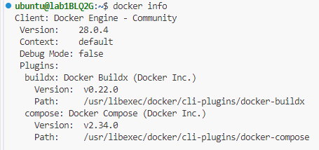

# Lab - Preparing the local lab environment (Azure Lab Services)

This lab will guide you through the setup of your Azure Lab Services virtual machine to prepare for the subsequent lab exercises.

We have pre-installed the Xfce Desktop environment for your convenience.

#### Lab Tasks Overview:

1. Logging in to Azure Lab Services

2. Installation of Tools
   -  Python
   -  Firefox
   -  MongoDB
   -  VSCode and extensions
   -  Docker Tools
   -  Nginx

<!-- #### Common tasks between ALS and WSL:
* Installing python pip and virtual environment
* Installing Firefox
* Installing MongoDB Community Edition
* Starting MongoDB and enabling it to start on boot
* Downloading and installing MongoDB Compass
* Downloading and installing VSCode
* Installing extensions in VSCode IDE
* Installing Docker Engine and Compose in Ubuntu
* Installing Nginx -->

## Task 1: Logging to Azure Lab Services (ALS)

Please visit the [ALS guide](ALS_GUIDE.md) for detailed instructions.

Below are the summarized steps:

1. Access [Azure Lab Services](https://labs.azure.com).

2. Upon successful login, you will be able to see your assigned virtual machine.

3. To start your virtual machine, toggle the switch to turn on the machine.

   > NOTE: If you are not using your virtual machine, please toggle the switch to turn off the virtual machine so that you will not waste your user quota hours.

4. When the virtual machine is turned on, click on the *blue desktop icon* to download the RDP file.

5. (FOR MAC Users), please download and install **Windows App** application from Apple App Store first before proceeding.

6. Double click on the RDP file and key in the credentials to login to the virtual machine.

7. You will get a prompt to connect to the virtual machine. Please allow and you will be connected to the virtual machine.

## Task 2: Installing python pip and virtual environment

**Overview:** Install Python package manager (pip) and virtual environment support to manage Python packages and create isolated environments for your projects.

1. Open **Terminal**.

2. Install python pip and virtual environment with the following command:

   ```bash
   sudo apt-get update
   sudo apt-get install python3-pip python3-venv -y
   ```

## Task 3: Installing Firefox

**Overview**: Firefox is distributed as a Snap package by default on recent Ubuntu releases. Although the Snap package provides benefits such as application confinement and automatic updates, it can present compatibility challenges for Selenium-based browser automation due to differences in packaging and application confinement. Therefore, the DEB version of Firefox is recommended for Selenium because it provides better compatibility and a more predictable runtime environment.

1. Open **Terminal**.

2. Uninstall the Firefox Snap.
   
   ```bash
   sudo snap remove firefox
   ```

3. Create an APT keyring.

   ```bash
   sudo install -d -m 0755 /etc/apt/keyrings
   sudo apt-get install gnome-keyring -y
   ```

4. Import the Mozilla APT repo signing key.
   
   ```bash
   wget -q https://packages.mozilla.org/apt/repo-signing-key.gpg -O- | \
   sudo tee /etc/apt/keyrings/packages.mozilla.org.asc > /dev/null
   ```

5. Add the Mozilla signing key to your sources.list file.

   ```bash
   echo "deb [signed-by=/etc/apt/keyrings/packages.mozilla.org.asc] \
   https://packages.mozilla.org/apt mozilla main" | sudo tee -a /etc/apt/sources.list.d/mozilla.list > /dev/null
   ```

6. Set the Firefox package priority to ensure Mozilla’s Deb version is always preferred. If you don’t do this the Ubuntu transition package could replace it, reinstalling the Firefox Snap.

    ```bash
    echo -e 'Package: *\nPin: origin packages.mozilla.org\nPin-Priority: 1000'  \
    | sudo tee /etc/apt/preferences.d/mozilla
    ```
7. Reload the local package database.

   ```bash
   sudo apt-get update
   ```

8. Install the Firefox DEB in Ubuntu.

   ```bash
   sudo apt-get install firefox -y
   ```

## Task 4: Installing MongoDB Community Edition

**Overview:** MongoDB is a NoSQL database used in subsequent labs for data storage and management. We will install MongoDB Community Edition 7.0.

1. Open Terminal.

2. Import the public key used by the package management system.

   ```bash
   # Install gnupg and curl if not available.
   sudo apt-get install gnupg curl -y
   ```

   To import the MongoDB public GPG Key, run the following command:

   ```bash
   curl -fsSL https://www.mongodb.org/static/pgp/server-7.0.asc | \
   sudo gpg -o /usr/share/keyrings/mongodb-server-7.0.gpg \
   --dearmor
   ```

3. Create a list file for MongoDB.

   ```bash
   echo "deb [ arch=amd64,arm64 signed-by=/usr/share/keyrings/mongodb-server-7.0.gpg ] \
   https://repo.mongodb.org/apt/ubuntu jammy/mongodb-org/7.0 multiverse" | \
   sudo tee /etc/apt/sources.list.d/mongodb-org-7.0.list
   ```

4. Reload the local package database.

   ```bash
   sudo apt-get update
   ```

5. Install the MongoDB packages.

   ```bash
   sudo apt-get install -y mongodb-org
   ```

## Task 5: Starting MongoDB and enabling it to start on boot

1. In Terminal, enter the following command to start MongoDB.

   ```bash
   sudo systemctl start mongod
   ```

2. To enable MongoDB to start on boot, enter the following command.

   ```bash
   sudo systemctl enable mongod
   ```

## Task 6: Downloading and installing MongoDB Compass

1. Navigate to the [MongoDB Compass](https://www.mongodb.com/try/download/compass) website.

2. Under Platform, select **Ubuntu 64-bit**.

3. Click on the green **Download** button.

3. The deb package file should be downloaded to the Downloads folder.

4. To install MongoDB Compass, open **Terminal** and navigate to the Downloads folder.

   ```bash
   cd ~/Downloads
   # run this command to install the deb file
   sudo apt-get install ./mongodb-compass_XXX_amd64.deb -y
   ```

## Task 7: Downloading and installing VSCode

This section is optional as VSCode has been pre-installed in ALS.

1. Open **Terminal**.

2. Install the repository dependencies.

   ```bash
   sudo apt-get update
   sudo apt-get install software-properties-common apt-transport-https wget -y
   ```

3. Import Microsoft GPG key.

   ```bash
   wget -q https://packages.microsoft.com/keys/microsoft.asc -O- | sudo apt-key add -
   ```

4. Enable VSCode repository.

   ```bash
   sudo add-apt-repository "deb [arch=amd64] https://packages.microsoft.com/repos/vscode stable main" -y
   ```

5. Install VSCode via apt.

   ```bash
   sudo apt-get install code -y
   ```

6. You can verify VSCode version by entering this command:

   ```bash
   code --version
   ```

## Task 8: Installing extensions in VSCode IDE

1. Click on the <> icon on the left bottom sidebar to open a Remote Window.

2. Click **Extensions** on the left menu bar.

3. Search for **Python** and click **Install**.

4. You should be able to view that the Python extension is installed as shown in the screenshot below.

5. Search for **Jupyter** and click **Install**.

6. You may consider installing other extensions that may help you in the subsequent labs.
    -   [Live Share by Microsoft](https://marketplace.visualstudio.com/items?itemName=MS-vsliveshare.vsliveshare)
    -   [YAML by Red Hat](https://marketplace.visualstudio.com/items?itemName=redhat.vscode-yaml)
    -   [Ansible by Red Hat](https://marketplace.visualstudio.com/items?itemName=redhat.ansible)
    -   [HashiCorp Terraform by HashiCorp](https://marketplace.visualstudio.com/items?itemName=HashiCorp.terraform)
    -   [Git Graph by mhutchie](https://marketplace.visualstudio.com/items?itemName=mhutchie.git-graph)
    -   [GitHub Pull Requests by Github](https://marketplace.visualstudio.com/items?itemName=GitHub.vscode-pull-request-github)

## Task 9: Installing Docker Engine and Compose in Ubuntu

We will be using the convenience script provided by Docker to install Docker Engine on Ubuntu.

1. Open **Terminal**.

2. Run the following commands to install Docker Engine.

   ```bash
   curl -fsSL https://get.docker.com -o get-docker.sh
   sudo sh get-docker.sh
   rm -rfv get-docker.sh
   ```

3. Add your user to the docker group.

   ```bash
   sudo usermod -aG docker ubuntu
   ```

4. Log out of the virtual machine.

5. Once you are logged in, run the command `docker info` to ensure there are no errors.

   

## Task 10: Installing Nginx

1. Open **Terminal**.

2. Run the following to install Nginx.

   ```bash
   sudo apt-get install nginx -y
   ```

3. To verify that Nginx has been installed, enter the following:

   ```bash
   nginx -v
   ```

   It should return the version of Nginx installed.

   ---

## 🎉 Congratulations!
You have completed the lab exercise.
