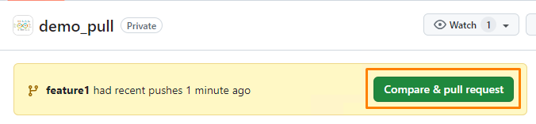
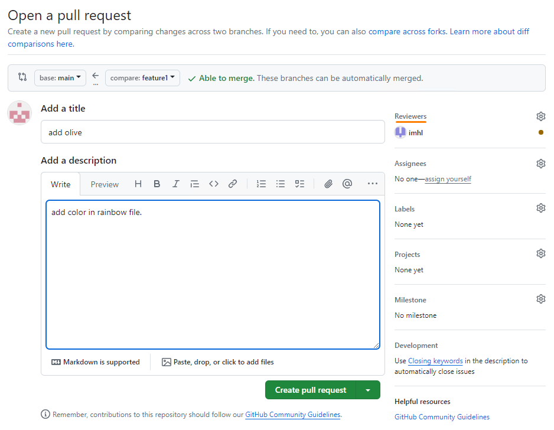
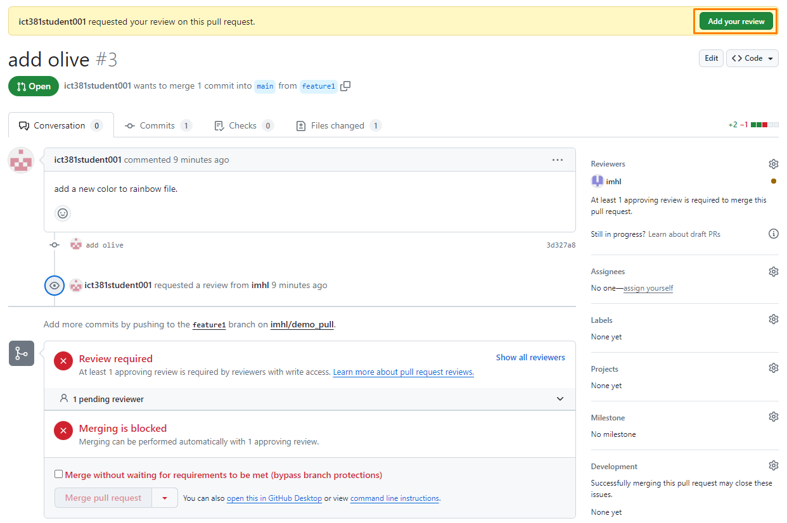
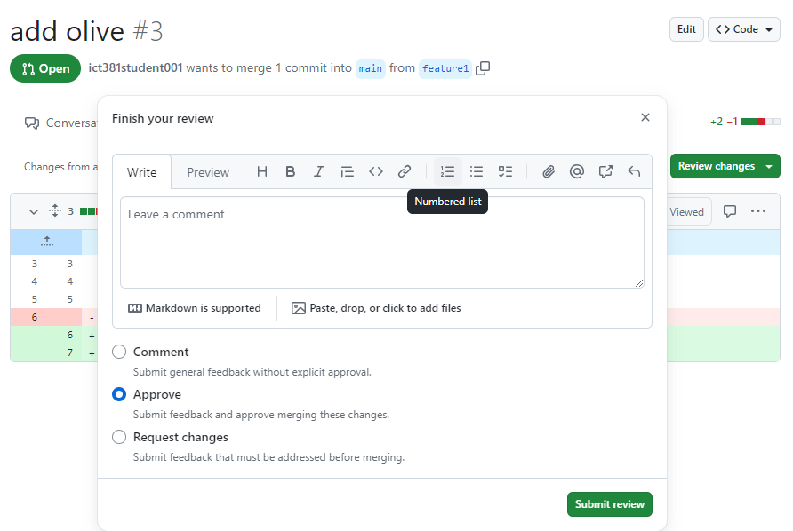
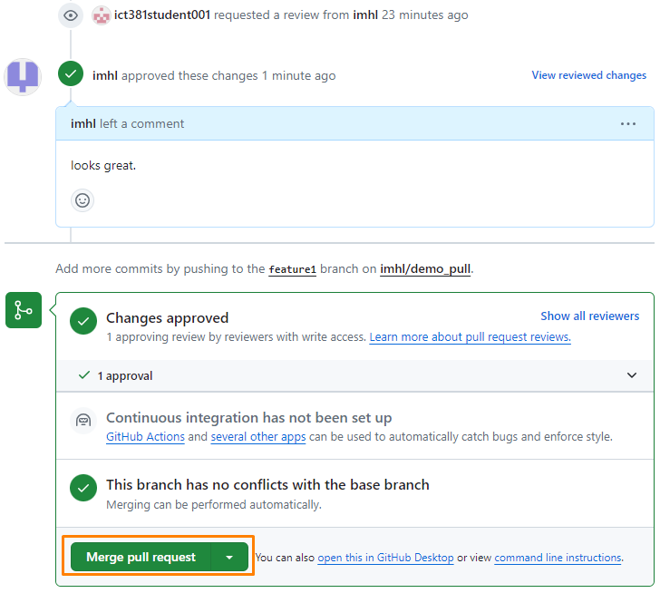
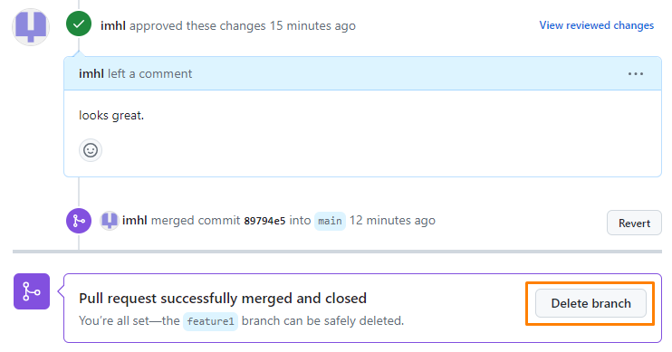

# Lab: GitHub

This lab introduces core Git and GitHub workflows.

- Tasks 1 to 5 are completed using your own private repositories.
- Task 6 introduces commonly used Git commands.
- Task 7 supports your GBA assignment workflow.
- Task 8 helps you use Git features in VS Code.

## Prerequisites

Before you begin:

1. Verify that Git it is available in your WSL terminal.
2. Ensure you have internet access.

## Task 1: Sign up for a personal GitHub account

1. Go to [https://github.com/](https://github.com/).
2. Select **Sign up**.
3. Register using your SUSS email address.
4. Follow the on-screen setup to complete the creation of your account.

## Task 2: Set your Git username and email

1. Go to WSL terminal.
2. Set your Git username:

   ```bash
   git config --global user.name "GIT_USERNAME"
   ```

3. Set your Git email:

   ```bash
   git config --global user.email "EMAIL_ADDRESS"
   ```
   > Note: Replace `GIT_USERNAME` and `EMAIL_ADDRESS` with your actual details.

4. Verify your configuration:

   ```bash
   git config --global --list
   ```

## Task 3: Create repositories on GitHub

Learn how to create new repositories on the GitHub website.

1. Sign in to your GitHub account.
2. In the top-right corner, select **+**, then select **New repository**.
3. Enter a short, memorable repository name.
4. Optionally add a description.
5. Set visibility to **Private**.
6. Select **Create repository**.

Create the following three empty repositories:

- StaycationX
- automation
- myReactApp

## Task 4: Set up GitHub SSH keys

SSH keys allow secure GitHub authentication without entering credentials on each push or pull.

1. Generate an SSH key pair:

   ```bash
   ssh-keygen -t rsa
   ```

   Press **Enter** to accept the defaults for the prompts.

### Add your public key to GitHub

1. In GitHub, select your profile picture at the top right hand corner, then select **Settings**.
2. In the **Access** section of the sidebar, select **SSH and GPG keys**.
3. Select **New SSH key**.
4. Enter a descriptive title.
5. For key type, select **Authentication Key**.
6. Paste your public key into the **Key** field.
7. Select **Add SSH key**.

Common public key paths: `~/.ssh/id_rsa.pub`

To display the public key in terminal: `cat ~/.ssh/id_rsa.pub`

### Add GitHub host keys to known_hosts

Use the `ssh-keyscan` command to retrieve GitHub’s SSH public host key and append it to the known_hosts file in your ~/.ssh directory. This file helps secure your SSH connections by verifying the identity of the servers you connect to.

```bash
ssh-keyscan github.com >> ~/.ssh/known_hosts
```

## Task 5: Mirror course repositories to your account

This task copies course repositories into repositories under your own GitHub account.


```bash
git clone --bare SOURCE_REPO_URL
cd REPO_NAME.git
git push --mirror DESTINATION_REPO_URL
cd ..
rm -rf REPO_NAME.git
```

Example for StaycationX:

```bash
git clone --bare git@github.com:ict381/StaycationX.git
cd StaycationX.git
git push --mirror git@github.com:GIT_USERNAME/StaycationX.git
cd ..
rm -rf StaycationX.git
```

In order to save time, a helper script is provided and made available at `scripts/mirror-repo.sh`.

Before running it:

1. Set `GIT_USERNAME` in the script (Line 11).
2. Set `DEST_DIR` in the script if you want a custom clone location. By default, it is set to your home directory.

Run:

```bash
git clone git@github.com:ict381/ict381-lab-notes.git
cd ict381-lab-notes/scripts
./mirror-repo.sh
```

> Note: The script mirrors repositories and then clones each mirrored repository into `DEST_DIR`.

Typical access paths after cloning:

- Ubuntu: `/home/ubuntu/REPO_NAME`
- macOS: `/Users/USERNAME/REPO_NAME`

## Task 6: Basic GitHub and Git commands

Common commands you should know:

- `git init`: Initialize a new Git repository.
- `git add FILE`: Stage file changes.
- `git commit -m "MESSAGE"`: Commit staged changes.
- `git remote add NAME URL`: Add a remote repository.
- `git push`: Push committed changes to remote.
- `git pull`: Fetch and merge remote changes into the local branch.
- `git log`: Show commit history.
- `git clone URL`: Clone a repository from a remote URL.
- `git branch`: List branches.
- `git switch -c BRANCH` or `git checkout -b BRANCH`: Create and switch to a new branch.
- `git switch BRANCH` or `git checkout BRANCH`: Switch branches.
- `git merge BRANCH`: Merge BRANCH into the current branch.

## Task 7: Create a pull request

Pull requests allow you to share work you have done on a branch with your teammates, gather feedback, and integrate those changes into the project.

High-level workflow:

1. Create a branch locally and commit your changes.
2. Push the branch to GitHub.
3. Open a pull request on GitHub.
4. Get the pull request reviewed by the assigned personnel and potentially get feedback.
5. Get the pull request approved.
6. Merge the pull request.
7. Delete the branch.
8. Sync your local repository.

### Local setup example

Create a sample repository named `demo_pull` on GitHub, then run:

```bash
git init -b main
echo "Add Red" > rainbow.txt
git add rainbow.txt
git commit -m "first upload"
git remote add origin git@github.com:GIT_USERNAME/demo_pull.git
git push -u origin main
git switch -c feature1
echo "Add Olive" > rainbow.txt
git add rainbow.txt
git commit -m "add color"
git push -u origin feature1
```

### Open and review the pull request on GitHub

1. Select **Compare & pull request** for your feature branch.

   

2. Use the base branch dropdown menu to select the branch you want to merge your changes into, then use the compare branch dropdown menu to choose the branch where you made your changes.
3. Enter a title and description for your pull request.
4. Add reviewer(s) to review the changes.
5. Select **Create pull request**.

   

6. You should see the message that review is required and merging is blocked.

---
Next, please get the reviewer to login to review the changes.

### Reviewer actions

1. Click on the GitHub notification box (which is beside the profile logo)

   

2. Open the review request.
3. Select **Add your review**.

   

4. Add your comments on a particular line by clicking on the blue + icon.
5. After completing the review, click on **Review changes** button.
6. Write a review comment, select the **Approve** button and click on the **Submit review** button.

   

### Merge and clean up

Now that the changes are approved, you can merge the pull request.

1. Click on the **Merge pull request** button.

   

2. Select **Confirm merge**. Once successfully merged, you are given an option to delete the branch.
3. Select **Delete branch**.

   

Back in your local repository:

Run:
```bash
# Switch back to main branch and pull the latest changes
git switch main
git pull
# Update remote-tracking branches and remove those deleted from the remote
git fetch --prune
# Remove the local branch that has already been merged and deleted on the remote
git branch -d feature1
```

## Task 8: Use Git in VS Code

VS Code includes built-in source control support for Git.

Refer to these references:

- [SCM Overview](https://code.visualstudio.com/docs/sourcecontrol/overview)
- [Introduction to Git](https://code.visualstudio.com/docs/sourcecontrol/intro-to-git)
- [Collaborate on GitHub](https://code.visualstudio.com/docs/sourcecontrol/github)

---

### More References:

1. [Learning Git by Anna Skoulikari](https://learning.oreilly.com/library/view/learning-git/9781098133900/)
2. [GitLab Cheat Sheet](https://about.gitlab.com/images/press/git-cheat-sheet.pdf)

---
## 🎉 Congratulations!

These exercises will strengthen your understanding of Git and GitHub.
