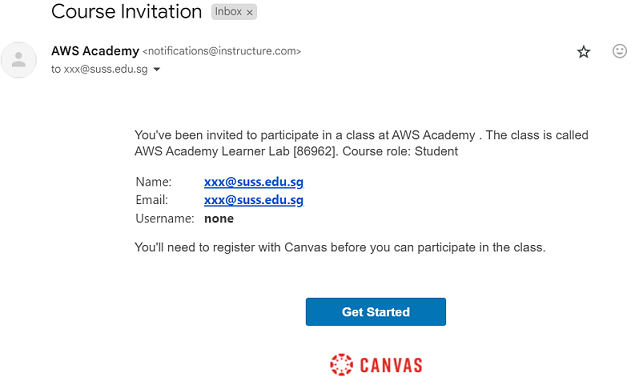
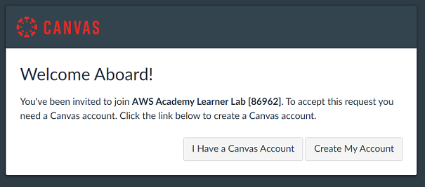
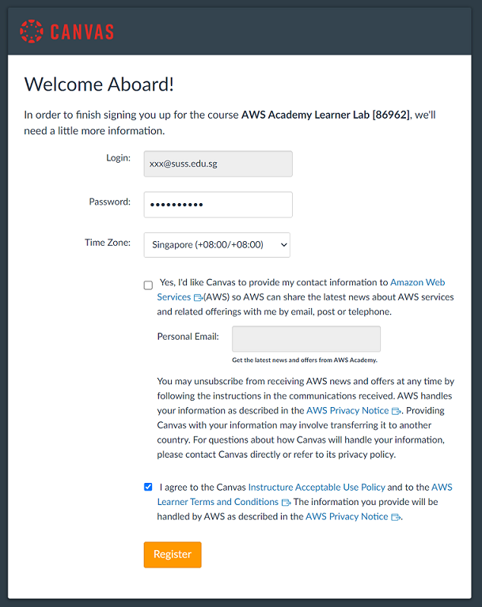
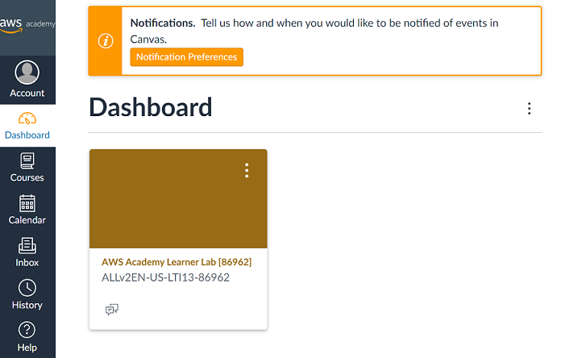

# Lab: Accessing AWS Academy Canvas LMS

## Overview
AWS Academy is a separate learning platform from your SUSS Canvas LMS. In this lab, you will set up your AWS Academy account and gain access to AWS Learner Lab (a cloud environment for hands-on practice). This account will be required for the subsequent AWS labs in this course.

## Prerequisites
- An enrollment invitation from your instructor

## Important Note
⚠️ AWS Academy Canvas LMS is **not** the same as your SUSS Canvas LMS. You will have separate logins and accounts for each platform.

## Account Setup Procedure

Once you receive your course enrollment confirmation, follow these steps:

1. **Check your email for the invitation.** You should receive an email from AWS Academy with the subject "Course Invitation" after you have been enrolled by your instructor.

   

2. **Click the "Get Started" button** in the email.

3. **Create your AWS Academy account** by clicking **Create My Account**.
   
   > **Reminder:** This is a separate login from your SUSS Canvas account. You will need to keep both usernames and passwords.

   

4. **Configure your account settings** on the **Welcome Aboard!** page:
   - Enter a secure password
   - Select your time zone
   - ✓ Check the box to accept the AWS Learner Lab terms and conditions
   
   

5. **Click Register** to complete account creation.

6. **Verify successful enrollment.** You should be redirected to your AWS Academy dashboard, and your course should appear in your course list.

   

### Verification Checklist
- [ ] You received a "Course Invitation" email from AWS Academy
- [ ] You successfully created an account
- [ ] You can log in to AWS Academy (separate login from SUSS Canvas)
- [ ] Your course appears on your AWS Academy dashboard

## Troubleshooting

### I didn't receive the invitation email
- Check your spam/junk folder
- Verify your email address with your instructor

### I forgot my AWS Academy password
- Use the "Forgot Password?" link on the AWS Academy login page
- Reset instructions will be sent to your registered email address

### My course doesn't appear on my dashboard
- Log out and log back in
- Try clearing your browser cache (Ctrl+Shift+Delete on Windows)
- Contact your instructor to verify your enrollment status

---

## 🎉 Congratulations!

You have successfully completed the initial setup for AWS Academy. You now have:
- ✓ An active AWS Academy account
- ✓ Access to AWS Learner Lab for hands-on cloud practice

