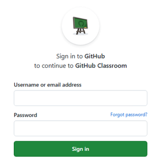
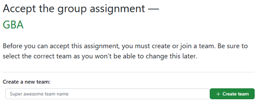
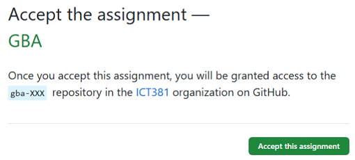
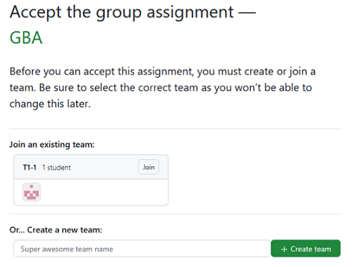
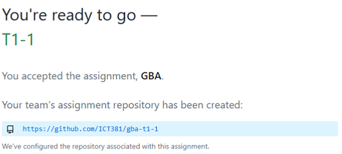
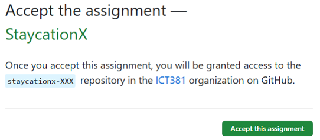
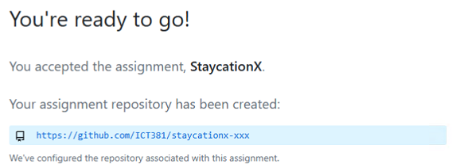

# GitHub Classroom

In this course, there are group based and individual assignments that require you to submit your codes in Github Classroom.

Your instructor will provide you with the assignment invitation links which you would need to access the repository.

Now, we will take you through the steps to access your assignment repository once you have received the links.

Before you start, please ensure that you have the following:
*  A GitHub account


To start, please do the following:

## Accessing Group Assignment

1. Access the group based assignment link that is provided by your instructor in the Canvas **T** group course site.

2. Login to your GitHub account if it prompts for your login.

   

3. Before accepting the group assignment, the elected group leader should create a team. If your team has been created, click on the team to join.

    ### New team (no existing team)

    The name format of the team should be **TX-Y** where `X` refers to the T group number and `Y` refers to the number of the team. Please perform this step correctly so that your group can be easily identified.

    > You can find your group number in Canvas T group. Under People, click on **Groups**. <br>
    > For example, if you are in T01 group and your team is the first team, the team name should be **T1-1**.

    Once you have entered the name, click **+Create team**.

    

3. Click on **Accept this assignment** to continue.

   

   ### Existing team

   If your team has been created, click on the **Join** button.

   

4. You should be able to see the link of your team's created repository.

   Sample screenshot:

   

5. Open VSCode and open a **Terminal**.

6. Clone the group repository to your local machine.

   Taking reference from the sample screenshot, it is showing the HTTPS format. You need to convert it to SSH format as we are using SSH keys.

   To convert from the HTTPS link to SSH, simply replace `https://github.com/` with `git@github.com:`.

   **NOTE**: The result of the SSH format of the git clone command is as follows:

   git clone git@github.com:ict381/gba-*team name*
   
   For instance, if your team name is `T1-1`, the command should be:

   ```bash
   git clone git@github.com:ict381/gba-t1-1
   ```

   For instance, if your team name is `T2-4`, the command should be:

   ```bash
   git clone git@github.com:ict381/gba-t2-4
   ```

7. You can now start to access and work on your group assignment.

8. Do not forget to commit and push your changes to the remote repository.


## Accessing Individual Assignment

1. Access the individual based assignment link that is provided by your instructor in the Canvas **T** course site.

2. Login to your GitHub account if it prompts for your login.

   

3. Click **Accept this assignment**.
 
   

4. You should be able to see the link of your individual created repository.

   Sample screenshot:

   

5. Open VSCode and open a **Terminal**.

6. Clone the assignment repository to your local machine.

   As mentioned earlier, you need to convert the HTTPS link to SSH, simply replace `https://github.com/` with `git@github.com:`.

   **NOTE**: The result of the SSH format of the git clone command is as follows:

   ```bash
   git clone git@github.com:ict381/ASSIGNMENT_REPO-xxx
   ```

   > Replace `ASSIGNMENT_REPO` with the name of the assignment repository.

   For example, if the assignment repository is `StaycationX`, the command should be:

   ```bash
   git clone git@github.com:ict381/staycationx-xxx
   ```

   For example, if the assignment repository is `myReactApp`, the command should be:

   ```bash
   git clone git@github.com:ict381/myreactapp-xxx
   ```

7. You can now start to access and work on your assignment.

8. Do not forget to commit and push your changes to the remote repository.

---

Congratulations! You have successfully accessed your assignment repositories. You can start to work on your assignments.