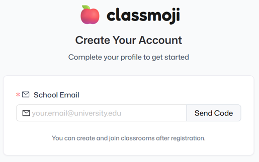
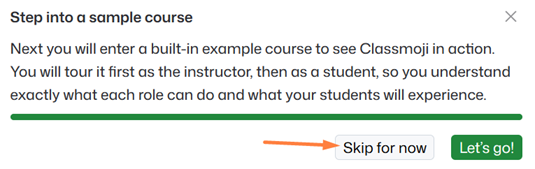
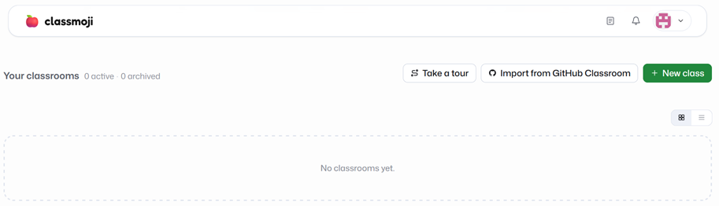
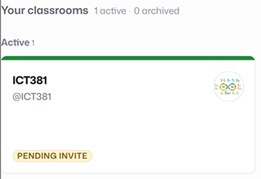
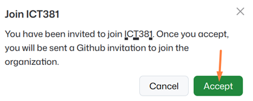
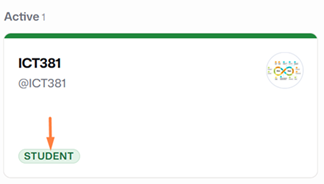
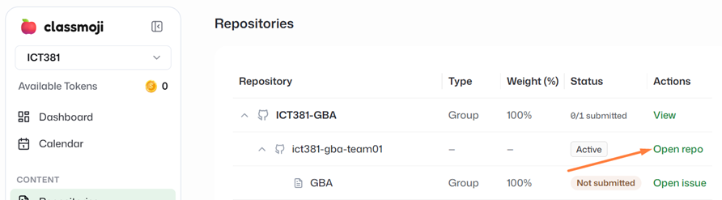
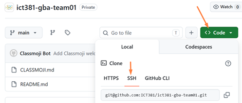
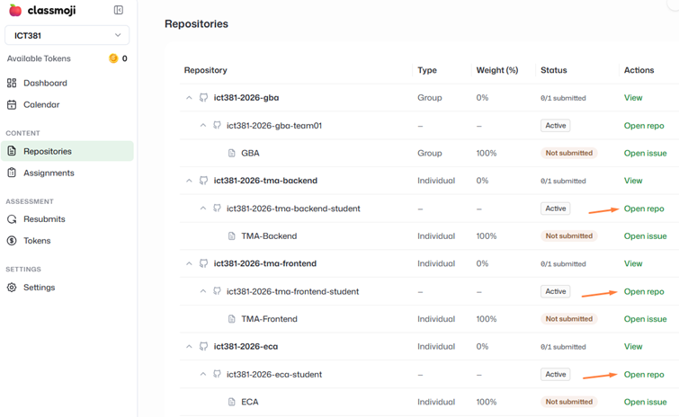
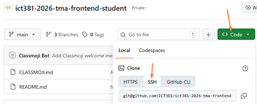

# Classmoji

In this course, there are group based and individual assignments that require you to submit your codes in Classmoji.

Before you start, please ensure that you have the following:
*  A GitHub account

You will be using your GitHub account to sign up for an account in Classmoji.

## How to create an account in Classmoji?

1. Go to [Classmoji](https://app.classmoji.io/) website and click **Continue with GitHub** button.

2. Sign in by using your GitHub credentials.

3. Click on the **Authorize** button.

4. Enter your SUSS email address and click **Send Code**.

   

5. Go to your mail inbox to retrieve the 6 digit code. kindly note that the verification code will expire in 10 minutes.

6. Enter the 6 digit code and click **Verify Code**.

7. You will be asked to fill in more details such as your name and school ID.

   -  **Your Name**: YOUR_FULL_NAME
   -  **School ID**: SUSS

8. Click **Complete Registration** button to continue.

9. You will see the welcome message. Click **Next**.

10. Follow the screen and click **Next**. When you reach the message to step into a sample course, click **Skip for now**.

      

11. When you see this page, you have completed the registration of your Classmoji account.

      

12. Please to go the Canvas LMS > Modules and indicate in the excel sheet that you have completed the account creation. This will allow the admin team to invite you into the classroom.

## Waiting for Class Enrollment in Classmoji

1. After completing your account creation, your instructor or the admin team will enroll you into the classroom that is assigned for this course.

2. When you are being added into the classroom, you will also receive an email notification from Classmoji with the email subject title: **"[Classmoji] You've been added to ICT381"**.

3. You can verify on the homepage that there is an active classroom which has a **pending invite** status.

   

4. Click on the active classroom.

5. You will get the join message prompt. Click **Accept**.

   

6. Check your inbox, you should receive an email notification from GitHub with the subject title: **[GitHub] You're invited to join the @ICT381 organization**.

7. Click on the **Join @ICT381** button.

8. Sign in to GitHub using your credentials.

9. Click on the **Join ICT381** button.

10. You will be directed to the organization home page. You should see a message on the top bar saying: **You are being added as a member of ICT381**.

11. Go to Classmoji and refresh the page, you should be see the status as being changed to **STUDENT**.

      

---

Now, we will take you through the steps to access your assignment repository.

## Accessing Group Assignment

Once the repositories are published, you will be able to access them.

1. Login to [Classmoji](https://app.classmoji.io/), click on the active class.

2. Click on **Repositories** on the left menu.

3. Access the group repo by clicking on the **Open repo** link.

   

4. It will bring you to the group repository on GitHub.

5. To work on the group repository on VScode, you need to clone the repository.

6. Click on the **Code** button and click **SSH**.

   Sample Screenshot:

   

7. Copy the link.

8. Open VSCode and open a **Terminal**.

9. Paste the command and it should clone the group repository to your local machine.

   ```bash
   git clone git@github.com:ict381/<GROUP-REPO-LINK>
   ```

10. You can now start to access and work on your group assignment.

11. Do not forget to commit and push your changes to the remote repository.


## Accessing Individual Assignment

1. Click on **Repositories** on the left menu in [Classmoji](https://app.classmoji.io/).

2. Access the respective repository by clicking on the **Open repo** link.

   

3. It will bring you to your individual repository on GitHub.

4. To work on the individual repository on VScode, you need to clone the repository.

5. Click on the **Code** button and click **SSH**.

   Sample Screenshot for StaycationX repo:

   

6. Copy the link.

7. Open VSCode and open a **Terminal**.

8. Paste the command and it should the clone the individual repository to your local machine.

   ```bash
   git clone git@github.com:ict381/<INDIVIDUAL-REPO-LINK>
   ```

   **NOTE**: Repeat the above steps for the **3** individual repositories.

9. You can now start to access and work on your assignment.

10. Do not forget to commit and push your changes to the remote repository.

---

## 🎉 Congratulations!

You have successfully accessed your assignment repositories. You can start to work on your assignments.