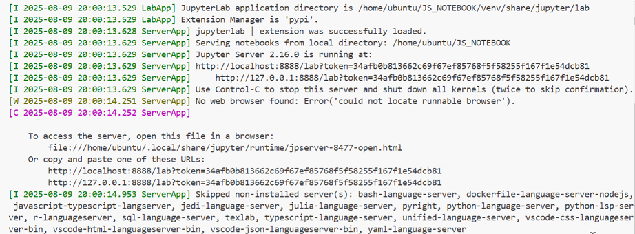
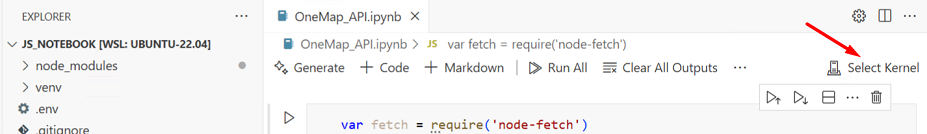
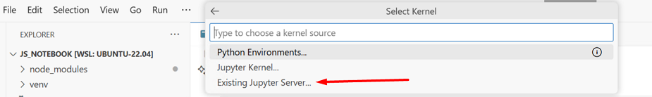
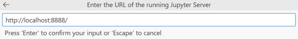
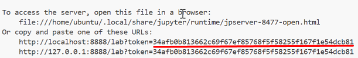
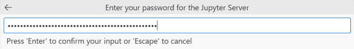
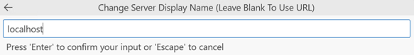
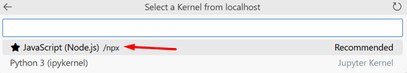
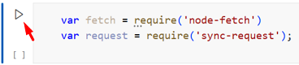
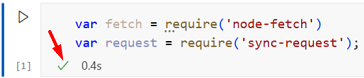

# Lab - Familiarization with OneMap API (Javascript)
In this lab, you will be familiarizing yourself with the OneMap API by setting up the environment and running the notebook sample codes that interacts with the OneMap API. This will help you to understand how to use the OneMap API for your application development.

## Pre-requisites
- You have completed the registration of your OneMap account.
    - Refer to [Task 1](./LAB_1B.md#task-1-create-onemap-api-account) from LAB_1B if you have not done so.
- You have SSH access to your GitHub account.
    - Refer to [Task 4](./LAB_0C.md#task-4-github-ssh-keys) from LAB_0C for the complete instructions if you have not done so.
- You have completed LAB_0A to setup your development environment.
    -   Ensure that you have the `jupyter` extension installed in VSCode.
- You have installed Node.js in your WSL environment.
    - Refer to [Task 3](./LAB_1B.md#task-3-install-nodejs-and-react-js) from LAB_1B if you have not done so.

## Instructions
The main tasks for this lab are as follows:
1. Cloning the `JS_NOTEBOOK` repo
2. Creating and activating a virtual environment
3. Installing library dependencies in virtual environment
4. Installing Node packages
5. Setup Javascript kernel
6. Creating an .env file
7. Start JupyterLab
8. Selecting the kernel
9. Running the first cell

Before you start to perform the following tasks, please open your VSCode and connect to your WSL.

## Task 1: Cloning the JS_NOTEBOOK repo

1.  Open a **Terminal**.

2.  Clone the `JS_NOTEBOOK` repo into your user home folder.

    ```bash
    cd /home/ubuntu
    git clone git@github.com:GIT_USERNAME/JS_NOTEBOOK
    ```

    > Replace GIT_USERNAME with your own GIT username

## Task 2: Creating and activating a virtual environment

1.  Navigate to the `JS_NOTEBOOK` folder.

    ```bash
    cd /home/ubuntu/JS_NOTEBOOK
    ```

2.  Create the virtual environment.

    ```bash
    python3 -m venv venv
    ```

3. Activate the virtual environment.

    ```bash
    source venv/bin/activate
    ```

## Task 3: Installing library dependencies in virtual environment

1.  Use `pip` to install the `jupyterlab` library.

    ```bash
    pip install jupyterlab
    ```

2.  Ensure that there are no errors installing the libraries.

## Task 4: Installing Node packages

You will need to install the following Node packages.

* `dotenv`: Loads environment variables from .env file into process.env.
* `node-fetch@2`: Brings the fetch() API to Node.js for making HTTP requests.
* `sync-request`: Allows making synchronous HTTP request in Node.js.
* `ijavascript`: A Javascript kernel for Jupyter notebook which allows running Javascript or Node.js code in a Jupyter environment.
* `base-64`: Utility for encoding and decoding data using Base64 format.

1. Use `npm` to install the node packages locally.

   ```bash
   npm install dotenv node-fetch@2 sync-request ijavascript base-64
   ```

2. Ensure that there are no errors installing the packages.

## Task 5: Setup Javascript kernel

You will setup the Javascript kernel so that you can run Node.js code inside the Jupyter notebook for the current project.

1. Use `npx` command to run the `ijsinstall` executable for the current (local) project.

    ```bash
    npx ijsinstall --install=local
    ```

2. Update the `argv` array to include `npx` as the first argument. This ensures that the `ijskernel` executable is run using `npx`. Using `npx` ensures the correct version from the project is used as it retrieves the executable from the project's `node_modules` folder.

    ```bash
    nano /home/ubuntu/.local/share/jupyter/kernels/javascript/kernel.json
    ```

    Change from :

    ```json
    {
        "argv": ["ijskernel", "--hide-undefined", "{connection_file}", "--protocol=5.1"],
        "display_name": "JavaScript (Node.js)",
        "language": "javascript"
    }
    ```

    To:
    ```json
    {
        "argv": ["npx", "ijskernel", "--hide-undefined", "{connection_file}", "--protocol=5.1"],
        "display_name": "JavaScript (Node.js)",
        "language": "javascript"
    }
    ```
3. Press `Ctrl+O` followed by **Enter** button to save the file.

4. Press `Ctrl+X` to exit the nano editor.

## Task 6: Creating an .env file

In this task, you will create a `.env` file to store your OneMap credentials for authentication.

1.  Create the `.env` file using nano editor.

    ```bash
    nano .env
    ```

2.  In the .env file, enter the following contents:

    ```bash
    ONEMAP_EMAIL=XXX
    ONEMAP_PASSWORD=XXX
    ```

    > **NOTE 1**: Replace XXX with your own OneMap credentials <br>
      **NOTE 2**: The `.env` file is not included in the git repository because it is listed in the `.gitignore` file. This ensures that your private variables are not shared with others. <br>

3. Press `Ctrl+O` followed by **Enter** button to save the file.

4. Press `Ctrl+X` to exit the nano editor.

## Task 7: Start JupyterLab

1. Ensure that you are still in your virtual environment, run the following command:

    ```bash
    jupyter lab
    ```

    You should the sample output:

    

## Task 8: Selecting the kernel

1.  Click to open the `OneMap_API.ipynb` file in VSCode.

2.  Click on **Select Kernel** that is shown at the top right hand corner of the file.

    

3.  Select **Existing Jupyter Server**.

    

4. It will prompt for the URL of the running Jupyter Server. Enter `http://localhost:8888/` and press **Enter**.

    

5.  It will prompt for the password of the Jupyter Server. The password is the token of the Jupyter Server.

    Sample Screenshot:

    

    Copy the token value and paste in the password prompt and press **Enter**.

    

6.  It will prompt for the server display name. You may change it or leave it as default with the `localhost` value. Press **Enter** to continue.

    

7.  Select the **Javascript (Node.js)** kernel.

    


## Task 9: Running the first cell

1.  Click on the first cell that shows to import the necessary modules.

2.  Click on the **Run** button.

    

3. Ensure that there are no errors. You should see the green tick.

    

---

## Running Staycation_API notebook

In order to run the `Staycation_API.ipynb` jupyter notebook, you would need to perform the following tasks:

1.  Edit the `.env` file with the nano editor.

    ```bash
    nano .env
    ```

2. Append the following contents to the `.env` file.

    ```bash
    STAYZ_EMAIL=peter@cde.com
    STAYZ_PASSWORD=12345
    ```

    Press `Ctrl+O` followed by **Enter** button to save the file. <br>
    Press `Ctrl+X` to exit the nano editor.

3.  Before you run the code cells, ensure that the following tasks have been completed:
    *   Run the StaycationX flask application.
    *   Ensure that the mongoDB database server is already started.
    *   The mongoDB database has been populated with data.

4. Finally, run the code cells by using the **Javascript** kernel.

---

**Congratulations!** You have successfully setup the environment. Please continue to explore the rest of the example codes to get familiar with the use of the API.