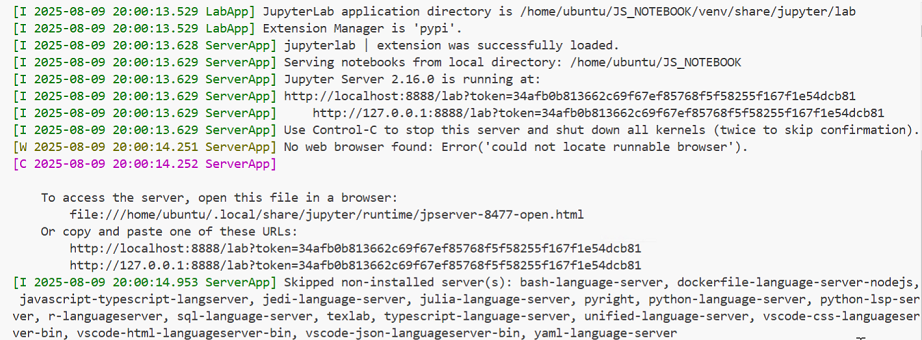
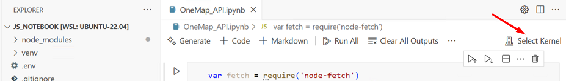
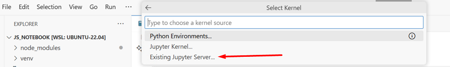
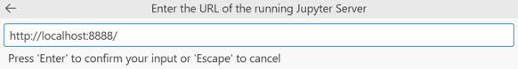
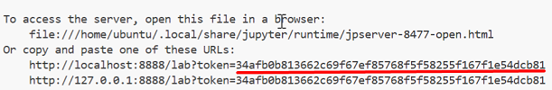
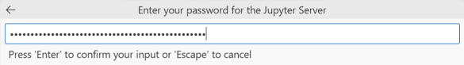
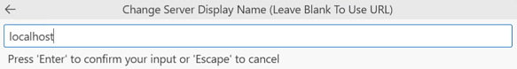
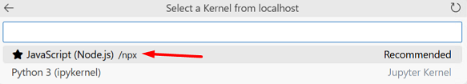
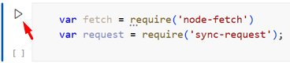
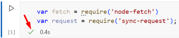

# Lab - Familiarization with the OneMap API (JavaScript)
In this lab, you will set up your environment and run sample notebook code that interacts with the OneMap API. This will help you understand how to use the OneMap API in your application development.

## Prerequisites

Before you begin, make sure you have completed these requirements:

**Account and access**
- Registration of your OneMap account.
    - Refer to [Task 1](./LAB_1B.md#task-1-create-onemap-api-account) in LAB_1B if you have not done so.

**IDE**
- Complete [LAB_0A](./LAB_0A.md) to set up your development environment.
- Install the Jupyter extension in VS Code.
- Install Node.js in your WSL environment.
    - Refer to [Task 3](./LAB_1B.md#task-3-install-nodejs-and-react-js) in LAB_1B if you have not done so.

**Course repositories**
- Cloned the course repositories to your WSL environment.
- The `JS_NOTEBOOK` repository will be used for this lab exercise.
    - Refer to [Task 5](./LAB_0C.md#task-5-mirror-course-repositories-to-your-account) in LAB_0C if you have not done so.

## Instructions
The main tasks for this lab are as follows:

1. Creating and activating a virtual environment
2. Installing library dependencies in the virtual environment
3. Installing Node packages
4. Setting up the JavaScript kernel
5. Creating an .env file
6. Starting JupyterLab
7. Selecting the kernel
8. Running the first cell

Before you begin, open VS Code and connect to WSL.

## Task 1: Create and activate a virtual environment

1. Navigate to the `JS_NOTEBOOK` folder.

    ```bash
    cd /home/ubuntu/JS_NOTEBOOK
    ```

2. Create the virtual environment.

    ```bash
    python3 -m venv venv
    ```

3. Activate the virtual environment.

    ```bash
    source venv/bin/activate
    ```

## Task 2: Install library dependencies in the virtual environment

1. Use `pip` to install the `jupyterlab` package.

    ```bash
    pip install jupyterlab
    ```

2. Verify that the installation completes without errors.

## Task 3: Install Node packages

You will need to install the following Node packages.

* `dotenv`: Loads environment variables from the `.env` file into `process.env`.
* `node-fetch@2`: Provides the `fetch()` API for Node.js.
* `sync-request`: Sends synchronous HTTP requests from Node.js.
* `ijavascript`: Provides a JavaScript kernel for Jupyter notebooks.
* `base-64`: Encodes and decodes Base64 data.

1. Use `npm` to install the packages locally.

   ```bash
   npm install dotenv node-fetch@2 sync-request ijavascript base-64
   ```

2. Verify that the packages install without errors.

## Task 4: Set up the JavaScript kernel

Set up the JavaScript kernel so that you can run Node.js code in Jupyter notebook for this project.

1. Use `npx` to run the local `ijsinstall` executable for the current project.

    ```bash
    npx ijsinstall --install=local
    ```

2. Update the `argv` array so that `npx` is the first argument. This starts `ijskernel` from the project `node_modules` folder instead of a global installation.

    ```bash
    nano /home/ubuntu/.local/share/jupyter/kernels/javascript/kernel.json
    ```

    Change from:

    ```json
    {
        "argv": ["ijskernel", "--hide-undefined", "{connection_file}", "--protocol=5.1"],
        "display_name": "JavaScript (Node.js)",
        "language": "javascript"
    }
    ```

    To:
    ```json
    {
        "argv": ["npx", "ijskernel", "--hide-undefined", "{connection_file}", "--protocol=5.1"],
        "display_name": "JavaScript (Node.js)",
        "language": "javascript"
    }
    ```
3. Press `Ctrl+O`, then press **Enter** to save the file.

4. Press `Ctrl+X` to exit the nano editor.

## Task 5: Create an .env file

In this task, you will create an `.env` file to store your OneMap credentials for authentication.

1. Create the `.env` file using the nano editor.

    ```bash
    nano .env
    ```

2. In the `.env` file, enter the following contents:

    ```bash
    ONEMAP_EMAIL=XXX
    ONEMAP_PASSWORD=XXX
    ```

    > **NOTE 1:** Replace `XXX` with your OneMap credentials.
    > **NOTE 2:** The `.env` file is excluded from the repository because it is listed in `.gitignore`, which prevents private values from being shared.

3. Press `Ctrl+O`, then press **Enter** to save the file.

4. Press `Ctrl+X` to exit the nano editor.

## Task 6: Start JupyterLab

1. Make sure the virtual environment is still active, then run:

    ```bash
    jupyter lab
    ```

    You should see the output similar to the following:

    

## Task 7: Select the kernel

1. Open the `OneMap_API.ipynb` file in VS Code.

2. Click **Select Kernel** in the top-right corner of the notebook.

    

3. Select **Existing Jupyter Server**.

    

4. When prompted for the URL of the running Jupyter Server, enter `http://localhost:8888/` and press **Enter**.

    

5. When prompted for the Jupyter Server password, enter the token shown in the JupyterLab terminal output.

    Sample Screenshot:

    

    Copy the token value, paste it into the prompt, and press **Enter**.

    

6. When prompted for the server display name, you may keep the default `localhost` value or change it. Press **Enter** to continue.

    

7. Select the **JavaScript (Node.js)** kernel.

    


## Task 8: Run the first cell

1. Click the first cell, which imports the required modules.

2. Click **Run**.

    

3. Confirm that no errors appear and that the cell shows a green checkmark.

    

---

## Run the Staycation_API notebook

To run the `Staycation_API.ipynb` notebook, complete the following steps:

1. Open the `.env` file in the nano editor.

    ```bash
    nano .env
    ```

2. Append the following values to the `.env` file.

    ```bash
    STAYZ_EMAIL=peter@cde.com
    STAYZ_PASSWORD=12345
    ```

    Press `Ctrl+O`, then press **Enter** to save the file.
    Press `Ctrl+X` to exit the nano editor.

3. Before you run the notebook cells, make sure that:
    * The StaycationX Flask application is running.
    * The MongoDB server is running.
    * The MongoDB database has been populated with data.

4. Run the notebook cells by selecting the **JavaScript** kernel.

---

## 🎉 Congratulations!

You have successfully set up the environment. Continue exploring the example codes to become familiar with the OneMap API.