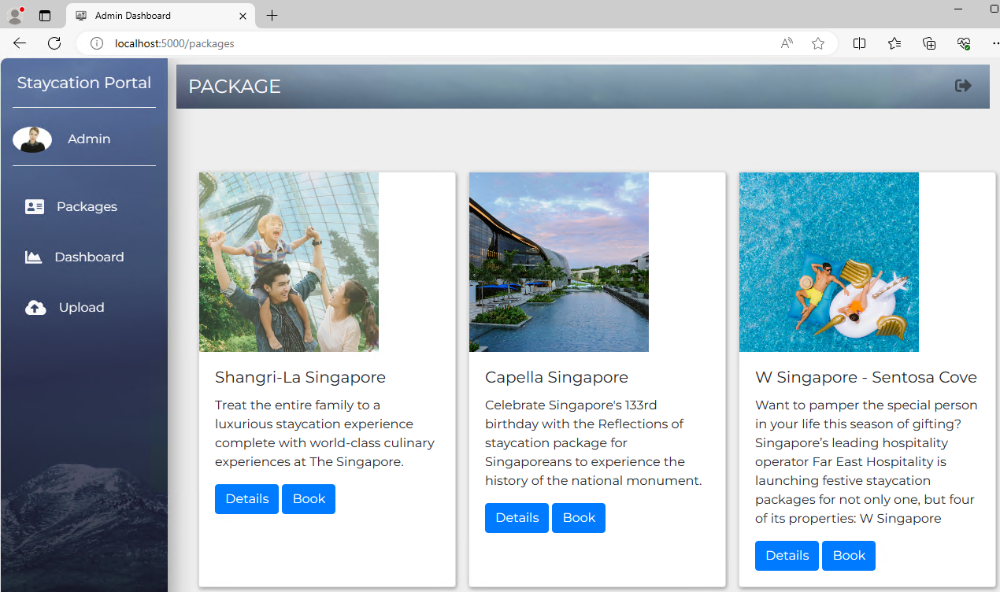

# Lab - How to Run StaycationX

In this lab, you will create a Python virtual environment, install the required dependencies, start the application, load sample data, and view the database in MongoDB Compass.

## Prerequisites
- Have completed LAB_0A or LAB_0B, depending on your platform.
- Have added your generated SSH public key to your GitHub account.
- Have cloned the course repositories to your WSL environment.
   - The `StaycationX` repository will be used for this lab exercise.

 **Note:** This lab assumes the default WSL user is `ubuntu`. If you use a different user name, update the paths in the commands accordingly.

## Lab Tasks

1. Creating the virtual environment.
2. Installing the required dependencies in the virtual environment.
3. Starting the StaycationX application.
4. Populating the database with sample data.
5. Viewing the MongoDB database in MongoDB Compass.

## Task 1: Creating the virtual environment

1. Navigate to the StaycationX folder.

   ```bash
   cd /home/ubuntu/StaycationX
   ```

2. Create a virtual environment.

   ```bash
   python3 -m venv venv
   ```

3. Activate the virtual environment.

   ```bash
   source venv/bin/activate
   ```

## Task 2: Installing dependencies in the virtual environment

1. Install the packages listed in `requirements.txt`.

   ```bash
   pip install -r requirements.txt
   ```

## Task 3: Starting the StaycationX application

1. Run the `start.sh` script to start the StaycationX application.

   ```bash
   ./start.sh
   ```

   ---
   **Note:** The StaycationX application requires MongoDB to be running. Before you start the application, verify the MongoDB service status:

   ```bash
   sudo systemctl status mongod
   ```
   If the service is not running, start it with:

   ```bash
   sudo systemctl start mongod
   ```
   ---

2. Open a web browser and go to `http://localhost:5000`. You should see the StaycationX website.

## Task 4: Populating the database with sample data

### Step 1: Register an admin user

1. Click **Register** on the home page.

2. Fill in the registration form with the following details and click **Submit**.

   | Field | Value |
   | --- | --- |
   | Email | admin@abc.com |
   | Password | 12345 |
   | Name | Admin |

3. On the login page, enter the email and password you used in the previous step and click **Submit**.

### Step 2: Populate the database with data

Upload the following CSV files: `booking.csv`, `users.csv`, and `staycation.csv`.

These files are located in the StaycationX `app/assets/js` folder.

#### How to select files in the WSL environment
When the Windows file picker opens after you click **Choose File**, browse to your Ubuntu distribution folder, then go to `home > ubuntu > StaycationX > app > assets > js`.

1. Click **Upload** on the left menu.
2. On the upload page, import the CSV files one at a time:

   - Select **Users** from the dropdown list, choose `users.csv`, and click **Upload**.
   - Select **Package** from the dropdown list, choose `staycation.csv`, and click **Upload**.
   - Select **Booking** from the dropdown list, choose `booking.csv`, and click **Upload**.

3. Click **Packages** on the left menu. The package list should appear.

   


## Task 5: Viewing the MongoDB database in MongoDB Compass

1. Launch the MongoDB Compass application.

2. Click **+Add new connection**.

3. Connect to the local MongoDB instance with the following URI: `mongodb://localhost:27017`.

   

4. Click **Connect**.

5. You should now be able to view the StaycationX database and its collections.

   


---

## 🎉 Congratulations!

You have completed the lab exercise. Please move on to next lab exercise.