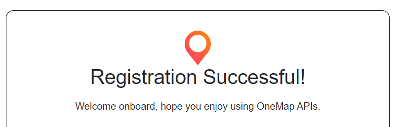
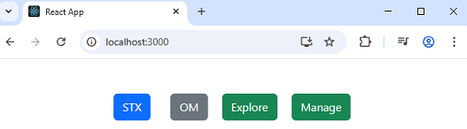
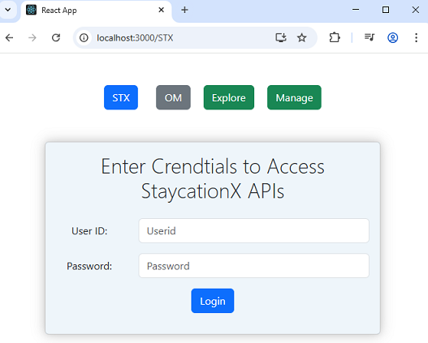
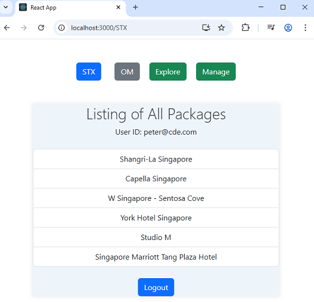
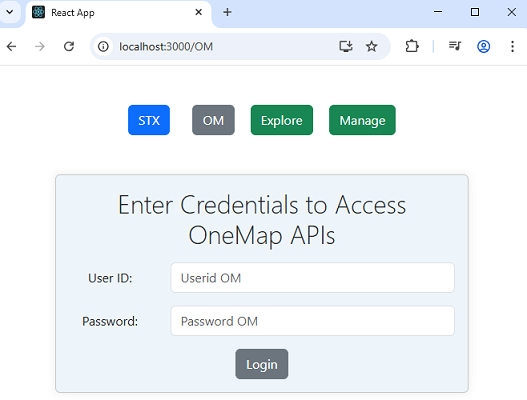
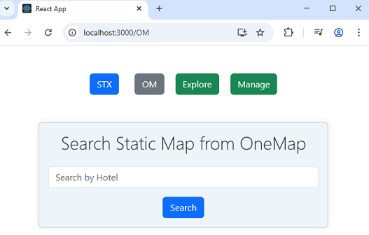
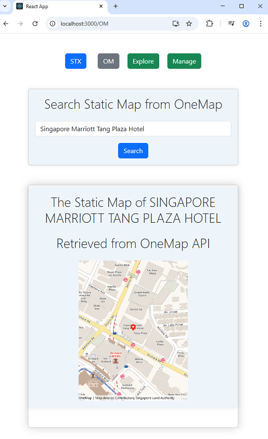

# Lab: Run the React Frontend for StaycationX

In this lab, you will run the React frontend for the StaycationX API and use the OneMap API to display static map images of hotels in Singapore.

## Before You Begin

Make sure the following prerequisites are met:

- Access to the `myReactApp` repository
- StaycationX backend application running and reachable (required for Task 5)

## Lab Tasks

1. Create a OneMap API account
2. Install Node.js and project dependencies
3. Start the React application
4. Test StaycationX API integration
5. Test OneMap API integration

## Task 1: Create a OneMap API Account

1. Visit the [OneMap API Registration](https://www.onemap.gov.sg/apidocs/register) website.
2. Fill in the required details and click **Register**.
3. On the **Confirm your OneMap API account** page:
    - Check your email inbox for the **Confirmation Code**.
    - Create a password that meets the criteria listed on the website.
    - Click **Register**.
4. Confirm that you see the message **Registration Successful!**.

    


## Task 2: Install Node.js and Project Dependencies

1.  Open a WSL terminal, download and run the Node.js setup script.

    ```bash
    cd /home/ubuntu/myReactApp
    curl -sL https://deb.nodesource.com/setup_16.x -o nodesource_setup.sh
    chmod +x nodesource_setup.sh
    sudo ./nodesource_setup.sh
    rm -rf nodesource_setup.sh
    ```

2.  Install Node.js.

    ```bash
    sudo apt-get install nodejs -y
    ```

3. Verify installation:

    ```bash
    node -v
    npm -v
    ```

    > Note: You should see version numbers for both `node` and `npm`.

4. Ensure you are in `myReactApp` directory:

    ```bash
    cd /home/ubuntu/myReactApp
    ```

5. Install project dependencies:

    ```bash
    npm install
    ```

## Task 3: Start the React Application

1. Run the following command to start the application:

    ```bash
    npm start
    ```

2. Access the app at `http://localhost:3000`.
    - If a browser does not open automatically, open a browser and enter the URL manually.

        

## Task 4: Test StaycationX API Integration

> Note: Ensure the StaycationX backend application is running before you begin this task.

1. On the home page, click the **STX** button.

2. Enter your StaycationX credentials to sign in.

    

3. After a successful login, verify that the package listings are displayed.

    

## Task 5: Test OneMap API Integration

1. On the home page, click the **OM** button.

2. Enter the OneMap credentials you created in Task 1 and sign in.

    

3. After a successful login, search for a location to display a static map image using the OneMap API.

    

4. Example search: `Singapore Marriott Tang Plaza Hotel`

    

---

## 🎉 Congratulations!

You have completed the lab exercise.