# Lab - Jira

## Task 1: Creating Jira account

1. Navigate to [https://www.atlassian.com/software/jira](https://www.atlassian.com/software/jira)

2. Enter your SUSS email address and click **Sign up**.

   

   > NOTE: DO NOT click on the Microsoft button to create your Jira account.

3. Check your email inbox for the **OTP code** from Atlassian, then enter it on the website.

   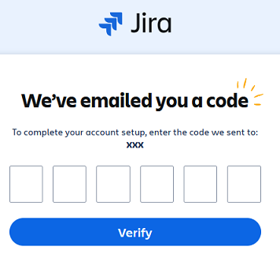

4. After successful verification of the code, you should see the green successful message.

   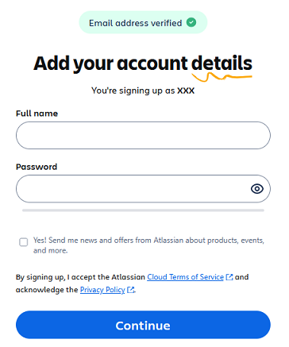

5. On **Add your account details** page, enter your `full name` and `password`.

6. Click **Continue** to proceed.

7. On the **Create a site** page, enter a **name** for your site.

   

8. Click **Continue** to proceed.

9. On **What kind of work do you do?** page, select **Software development** and click **Continue**.

    

10. On **How does your team plan to use Jira** page, click **Continue**.

    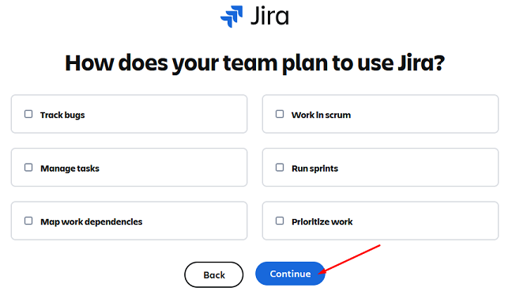

11. On **Name your first project** page, enter a **name** for your project and click **Get Started**.

    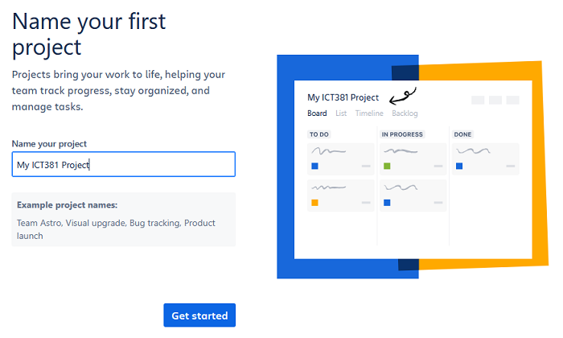

12. On **What types of work do you need** page, leave the default options selected and click **Next**.

    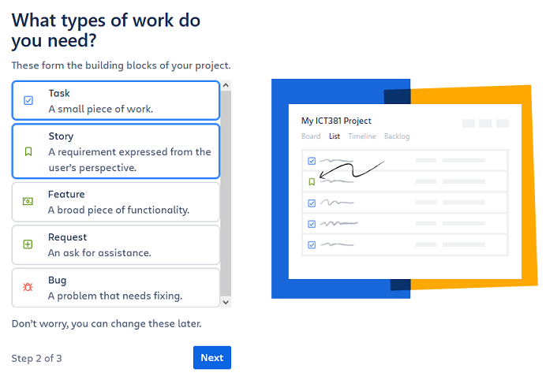

13. On **How do you track work?** page, leave the default options selected and click **Finish**.

    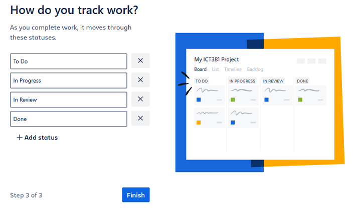

## Task 2: Cleaning up sample data

You will notice that the project you created has some sample data in it. You will need to clean up the sample data before proceeding.

1. Click on the **List** icon on the menu bar.

   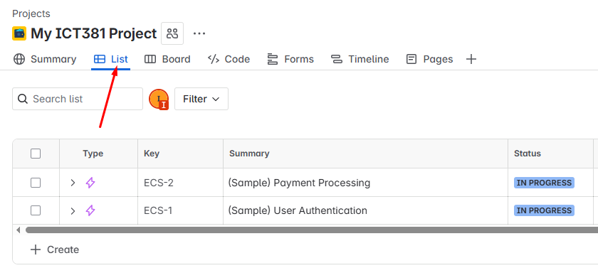

2. Click on the checkbox in the first column and click **Delete**.

   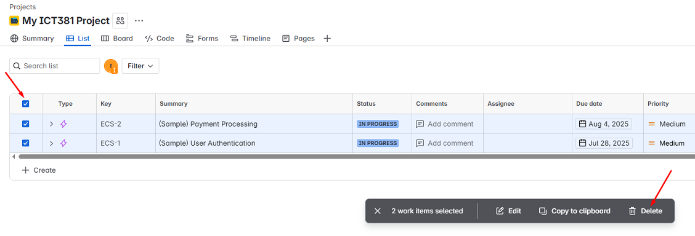

3. Repeat the previous step until the list is empty.

   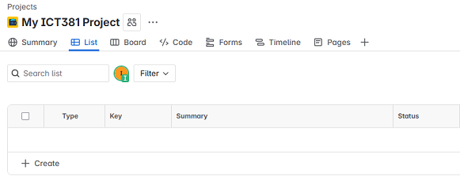

## Task 3: Invite your team members and instructor

1. Click on **More actions** button (three dots).

   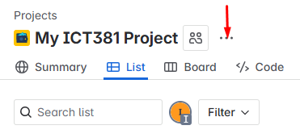

2. Click on **Add people** button.

   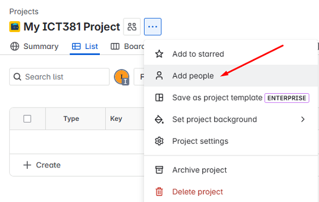

3. Under **Add people to Project** prompt, enter the email address of your team members and instructor.

   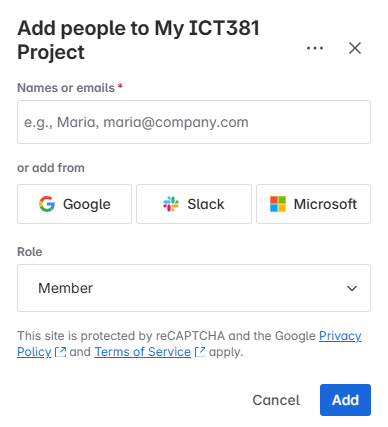

   > NOTE: Do not use the Microsoft button to add your team members email address.

4. Click on the **Add** button.

5. A message is displayed to show that the user has been added to the project.

   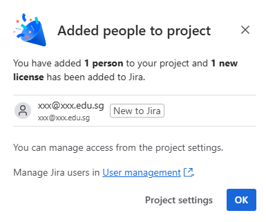

6. The added user will receive an email invitation to join the Jira project. Team members should check their inbox and accept the invitation.

#### NOTE: The team leader should add the instructor email address so that the instructor can access the project for grading purposes.

## Task 4: Practice

#### Please refer to your study guide to complete the rest of the exercises.

---

**Congratulations!** You have completed the lab exercise.