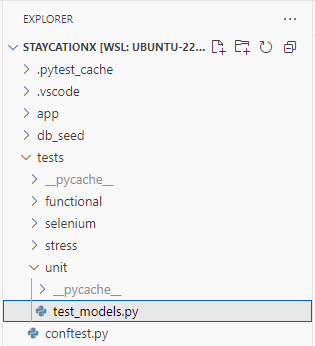
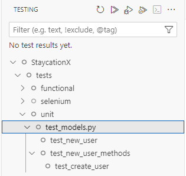
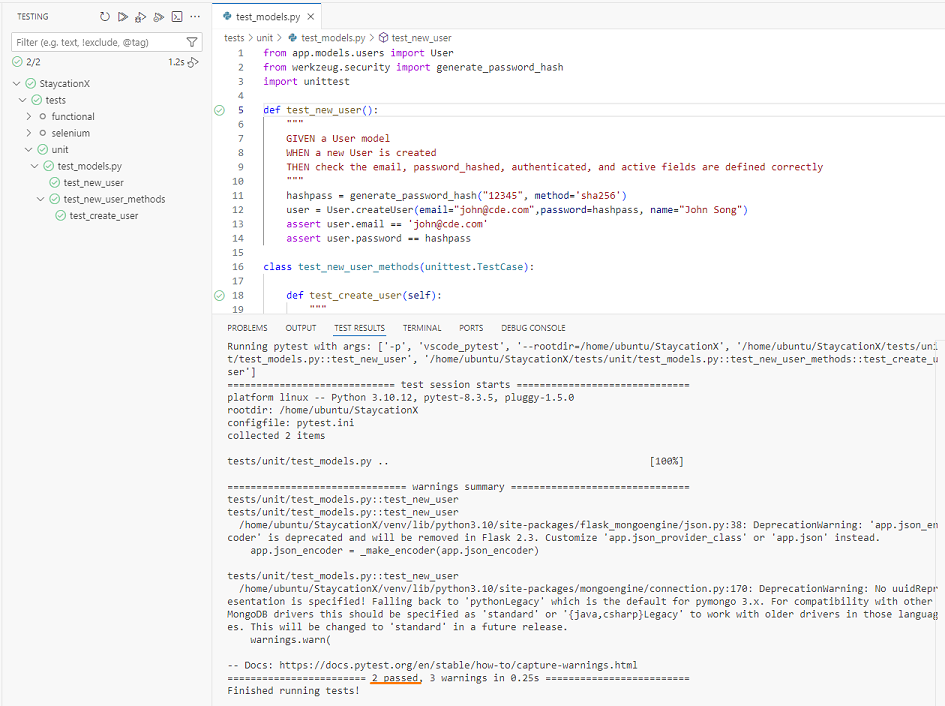
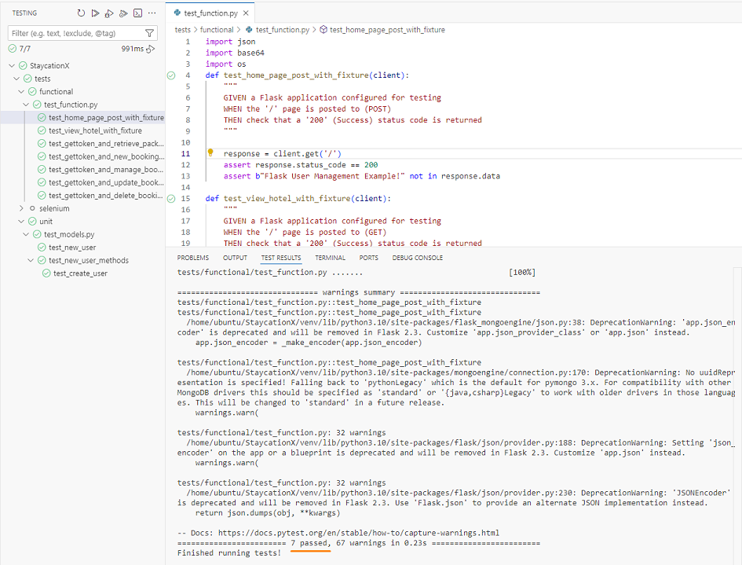

# Lab - Practice UnitTest and Pytest modules for unit and feature testing

In this lab, you will learn how the unit tests and feature tests are implemented for StaycationX. You will be working this lab within your own local development VSCode environment.

## Pre-requisites
- Completed Lab_0A or Lab_0B depending on your platform.

## Instructions
1. Clone StaycationX repo
2. Creating an .env file
3. Run Unit testing
4. Run Feature testing


## Task 1: Clone StaycationX repo

This section is optional if you have already cloned the `StaycationX` repo in the previous lab.

If you have not done so, please clone the `StaycationX` repo into your home directory. You can follow the steps provided under Task 1 in LAB_1A.
## Task 2: Creating an .env file

In line 9 of the `conftest.py` file, the `load_dotenv()` function from the `dotenv` library is used to import all environment variables into the system. This affects the behavior of the application. For example, the `create_app()` function checks the value of the `FLASK_ENV` environment variable:

```python
# Line 24 of __init__.py file
host = 'localhost' if os.getenv('FLASK_ENV') == 'development' else 'db'
```

* If `FLASK_ENV` is set to `development`, the host value will be set to `localhost`.
* If `FLASK_ENV` is not set or has any other value, the host value will default to `db`.

To use the `dotenv` module properly for testing, you need to create a `.env` file in the root directory of the application and add the following content to it:

```bash
# Add FLASK_ENV=development to the .env file
# Use the echo command to add the line to the .env file
echo 'FLASK_ENV=development' > /home/ubuntu/StaycationX/.env
```

**NOTE:** The `.env` file is not included in the git repository because it is listed in the `.gitignore` file. This ensures that your private environment variables are not shared with others.

## Task 3: Run Unit Testing

Please refer to your study guide for a better understanding and explanation of the test cases and their relevant code for Unit and Feature testing.

Before running the tests, ensure that your MongoDB server is running and data has been populated into the database.

1. In VSCode, expand the **tests** folder.

2. You will notice that there are different test folders for each type of test.

3. Take a look at unit test sub-folder, open and study the `test_models.py` file. You should see that there are two test functions.

   

4. To run the tests, click **Testing** icon on the left panel of VSCode. (It looks like a flask icon)

5. Expand StaycationX folder and under the `unit` sub-folder, hover your mouse and click on the run button under `test_models.py` to run the test cases.
   
   

   > TIP: You can run the individual test functions by clicking on the run button when you hover your mouse over the function.

6. You should see that the test functions have passed successfully.

   

---
#### NOTE

Please note that when you run the test functions multiple times, you will encounter an error as the user already exists in the database. To resolve this issue, you can use MongoDB Compass to connect to the database and drop the records that were created from the `test_models.py` file.

For test_new_user function, an user with an email `john@cde.com` is created. You can delete this record from the database and try again.

For test_create_user function, an user with an email `jack@fgh.com` is created. You can delete this record from the database and try again.

---

## Task 4: Run Feature Testing

1. Under the `functional` folder, open and study the `test_function.py` file. You should see that there are three test functions.

2. Click on the run button under `test_function.py` to run the test cases.

   > TIP: You can run the individual test function by clicking on the run button when you hover your mouse over the function.

3. You should see the test functions have passed successfully.

   


Under the `tests` folder, there is a `conftest.py` file. It is a configuration file for the pytest testing framework. It sets up fixtures that help to initialize and manage the testing environment for the StaycationX appplication. It has the following components:

1. Flask Application Setup:
   - `setup_app` fixture:
      -  `@pytest.fixture(scope='session', autouse=True)`: This decorator defines setup_app as a fixture. 
      -  `scope='session'`: means it runs once per test session
      -  `autouse=True`: means it's automatically used by all tests without needing to explicitly include it.
      -  Creates a Flask application instance for testing using `create_app()`.
      -  Responsible for initializing the application with the provided configurations, which are defined in the  `create_app()` function located in the `__init__.py` file within the app folder.

2. Test Client:
   - `client` fixture:
      -  Creates and returns a Flask test client which allows you to make requests to the application during tests.


This file ensures that each test has access to the configured Flask application instance and a test client for making requests. The session-scoped `setup_app()` fixture efficiently creates the application once per session, while the function scoped client fixture provides a fresh test client for each individual test.

---

**Congratulations!** You have completed this lab exercise. Do move on to the next lab exercise for selenium testing.