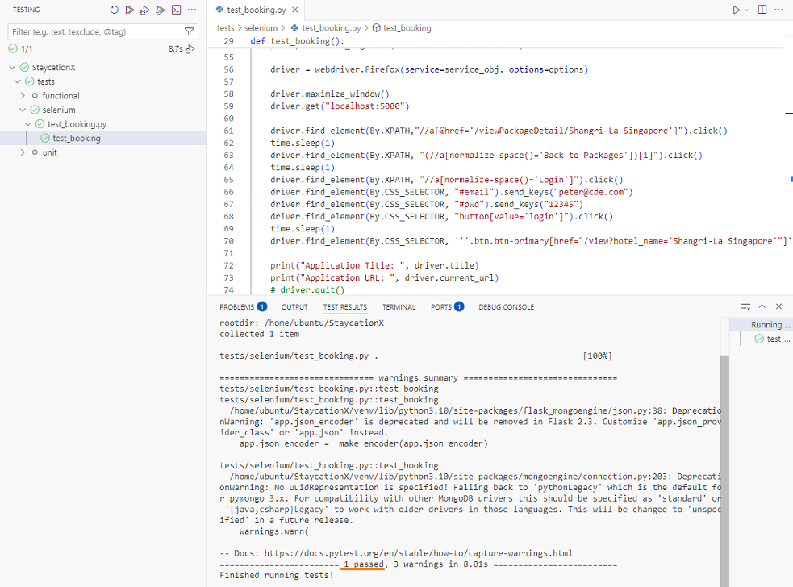

# Lab - Practice Selenium for System Testing

This lab introduces Selenium for automated system testing of the StaycationX web application. You will configure the Geckodriver service, run a browser automation test, and verify that the booking workflow passes end-to-end.

> **Background:** Selenium automates web browser interactions to verify that a web application behaves correctly from the user's perspective. Geckodriver is the WebDriver implementation for Firefox. It translates Selenium commands into browser actions.

## Prerequisites

- Completed Lab 0A or Lab 0B (depending on your platform).
- Access to the `StaycationX` repository.
   * The main branch will be used.
- The database is populated with sample data.

**NOTE:** All steps in this lab are performed inside your **local development environment**.


## Instruction
1. Running of StaycationX and MongoDB
2. Setup and run Selenium Test

## Task 1: Start StaycationX and MongoDB

1. Open VS Code and open the StaycationX project folder.

2. Confirm that the active branch is `main`.

3. Start both the StaycationX application and MongoDB.

## Task 2: Setup and Run the Selenium Test

Please refer to your study guide for a better understanding and explanation of the test case and its relevant codes for Selenium testing.

### Step 1 — Review and study the test file

1. In the VS Code Explorer, expand the `tests` folder.

2. Open `tests/selenium/test_booking.py` and review its contents.

### Step 2 — Understand the Geckodriver path resolution

When running the Selenium test in the `test_booking.py` file, you need to tell Selenium where to find the geckodriver file. The code snippet shows how this is being handled.

```python
path = os.getenv('GECKODRIVER_PATH')
service_obj = Service(path) if os.getenv('FLASK_ENV') == 'development' else Service("/opt/geckodriver")
```

| Condition | Geckodriver path used |
|-----------|----------------------|
| `FLASK_ENV=development` | Value of the `GECKODRIVER_PATH` environment variable |
| Any other value (including unset) | Hardcoded path `/opt/geckodriver` (used in containerised deployments) |

This allows the same code to run in both local development and containerised environments without modification. This effect can be observed when you are running StaycationX inside containers.

### Step 3 — Set the `GECKODRIVER_PATH` environment variable

Add `GECKODRIVER_PATH` to the project's `.env` file, setting its value to the full path of the `geckodriver` binary on your system.

The following command uses the default path. Modify the path if your `geckodriver` binary is located elsewhere.

```bash
echo 'GECKODRIVER_PATH=/home/ubuntu/StaycationX/geckodriver' >> /home/ubuntu/StaycationX/.env
```

### Step 4 — Run the test

1. In VS Code, click the **Testing** icon in the Activity Bar (the beaker icon).

2. Expand the `selenium` folder in the Test Explorer.

3. Click the **Run** button next to `test_booking.py`.

4. A Firefox window will open and automatically execute the workflow defined in test file.

5. When the test completes, confirm that the test result shows **passed**.

   

6. Close the Firefox browser window.

---
## 🎉 Congratulations!

You have completed the lab exercise. Do move on to the next lab exercise.