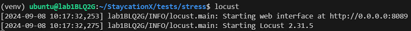
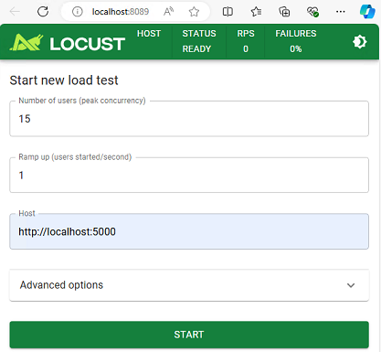
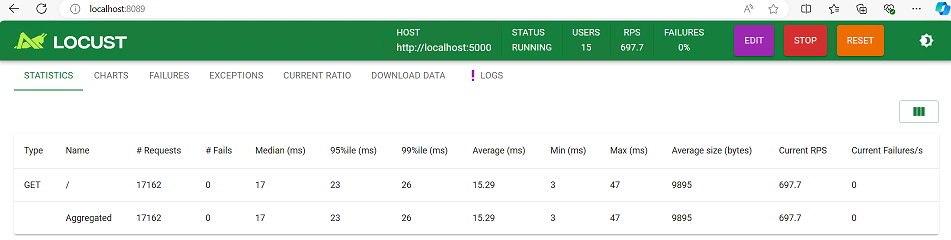
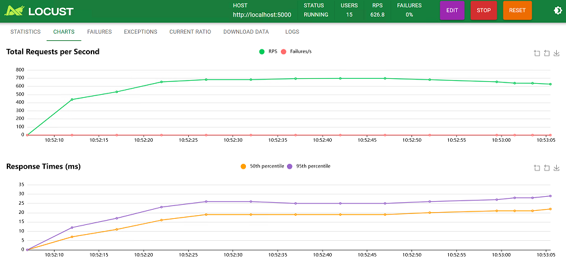
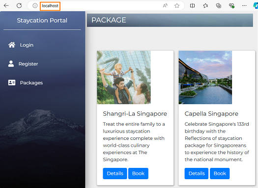
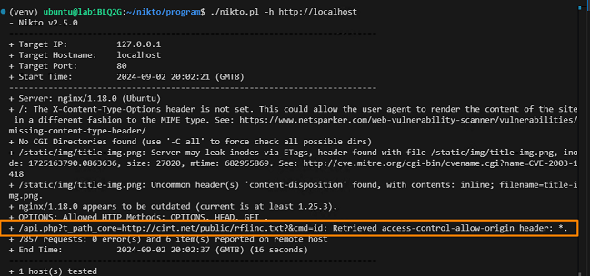
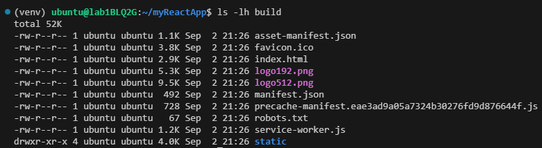
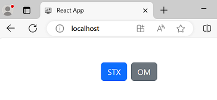
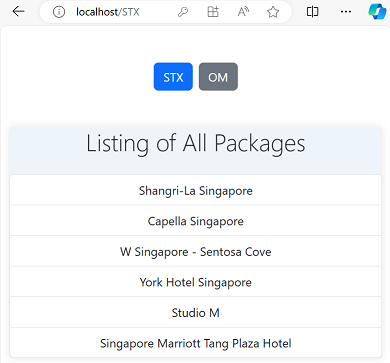
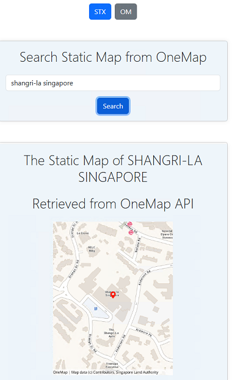

# Lab - Exploring Web and Application Servers

This lab has three exercises:

1. Deploying StaycationX with Gunicorn and running load tests with Locust.

2. Deploying Nginx in front of StaycationX with Gunicorn and scanning the site with Nikto.

3. Deploying StaycationX with Gunicorn with Nginx serving as the frontend to deliver myReactApp wuth files from the build directory.

## Prerequisites

Before you begin, confirm the following:

1. The MongoDB database is populated and the `mongodb` service is running.
2. The StaycationX and myReactApp repositories are cloned on your machine.
3. Both Nginx and Node.js are installed.


## Exercise 1: Run StaycationX and test it with Locust

For background on load testing with [Locust](https://locust.io/), refer to the study guide and the [youtube video](https://www.youtube.com/watch?v=uvs4cq6JCeU) that is provided under the course syllabus page.

This exercise is to showcase how to setup StaycationX application with Gunicorn and conduct load testing using Locust.

1. Open a WSL terminal and go to the StaycationX repository.
2. Activate the Python virtual environment used by the project.
3. Start StaycationX with Gunicorn.

   ```bash
   gunicorn --bind :5000 -m 007 --workers 3 -e FLASK_ENV=development "app:create_app()"
   ```

   Gunicorn does not read `.env` files automatically. Use `-e` to set any required environment variables for the process.

4. Go to the `stress` sub-folder under the tests directory.

   ```bash
   cd /home/ubuntu/StaycationX/tests/stress
   ```

5. Start the Locust load testing tool.

   ```bash
   locust
   ```

    

6. Open `http://localhost:8089` in a web browser.

7. Set the test parameters in the form.

   - Number of users: `15`
   - Host: `http://localhost:5000`

      

8. Select **Start** to begin the test.

9. Review the **Statistics** page. Switch to **Charts** to inspect the results as well.

      Sample Screenshots:

      
      

10. If you prefer a non-interactive run, you can use the terminal mode.

      ```bash
      locust -f locustfile.py --headless -u 10 -r 1 -t 30s -H http://localhost:5000 --html=report.html --csv=report
      ```

   - `-f locustfile.py` selects the Locust test file.
   - `--headless` runs Locust without the web UI.
   - `-u 10` sets 10 users to simulate.
   - `-r 1` spawns one user per second.
   - `-t 30s` runs the test for 30 seconds.
   - `-H http://localhost:5000` sets the target host.
   - `--html=report.html` generates an HTML report named `report.html`.
   - `--csv=report` generates `report_stats.csv`, `report_stats_history.csv`, and `report_failures.csv`.

This exercise was performed on a development machine. You can repeat it on an EC2 instance to compare local and remote performance.

## Exercise 2: Put Nginx in front of StaycationX and scan it with Nikto

For background on Nikto, refer to the study guide and the [youtube video](https://www.youtube.com/watch?v=K78YOmbuT48) video provided in the course syllabus page.

Nikto is an open-source web scanner that identifies common web server and application security issues.

1. Make sure the Gunicorn process from Exercise 1 is still running. If not, repeat steps 1 to 3 from Exercise 1.

2. Navigate to the Nginx site configuration directory.

   ```bash
   cd /etc/nginx/sites-available
   ```

3. Back up the default site configuration.

   ```bash
   sudo cp default default.bak
   ```

4.  Copy the following contents to replace the default file contents. This configuration block is used to setup Nginx to act as a reverse proxy for the StaycationX application served by Gunicorn.

      ```bash
      sudo tee /etc/nginx/sites-available/default <<EOF
      proxy_cache_path cache levels=1:2 keys_zone=my_cache:10m max_size=10g inactive=60m use_temp_path=off;

      server {
         listen 80;

         location / {
            proxy_pass http://localhost:5000;
            proxy_set_header Host \$host;
            proxy_set_header X-Forwarded-For \$proxy_add_x_forwarded_for;
            proxy_redirect off;
            proxy_cache my_cache;
         }
      }
      EOF
      ```

      This configuration forwards browser requests to the Gunicorn server listening on port 5000.

5. Validate the Nginx configuration for errors and validity. Make sure that there are no errors.

   ```bash
   sudo nginx -t
   ```

6. Restart Nginx.

   ```bash
   sudo systemctl restart nginx
   ```

7. Open `http://localhost` in a web browser and confirm that the StaycationX application loads.

   

---

In the next few steps, we will download the Nikto tool and perform a security scan on the StaycationX application.

1. Download Nikto in the home directory.

   ```bash
   cd /home/ubuntu/
   git clone https://github.com/sullo/nikto
   ```

2. Go to the Nikto program directory.

   ```bash
   cd nikto/program
   ```

3. To enable SSL support for Nikto, install these additional packages.

   ```bash
   sudo apt-get update
   sudo apt-get install perl libnet-ssleay-perl openssl libauthen-pam-perl libio-pty-perl -y
   # add additional support for JSON and xmlwriter
   sudo apt-get install libxml-writer-perl libjson-perl -y
   ```

4. Confirm the Nikto version.

   ```bash
   ./nikto.pl -Version
   ```

5. Scan the StaycationX application.

      ```bash
      ./nikto.pl -h http://localhost
      ```

      


   The scan output may report `Access-Control-Allow-Origin: *`. This header allows any website origin to read permitted responses in the browser, but it does not restrict which IP addresses or clients can send requests. If the application exposes sensitive data, configure CORS to allow only trusted origins instead of using `*`.

## Exercise 3: Serve myReactApp from Nginx

This exercise shows how to build myReactApp and serve the compiled files through Nginx while StaycationX remains served behind Gunicorn.

1. Open a terminal and go to the myReactApp repository.

   ```bash
   cd /home/ubuntu/myReactApp
   ```

2. Create a production build of myReactApp.

   ```bash
   npm run build
   ```

3. Confirm that the build folder was created.

   ```bash
   ls -lh build
   ```

   

4. Copy the build output to the Nginx web root.

   ```bash
   sudo cp -R /home/ubuntu/myReactApp/build/* /usr/share/nginx/html
   ```

5. Copy the following contents to replace the default file. This configuration block is used to set up Nginx to serve a static frontend application.

   ```bash
   sudo tee /etc/nginx/sites-available/default <<EOF
   server {
       listen 80;

       location / {
           root /usr/share/nginx/html;
           try_files \$uri /index.html;
       }
   }
   EOF
   ```

   The `root` directive points Nginx to the directory that contains the compiled React files. The `try_files` directive supports client-side routing by falling back to `index.html`.

7. Test the Nginx configuration for errors and validity. Make sure there are no errors.

   ```bash
   sudo nginx -t
   ```

8. Restart Nginx.

   ```bash
   sudo systemctl restart nginx
   ```

9. Open `http://localhost` in a browser and confirm that myReactApp loads.

   

10. Make sure the Gunicorn service from Exercise 1 is still running. If not, repeat steps 1 to 3 from Exercise 1.

11. Select the **STX** button.

12. Sign in with your StaycationX credentials.

13. After sign-in, confirm that the staycation package list appears.

      

14. Select the **OM** button to access the OneMap API feature.

15. Once login succesfully, enter a hotel name in the search field and click on **Search** button. For instance, enter `shangri-la singapore`.

16. Verify that the static map appears.

      

---
## 🎉 Congratulations!

You have completed the lab exercise.
