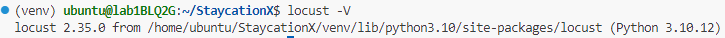
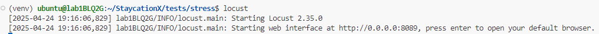
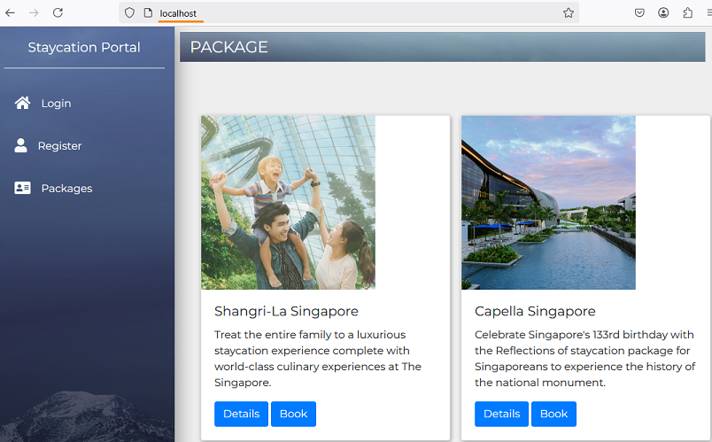
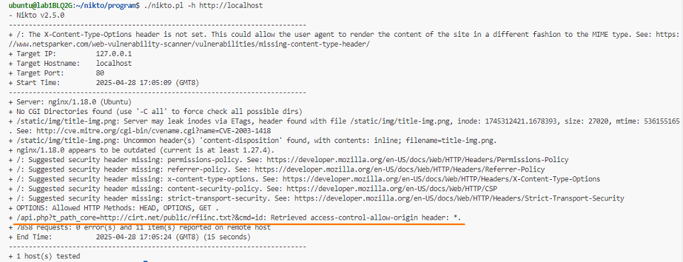
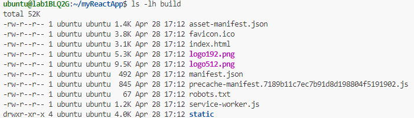
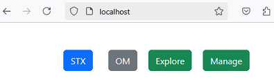
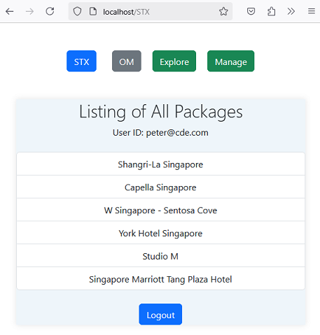
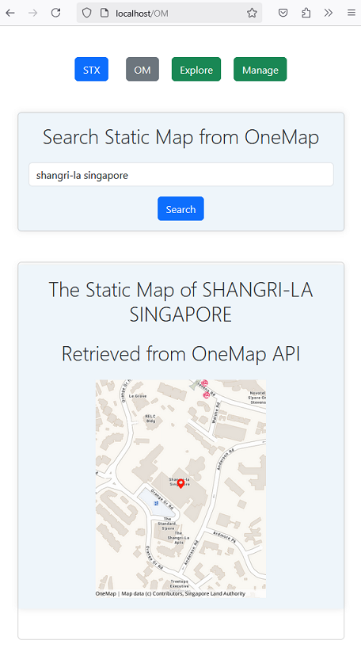

# Lab - Exploring Web and Application Server

This lab has 3 exercises:
1. The first exercise involves launching the StaycationX application with Gunicorn and conducting load testing using Locust.

2. The second exercise involves deploying the StaycationX application using Gunicorn, with Nginx serving as the frontend, followed by conducting security testing using Nikto.

3. The third exercise focuses on deploying the StaycationX application using Gunicorn, with Nginx serving as the frontend to deliver myReactApp with files from the build directory.


## Pre-requisites
1. The MongoDB database is populated with data and the mongodb service is running throughout these lab exercises.
2. You have the repositories cloned to your machine.
3. You have installed Nginx web server on your machine.


## Exercise 1

To find out more about load testing with [Locust](https://locust.io/), please refer to the study guide and the [youtube video](https://www.youtube.com/watch?v=uvs4cq6JCeU) that is provided under the course syllabus page.

This exercise is to showcase how to setup StaycationX application with Gunicorn and conduct load testing using Locust.

To get started, please follow the steps below:

1. Navigate to the folder where your StaycationX repository is located.

2. Activate the virtual environment.

3. Start StaycationX using the Gunicorn application server.

   ```bash
   gunicorn --bind :5000 -m 007 --workers 3 -e FLASK_ENV=development "app:create_app()"
   ```

   > Gunicorn does not automatically read the `.env` file so you must use the `-e` flag to set the environment variable for the execution process.

4. Open a new terminal and check whether Locust is installed. If it is not installed, please perform pip install of the `requirements.txt` file.

   ```bash
   locust -V
   ```

   

5. Navigate to the `stress` sub-folder under the tests directory.

   ```bash
   cd /home/ubuntu/StaycationX/tests/stress
   ```

6. Run the locust command to start the Locust load testing tool.

   ```bash
   locust
   ```

   

7. Open web browser and navigate to `http://localhost:8089`.

8. On the Locust form, you can set the values to start a load test.  

   For the **Number of users (peak concurrency)** field, set it to `15`.

   For the **Host** field, set it to `http://localhost:5000`.

   

9. Once ready, click on **Start** button to start the load test.

10. Once the test starts, you will be presented with the Statistics page. Click on other tabs such as **Charts** to explore the features.

    Sample Screenshots:

    

    

11. You can also run it from the Terminal without using the GUI.

    ```bash
    locust -f locustfile.py --headless -u 10 -r 1 -t 30s -H http://localhost:5000 --html=report.html
    ```

      *  `-f locustfile.py`: Specifies the locustfile to use.
      *  `--headless`: Runs Locust without the web UI.
      *  `-u 10`: Simulates 10 users.
      *  `-r 1`: Spawns 1 user per second.
      *  `-t 30s`: Run the tests for 30 seconds.
      *  `-H http://localhost:5000`: Specifies the specific host to load the test.
      *  `--html=report.html`: Generates an HTML report named `report.html`.
      *  `--csv=report`: Generates three CSV files: report_stats.csv, report_stats_history.csv and report_failures.csv.

Please note that the above exercise was conducted on a development machine. You can repeat this exercise on an EC2 machine to observe the performance test and compare the results with those from local testing.

## Exercise 2

To find out more about security testing with Nikto, please refer to the study guide and the [youtube video](https://www.youtube.com/watch?v=K78YOmbuT48) that is provided under the course syllabus page.

This exercise is to showcase how to setup StaycationX application with Gunicorn, with Nginx acting as the frontend and conducting security scanning using Nikto. 

Nikto is an open-source web scanner used for identifying vulnerabilties and security issues with web applications.

To get started, please follow the steps below:

1. Ensure that the gunicorn application server is still runnning. If it is not, kindly follow Steps 1-3 from Exercise 1.

2. Navigate to the nginx `sites-available` directory which stores the configuration files.

   ```bash
   cd /etc/nginx/sites-available
   ```

3. Backup the default file.

   ```bash
   sudo cp default default.bak
   ```

4. Copy the following contents to replace the default file. This configuration block is used to set up Nginx to act as a reverse proxy for the StaycationX application served by Gunicorn.


   ```bash
   sudo tee /etc/nginx/sites-available/default <<EOF
   proxy_cache_path cache levels=1:2 keys_zone=my_cache:10m max_size=10g inactive=60m use_temp_path=off;

   server {

    listen 80;

    location / {
        proxy_pass http://localhost:5000;
        proxy_set_header X-Forwarded-For \$proxy_add_x_forwarded_for;
        proxy_set_header Host \$host;
        proxy_redirect off;
        proxy_cache my_cache;
      }
   }
   EOF
   ```

   The `proxy_pass` directive is used to forward all requests to `http://localhost:5000`, where the Gunicorn server is running the StaycationX application.

5. Test the Nginx configuration files for errors and validity. Make sure there are no errors.

   ```bash
   sudo nginx -t
   ```

6. Restart the Nginx service.

    ```bash
    sudo systemctl restart nginx
    ```

7. Open the web browser and browse `http://localhost`. You should see the **StaycationX** application.

    

In the next few steps, we will download the Nikto tool and perform a security scan on the StaycationX application.

1. Navigate to your home directory and clone the Nikto repository.

   ```bash
   cd /home/ubuntu
   git clone https://github.com/sullo/nikto
   ```

2. Navigate to the Nikto program directory.

   ```bash
   cd nikto/program
   ```

4. To enable SSL support for Nikto, install these additional libaries.

   ```bash
   sudo apt-get update
   sudo apt-get install perl libnet-ssleay-perl openssl libauthen-pam-perl libio-pty-perl -y
   ```

3. You may check out the version of the Nikto program.

   ```bash
   ./nikto.pl -Version
   ```

4. Perform a scan on the StaycationX application.

   ```bash
   ./nikto.pl -h http://localhost
   ```

   


   From the scan result, it is noted that access-control-allow-origin is set to *, which means it allows inbound traffic from any IP address. This could be potentially dangerous. Therefore, we need to address this issue to only allow trusted origins.


## Exercise 3

The exercise involves deploying StaycationX application with Gunicorn, while Nginx acts as the frontend, serving myReactApp using files from the build directory.

1. Navigate to the folder where the myReactApp repository is located.

   ```bash
   cd /home/ubuntu/myReactApp
   ```

2. Create a production build of myReactApp.

   ```bash
   npm run build
   ```

3. Check that there is a build folder created.

   ```bash
   ls -lh build
   ```

   

4. Copy the build files to the Nginx HTML folder.

   ```bash
   sudo cp -R /home/ubuntu/myReactApp/build/* /usr/share/nginx/html
   ```

5. Copy the following contents to replace the default file. This configuration block is used to set up Nginx to serve a static frontend application.

   ```bash
   sudo tee /etc/nginx/sites-available/default <<EOF
   server {

    listen 80;

    location / {
        root /usr/share/nginx/html;
        try_files \$uri /index.html;
      }
   }
   EOF
   ```

   The `root` directive specifies the root directory for the static files. It will serve files from `/usr/share/nginx/html` directory, which is where `myReactApp` build files were copied in the previous step.
   
6. Test the Nginx configuration files for errors and validity. Make sure there are no errors.

   ```bash
   sudo nginx -t
   ```

7. Restart the Nginx service.

    ```bash
    sudo systemctl restart nginx
    ```

8. Open the web browser and browse `http://localhost`. You should see **myReactApp** application.

    


9. Ensure that the gunicorn application server is still runnning. If it is not, kindly follow Steps 1-3 from Exercise 1.

10. Now on the web browser, click on the **STX** button.

11. You will be prompted to enter your StaycationX user credential.

12. Once login successfully, you will be able to view the listing of the staycation packages.

    

13. Click **OM** button to access OneMap API.

14. Once login successfully, please enter a hotel name in the search field and click on **Search** button. For instance, you can enter `shangri-la singapore` in the search field.

15. The static map of the location will be displayed.

    


You have successfully deployed StaycationX application with Gunicorn, with Nginx serving the frontend to deliver myReactApp with files from the build directory.


---

Congratulations! You have completed the lab exercise.