# Lab - Provision an AWS EC2 Virtual Machine

This lab will walk you through provisioning an Ubuntu-based Amazon EC2 instance in AWS Academy Learner Lab, connecting to it via SSH, and installing the software required for the StaycationX application.

## Prerequisites

- Access to AWS Academy Learner Lab.

> [!IMPORTANT]
> Contact your instructor if you do not have an AWS Academy Learner Lab account.

## Lab Overview

In this lab, you will:

1. Launch AWS Academy Learner Lab.
2. Create an EC2 instance.
3. Connect to the EC2 instance from your platform.
4. Install the required software dependencies.

## Task 1: Launch AWS Academy Learner Lab

1. Sign in to AWS Learner Lab using this [link](https://awsacademy.instructure.com/login/canvas).
2. Open the course assigned to you from the LMS dashboard.
3. In the navigation menu, select **Modules**.

    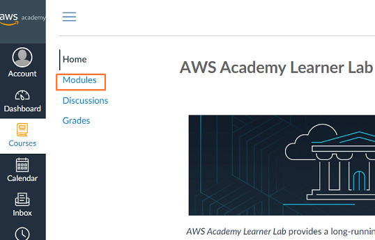

4. Scroll to the **AWS Academy Learner Lab** section.
5. Click **Launch AWS Academy Learner Lab**.

    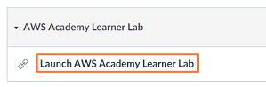

6. Click **Start Lab**.

    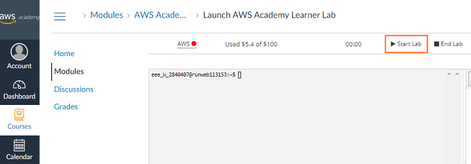

7. Wait until the circle icon beside the AWS link turns green.

8. Click the **AWS** link to open the AWS Management Console in a new tab.

    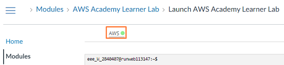

## Task 2: Create an AWS EC2 Instance

1. In the AWS search bar, enter **ec2** and select the **EC2** service.

    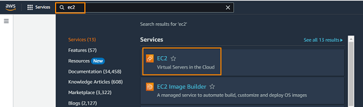

2. On the EC2 dashboard, click **Launch instance**.

    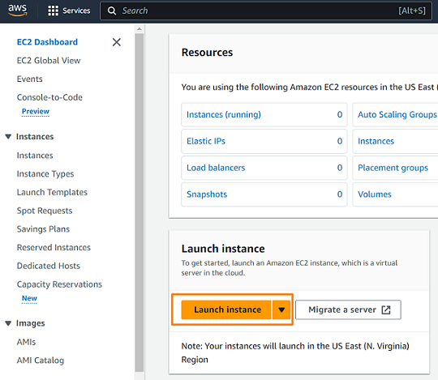

3. Under **Name and tags**, enter a descriptive instance name such as **staycationX**.

4. Under **Application and OS Images (Amazon Machine Image)**:
    - Choose **Quick Start** then select **Ubuntu**.
    - From **Amazon Machine Image**, choose **Ubuntu Server 24.04 LTS (HVM), SSD Volume Type** from the dropdown list.
    - Click **Confirm changes** if there is a prompt showing *Some of your current settings will be changed or removed if you proceed*.

      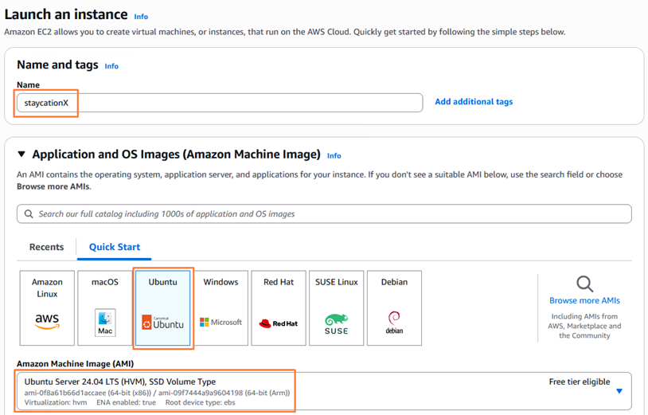

5. Under **Instance type**, select **t3.large**.

    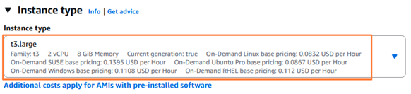

6. Under **Key pair (login)**, select **vockey** from the dropdown list.

    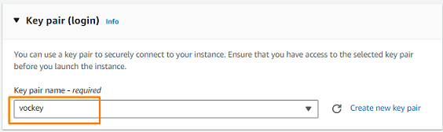


7. Under **Network settings**, click **Edit** and configure the security group:
    - Security group name: **staycationX-sg**
    - Description: **staycationX security group**
    - Keep the default SSH rule.
    - Add these additional inbound rules:

        | Type | Port | Source Type|
        | --- | --- | --- |
        | HTTP | 80 | Anywhere |
        | Custom TCP | 5000 | Anywhere |
        | Custom TCP | 27017 | Anywhere |
        | Custom TCP | 3000 | Anywhere |

        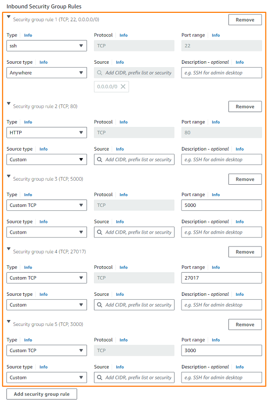

8. Under **Configure storage**, change the size to **32 GiB**.

    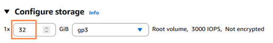

9. Leave the remaining settings at their default values.

10. Review the **Summary** panel, then click **Launch instance**.

    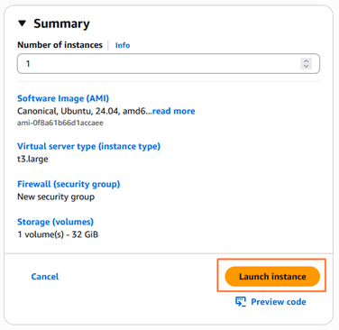

11. After the confirmation page appears, click **View all instances**.

    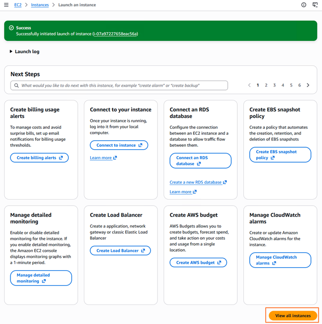

## Task 3: Connect to the EC2 Instance

Before connecting, collect the following information:

1. Record the **Public IPv4 address** of your EC2 instance.

    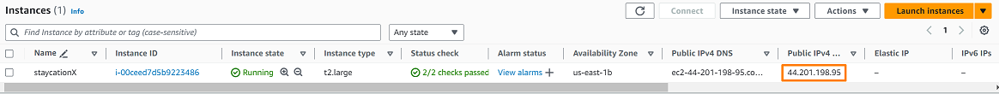

2. From your AWS Academy Canvas page, click **AWS Details** to download the appropriate private key file.

    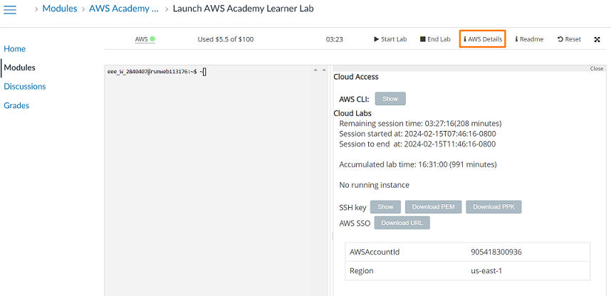

### Option 1: Windows with PuTTY

1. In **AWS Details**, click **Download PPK**.

    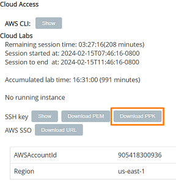

2. Open **PuTTY**.
3. In **Host Name (or IP address)**, enter the EC2 instance public IPv4 address.

    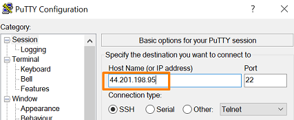

4. In the left navigation tree, expand **SSH**, then **Auth**, then click **Credentials**.

    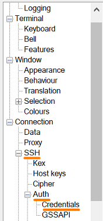

5. Under **Public-key Authentication**, click **Browse** and select the downloaded `.ppk` file.

    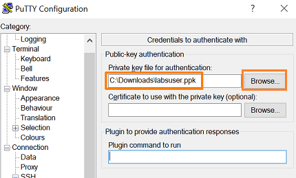

6. Click **Open**.
7. In the **PuTTY Security Alert** appears, click **Accept**.
8. When prompted for a username, enter **ubuntu**.

9.  If the connection is successful, you should see a terminal similar to the following.

    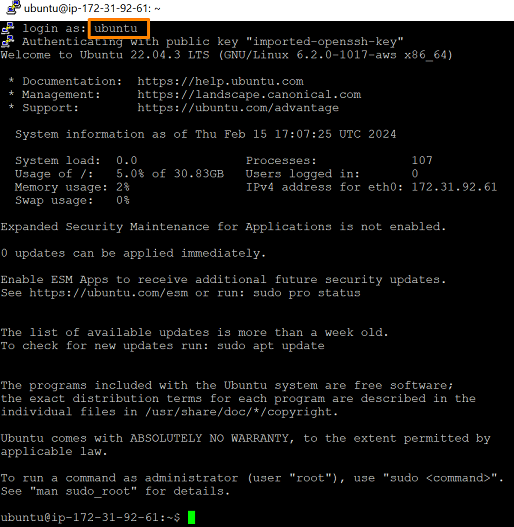

### Option 2: OpenSSH from Azure Lab Services, macOS, or Linux

1. In **AWS Details**, click **Download PEM**.

    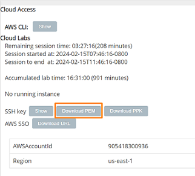

2. Open a terminal and change to the folder that contains the downloaded `.pem` file.

3. Restrict the file permissions so that only you can read the private key:

    ```bash
    chmod 400 labsuser.pem
    ```

4. Connect to the EC2 instance using SSH:

    ```bash
    # Replace the EC2_PUBLIC_IP with the real EC2 instance public IP address
    ssh -i labsuser.pem ubuntu@EC2_PUBLIC_IP
    ```

    Example:

      ```bash
      ssh -i labsuser.pem ubuntu@44.201.198.95
      ```

5. Enter **yes** if prompted to trust the remote host.

6.  If the connection is successful, you should see a terminal similar to the following:

    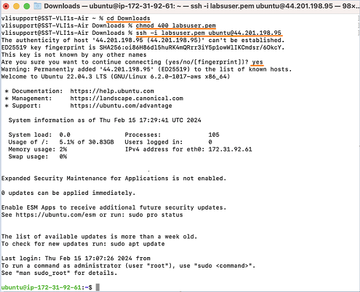

> [!NOTE]
> If you stop and start the EC2 instance later, the public IPv4 address may change. Recheck the instance details before reconnecting.

## Task 4: Install the Required Software

In this task, you will install:

1. Python `pip` and `venv`
2. MongoDB Community Edition
3. Docker Engine and the Docker Compose plugin
4. Nginx

Run the following commands from the EC2 terminal or PuTTY client session.

### Install Python `pip` and `venv`

```bash
sudo apt-get update
sudo apt-get install -y python3-pip python3-venv
```

### Install MongoDB Community Edition

1. Install the required tools and add the MongoDB repository:

    ```bash
    sudo apt-get install -y gnupg curl
    curl -fsSL https://pgp.mongodb.com/server-7.0.asc | sudo gpg -o /usr/share/keyrings/mongodb-server-7.0.gpg --dearmor
    echo "deb [arch=amd64,arm64 signed-by=/usr/share/keyrings/mongodb-server-7.0.gpg] https://repo.mongodb.org/apt/ubuntu jammy/mongodb-org/7.0 multiverse" | sudo tee /etc/apt/sources.list.d/mongodb-org-7.0.list
    sudo apt-get update
    sudo apt-get install -y mongodb-org
    ```

2. Start the MongoDB service and verify that it is running:

    ```bash
    sudo systemctl start mongod
    sudo systemctl enable mongod
    sudo systemctl status mongod --no-pager
    ```

4. To confirm that the MongoDB binaries were installed, check the version:

    ```bash
    mongod --version
    ```

    A sample output is shown below.

    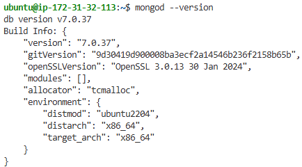

### Install Docker Engine and Docker Compose

1. Install Docker from Docker's official Ubuntu repository:

    ```bash
    sudo apt-get update
    sudo apt-get install -y ca-certificates curl
    sudo install -m 0755 -d /etc/apt/keyrings
    sudo curl -fsSL https://download.docker.com/linux/ubuntu/gpg -o /etc/apt/keyrings/docker.asc
    sudo chmod a+r /etc/apt/keyrings/docker.asc

    echo "deb [arch=$(dpkg --print-architecture) signed-by=/etc/apt/keyrings/docker.asc] https://download.docker.com/linux/ubuntu \
    $(. /etc/os-release && echo "$VERSION_CODENAME") stable" | sudo tee /etc/apt/sources.list.d/docker.list > /dev/null
    sudo apt-get update
    sudo apt-get install -y docker-ce docker-ce-cli containerd.io docker-buildx-plugin docker-compose-plugin
    ```

2. Add the `ubuntu` user to the `docker` group:

      ```bash
      sudo usermod -aG docker ubuntu
      ```

3. Exit the current SSH session, then reconnect using the same method from Task 3.

> [!NOTE]
> This step refreshes the group membership for the current user. If you skip it, `docker` commands will not work.

4. Verify that the `ubuntu` user can run Docker commands:

    ```bash
    docker info
    ```

    A sample output is shown below.

    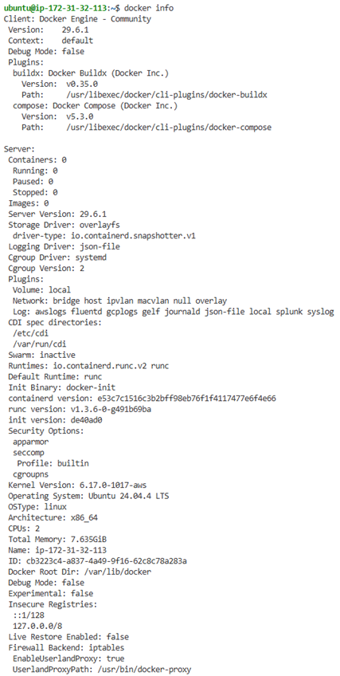

5. Verify that the Docker Compose plugin is installed:

    ```bash
    docker compose version
    ```

### Install Nginx

1. Install Nginx:

    ```bash
    sudo apt-get install -y nginx
    ```

2. Verify the installed version:

    ```bash
    nginx -v
    ```

    A sample output is shown below.

    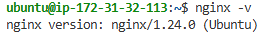

## Completion Check

Before moving to the next lab, confirm that:

- You can connect to the EC2 instance using SSH.
- `mongod` is installed and running.
- `docker info` runs successfully without `sudo`.
- `nginx -v` returns the installed version.

---

## 🎉 Congratulations!

You have completed this lab exercise. Proceed to the next lab to deploy the applications on a virtual machine.
