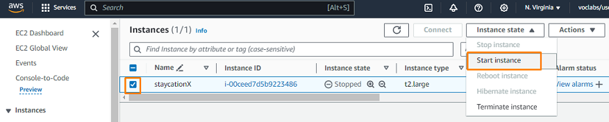
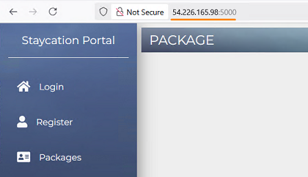
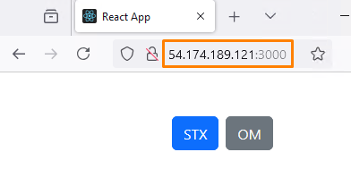

# Lab - Practice deploying StaycationX and myReactApp on Virtual Machine

This lab will guide you through the process of manually deploying the staycationX and myReactApp application on an EC2 instance in AWS.

## Pre-requisites
- Completed all the tasks in LAB_4A

## Instructions
The main tasks for this lab are as follows:
1. Starting the EC2 instance if it is not running
2. Downloading and installing Git Credential Manager in the EC2 instance
3. Cloning StaycationX repository
4. Setting up virtual environment
5. Running the StaycationX application with Flask
6. Checking out the nginx branch from the StaycationX repository
7. Running the nginx branch of the StaycationX application using gunicorn
8. Modify myReactApp source codes
9. Running myReactApp application


## Task 1: Starting EC2 instance if it is not running

1.  From the EC2 console dashboard, in the **Resources** box, click on the **Instances** link.

2.  In the **Instances** page, select the instance with the name **staycationX**.

3.  Click **Instance state** and select **Start instance**.

    

4. Please allow some time for the EC2 instance to get started and running.

## Exercise 2: Generate SSH keys and add to Github

You can generate a SSH key in the EC2 instance and add the public key (`id_rsa.pub`) to your Github account.

Please refer to [Lab_0C Task 4](LAB_0C.md#exercise-4-github-ssh-keys) if you need the detailed steps.

## Task 3: Cloning StaycationX repository

1. Change the current working directory to the location where you want the cloned directory. For example: /home/ubuntu

    ```bash
    cd /home/ubuntu
    ```

2. Run the following to clone your own StaycationX repository.

    ```bash
    git clone git@github.com:USERNAME/StaycationX
    ```

## Task 4: Setting up virtual environment

1.  Run the following to setup virtual environment.
    
    ```bash
    cd /home/ubuntu/StaycationX
    python3 -m venv venv
    ```
2.  Install the python libraries in the virtual environment.
    
    ```bash
    source venv/bin/activate
    pip install -r requirements.txt
    ```

## Task 5: Running the StaycationX application with Flask
1. Before running the application, you need to ensure that the MongoDB database is running. Run the following to start the MongoDB service.

    ```bash
    sudo systemctl start mongod
    ```

    > **TIP**: You can use the command **sudo systemctl status mongod** to check whether the service is running.

2. Start the StaycationX application.

    ```bash
    ./start.sh
    ```

3. Ensure that there are no errors in terminal when starting the application.

4. To exit the running application, press `Ctrl+C` in terminal.

## Task 6: Checkout the nginx branch of the StaycationX repository

1. Ensure that your current working directory is still at the StaycationX folder.
    
    ```bash
    cd /home/ubuntu/StaycationX
    ```

2. Run the following to checkout the nginx branch of the staycationX repository.
   
   ```bash
   git switch nginx
   ```

## Task 7: Running the nginx branch of the StaycationX application using gunicorn

1. Install `gunicorn` in the virtual environment.

   ```bash
   pip install gunicorn
   ```

2. Run the StaycationX application using gunicorn.

   ```bash
   gunicorn --bind :5000 -m 007 -e FLASK_ENV=development --workers 3 "app:create_app()"
   ```

3. To access the StaycationX application, open a web browser and enter the public IP address of the EC2 instance followed by port `5000`.

   You should get the following sample screenshot.

   
   

7. To stop the running application, press `Ctrl+C` in terminal.


## Task 8: Modify myReactApp source codes

In your myReactApp repository, you are required to modify the source code for these two files `form.js` and `show.js`.

In both files, the StaycationX API URL is currently set to `localhost`, which functions correctly on your development machine. However, when deploying to the cloud or a remote server, you will need to update the URL to the <u>server's actual IP address</u>, as `localhost` refers only to the local machine and is inaccessible over the internet.

The two files are located at:
* myReactApp/src/Components/Form/form.js **(Line 18)**
* myReactApp/src/Pages/show.js **(Line 36)**

Make the changes for the two files: 

1.  Navigate to the home folder and clone the **OneMap** branch of your myReactApp repository.

    ```bash
    cd /home/ubuntu/
    git clone -b OneMap git@github.com:USERNAME/myReactApp
    ```

2.  Insert these two lines of codes to replace the line of the two files mentioned above.

    ```js
    const serverAddress = window.location.hostname;
    const url = 'http://' +serverAddress+ ":5000";
    ```

3.  Save the changes.

## Task 9: Running myReactApp application

1. Download and install NodeJS.

    ```bash
    curl -sL https://deb.nodesource.com/setup_16.x -o nodesource_setup.sh
    chmod +x nodesource_setup.sh
    sudo ./nodesource_setup.sh
    rm -rf nodesource_setup.sh
    sudo apt install nodejs -y
    ```

3. Ensure that you are still at myReactApp folder.

    ```bash
    cd /home/ubuntu/myReactApp
    ```

4. Install ReactJS package necessary for creating ReactJS projects.

    ```bash
    npm install create-react-app
    ```

5. Run the following to start myReactApp.

    ```bash
    npm start
    ```

6.  Open your web browser and enter the public IP address of the EC2 and followed by port `3000`.

    A sample screenshot is shown below.

    

7. For myReactApp to function properly, please make sure that both `StaycationX` app and `mongoDB` are running as well.
---

**Congratulations!** You have completed this lab exercise. Move on to the next exercise for deployment using containers.