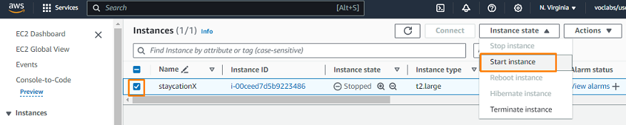
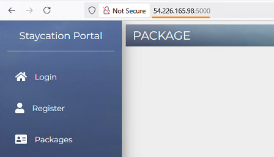
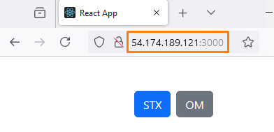

# Lab: Practice Deploying StaycationX and myReactApp on a Virtual Machine

This lab guides you through manually deploying both StaycationX and myReactApp on an AWS EC2 instance.

## Prerequisites

- Complete all tasks in [LAB_4A](./LAB_4A.md).
- Ensure your EC2 security group allows inbound traffic on the required ports:
  - `22` (SSH)
  - `5000` (StaycationX)
  - `3000` (myReactApp)
- Have access to your GitHub account and repositories:
  - `StaycationX`
  - `myReactApp`

## Lab Tasks

1. Start the EC2 instance.
2. Generate SSH keys and add the public key to GitHub.
3. Clone the StaycationX repository.
4. Set up a Python virtual environment.
5. Run StaycationX with Flask.
6. Run StaycationX with Gunicorn.
7. Run myReactApp.

## Task 1: Start the EC2 Instance

1. From the EC2 dashboard, in the **Resources** pane, select **Instances**.
2. On the **Instances** page, select the instance named **staycationX**.
3. Click **Instance state** > **Start instance**.

    

4. Wait until the instance state changes to **running**.

## Task 2: Generate SSH Keys and Add to GitHub

Generate an SSH key pair on the EC2 instance and add the public key (`id_rsa.pub`) to your GitHub account. This allows the EC2 instance to clone your private repositories using SSH.

For detailed steps, refer to [Lab_0C Task 4](./eLAB_0C.md#exercise-4-github-ssh-keys).

## Task 3: Clone the StaycationX Repository

1. Change to the `ubuntu` home directory.

    ```bash
    cd /home/ubuntu
    ```

2. Clone your StaycationX repository.

    ```bash
    git clone git@github.com:GIT_USERNAME/StaycationX.git
    ```

## Task 4: Set Up the Virtual Environment

1. Create a virtual environment.

    ```bash
    cd /home/ubuntu/StaycationX
    python3 -m venv venv
    ```

2. Activate the virtual environment and install dependencies.

    ```bash
    source venv/bin/activate
    pip install -r requirements.txt
    ```

## Task 5: Run StaycationX with Flask

1. Start MongoDB.

    ```bash
    sudo systemctl start mongod
    ```

    > **Tip**: Verify MongoDB is running with `sudo systemctl status mongod`.

2. Start the StaycationX application.

    ```bash
    ./start.sh
    ```

3. Ensure there are no startup errors in the terminal.
4. Open a web browser and navigate to `http://EC2_PUBLIC_IP:5000`.
5. Stop the running application with `Ctrl+C`.

## Task 6: Run StaycationX with Gunicorn

1. Run StaycationX with Gunicorn.

    ```bash
    gunicorn --bind :5000 -m 007 -e FLASK_ENV=development --workers 3 "app:create_app()"
    ```

2. Open a web browser and navigate to `http://EC2_PUBLIC_IP:5000` to access the StaycationX application.

    

3. Stop Gunicorn with `Ctrl+C`.

## Task 7: Run myReactApp

1. Install Node.js (LTS).

    ```bash
    curl -sL https://deb.nodesource.com/setup_16.x -o nodesource_setup.sh
    chmod +x nodesource_setup.sh
    sudo ./nodesource_setup.sh
    rm -rf nodesource_setup.sh
    sudo apt install nodejs -y
    ```

2. Clone the myReactApp repository to your home folder.

    ```bash
    cd /home/ubuntu
    git clone git@github.com:GIT_USERNAME/myReactApp.git
    ```

3. Install application dependencies.

    ```bash
    cd /home/ubuntu/myReactApp
    npm install
    ```

4. Start myReactApp.

    ```bash
    npm start
    ```

5. Open a web browser and navigate to `http://EC2_PUBLIC_IP:3000`.

    

    > **Note**: myReactApp requires StaycationX and MongoDB to be running.

---
## 🎉 Congratulations!

You have completed this lab. Continue to the next exercise on container-based deployment.