# Lab - Practice running StaycationX and ReactJS on Docker containers

This lab will guide you through the process of running the staycationX and ReactJS application on docker containers in an EC2 instance in AWS.

## Instructions

In this lab, it is separated in two stages.

The first stage will guide you through the following tasks.
1. Stopping Mongod service if it is running
2. Registering a Docker Hub account
3. Producing docker images from individual components of the StaycationX application
4. Producing docker image for myReactApp application
5. Using Docker Compose to run containers


The second stage will guide you through the following tasks.
1. Tagging and pushing your own container images to Docker Hub
2. Using Docker Compose to run containers
3. Connecting to applications

## Task 1 : Stopping Mongod service if it is running

In order to prevent a port conflict between the local MongoDB database and the container's MongoDB database on port `27017`, we will stop the **mongod** service running on the EC2 instance.

```bash
sudo systemctl stop mongod
```

## Task 2: Registering a Docker Hub account

1. Navigate to docker hub website via this [link](https://hub.docker.com/signup).

2. Specify the following fields with these values and click **Sign Up**.

   |Field|Value|
   |---|---|
   |Email|Your SUSS email address|
   |Username| Your Student Portal User ID|
   |Password| Your preferred password|

3. Please login to docker hub with your newly created credentials.

4. On the **Docker Core susbscription page**, choose **Continue with Personal**.

   

5. Please check your email inbox for an email with the subject title **[Docker] Please confirm your email address**.

   

6. Click **Verify Email Address**.

   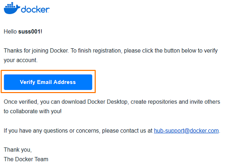

7. After verification, sign in to docker hub with your credentials.

   

8. Upon successful login, you will be redirected to the docker hub dashboard.


## Task 3: Producing docker images from individual components of the StaycationX application

In this task, you will produce docker images from individual components of the StaycationX application. The components are as follows:

- StaycationX
- MongoDB

To get started, please navigate to the StaycationX folder. Please check that you are in the `nginx` branch.

```bash
cd /home/ubuntu/StaycationX
git switch nginx
```

In the folder, you will notice that there are several dockerfiles. We will use these dockerfiles to create docker images for each of the components.

* StaycationX docker image
  
  Run the following to build the docker image for the staycationX flask application.

  ```bash
  docker build -t ict381_staycation .
  ```

  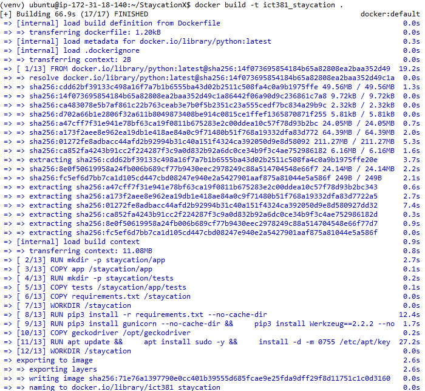

* MongoDB docker image
  
  Run the following to build the docker image for mongodb.

  ```bash
  docker build -t ict381_mongo -f DockerfileMongo .
  ```

  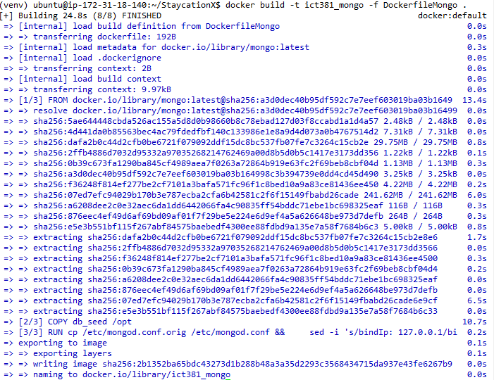


## Task 4: Producing docker image for myReactApp application

1. Navigate to the myReactApp folder.

    ```bash
    cd /home/ubuntu/myReactApp
    ```

2. Create a .dockerignore file to exclude unnecessary folder from the docker build context.

    ```bash
    echo 'node_modules' > .dockerignore
    ```

3.  Create a dockerfile for myReactApp.

    ```bash
    tee /home/ubuntu/myReactApp/DockerfilemyReactApp <<EOF

    FROM node:16.20.2-alpine AS builder

    WORKDIR /app

    COPY package*.json ./

    RUN npm install

    COPY . .

    RUN npm run build

    FROM nginx

    EXPOSE 80

    COPY --from=builder /app/build /usr/share/nginx/html

    EOF
    ```

4. Create the docker image for myReactApp.

    ```bash
    docker build -t ict381_myreactapp -f DockerfilemyReactApp .
    ```

    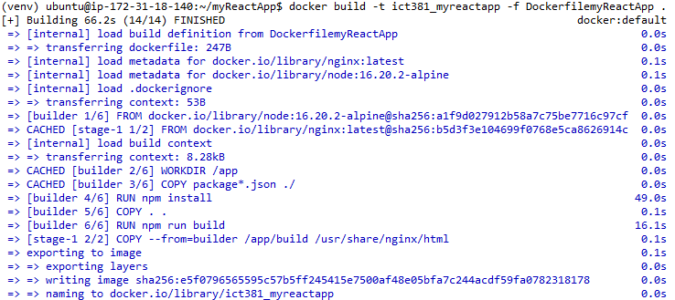

## Task 5: Using Docker Compose to run containers

After creating the Docker images on your delivery machine, you can use the `docker compose` command to run both the staycationX and myReactApp application simultaneously.

Docker compose simplifies the management of multi-container applications by providing a single YAML configuration file. With a single command, one can create and start all the services specified in the configuration file, streamlining the development and deployment process.

* Ensure that you are still in the myReactApp folder.

* Create `compose.yaml` file with the following contents.

  ```bash
  tee /home/ubuntu/myReactApp/compose.yaml <<EOF

  services:
    frontend:
      container_name: ict381app
      image: ict381_staycation
      networks:
      - ict381network
      ports:
      - "5000:5000"

    db:
      container_name: ict381db
      image: ict381_mongo
      networks:
      - ict381network
      ports:
      - "27017:27017"

    myReactApp:
      container_name: myReactApp
      image: ict381_myreactapp
      networks:
      - ict381network
      ports:
      - "80:80"
      depends_on:
      - frontend

  networks:
    ict381network:

  EOF
  ```

* Run the `docker compose` command.

  ```bash
  docker compose up -d
  ```

  Docker Compose will read the configuration defined in the docker-compose.yml and start to execute the specified steps to setup and manage the multi-container application.

  The default path for a Docker Compose file is either `compose.yaml` (preferred) or `compose.yml` that is placed within the working directory. It also supports `docker-compose.yaml` and `docker-compose.yml` for backward compatibility of earlier versions. If you have a different file name, you need to specify the file name using the `-f` flag.

* To view the applications, please enter the EC2 IP Address on the URL bar followed by the port.
  * StaycationX application: `http://EC2_IP_ADDRESS:5000`
  * myReactApp application: `http://EC2_IP_ADDRESS`

* To connect to MongoDB via MongoDB Compass, the URI is `mongodb://EC2_IP_ADDRESS:27017/`

* To stop and remove the resources created by Docker Compose, you can use the command `docker compose down`.

  ```bash
  docker compose down
  ```

* To check the status of the Docker Compose, you can use the command `docker compose ps`.

  ```bash
  docker compose ps
  ```

---

**TIP: Using of Docker Volumes**

You will notice that when you stop and remove the containers, any data in database is lost when you start the containers the next time. To persist the data, you can consider using Docker Volumes.

Docker volumes are used to persist data generated by and used by Docker containers. Volumes are stored in a part of the host filesystem which is managed by Docker (`/var/lib/docker/volumes/` on Linux).

To read more about Docker Volumes, you can refer to the [Docker documentation](https://docs.docker.com/engine/storage/volumes/).

To use Docker Volumes, you need to modify the `compose.yml` file to include the volume configuration.

```bash
tee /home/ubuntu/myReactApp/compose.yaml <<EOF

services:
  frontend:
    container_name: ict381app
    image: ict381_staycation
    networks:
    - ict381network
    ports:
    - "5000:5000"

  db:
    container_name: ict381db
    image: ict381_mongo
    networks:
    - ict381network
    ports:
    - "27017:27017"
    volumes:
    - ict381vol:/data/db

  myReactApp:
    container_name: myReactApp
    image: ict381_myreactapp
    networks:
    - ict381network
    ports:
    - "80:80"
    depends_on:
    - frontend

networks:
  ict381network:

volumes:
  ict381vol:

EOF
```

---

## Task 6: Tagging and pushing your own container images to Docker Hub

Now, you have created the docker images for the StaycationX application, MongoDB and myReactApp. The next step is to tag and push the images to Docker Hub.

1. Tag the docker images with your docker hub username.

    ```bash
    docker tag ict381_staycation <your_docker_hub_username>/ict381_staycation
    docker tag ict381_mongo <your_docker_hub_username>/ict381_mongo
    docker tag ict381_myreactapp <your_docker_hub_username>/ict381_myreactapp
    ```

    An example using the dockerhub username **suss001** which was created earlier in Task 2.

    ```bash
    # docker tag ict381_staycation suss001/ict381_staycation
    # docker tag ict381_mongo suss001/ict381_mongo
    # docker tag ict381_myreactapp suss001/ict381_myreactapp
    ```

    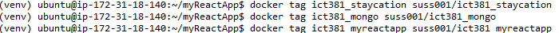

2. Before you can push your docker image to docker hub, you would need to login to docker hub. Run the following to login to docker hub.

    ```bash
    docker login -u <YOUR-DOCKER-USERNAME>
    ```

    > **NOTE**: There is no visible indication of the characters being typed when you are keying your password. Please key in your password and press **Enter**.

    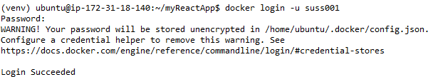

3.  Push the docker images to Docker Hub.

    ```bash
    docker push <your_docker_hub_username>/ict381_staycation
    docker push <your_docker_hub_username>/ict381_mongo
    docker push <your_docker_hub_username>/ict381_myreactapp
    ```

    Sample screenshots:

    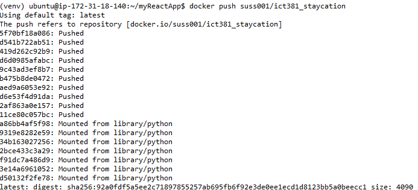

    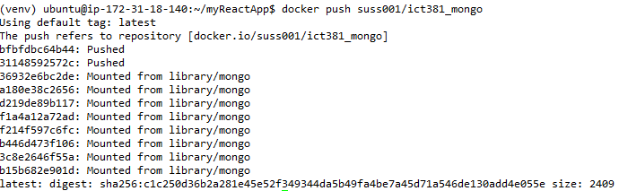

    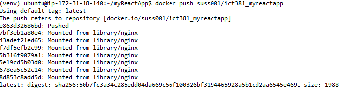
    

## Task 7: Using Docker Compose to run containers

We will use Docker Compose to run the StaycationX, mongoDB and myReactApp application. Unlike Task 5, where you used a local copy, this time you will pull the image from Docker Hub.

In the StaycationX folder under the nginx branch, we will inspect the file **dockerhub.yml** and perfom the following:

1.  insert your own docker id in the placeholder
2.  remove the content on line 1 as it is obsolete now
3.  make changes to the `myReactApp` section.

```bash
cd /home/ubuntu/StaycationX
nano dockerhub.yml
```

To save the file, press `Ctrl+O` to save the contents and `Ctrl+X` to exit.

A sample screenshot of the completed file with docker id **suss001** is shown below.

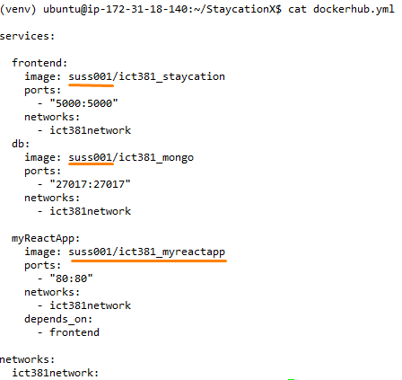


Finally, we will run the StaycationX, mongoDB and myReactApp application using docker compose. Enter the following to run the application.

```bash
docker compose -f dockerhub.yml up -d
```

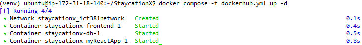

> **TIP**: To check the status of the docker compose, you can use the command **docker compose ps**.
>
> 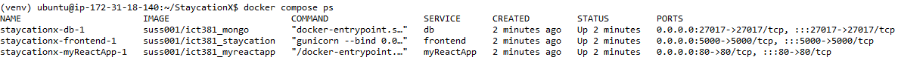

To stop and remove the resources created by docker compose, you can use the command **docker compose -f dockerhub.yml down**.

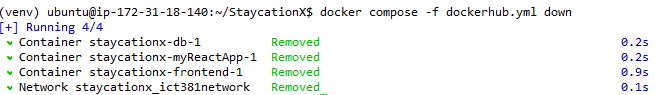

Lastly, remember to push the changes of this file back to your GitHub repository, as it would be used for the subsequent labs.

Here's an example of how to push the file to your Github repository.

```bash
# Ensure that you are on the nginx branch
# It is assumed that you are at /home/ubuntu/StaycationX directory.
# git add dockerhub.yml
# git commit -m "update docker user for the images"
# git push origin nginx
```

## Task 8: Connecting to applications
To access StaycationX application, open web browser and navigate to the `http://EC2_IP_ADDRESS:5000`.

To access myReactApp application, navigate to `http://EC2_IP_ADDRESS`.

To access MongoDB via MongoDB Compass application:

1. Open the MongoDB Compass application.

2. Change the URI to be `mongodb://EC2 IP address>:27017`.

3. Click **Connect**.

4. Ensure you can connect to MongoDB successfully.


---

**Congratulations!** You have successfully run the StaycationX and ReactJS application on Docker containers in an EC2 instance in AWS. You have also pushed your own docker images to Docker Hub and run the applications by using the docker images from Docker Hub.
