# Lab: Run StaycationX and myReactApp with Docker on AWS EC2

This lab guides you through running StaycationX, MongoDB and myReactApp in Docker containers on an EC2 instance.

## Prerequisites

- Complete all tasks in [LAB_4A](./LAB_4A.md).
- Ensure Docker Engine and Docker Compose are installed on your EC2 instance.
- Ensure your EC2 security group allows inbound traffic on these ports:
  - `22` (SSH)
  - `80` (myReactApp via Nginx)
  - `5000` (StaycationX)
  - `27017` (MongoDB, only if you need external MongoDB Compass access)
- Have access to your Docker Hub account.

## Lab Stages

Stage 1 covers local image build and deployment:
1. Stop host services that may conflict with container ports.
2. Create a Docker Hub account.
3. Build Docker images for StaycationX and MongoDB.
4. Build a Docker image for myReactApp.
5. Run all services with Docker Compose.

Stage 2 covers image publishing and Docker Hub-based deployment:
1. Tag local images with your Docker Hub username.
2. Configure Docker credential helper.
3. Push images to Docker Hub.
4. Run containers by pulling images from Docker Hub.
5. Connect to the applications.

## Task 1: Stop Host Services That May Cause Port Conflicts

Stop local MongoDB if it is running. This prevents conflict on port `27017`.

```bash
sudo systemctl stop mongod
```

Stop local Nginx if it is running. This prevents conflict on port `80`.

```bash
sudo systemctl stop nginx
```

Optional verification:

```bash
sudo systemctl status mongod --no-pager
sudo systemctl status nginx --no-pager
```

## Task 2: Register a Docker Hub Account

If you already have a Docker Hub account, skip to Task 3.

1. Go to the [Docker Hub website](https://hub.docker.com/signup) to sign up your account.
2. Complete sign-up using your preferred credentials.
3. Verify your email for the message titled **[Docker] Please confirm your email address**.
4. Click **Verify Email Address**.

   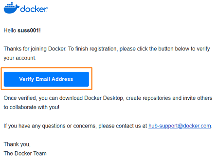

5. Sign in to Docker Hub with your credentials

   

## Task 3: Build Docker Images for StaycationX Components

In this task, you build two images:
- StaycationX
- MongoDB

1. Go to the StaycationX project folder.

    ```bash
    cd /home/ubuntu/StaycationX
    ```

2. Build the StaycationX image. Docker uses `Dockerfile` by default in the current directory.

    ```bash
    docker build -t ict381_staycation .
    ```

    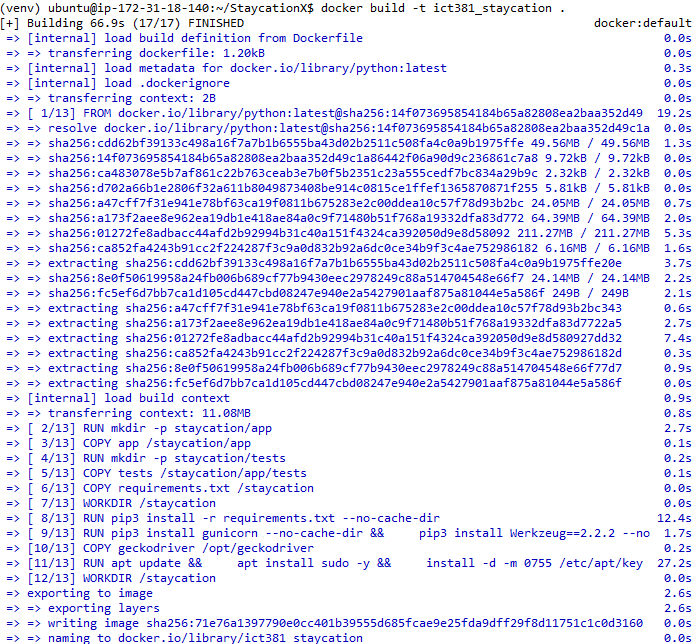

3. Build the MongoDB image.

    ```bash
    docker build -t ict381_mongo -f DockerfileMongo .
    ```

    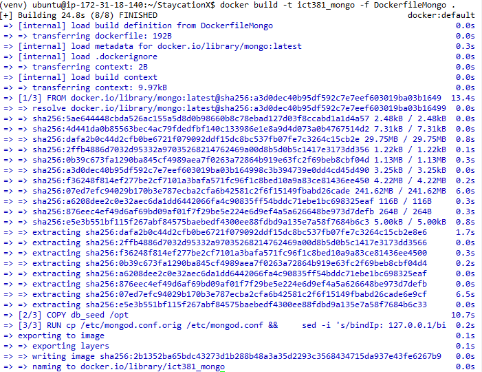

## Task 4: Build Docker Image for myReactApp

1. Go to the myReactApp project folder.

    ```bash
    cd /home/ubuntu/myReactApp
    ```

2. Build myReactApp image.

    ```bash
    docker build -t ict381_myreactapp -f DockerfilemyReactApp .
    ```

    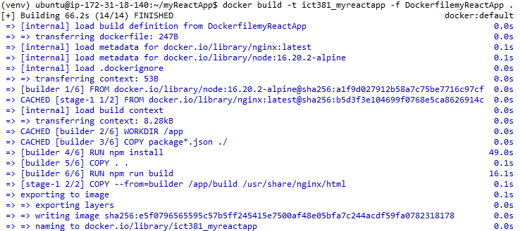

## Task 5: Run Containers with Docker Compose (Local Images)

After creating the Docker images on your EC2 instance, you can use the docker compose command to run the StaycationX, MongoDB and myReactApp applications simultaneously.

Docker Compose simplifies the management of multi‑container applications by using a single YAML configuration file. With one command, you can create and start all the services specified in the file, streamlining both development and deployment.

1. Ensure you are in `/home/ubuntu/myReactApp`.
2. Review `compose.yaml`.

    ```yaml
    services:
      backend:
        container_name: ict381app
        image: ict381_staycation
        networks:
          - ict381network
        ports:
          - "5000:5000"

      db:
        container_name: ict381db
        image: ict381_mongo
        networks:
          - ict381network
        ports:
          - "27017:27017"

      myReactApp:
        container_name: myReactApp
        image: ict381_myreactapp
        networks:
          - ict381network
        ports:
          - "80:80"
        depends_on:
          - backend

    networks:
      ict381network:
    ```

  ---
  **NOTES:**

  In this `compose.yaml` file, there are three services and one network section defined:

  - **backend**: 
    - `container_name`: Sets the container name as `ict381app`.
    - `image`: Uses the Docker image `ict381_staycation` that was built earlier in the Task 3.
    - `networks`: Connects the container to the `ict381network` network
    - `ports`: Maps port `5000` of the host to port `5000` of the container, making the StaycationX application accessible on port `5000`.

  - **db**:
    - `container_name`: Sets the container name as `ict381db`.
    - `image`: Uses the Docker image `ict381_mongo` that was built earlier in the Task 3.
    - `networks`: Connects the container to the `ict381network` network.
    - `ports`: Maps port `27017` of the host to port `27017` of the container, making the MongoDB database accessible on port `27017`.

  - **myReactApp**:
    - `container_name`: Sets the container name as `myReactApp`.
    - `image`: Uses the Docker image `ict381_myreactapp` that was built earlier in the Task 4.
    - `networks`: Connects the container to the `ict381network` network.
    - `ports`: Maps port `80` of the host to port `80` of the container, making the myReactApp application accessible on port `80`.
    - `depends_on`: Ensures the `backend` service starts before `myReactApp` service.

  - **networks**: Creates a user-defined bridge network named `ict381network` for the containers to communicate with each other using the container names as hostnames.
    
---

3. Start the deployment.

    ```bash
    docker compose up -d
    ```

4. Check deployment status.

    ```bash
    docker compose ps
    ```

5. Access the applications:
    - StaycationX: `http://EC2_IP_ADDRESS:5000`
    - myReactApp: `http://EC2_IP_ADDRESS`

6. Connect to MongoDB Compass (optional):

    ```text
    mongodb://EC2_IP_ADDRESS:27017/
    ```

7. Stop and remove the Compose resources when needed.

    ```bash
    docker compose down
    ```

### Optional: Persist MongoDB Data with Docker Volumes

Without a volume, MongoDB data is lost when the container is removed.

You will notice that when you stop and remove the containers, any data in database is lost when you start the containers the next time. To persist the data, you can consider using Docker Volumes.

Docker volumes are used to persist data generated by and used by Docker containers. Volumes are stored in a part of the host filesystem which is managed by Docker (`/var/lib/docker/volumes/` on Linux).

To read more about Docker Volumes, you can refer to the [Docker documentation](https://docs.docker.com/engine/storage/volumes/).

Update `/home/ubuntu/myReactApp/compose.yaml` to include the volume configuration.

```bash
tee /home/ubuntu/myReactApp/compose.yaml <<EOF
services:
  backend:
    container_name: ict381app
    image: ict381_staycation
    networks:
      - ict381network
    ports:
      - "5000:5000"

  db:
    container_name: ict381db
    image: ict381_mongo
    networks:
      - ict381network
    ports:
      - "27017:27017"
    volumes:
      - ict381vol:/data/db

  myReactApp:
    container_name: myReactApp
    image: ict381_myreactapp
    networks:
      - ict381network
    ports:
      - "80:80"
    depends_on:
      - backend

networks:
  ict381network:

volumes:
  ict381vol:

EOF
```

In the revised Docker Compose configuration, we have added an additional volume for persistent data storage.

* Under the `volumes` section, a Docker volume named `ict381vol` is defined to persist data independently of the containers.

* Under the `db` service,
    * `ict381vol:/data/db`: Mounts the volume `ict381vol` to `/data/db` inside the container, ensuring that the database data is persisted even if the container is stopped or removed.


## Task 6: Tagging your own container images

Now, you have created the docker images for the StaycationX application, MongoDB and myReactApp. The next step is to tag and push the images to Docker Hub.

Tag the docker images with your Docker Hub username.

  ```bash
  docker tag ict381_staycation <DOCKER_USERNAME>/ict381_staycation
  docker tag ict381_mongo <DOCKER_USERNAME>/ict381_mongo
  docker tag ict381_myreactapp <DOCKER_USERNAME>/ict381_myreactapp
  ```

  An example using the dockerhub username **suss001**.

  ```bash
  # docker tag ict381_staycation suss001/ict381_staycation
  # docker tag ict381_mongo suss001/ict381_mongo
  # docker tag ict381_myreactapp suss001/ict381_myreactapp
  ```

Before you can push your docker images to Docker Hub, you would need to login to Docker Hub.

When you login to Docker Hub using the `docker login` command, Docker stores your credential in a file named `config.json` located in the `/home/ubuntu/.docker` directory. By default, these credential are stored in a base64 encoded format. While base64 encoding makes the credential less human readable, it is not a secure method because the encoded password can be easily decoded which will expose your credential. To address this security concern, you will configure Docker to use a credential store which securely stores and manages your credential.

A sample screenshot to illustrate the example.

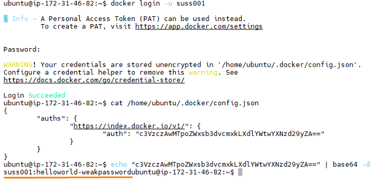


## Task 7: Setup Docker credential helper

This section explains how to set up the Docker credential helper to securely store Docker Hub credentials.

1. Install `pass` password manager and other dependencies.

   ```bash
   sudo apt-get install pass gnupg2 pinentry-tty -y
   ```

2. Download the Docker credential helper, extract and move the docker-credential-pass helper to `/usr/bin`.

   ```bash
   wget https://github.com/docker/docker-credential-helpers/releases/download/v0.9.8/docker-credential-pass-v0.9.8.linux-amd64
   chmod +x docker-credential-pass-v0.9.8.linux-amd64
   sudo mv docker-credential-pass-v0.9.8.linux-amd64 /usr/bin/docker-credential-pass
   ```

3. Create a new GPG key pair.

   ```bash
   gpg2 --gen-key
   ```

   Follow prompts from the gpg2 utility. You will be prompted to enter your **name**, **email address** and a **passphrase**. You can use your SUSS email address.

   > NOTE: The passphrase is used to protect your private key in GPG. It is important to remember this passphrase as you will need it to access your private key.

   Your result should be similar to the screenshot provided.

   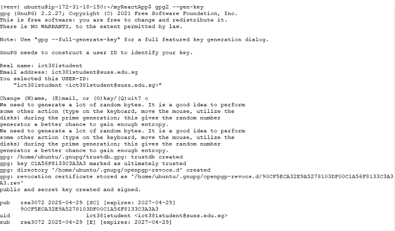

4. Initialize the password store using your email address.

   ```bash
   pass init EMAIL_ADDRESS
   ```

   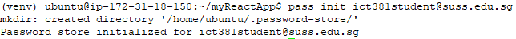

5. Configure the credential store by adding `credsStore` to the config.json file.

   ```bash
   mkdir -p /home/ubuntu/.docker
   echo '{"credsStore": "pass"}' > /home/ubuntu/.docker/config.json
   ```

6. Login to Docker Hub.

   ```bash
   docker login -u DOCKER_USERNAME 
   ```

7. You will be prompted to enter your password. Enter your password and press **Enter**.

8. Upon successful login, review the file `/home/ubuntu/.docker/config.json`.

   ```bash
   cat /home/ubuntu/.docker/config.json
   ```

   You will notice that your password is not stored in the `config.json` file.

   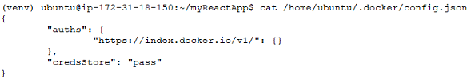

9. Run the commands to add contents to the GPG agent config file and restart the GPG agent.

   ```bash
    echo -e 'pinentry-program /usr/bin/pinentry-tty' > /home/ubuntu/.gnupg/gpg-agent.conf
    gpgconf --kill gpg-agent
    ```

    The above configurations:
    - `pinentry-program /usr/bin/pinentry-tty`: This specifies the pinentry program to use pinentry-tty which prompts you to enter your passphrase in the terminal.
    - `gpgconf --kill gpg-agent`: command is used to kill the current GPG agent process, which will cause it to restart and pick up the new configuration.

10. Set the `GPG_TTY` environment variable to the current terminal device.

    ```bash
    echo 'export GPG_TTY=$(tty)' >> /home/ubuntu/.bashrc
    source /home/ubuntu/.bashrc
    ```
   
    GPG, the encryption tool used by pass, often needs to interact with the user (eg. to request a passphrase). To do this, it must know which terminal to use. By setting the `GPG_TTY` environment variable, you ensure that GPG correctly identifies your terminal and can prompt you when needed. Without this, GPG might fail to prompt especially in non-interactive environments.

    You will experience this when you need to push your docker images to Docker Hub in the next task.

## Task 8: Push docker images to Docker Hub

After authenticating with Docker Hub, you can now push your Docker images to Docker Hub.

1.  Use the following commands to push the docker images to Docker Hub.

    Please enter your GPG passphrase when prompted.

    ```bash
    docker push <DOCKER_USERNAME>/ict381_staycation
    docker push <DOCKER_USERNAME>/ict381_mongo
    docker push <DOCKER_USERNAME>/ict381_myreactapp
    ```

    Sample screenshots:

    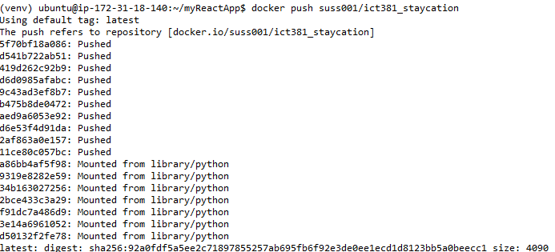

    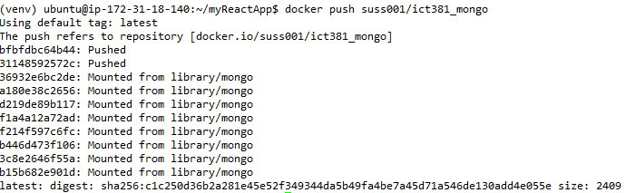

    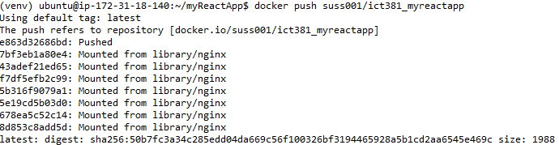
    

## Task 9: Using Docker Compose to run containers

We will use Docker Compose to run StaycationX, mongoDB and myReactApp applications. Unlike Task 5, where you used a local copy, this time you will pull the image from Docker Hub.

To demonstrate this, you will need to remove the tagged images of StaycationX, mongoDB and myReactApp. This is because Docker first checks if the image is available locally before pulling from Docker Hub. If the image is available locally, it will use the local image instead of pulling from Docker Hub.

```bash
docker rmi suss001/ict381_staycation suss001/ict381_mongo suss001/ict381_myreactapp
```

> Do remember to replace **suss001** with your own Docker Hub username.

In the StaycationX folder, you will inspect the **dockerhub.yml** file and perfom the following:

1.  Insert your own Docker Hub username in the placeholder
2.  Make changes to the `myReactApp` section.

  ```bash
  cd /home/ubuntu/StaycationX
  nano dockerhub.yml
  ```

To save the file, press `Ctrl+O` to save the contents and `Ctrl+X` to exit.

A sample screenshot of the completed file with docker username **suss001** is shown below.

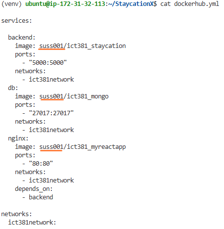


Finally, you will run the StaycationX, mongoDB and myReactApp application using docker compose. Enter the following to run the application.

```bash
docker compose -f dockerhub.yml up -d
```

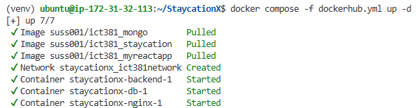

> **TIP**: To check the status of the docker compose, you can use the command **docker compose ps**.
>
> 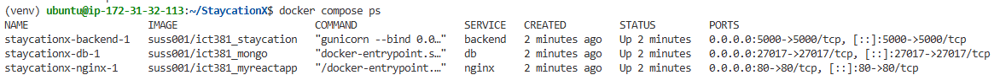


## Task 10: Connecting to applications
To access StaycationX application, open a web browser and navigate to the `http://EC2_IP_ADDRESS:5000`.

To access myReactApp application, navigate to `http://EC2_IP_ADDRESS`.

To access MongoDB via MongoDB Compass application:

  1. Open the MongoDB Compass application.

  2. Change the URI to be `mongodb://EC2_IP_ADDRESS:27017`.

  3. Click **Connect**.

  4. Ensure you can connect to MongoDB successfully.


After verification, to stop and remove the resources created by docker compose, you can use this command.

```bash
docker compose -f dockerhub.yml down
```

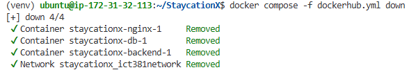

Lastly, remember to push the changes of this file back to your GitHub repository, as it would be used for the subsequent labs.

Here's an example of how to push the file to your Github repository.

```bash
# It is assumed that you are still at /home/ubuntu/StaycationX directory.
git add dockerhub.yml
git commit -m "update Docker Hub username for the images"
git push
```

---
## 🎉 Congratulations!

You have completed this lab.