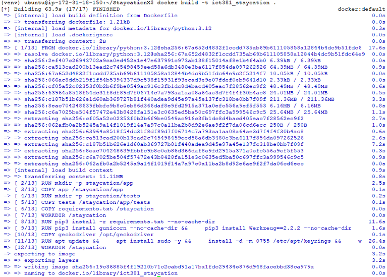
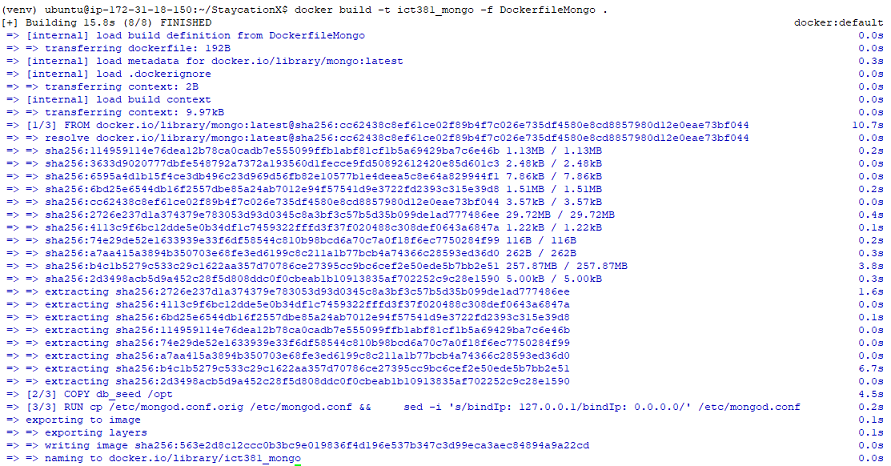
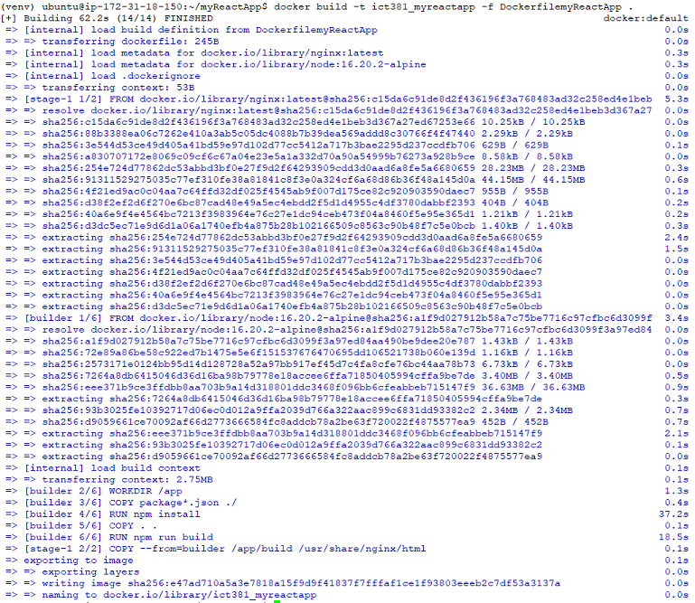
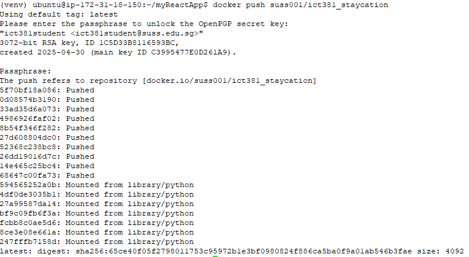
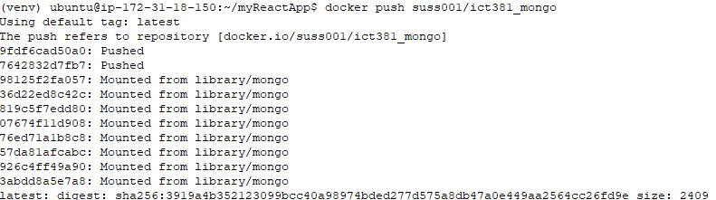
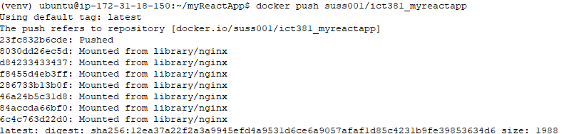
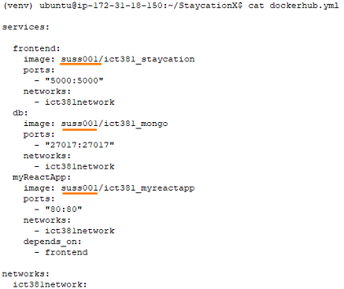
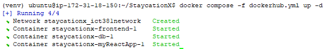
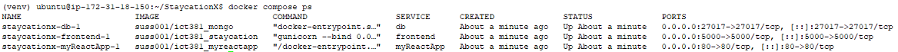

# Lab - Practice running StaycationX and ReactJS on Docker containers

This lab will guide you through the process of running the StaycationX, mongoDB and myReactApp application on docker containers in an EC2 instance in AWS.

## Instructions

In this lab, it is separated in two stages.

The first stage will guide you through the following tasks.
1. Stopping Mongod and Nginx service if it is running
2. Registering a Docker Hub account
3. Creating docker images from individual components of the StaycationX application
4. Creating docker image for myReactApp application
5. Using Docker Compose to run containers

The second stage will guide you through the following tasks.
1. Tagging your own container images
2. Setup docker credential helper
3. Push docker images to Docker Hub
4. Using Docker Compose to run containers
5. Connecting to applications

## Task 1 : Stopping Mongod and Nginx service if it is running

In order to prevent a port conflict between the local MongoDB database and the container's MongoDB database on port `27017`, stop the **mongod** service running on the EC2 instance.

```bash
sudo systemctl stop mongod
```

To prevent port conflict between the local Nginx and the container's Nginx on port `80`, stop the **nginx** service running on the EC2 instance.

```bash
sudo systemctl stop nginx
```

## Task 2: Registering a Docker Hub account

1. Navigate to Docker Hub website via this [link](https://hub.docker.com/signup).

2. Specify the following fields with these values and click **Sign Up**.

   |Field|Value|
   |---|---|
   |Email|Your SUSS email address|
   |Username| Your Student Portal User ID|
   |Password| Your preferred password|

3. Please login to Docker Hub with your newly created credentials.

4. Please check your email inbox for an email with the subject title **[Docker] Please confirm your email address**.

5. Click **Verify Email Address**.

   

6. After successful verification, sign in to Docker Hub with your credentials.

   

7. Upon successful login, you will be redirected to the home page of the Docker Hub website.

## Task 3: Creating docker images for individual components of the StaycationX application

In this task, you will create Docker images for the individual components of the StaycationX application. The components are as follows:

- StaycationX
- MongoDB

To get started, please navigate to the StaycationX folder.

```bash
cd /home/ubuntu/StaycationX
```

In the folder, you will notice that there are several dockerfiles. We will use these dockerfiles to create docker images for each of the components.

When you run the **docker build** command, Docker automatically looks for a file named `Dockerfile` in the specified build context directory (current directory). Unless you explicitly specify a different filename using the `-f` flag, Docker assumes the file is named `Dockerfile`.

* StaycationX docker image

  Run the following to build the docker image for the StaycationX Flask application.
  
  ```bash
  docker build -t ict381_staycation .
  # It is using the Dockerfile in the StaycationX directory.
  ```

  

* MongoDB docker image
  
  Run the following command to build the docker image for mongodb.

  ```bash
  docker build -t ict381_mongo -f DockerfileMongo .
  ```

  

## Task 4: Creating docker image for myReactApp application

1. Navigate to myReactApp folder.

    ```bash
    cd /home/ubuntu/myReactApp
    ```

2. Run the following command to create the docker image for myReactApp.

    ```bash
    docker build -t ict381_myreactapp -f DockerfilemyReactApp .
    ```

    


## Task 5: Using Docker Compose to run containers

After creating the Docker images on your delivery machine, you can use the `docker compose` command to run the StaycationX, mongoDB and myReactApp applications simultaneously.

Docker compose simplifies the management of multi-container applications by providing a single YAML configuration file. With a single command, one can create and start all the services specified in the configuration file, streamlining the development and deployment process.

* Ensure that you are still at myReactApp folder.

* Review the `compose.yaml` file. It contains the following content.

  ```bash
  services:
    frontend:
      container_name: ict381app
      image: ict381_staycation
      networks:
      - ict381network
      ports:
      - "5000:5000"

    db:
      container_name: ict381db
      image: ict381_mongo
      networks:
      - ict381network
      ports:
      - "27017:27017"

    myReactApp:
      container_name: myReactApp
      image: ict381_myreactapp
      networks:
      - ict381network
      ports:
      - "80:80"
      depends_on:
      - frontend

  networks:
    ict381network:
  ```

  ---
  **NOTES**:

  In this `compose.yaml` file, there are three services and one network section defined:

  - **frontend**: 
    - `container_name`: Gives the container name as `ict381app`.
    - `image`: Uses the Docker image `ict381_staycation` that was built earlier in the Task 3.
    - `networks`: Connects the container to the `ict381network` network
    - `ports`: Maps port `5000` of the host to port `5000` of the container, making the StaycationX application accessible on port `5000`.

  - **db**:
    - `container_name`: Gives the container name as `ict381db`.
    - `image`: Uses the Docker image `ict381_mongo` that was built earlier in the Task 3.
    - `networks`: Connects the container to the `ict381network` network.
    - `ports`: Maps port `27017` of the host to port `27017` of the container, making the MongoDB database accessible on port `27017`.

  - **myReactApp**:
    - `container_name`: Gives the container name as `myReactApp`.
    - `image`: Uses the Docker image `ict381_myreactapp` that was built earlier in the Task 4.
    - `networks`: Connects the container to the `ict381network` network.
    - `ports`: Maps port `80` of the host to port `80` of the container, making the myReactApp application accessible on port `80`.
    - `depends_on`: Ensures the `frontend` service starts before `myReactApp` service.

  - **networks**: Creates a user-defined bridge network named `ict381network` for the containers to communicate with each other using the container names as hostnames.
    
  ---

* Run the `docker compose` command to start the deployment.

  ```bash
  docker compose up -d
  ```

  Docker Compose will read the configuration defined in the compose.yaml and start to execute the specified steps to setup and manage the multi-container application.

  The default path for a Docker Compose file is either `compose.yaml` (preferred) or `compose.yml` that is placed within the working directory. It also supports `docker-compose.yaml` and `docker-compose.yml` for backward compatibility of earlier versions. If you have a different file name, you need to specify the file name using the `-f` flag.

* To view the applications, please enter the EC2 IP Address on the URL bar followed by the port.
  * StaycationX application: `http://EC2_IP_ADDRESS:5000`
  * myReactApp application: `http://EC2_IP_ADDRESS`

* To connect to MongoDB via MongoDB Compass, the URI is `mongodb://EC2_IP_ADDRESS:27017/`

* To check the status of the Docker Compose, you can use the command `docker compose ps`.

  ```bash
  docker compose ps
  ```

* To stop and remove the resources created by Docker Compose, you can use the command `docker compose down`.

  ```bash
  docker compose down
  ```

---

**TIP: Using of Docker Volumes**

You will notice that when you stop and remove the containers, any data in database is lost when you start the containers the next time. To persist the data, you can consider using Docker Volumes.

Docker volumes are used to persist data generated by and used by Docker containers. Volumes are stored in a part of the host filesystem which is managed by Docker (`/var/lib/docker/volumes/` on Linux).

To read more about Docker Volumes, you can refer to the [Docker documentation](https://docs.docker.com/engine/storage/volumes/).

To use Docker Volumes, you need to modify the `compose.yaml` file to include the volume configuration.

```bash
tee /home/ubuntu/myReactApp/compose.yaml <<EOF

services:
  frontend:
    container_name: ict381app
    image: ict381_staycation
    networks:
    - ict381network
    ports:
    - "5000:5000"

  db:
    container_name: ict381db
    image: ict381_mongo
    networks:
    - ict381network
    ports:
    - "27017:27017"
    volumes:
    - ict381vol:/data/db

  myReactApp:
    container_name: myReactApp
    image: ict381_myreactapp
    networks:
    - ict381network
    ports:
    - "80:80"
    depends_on:
    - frontend

networks:
  ict381network:

volumes:
  ict381vol:

EOF
```
In this revised Dockerfile, we added an additional volume for persistent data storage. 

* Under the `volumes` section, a Docker volume named `ict381vol` was defined to persist data independently of the containers.
  
* Under the `db` service, 
  * `ict381vol:/data/db`: Mounts the volume `ict381vol` to `/data/db` inside the container, ensuring that the database data is persisted even if the container is stopped or removed.

---

## Task 6: Tagging your own container images

Now, you have created the docker images for the StaycationX application, MongoDB and myReactApp. The next step is to tag and push the images to Docker Hub.

Tag the docker images with your Docker Hub username.

  ```bash
  docker tag ict381_staycation <DOCKER_USERNAME>/ict381_staycation
  docker tag ict381_mongo <DOCKER_USERNAME>/ict381_mongo
  docker tag ict381_myreactapp <DOCKER_USERNAME>/ict381_myreactapp
  ```

  An example using the dockerhub username **suss001**.

  ```bash
  # docker tag ict381_staycation suss001/ict381_staycation
  # docker tag ict381_mongo suss001/ict381_mongo
  # docker tag ict381_myreactapp suss001/ict381_myreactapp
  ```

Before you can push your docker images to Docker Hub, you would need to login to Docker Hub.

When you login to Docker Hub using the `docker login` command, Docker stores your credential in a file named `config.json` located in the `/home/ubuntu/.docker` directory. By default, these credential are stored in a base64 encoded format. While the base64 encoding makes the credential less human readable, it is not a secure method because the encoded password can be easily decoded which will expose your credential. In order to address this security concern, we will configure Docker to use a credential store which will securely store and manage your credential.

A sample screenshot to illustrate an example.


## Task 7: Setup docker credential helper

This section explains how to set up the Docker credential helper to securely store Docker Hub credentials.

1. Install `pass` password manager and other dependencies.

   ```bash
   sudo apt-get install pass gnupg2 pinentry-tty -y
   ```

2. Download docker credential helper, extracts and move the docker-credential-pass helper to `/usr/bin`.

   ```bash
   wget https://github.com/docker/docker-credential-helpers/releases/download/v0.9.3/docker-credential-pass-v0.9.3.linux-amd64
   chmod +x docker-credential-pass-v0.9.3.linux-amd64
   sudo mv docker-credential-pass-v0.9.3.linux-amd64 /usr/bin/docker-credential-pass
   ```

3. Create a new GPG key pair.

   ```bash
   gpg2 --gen-key
   ```

   Follow prompts from the gpg2 utility. You will be prompted to enter your **name**, **email address** and a **passphrase**. You can use your SUSS email address.

   > NOTE: The passphrase is used to protect your private key in GPG. It is important to remember this passphrase as you will need it to access your private key.

   Your result should be similar to the screenshot provided.

   

4. Initialize the password store using your email address.

   ```bash
   pass init EMAIL_ADDRESS
   ```

   

5. Configure the credential store by adding `credsStore` to the config.json file.

   ```bash
   mkdir -p /home/ubuntu/.docker
   echo '{"credsStore": "pass"}' > /home/ubuntu/.docker/config.json
   ```

6. Login to Docker Hub.

   ```bash
   docker login -u DOCKER_USERNAME 
   ```

7. You will be prompted to enter your password. Enter your password and press **Enter**.

8. Upon successful login, review the file `/home/ubuntu/.docker/config.json`.

   ```bash
   cat /home/ubuntu/.docker/config.json
   ```

   You will notice that your password is not stored in the `config.json` file.

   

9. Run the commands to add contents to the GPG agent config file and restart the GPG agent.

   ```bash
    echo -e 'pinentry-program /usr/bin/pinentry-tty' > /home/ubuntu/.gnupg/gpg-agent.conf
    gpgconf --kill gpg-agent
    ```

    The above configurations:
    - `pinentry-program /usr/bin/pinentry-tty`: This specifies the pinentry program to use pinentry-tty which prompts you to enter your passphrase in the terminal.
    - `gpgconf --kill gpg-agent`: command is used to kill the current GPG agent process, which will cause it to restart and pick up the new configuration.

10. Set the `GPG_TTY` environment variable to the current terminal device.

    ```bash
    echo 'export GPG_TTY=$(tty)' >> /home/ubuntu/.bashrc
    source /home/ubuntu/.bashrc
    ```
   
    GPG, the encryption tool used by pass, often needs to interact with the user (eg. to request a passphrase). To do this, it must know which terminal to use. By setting the `GPG_TTY` environment variable, you ensure that GPG correctly identifies your terminal and can prompt you when needed. Without this, GPG might fail to prompt especially in non-interactive environments.

    You will experience this when you need to push your docker images to Docker Hub in the next task.

## Task 8: Push docker images to Docker Hub

After authenticating with Docker Hub, you can now push your docker images to Docker Hub.

1.  Use the following commands to push the docker images to Docker Hub.

    Please enter your GPG passphrase when prompted.

    ```bash
    docker push <DOCKER_USERNAME>/ict381_staycation
    docker push <DOCKER_USERNAME>/ict381_mongo
    docker push <DOCKER_USERNAME>/ict381_myreactapp
    ```

    Sample screenshots:

    

    

    
    

## Task 9: Using Docker Compose to run containers

We will use Docker Compose to run StaycationX, mongoDB and myReactApp application. Unlike Task 5, where you used a local copy, this time you will pull the image from Docker Hub.

To demonstrate this, you will need to remove the tagged images of StaycationX, mongoDB and myReactApp. This is because Docker first checks if the image is available locally before pulling from Docker Hub. If the image is available locally, it will use the local image instead of pulling from Docker Hub.

```bash
docker rmi suss001/ict381_staycation suss001/ict381_mongo suss001/ict381_myreactapp
```

> Do remember to replace **suss001** with your own Docker Hub username.

In the StaycationX folder, we will inspect the **dockerhub.yml** file and perfom the following:

1.  Insert your own docker id in the placeholder
2.  Remove the content on line 1 as it is obsolete now
3.  Make changes to the `myReactApp` section.

```bash
cd /home/ubuntu/StaycationX
nano dockerhub.yml
```

To save the file, press `Ctrl+O` to save the contents and `Ctrl+X` to exit.

A sample screenshot of the completed file with docker username **suss001** is shown below.




Finally, we will run the StaycationX, mongoDB and myReactApp application using docker compose. Enter the following to run the application.

```bash
docker compose -f dockerhub.yml up -d
```



> **TIP**: To check the status of the docker compose, you can use the command **docker compose ps**.
>
> 

To stop and remove the resources created by docker compose, you can use this command.

```bash
docker compose -f dockerhub.yml down
```


Lastly, remember to push the changes of this file back to your GitHub repository, as it would be used for the subsequent labs.

Here's an example of how to push the file to your Github repository.

```bash
# It is assumed that you are at /home/ubuntu/StaycationX directory.
# git add dockerhub.yml
# git commit -m "update user for the docker images"
# git push
```

## Task 10: Connecting to applications
To access StaycationX application, open web browser and navigate to the `http://EC2_IP_ADDRESS:5000`.

To access myReactApp application, navigate to `http://EC2_IP_ADDRESS`.

To access MongoDB via MongoDB Compass application:

1. Open the MongoDB Compass application.

2. Change the URI to be `mongodb://EC2 IP address>:27017`.

3. Click **Connect**.

4. Ensure you can connect to MongoDB successfully.


---

**Congratulations!** You have successfully run both StaycationX and ReactJS application on Docker containers in an EC2 instance in AWS. You have also pushed your own docker images to Docker Hub and run the applications by using the docker images from Docker Hub.
