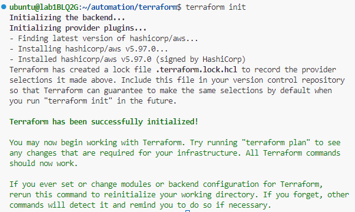
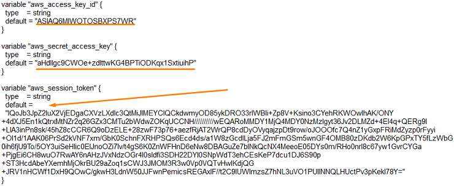
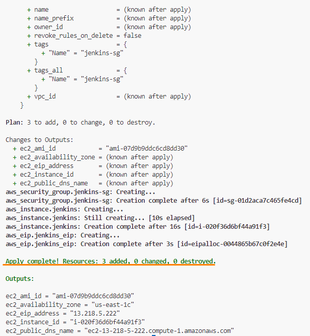

# Lab - Automate provisioning virtual servers using Terraform

This lab will guide you through the process of downloading and installing Terraform in your development environment. After which, Terraform will be used to create an EC2 instance in the AWS Learner Lab automatically.

## Pre-requisites

* Your SSH key is generated and added on GitHub

---
Before we continue, let's understand more about Terraform. Terraform is an open source infrastructure as code (IaC) tool that allows you to define and provision infrastructure using a declarative configuration language. It enables you to create, manage, and version your infrastructure in a consistent and repeatable manner. You will need to write configuration files in HashiCorp Configuration Language (HCL) that describes the desired state of your infrastructure (eg, servers, networks, security groups, etc). Terraform takes care of the provisioning and manage these resources for you. Some of the key benefits of using Terraform include:

* **Automation**: Automates the provisioning and management of infrastructure, reducing manual effort and human error.
* **Version Control**: Terraform configuration files can be stored in version control systems like Git, allowing you to track changes and collaborate with others.
* **Reproducibility**: Ensures consistent infrastructure deployments across different environments.
* **Modularity**: Allows you to break down complex infrastructure into smaller, reusable modules, making it easier to manage and maintain.
* **State Mangement**: Terraform manages the state of your infrastructure in a state file, which tracks the current configuration and allows Terraform to update only the resources that have changed.
* **Provider Support**: Terraform supports a wide range of cloud providers and services, making it versatile for multi-cloud environments.


## Instructions
The main tasks for this lab are as follows:
1. Download and install Terraform
2. Cloning the automation repository
3. Initialize Terraform
4. Retreive the AWS access key and secret key
5. Apply Terraform configuration to create Jenkins machine (delivery server)
6. Review the Terraform configuration files

Please note that all the tasks in this lab is performed on the development machine.

## Task 1: Download and install Terraform

1. Open **WSL Terminal**.

2. Enter the following to download and install Terraform.
   ```bash
    sudo apt-get update && sudo apt-get install -y gnupg software-properties-common
    wget -O- https://apt.releases.hashicorp.com/gpg | gpg --dearmor | sudo tee /usr/share/keyrings/hashicorp-archive-keyring.gpg > /dev/null
    echo "deb [signed-by=/usr/share/keyrings/hashicorp-archive-keyring.gpg] https://apt.releases.hashicorp.com $(lsb_release -cs) main" | sudo tee /etc/apt/sources.list.d/hashicorp.list
    sudo apt-get update
    sudo apt-get install terraform -y
   ```

3. Verify the installation by entering the following:

   ```bash
   terraform -version
   ```

## Task 2: Cloning the automation repository

1.  Change to your home directory.

    ```bash
    cd /home/ubuntu
    ```
2.  Run the following to clone your own `automation` repository.

    ```bash
    git clone git@github.com:GIT_USERNAME/automation
    ```

    NOTE: If you have not clone the course `automation` repository, please refer to [Lab_0C Task 5](LAB_0C.md#task-5-mirror-repositories-to-your-own-repository) to clone your own repository.

3.  Change the current working directory to the cloned automation directory.

    ```bash
    cd automation
    ```

## Task 3: Initialize Terraform

`terraform init` initializes a Terraform working directory. It downloads the necessary provider plugins (in our lab, the AWS provider) and sets up the backend for storing Terraform's state data. This is the crucial first step before you can use any other Terraform commands like `plan` or `apply`. Without initiailizing, Terraform won't haave the necessary components to interact with the infrastructure provider.

1. Navigate to the `terraform` directory, run the following to initialize a Terraform working directory.

    ```bash
    cd terraform
    terraform init
    ```

    

## Task 4: Retrieve the AWS access key and secret key

Terraform needs your AWS access key ID, secret access key and session token to authenticate with your AWS account. These credentials grant Terraform the necessary permissions to create, modify, and delete resources on your behalf. Without these credentials, Terraform cannot interact with AWS API and perform the actions defined in your Terraform configuration files.

To retrieve the AWS access key and secret key, follow these steps:

1. Go to the AWS Academy LMS.

2. Click on **AWS Details** at the top right hand corner of the header bar.

3. Click on the **Show** button to reveal the `Access Key` and `Secret Key` and `Session Token`.

   

4. Copy the `Access Key` and `Secret Key` and `Session Token` values and replace the placeholders in the **variables.tf** file respectively.

   A sample screenshot of the `variables.tf` file is shown below.

   

5. Save the changes to the file.

## Task 5: Apply Terraform configuration to create Jenkins machine (delivery server)

1. Run the following to apply the Terraform configuration.

    ```bash
    terraform apply
    ```

2. Enter **yes** to confirm the action.

   > **TIP**: You can use the command **terraform apply --auto-approve** to apply the changes defined in the Terraform configuration files to the infrastructure without requiring manual confirmation.

3. You should be able to see the output of your created EC2 machine.

   


## Task 6: Review the Terraform configuration files

Please take a moment to look at the Terraform source code that was used to provision the Delivery Virtual Server (Jenkins).

Under the terraform directory, you will find the following files. We have defined the typical file structure for our Terraform project as follows:

```md
terraform/
├── main.tf
├── output.tf
└── variables.tf
```

* **main.tf**: This is the main configuration file where you define your infrastructure resources.
* **output.tf**: This file is used to define output variables. It allows you to display information about the resources created.
* **variables.tf**: This file is used to define input variables that can be passed to the configuration. It allows you to parameterize your configuration and make it more flexible.

---

The `main.tf` file provisions AWS resources for deploying the Jenkins server. Here is a summary of its components:

* **AWS Provider Configuration**: Configures the AWS provider with the region set to us-east-1 and credentials (access key, secret key, and session token) passed as variables. The variable values are defined in the `variables.tf` file.

* **Data Source: AWS AMI**: Queries AWS for the most recent Ubuntu 22.04 AMI with specific filters for virtualization type (`hvm`) and architecture (`x86_64`).

* **Security Group**: 
    * Creates a security group named (`jenkins-sg`) with the following ingress rules:
        * Allows TCP traffic on ports 5000, 22, 80, 27017, 8080, 9000 and 3000 from a source IP block defined by the variable `var.source_ip_block` in `variables.tf` file.
        * Allows all outbound traffic (egress) to any destination.

* **AWS EC2 Instance**: 
    * Provisions an EC2 instance (jenkins) with:
        * The Ubuntu AMI fetched from the data block.
        * Instance type `t2.large`.
        * A key pair named `vockey`. (This key pair is provided in the AWS Academy Lab).
        * Attaches the EC2 instance to the security group created above (`jenkins-sg`).
        * A 32GB EBS volume is created and attached as the root device storage.
        * Tags the instance with name and group values with variables defined in the `variables.tf` file.

* **Elastic IP (EIP)**: Allocates an Elastic IP (`jenkins_eip`) and associates it with the Jenkins EC2 instance. This ensures that the Jenkins EC2 instance has the same static IP address which you can always refer to.

---

The `variables.tf` file defines the input variables for the Terraform configuration. It allows you to parameterize your configuration and make it more flexible. Here is a summary of its components:
* **AWS Access Key ID**: The AWS access key ID used for authentication with AWS.
* **AWS Secret Key**: The AWS secret access key used for authentication with AWS.
* **AWS Session Token**: The AWS session token used for authentication with AWS.
* **Source IP Block**: The source IP block used for the security group ingress rules is set to `0.0.0.0`. This means all IP addresses are allowed to access the Jenkins server. While this is acceptable for development or testing environments where ease of access is important, **it is not recommended for production**.
* **group and name variable**: The group and name variables are used to tag the EC2 instance with a name and group value. This helps in identifying and organizing resources in AWS. In this case, we have set both the name and group to `jenkins`.

---

The `output.tf` file defines the output variables for the Terraform configuration. It allows you to display information about the resources created. In this case, it outputs several piece of information of the Jenkins EC2 instance such as the public IP address, dns name etc. This information can be useful for accessing and managing the Jenkins server after it has been provisioned.

---

### Want to know more about Terraform?

Suggested Readings:
1. [Terraform Tutorial](https://spacelift.io/blog/terraform-tutorial)
2. [Terraform, Up and Running, 3rd Edition (Oreilly)](https://learning.oreilly.com/library/view/terraform-up-and/9781098116736/)

---

**Congratulations!** You have completed the lab exercise. Move on to the next exercise for configuring the EC2 instance using Ansible.