# Lab - Automate configuring delivery server using Ansible and release testing

This lab will guide you through downloading and installing Ansible in your development environment. You will then use Ansible to configure the delivery server (EC2 instance) that was created with Terraform in the previous lab. Next, a release testing process will be conducted on the deployed StaycationX application. Then, Jenkins will be installed using an Ansible playbook, and finally, you will access Jenkins through a web browser to install the suggested plugins and create your first user.


## Pre-requisites
1. Completed all the tasks in LAB_5A

## Instructions
1. Install Ansible
2. Run the Ansible playbook to install the required packages automatically
3. Release testing of deployed StaycationX
4. Install Jenkins via Ansible Playbook
5. Accessing Jenkins on the browser

## Task 1: Install Ansible

1. Open a **Terminal** in your development environment.

2. Run the following to install ansible.
   ```bash
   sudo apt-get install ansible -y
   ```

3. Verify the installation by entering the following:
   ```bash
   ansible --version
   ```

   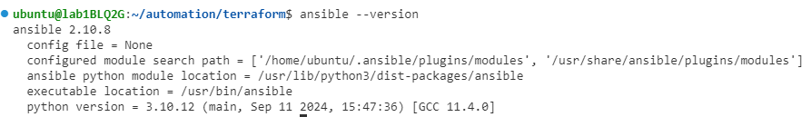

## Task 2: Run the Ansible playbook to install the required packages automatically

1. Change the current working directory to the `local-ansible` directory

   ```bash
   cd /home/ubuntu/automation/local-ansible
   ```

2. Navigate to the AWS Academy Canvas LMS and click **Show** SSH key.
      - Highlight and copy the private key contents
      - Open the labsuser.pem file
        ```bash
        nano labsuser.pem
        ```
      - Paste (by using your mouse right click) the private key contents into the file.
      - Press **Ctrl+O** to save the file and press **Enter** to leave the filename as default.
      - Press **Ctrl+X** close the file.

3. Run the following command to change the permissions of the PEM file to readonly.

   ```bash
   chmod 400 labsuser.pem
   ```

4. Open the **inventory** file and insert the delivery machine EC2 IP address on line 2.

   -  Open the application.yaml file
      ```bash
      nano inventory
      ```
   - Insert the delivery machine EC2 IP address on line 2. The IP address is obtained from the last step of LAB_5A.

      NOTE: If you are not using the user name `ubuntu` in WSL, then the content you need to put in on line 2 would be as follow: <br>
      DELIVERY_MACHINE_EC2_IP_ADDRESS ansible_ssh_user=ubuntu

   - Press **Ctrl+O** to save the file and press **Enter** to leave the filename as default.
   - Press **Ctrl+X** close the file.

5. Add the EC2 IP address to the list of known hosts.

   ```bash
   ssh-keyscan -t rsa EC2_PUBLIC_IP >> /home/ubuntu/.ssh/known_hosts
   ```

   Replace `EC2_PUBLIC_IP` with the public IP address of your EC2 instance.

6. Please take a moment to review both the ansible playbook files `common.yaml` and `application1.yaml` to understand the tasks that will be executed. You can find the playbook at the `automation` repository. Navigate to the `local-ansible` folder and look at the respective files.

7. Before we run the `common.yaml` file, you are required to do the following:

   *  If you are not using the `ubuntu` username in WSL, you would need to modify the path for the second last task where it is copying the key from development machine to delivery machine.

7. To install all the common libraries required, use the ansible playbook command to run the `common.yaml` playbook file.

   ```bash
   ansible-playbook common.yaml
   ```

   Sample Screenshot:

   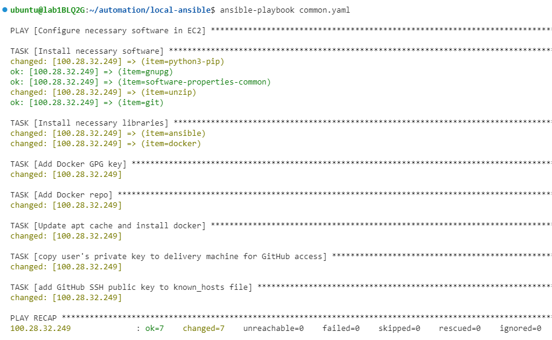


8. Before we run the `application1.yaml` file, you are required to do the following:

      * Enter your own dockerhub username and password under the **Login to Dockerhub** step
      * On Line 9, replace the USERNAME with your own DockerHub username
      * On Line 14 and 20, replace the username with your own GitHub username
      * In your own StaycationX repo under the `nginx` branch, change the first line on the Dockerfile **FROM python** to **FROM python:3.12** as there is incompatibility issues with the latest python version. After you have made the change, push the changes back to the repository.

9. Next, run the `application1.yaml` to tag the docker image and push it to DockerHub. It will use docker compose to run the applications.

   ```bash
   ansible-playbook application1.yaml
   ```

   Sample Screenshot:

   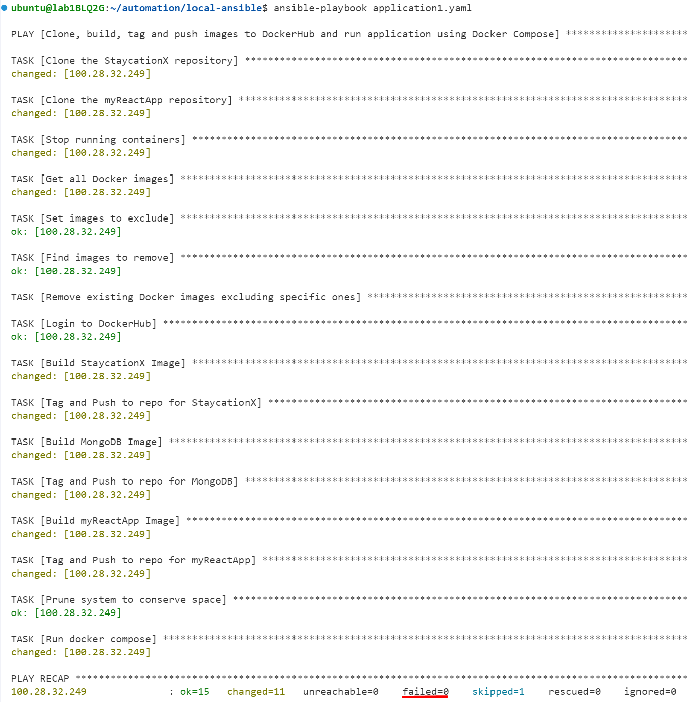


10. Ensure that you do not have any errors from the execution of the playbooks.

      > **TIP**: To get a more verbose output, you can use the `-v` flag. You can use `-vv` or `-vvv` for more verbosity.
      > For example: `ansible-playbook -vv application1.yaml`.

11. StaycationX and myReactApp is deployed. To verify it, open a web browser and browse to `http://EC2 IP ADDRESS`.

    * To view myReactApp, visit `http://EC2_IP_ADDRESS`.
    * To view StaycationX, visit `http://EC2_IP_ADDRESS:5000`.
    * To access MongoDB via Mongo Compass, the URI is `mongodb://EC2_IP_ADDRESS:27017`.

    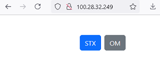

    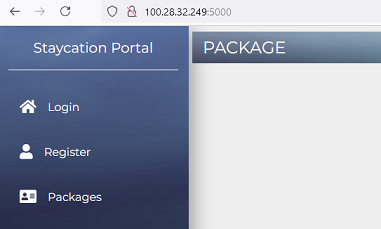
   
---

The following tasks in the section below are to be performed on the EC2 instance deployed by Terraform in LAB_5A.

## Task 3: Release testing of deployed StaycationX

Before you can perform the release testing on the containers, you will need to access the delivery machine where the containers are deployed.

To do that, you need to get the delivery machine IP address and use PuTTY to connect to the delivery machine.

### Step 1: Connecting to mongoDB container to seed data

1. Change the current path to the StaycationX directory in `/opt`.

   ```
   cd /opt/StaycationX
   ```

2. Run the following command to display the status of containers defined in the docker compose file.
   
   ```bash
   sudo docker compose ps
   ```

   You should be able to see `3` containers.

   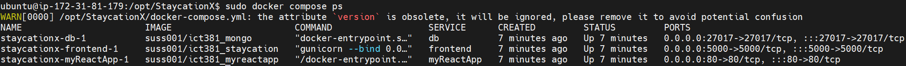

3. Before testing can be done, seeding of data in database is required. Seeding refers to the process of populating a database with initial data that is necessary for testing or development purposes.

   To seed the data, we need to first connect to the mongo database container.

   To connect to the database container, run the following command:

   ```bash
   sudo docker exec -ti staycationx-db-1 bash
   ```

4. Once connection is successful, run the following command to restore the mongoDB database from a binary backup that has been pre-prepared.

   ```bash
   mongorestore --nsInclude 'staycation.*' /opt
   ```

5. Once seeding is completed, you should see the message showing `66` documents successfully restored.

   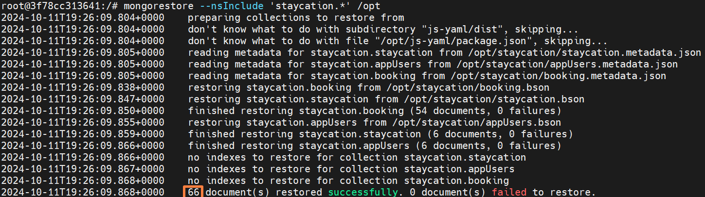

6. Enter **exit** to exit the mongoDB container.


### Step 2: Connect to the StaycationX application container to perform testing.

1. Run the following to connect to the staycation container.
   
   ```bash
   sudo docker exec -ti staycationx-frontend-1 bash
   ```

2. Set the following environment variables.
   -  MOZ_HEADLESS
   -  PYTHONPATH

   MOZ_HEADLESS is used in Firefox browser to enable headless mode. Headless mode allows Firefox to run without graphics interface, making it suitable for automated testing in a headless environment.

   PYTHONPATH is used to specify additional directories where Python should look for modules and packages.

   Run the following to export the environment variables.

   ```bash
   export MOZ_HEADLESS=1
   export PYTHONPATH=.
   ```

3. Run pytest from the root directory of the staycation app. pytest will automatically discover and run the defined test cases.

   ```bash
   pytest -s -v
   ```

4. You should see that the test results indicate that all test cases have passed.

   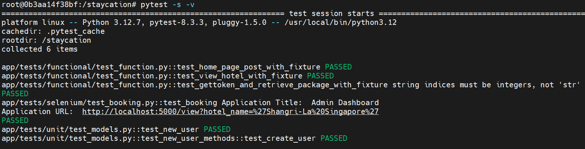

5. Enter **exit** to exit the container.


## Task 4: Installing Jenkins via Ansible Playbook

1. Ensure that you are still at `/home/ubuntu/automation/local-ansible` directory in your terminal.

2. Run ansible playbook command to run `application2.yaml` to install Jenkins.

   ```bash
   cd /home/ubuntu/automation/local-ansible
   ansible-playbook application2.yaml
   ```

   Sample Screenshot:

   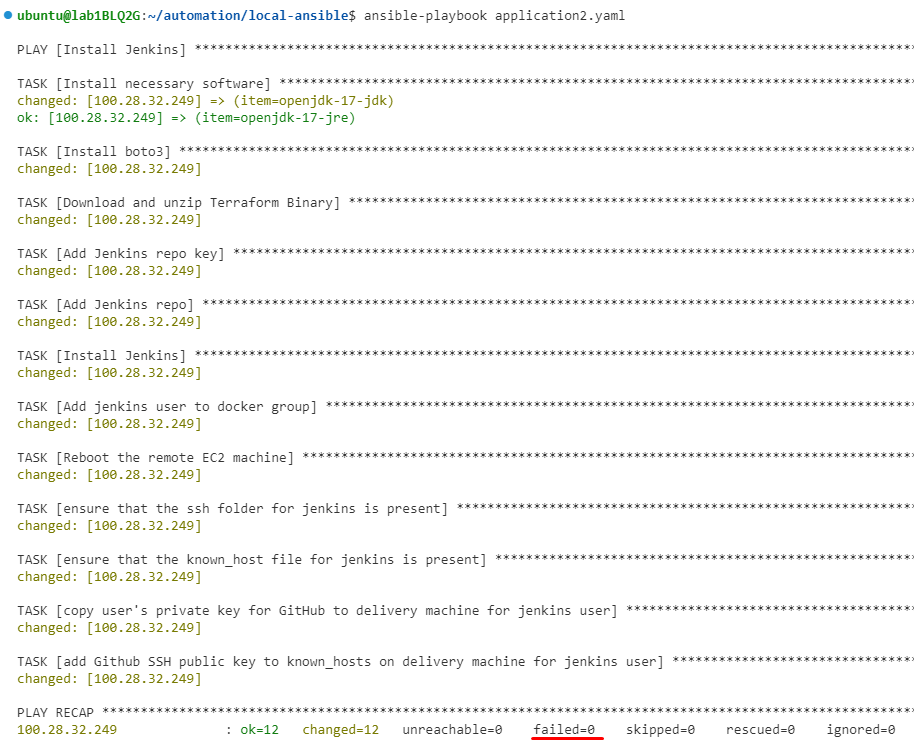

3. Ensure there are no errors from the execution of the playbook.


## Task 5: Accessing Jenkins on the browser

In this task, we will be accessing Jenkins on the browser to install the suggested plugins and create our first user.

1. Open a new browser tab and enter the following URL `http://EC2_PUBLIC_IP:8080`.

   Replace `<EC2_PUBLIC_IP>` with the public IP address of your EC2 instance.

2. You will be prompted to enter the initial admin password. Run the following command to retrieve the initial admin password.

   ```bash
   sudo cat /var/lib/jenkins/secrets/initialAdminPassword
   ```

   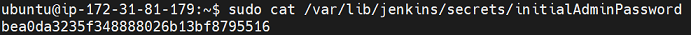


3. Copy the password and paste it into the **Administrator password** field. Click **Continue** to proceed.

   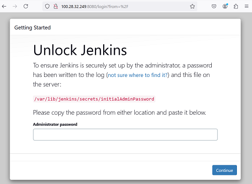

4.  Under Customize Jenkins, click **Install suggested plugins**.

    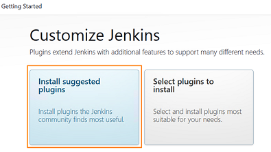

5. Wait for the installation to complete.

6. On the **Create First Admin User** page, enter the following:

   |Field|Value|
   |---|---|
   |Username| Your Student Portal User ID|
   |Password| Your preferred password|
   |Confirm Password| Your preferred password|
   |Full Name| Your full name|
   |Email Address| Your SUSS email address|

7. Click **Save and Continue**.

8. On the **Instance Configuration** page, click **Save and Finish**.

   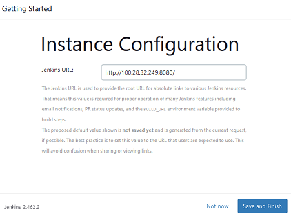

9. On the **Jenkins is ready!** page, click **Start using Jenkins**.

   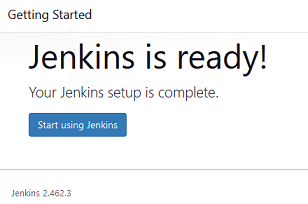

10. You will be redirected to the Jenkins dashboard.

    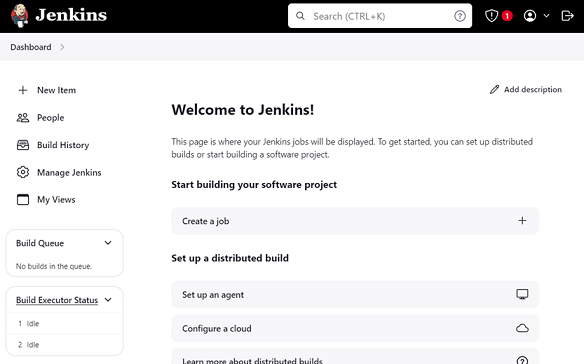

---

**Congratulations!** You have completed the lab exercise. Move on to the next exercise to learn more about creating pipelines with Jenkins.