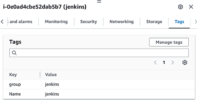
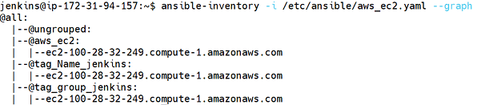
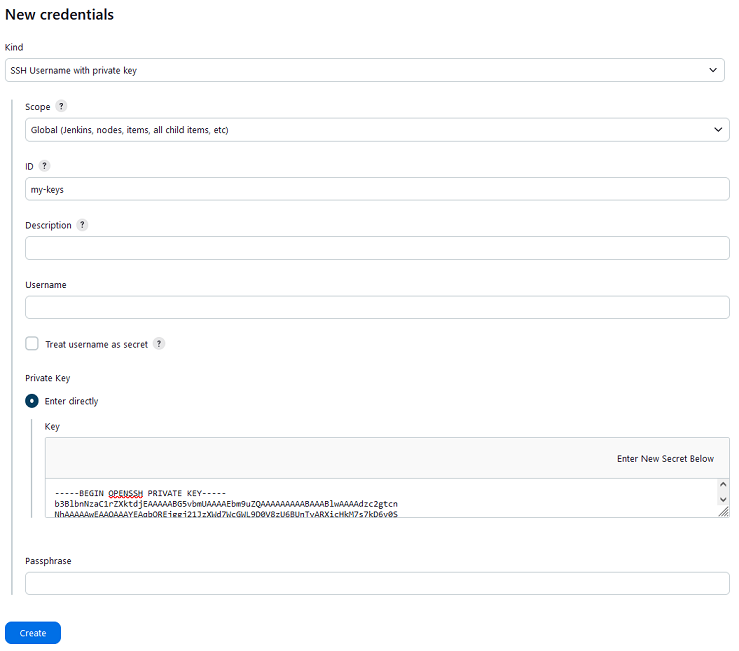
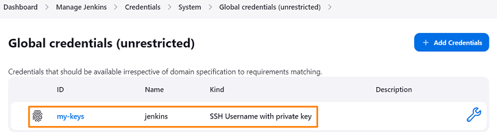
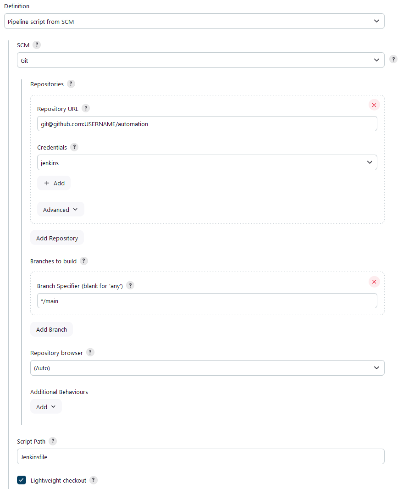
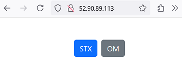
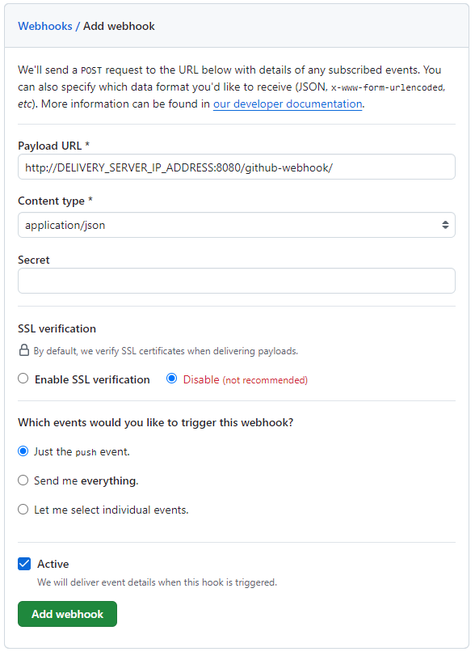
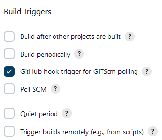
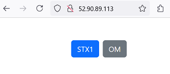

# Lab - Configuration of Jenkins pipeline

This lab will guide you through the process of setting up a Jenkins pipeline to automate the deployment of our application (StaycationX and myReactApp) using Ansible. The first step involves creating AWS credentials and SSH keys for the Jenkins user to interact with AWS resources and access the deployment machine. Next, the Ansible files will be configured to reference these credentials and perform the necessary tasks. Once the configuration is complete, the Jenkins pipeline will be created and configured to trigger a build whenever new code is pushed to the GitHub repository. This automated deployment process will streamline the development and deployment workflow, ensuring efficient and reliable updates to our application.

## Pre-requisites
1. Completed all the tasks in LAB_5A and LAB_5B

## Instructions

Configuration of SSH and AWS credentials for jenkins user
1. Create AWS credential for the jenkins user
2. Create SSH credental for the jenkins user
3. Configuration of files needed by Ansible to run in Jenkinsfile

Configuration of Jenkins
1. Adding SSH key to Jenkins to access the GitHub repository
2. Modify the files in ansible folder under automation repository that require changes
3. Saving all the changes and push to the automation repository
4. Creating the Jenkins Pipeline
5. Running the Jenkins Pipeline
6. Creating and configuring webhook in Github
7. Configure Jenkins to trigger a build when a new commit is pushed to the repository

## Configuration of SSH and AWS credentials for jenkins user

It is required and used by Ansible when invoked by Jenkins in the pipeline.

## Task 1: Create AWS credential for the jenkins user

AWS credential is used by the Ansible plugin in `aws_ec2.yaml` when Ansible is invoked from the Jenkinsfile.

The file `aws_ec2.yaml` is created in Task 3.

1. Before you start to perform the following actions, switch to the jenkins user first.

   ```bash
   sudo su
   su jenkins
   ```

2. Create the `.aws` directory in the jenkins user folder.

   ```bash
   mkdir /var/lib/jenkins/.aws
   ```

3. Navigate back to AWS Academy Canvas LMS and click **AWS Details** at the top right hand corner of the header bar.

4. Under AWS CLI, click on the **Show** button.

5. Highlight and copy the contents in the box.

5. Navigate back to the terminal and run the following command:

   ```bash
   vi /var/lib/jenkins/.aws/credentials
   ```

6. Paste (by using your mouse right click) the contents into the file.

7. Press **ESC**

8. Type **:wq** and press **Enter** to save and close the file.

9. **NOTE**: Please perform these step at the start of each new lab session as the AWS credentials changes for every session.

## Task 2: Create SSH credential for the jenkins user

Ansible requires SSH credentials to connect to the deployment server when invoked by Jenkins from the Jenkinsfile.

1. You will need to create a file to store your SSH credentials in the jenkins folder.

2. Navigate back to AWS Academy Canvas LMS and click **Show** SSH key.

3. Highlight and copy the private key contents.

4. Navigate back to the terminal and run the following command:

   ```bash
   vi /var/lib/jenkins/.ssh/vockey
   ```

5. Paste (by using your mouse right click) the private key contents into the file.

6. Press **ESC**

7. Type **:wq** and press **Enter** to save and close the file.

8. After the above has been completed, we will change the permissions of the `vockey` to ensure that the owner having only read only access.

   ```bash
   chmod 400 /var/lib/jenkins/.ssh/vockey
   ```

## Task 3: Configuration of files needed by Ansible to run in Jenkinsfile

Create the following files with the following contents.

1. Use the `exit` command once to exit out of jenkins user and change to root user.

2. Create the `/etc/ansible` directory to store the dynamic inventory file and the group_vars folder.

   ```bash
   mkdir -p /etc/ansible
   ```

3. Create the `aws_ec2.yaml` dynamic inventory file in the `/etc/ansible/` directory.

   ```bash
   vi /etc/ansible/aws_ec2.yaml
   ```

   Add the following contents to the file.

   ```bash
   plugin: amazon.aws.aws_ec2
   regions:
     - us-east-1
   strict: False
   keyed_groups:
     - key: 'tags'
       prefix: tag
   compose:
     ansible_host: ip_address
   ```

   Press **ESC**

   Type **:wq** and press **Enter** to save and close the file.

   We are creating a file called `aws_ec2.yaml` where it will define the configuration that uses the Ansible dynamic inventory plugin for AWS EC2 to automatically discover and manage EC2 instances in the `us-east-1` region. It groups instances by their tags with a prefix of 'tag' and specifies the connection details using their IP addresses. This setup streamlines automation tasks and simplifies the management of AWS resources using Ansible.

   For more information, you are encouraged to read up more at the [Ansible documentation](https://docs.ansible.com/ansible/latest/collections/amazon/aws/docsite/aws_ec2_guide.html#minimal-example)


4. Create the `tag_group_web.yaml` file in the `/etc/ansible/group_vars` directory.

   ```bash
   mkdir /etc/ansible/group_vars
   vi /etc/ansible/group_vars/tag_group_web.yaml
   ```

   Add the following contents to the file.

   ```bash
   ansible_ssh_private_key_file: /var/lib/jenkins/.ssh/vockey
   ansible_user: ubuntu
   ansible_ssh_common_args: '-o StrictHostKeyChecking=no'
   ```

   Press **ESC**

   Type **:wq** and press **Enter** to save and close the file.

   First we create the directory for Ansible group variables and defines specific connection settings for a group of hosts labelled `tag_group_web`. The commands create a YAML file that specifies the SSH private key and the default user ubuntu for connecting to these hosts. The setup simplifies the management of multiple servers by applying consistent variables across the group when running Ansible playook.

   For testing purposes, the argument `-o StrictHostKeyChecking=no` disables SSH's host key verification, allowing Ansible to connect to remote hosts without prompting for confirmation if the host key is new or has changed. This can be useful for automating connections to new or dynamic hosts.

   Do note that the names of the YAML files in group_vars must match the group defined in the inventory (`aws_ec2.yaml`). This ensure that Ansible can identify the relevant files and apply correct configurations to the servers.

4. You can test the dynamic inventory configuration by listing the EC2 instances.

   ```bash
   ansible-inventory -i /etc/ansible/aws_ec2.yaml --graph
   ```

   For example, you will notice that your jenkins EC2 is tagged with the following key value pairs and it matches what is queried using the ansible-inventory command.

   

   


## Configuration of Jenkins

## Task 1: Adding SSH key to Jenkins to access the GitHub repository

1. From the Jenkins dashboard, click on **Manage Jenkins** located on the left menu.

2. Click on **Credentials** under the Security section.

3. Click on the **global** link.

4. Click **+ Add Credentials**.

5. Under **Kind**, select **SSH Username with private key**.

6. Under **ID**, enter `my-keys`.

7. Under **Private Key**, select **Enter Directly**.

8. Click **Add**.

9. Paste in the contents of the private key file `id_rsa`. You can find the file located in your developer machine under `.ssh` folder.

   

10. Click **Create**.
    
11. You should see the credentials added to Jenkins.

    


## Task 2: Modify the files in ansible folder under automation repository that require changes

1. Open the `build-application.yaml` file in `ansible` folder under `automation` repository.

2. On Line 10 of the yaml file, replace the USERNAME placeholder with your own GitHub username.

3. Open the `Jenkinsfile` file under the `automation` repository and replace your GitHub username.

4. Save all the changes.

## Task 3: Saving all the changes and push to the automation repository

Please save and push all changes to your `automation` repository before proceeding, as the Jenkins pipeline relies on these files.

## Task 4: Creating the Jenkins Pipeline

1. Click on the Jenkins logo on the top left to show the Dashboard.

2. Click **+ New Item** on the left menu shown in the Dashboard.

3. Under item name, give it a name: `pipeline1`.

4. Select **Pipeline** and click **OK**.

5. Under **Pipeline** section, choose **Pipeline script from SCM** from the Definition drop down list.

6. Select **Git** from the SCM dropdown list.

7. Under Repository URL, enter your Git repository in this format: `git@github.com:USERNAME/automation`.

8. Under Credentials, select **jenkins** from the Credentials dropdown list.

9. Under Credentials, select **jenkins**.

10. Under the branch specifier, enter the branch name: `*/main`.

    

11. Leave the rest as default and scroll down to the end of page and click **Save**.

## Task 5: Running the Jenkins Pipeline

1. Click on **Build Now** on the left menu of the pipeline.
   > **NOTE**: The Build Now button appear once. The subsequent button text will be Build with Parameters.

2. Under Build History box, click on the Build Run # number to view more information.

3. You can click on the **Console Output** to view the build process.

4. If the build is successful, you should see a green tick on the left of the build number.

5. Go to the web browser and navigate to `http://DEPLOYMENT_EC2_IP`. Pleae ensure that you can view the application.

   

## Task 6: Creating and configuring webhook in Github

1. Navigate to your Github `myReactApp` repository.

2. Click on the **Settings** tab.

3. Under **Code and automation** section on the left, click **Webhooks**.

4. Click on **Add webhook**.

5. Enter the following details:
   - Payload URL: `http://<EC2_PUBLIC_IP>:8080/github-webhook/`
     > Replace the EC2_PUBLIC_IP with the jenkins machine public IP address
   - Content type: `application/json`
   - SSL verification: **Disable**
   - Which events would you like to trigger this webhook? Select `Just the push event`.

      

6. Click **Add webhook** to save the webhook.

7. You should see the webhook added to the repository.

Repeat the above steps if you want to create webhooks on the other repositories.

## Task 7: Configure Jenkins to trigger a build when a new commit is pushed to the repository

1. From the Jenkins dashboard, click on your created pipeline.

2. Click on **Configure** on the left menu.

3. Under the **Build Trigger** section, select **GitHub hook trigger for GITScm polling**.

   

4. Click **Save** at the bottom of the page.

To simulate the trigger, please make changes to the files and push it to your own Github repository.

You should see a new build being triggered in Jenkins automatically under the Build History box.

A quick way to verify:

*  Navigate to `App.js` in `myReactApp\src\App.js`.
*  On line 25, introduce a change. Before the end of the Link tag, replace **STX** to **STX1**.
*  Save and push the changes back to your own repository.
*  You should notice a new build being triggered automatically.

Visit the webpage to view the changes!

Screenshot showing after the change:



---

**Congratulations!** You have completed the lab exercise.
