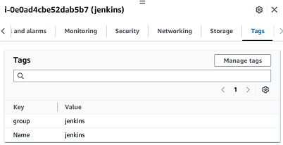
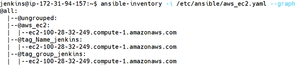
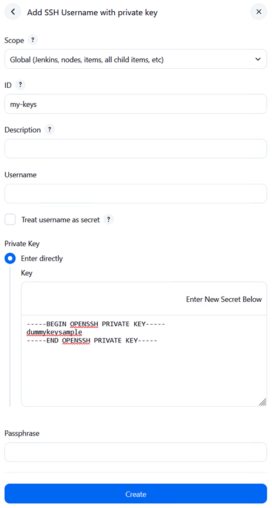
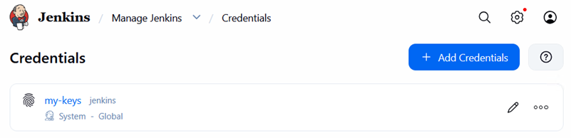
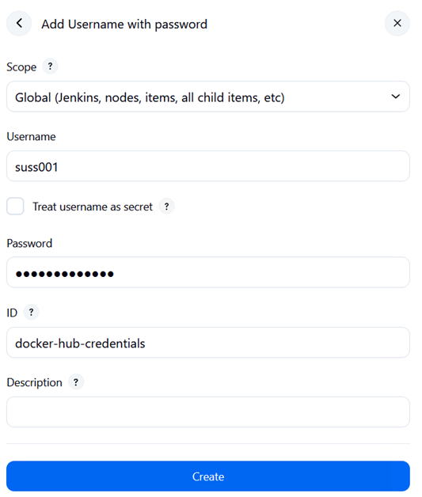
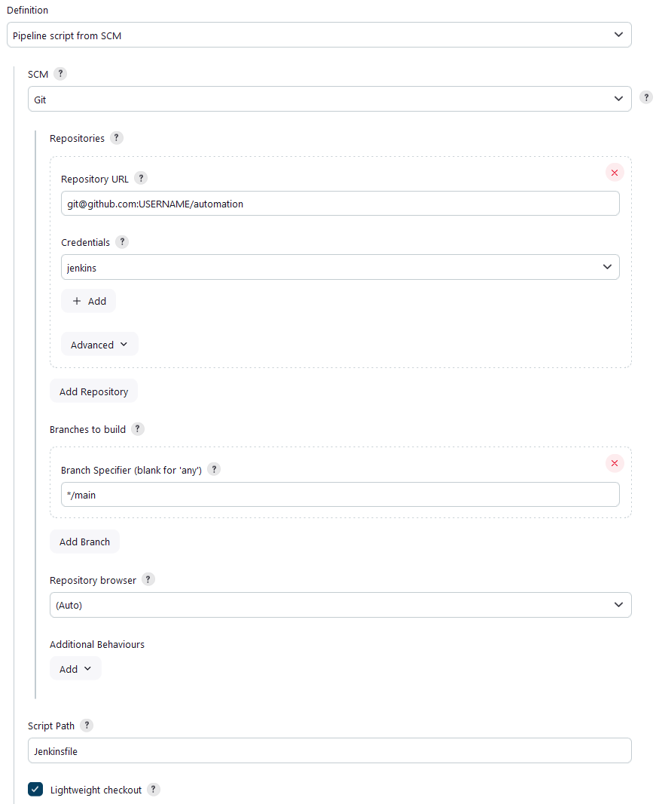
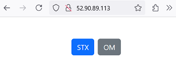
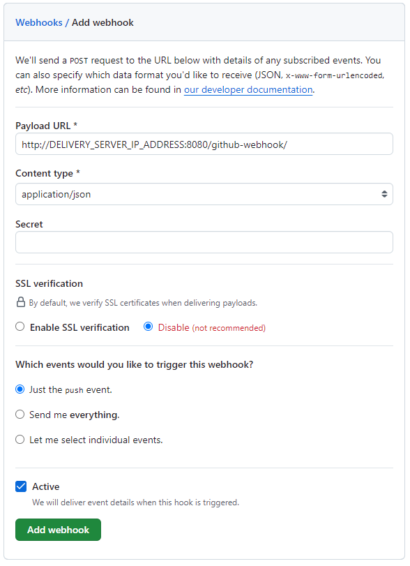
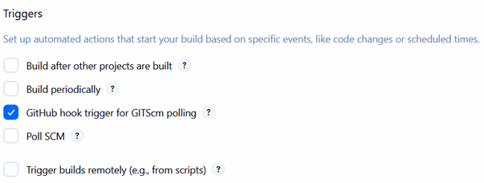
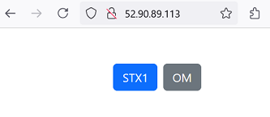

# Lab - Configuring a Jenkins Pipeline

In this lab, you will configure a Jenkins pipeline to automate the deployment of **StaycationX** and **myReactApp** using Ansible. The process involves:

1. Creating AWS credentials and SSH keys for the Jenkins user.
2. Configuring Ansible files to reference those credentials.
3. Setting up the Jenkins pipeline to trigger a build automatically on every GitHub push.

## Pre-requisites
1. Complete all the tasks in LAB_5A and LAB_5B.

---

Before we continue, let's understand the `Jenkinsfile`. A `Jenkinsfile` is a text-based configuration file that defines a Jenkins pipeline using a Groovy-based Domain-Specific Language (DSL). It enables developers to define, version-control and automate workflows in a structured manner. The `Jenkinsfile` is typically stored in the root directory of the project.

Some benefits of using a Jenkinsfile include:

* **Pipeline as Code**: The entire CI/CD pipeline is defined as code, making it easy to version control, manage and collaborate on.
* **Single Source of Truth**: The pipeline configuration is stored alongside the application code, visible and editable by all team members.
* **Consistency Across Builds**: The same Jenkinsfile can be used across different environments, ensuring predictable behavior at every stage.
* **Transparency**: The pipeline logic is written in a human-readable format which serves as a self-documenting workflow reference.

Understanding the `Jenkinsfile` is important for this lab because it shows the entire execution flow of the pipeline. It is divided into stages, each representing a step in the CI/CD process.

Let's take a look at the project's `Jenkinsfile` bit by bit:

The `pipeline` block is the root element of the Jenkinsfile. It defines the entire pipeline and its configuration. The `agent` directive specifies where the pipeline should run. In this case, `any` means it can run on any available agent.

```groovy
pipeline {
    agent any
}
```

The `parameters` block defines inputs that can be passed to the pipeline when it is triggered. Here, there is a dropdown menu that lets the user choose between two actions:

* `apply` — deploys the application and infrastructure.
* `destroy` — tears down the application and infrastructure.

```groovy
parameters {
   choice(
      name: 'Action',
      choices: 'apply\ndestroy',
      description: 'Apply or Destroy Instance'
   )
}
```

The pipeline is made up of stages and each stage represents one part of the process: `Checkout`, `Docker`, `Terraform` and `Ansible`. These stages are written inside the `stages` block. Each stage has one or more `steps`, which are the tasks Jenkins runs, such as scripts or commands.

---

In the `Checkout` stage, if the selected action is `apply`, the pipeline clones the `automation`, `StaycationX`, and `myReactApp` repositories from GitHub using the `my-keys` SSH credential stored in Jenkins. You will create this credential in the **Configuration of Jenkins** section below.

```groovy
stages {
   stage('Checkout') {
      steps {
         script {
            if (params.Action == 'apply') {
               git branch: 'main', credentialsId: 'my-keys', url: 'git@github.com:GIT_USERNAME/automation.git'

               dir('StaycationX') {
                     git branch: 'main', credentialsId: 'my-keys', url: 'git@github.com:GIT_USERNAME/StaycationX.git'
               }

               dir('myReactApp') {
                     git branch: 'main', credentialsId: 'my-keys', url: 'git@github.com:GIT_USERNAME/myReactApp.git'
               }
            }
         }
      }
        }
}
```

---

In the `Docker` stage, the `withCredentials` block retrieves the DockerHub username and password stored in Jenkins under the credential ID `docker-hub-credentials`, exposing them as the environment variables `DOCKER_USER` and `DOCKER_PASSWORD`. When the action is `apply`, Ansible executes the `build-docker.yaml` playbook located in the `ansible` directory. You will create the DockerHub credential in the **Configuration of Jenkins** section below.

```groovy
stage('Docker') {
   steps {
      withCredentials([
         usernamePassword(credentialsId: 'docker-hub-credentials',
                        usernameVariable: 'DOCKER_USER',
                        passwordVariable: 'DOCKER_PASSWORD')
      ]) {
         script {
            if (params.Action == 'apply') {
               sh 'ansible-playbook ansible/build-docker.yaml'
            }
         }
      }
   }
}
```

The `build-docker.yaml` playbook reads the `DOCKER_USER` and `DOCKER_PASSWORD` environment variables using a `set_fact` task, then uses those values to log in to DockerHub.

```yaml
- name: Get Docker credentials from environment variables
  set_fact:
     DOCKER_USER: "{{ lookup('env', 'DOCKER_USER') }}"
     DOCKER_PASSWORD: "{{ lookup('env', 'DOCKER_PASSWORD') }}"
  no_log: true

- name: Login to DockerHub
  shell: "echo {{DOCKER_PASSWORD}} | docker login -u {{DOCKER_USER}} --password-stdin"
  no_log: true
```

The rest of the playbook involves building the docker images, tagging the images and pushing the images to DockerHub.

---

In the `Terraform` stage, the pipeline performs different tasks depending on the selected action:

* **apply** — initializes the Terraform working directory and provisions the infrastructure, which includes a new production EC2 instance tagged with `name=prod-ict381` and `group=web`. The `-var` flag overrides the corresponding input variables in `variables.tf`. These tags are used by Ansible to dynamically discover and target the instance.
* **destroy** — tears down all infrastructure that was created by the `apply` action.

```groovy
stage('Terraform') {
   steps {
         script {
            if (params.Action == 'apply') {
               sh 'terraform -chdir=terraform init'
               sh 'terraform -chdir=terraform apply -var="name=prod-ict381" -var="group=web" --auto-approve'
            }
            else {
               sh 'terraform -chdir=terraform destroy -var="name=prod-ict381" -var="group=web" --auto-approve'
            }
         }
   }
}
```
---

In the `Ansible` stage, Jenkins runs the `prod-application.yaml` playbook located in the `ansible` folder. The `-i` flag specifies the `aws_ec2.yaml` dynamic inventory file, which uses the AWS EC2 inventory plugin to automatically discover and target EC2 instances.

```groovy
stage('Ansible') {
   steps {
         script {
            if (params.Action == 'apply') {
               sh 'ansible-playbook -i /etc/ansible/aws_ec2.yaml ansible/prod-application.yaml'
            }
         }
   }
}
```

The main tasks performed by the playbook (`prod-application.yaml`) include:
- Downloading and installing Docker
- Copying of `dockerhub.yaml` configuration file from jenkins to production machine
- Stopping any running containers
- Removing existing Docker images
- Starting the application using Docker Compose with the copied `dockerhub.yaml` configuration file

---

## Instructions

**Configuration of SSH credential for the Jenkins user**
1. Create SSH credentials for the Jenkins user
2. Configure Ansible files

**Configuration of Jenkins**
1. Add SSH key to Jenkins to access GitHub repository
2. Add DockerHub credentials to Jenkins
3. Update Jenkinfile with your GitHub Username
4. Save and push changes to the automation repository
5. Create the Jenkins pipeline
6. Run the Jenkins pipeline
7. Create and configure a GitHub webhook
8. Configure Jenkins to trigger on push

## Configuration of SSH Credential for the Jenkins User

When Jenkins runs Ansible from the Jenkinsfile, Ansible needs SSH credentials to connect to the production EC2 instance. You will store the private key file in the Jenkins home directory.

Connect to your Jenkins machine using either PuTTY or SSH from your WSL terminal and then perform the steps below.

```bash
# For instance
cd ~/automation/local-ansible
ssh -i labsuser.pem EC2_PUBLIC_IP
```

## Task 1: Create SSH credential for the jenkins user

1. Switch to the Jenkins user:

   ```bash
   sudo su
   su jenkins
   ```

2. Create the `.ssh` directory in the jenkins home directory (For info: it has been created via the playbook).

   ```bash
   mkdir /var/lib/jenkins/.ssh
   ```

3. Navigate back to AWS Academy Canvas LMS and click **Show** SSH key.

4. Highlight and copy the private key contents.

5. Navigate back to the terminal and run the following command:

   ```bash
   vi /var/lib/jenkins/.ssh/vockey
   ```

6. Paste (right-click with your mouse) the private key contents into the file.

7. Press **ESC**.

8. Type **:wq** and press **Enter** to save and close the file.

9. Set the correct permissions on the `vockey` file so that only the owner has read access:

   ```bash
   chmod 400 /var/lib/jenkins/.ssh/vockey
   ```

10. Type `exit` command once to return to the root user from the jenkins user.

## Task 2: Configure Ansible Files

Create the following configuration files required by Ansible when it runs inside the Jenkins pipeline.

1. Create the `/etc/ansible` directory to store the inventory file and group variables.

   ```bash
   mkdir -p /etc/ansible
   ```

2. Create the `aws_ec2.yaml` dynamic inventory file in the `/etc/ansible/` directory.

   This file configures the Ansible [AWS EC2 dynamic inventory plugin](https://docs.ansible.com/ansible/latest/collections/amazon/aws/docsite/aws_ec2_guide.html#minimal-example) to automatically discover EC2 instances in the `us-east-1` region, group them by their tags (using a `tag_` prefix), and connect to them using their IP addresses.

   ```bash
   vi /etc/ansible/aws_ec2.yaml
   ```

   Add the following contents to the file.

   ```yaml
   plugin: amazon.aws.aws_ec2
   regions:
     - us-east-1
   strict: False
   keyed_groups:
     - key: ec2_tags
       prefix: tag
   compose:
     ansible_host: ip_address
   ```

   Press **ESC**.

   Type **:wq** and press **Enter** to save and close the file.


3. Create the `tag_group_web.yaml` group variables file.

   This file defines SSH connection settings for all hosts in the Ansible group `tag_group_web`. The group name is derived from the dynamic inventory prefix (`tag_`) combined with the EC2 tag key (`group`) and its value (`web`), which Terraform sets when provisioning the production instance:

   ```bash
   # The Terraform tag -var="group=web" produces the Ansible group: tag_group_web
   sh 'terraform -chdir=terraform apply -var="name=prod-ict381" -var="group=web" --auto-approve'
   ```

   Create the directory and file:

   ```bash
   mkdir /etc/ansible/group_vars
   vi /etc/ansible/group_vars/tag_group_web.yaml
   ```

   Add the following contents to the file.

   ```bash
   ansible_ssh_private_key_file: /var/lib/jenkins/.ssh/vockey
   ansible_user: ubuntu
   ansible_ssh_common_args: '-o StrictHostKeyChecking=no'
   ```

   Press **ESC**.

   Type **:wq** and press **Enter** to save and close the file.

   This file specifies the SSH private key path and the default connection user (`ubuntu`) for all hosts in the group. The `-o StrictHostKeyChecking=no` argument disables SSH host key verification, which is useful when connecting to newly provisioned EC2 instances whose host keys are not yet trusted.

   > **NOTE:** The filename in `group_vars` must exactly match the group name defined in the inventory file (`aws_ec2.yaml`). Ansible uses this filename to apply the correct variables to the matching host group.

4. (Optional) Test the dynamic inventory configuration by listing the discovered EC2 instances.

   ```bash
   # Switch back to the jenkins user
   su jenkins
   ansible-inventory -i /etc/ansible/aws_ec2.yaml --graph
   ```

   The output should show your Jenkins EC2 instance grouped by its tags, matching what is visible in the AWS console:

   

   


## Configuration of Jenkins

## Task 1: Add SSH Key to Jenkins

1. From the Jenkins dashboard, click on **Manage Jenkins** (with gear icon) located on the top right menu.

2. Click on **Credentials** under the Security section.

3. Click **+ Add Credentials**.

4. Select **SSH Username with private key** and click **Next**.

5. Under **ID**, enter `my-keys`.

6. Under **Private Key**, select **Enter Directly**.

7. Click **Add**.

8. Paste the contents of your private key file `id_rsa`, located in the `.ssh` folder on your development machine.

   

9. Click **Create**.
    
10. You should see the credentials added to Jenkins.

    

## Task 2: Add DockerHub Credentials to Jenkins

1. Continuing from the previous task, click **+ Add Credentials**.

2. Select **Username with password** and click **Next**.

3. Enter your DockerHub username in the **Username** field.

4. Enter your DockerHub password in the **Password** field.

5. Under **ID**, enter `docker-hub-credentials`.

   

6. Click **Create** button to save the credential.

7. You should see the credentials added to Jenkins.

## Task 3: Update Jenkinfile with your GitHub Username

Review your `Jenkinsfile` and replace `GIT_USERNAME` with your own GitHub username so Jenkins can clone the correct repositories.

## Task 4: Save and Push Changes to the Automation Repository

Push all pending changes to your `automation` repository before proceeding. The Jenkins pipeline retrieves these files directly from GitHub — for instance, the `Terraform` stage uses the configuration files committed here to provision the production EC2 instance.

## Task 5: Create the Jenkins Pipeline

1. Click on the Jenkins logo on the top left to show the Dashboard.

2. Click **+ New Item** on the left menu shown in the Dashboard.

3. Under item name, enter `pipeline1`.

4. Select **Pipeline** and click **OK**.

5. Under the **Pipeline** section, choose **Pipeline script from SCM** from the Definition drop down list.

6. Select **Git** from the SCM dropdown list.

7. Under **Repository URL**, enter your Git repository URL in the format: `git@github.com:GIT_USERNAME/automation.git`.

8. Under **Credentials**, select **jenkins** from the dropdown list.

9. Under **Branch Specifier**, enter `*/main`.

    

10. Leave all other settings at their defaults, scroll to the bottom of the page, and click **Save**.

## Task 6: Run the Jenkins Pipeline

1. Click **Build Now** on the left menu of the pipeline.

   > **NOTE:** The **Build Now** button appears only on the first run. Subsequent runs display **Build with Parameters** instead.

2. In the **Build History** panel, click the build number to view its details.

3. Click **Console Output** to monitor the build progress in real time.

4. A successful build displays a success message at the end of the log and a green tick at the top of the page.

5. Open a browser and navigate to `http://DEPLOYMENT_EC2_IP` to verify that the application is accessible.

   

## Task 7: Create and Configure a GitHub Webhook

1. Navigate to your GitHub `myReactApp` repository.

2. Click the **Settings** tab.

3. In the left sidebar under **Code and automation**, click **Webhooks**.

4. Click **Add webhook** and enter the following details:

   | Field | Value |
   |---|---|
   | Payload URL | `http://<JENKINS_EC2_PUBLIC_IP>:8080/github-webhook/` |
   | Content type | `application/json` |
   | SSL verification | Disabled |
   | Events | Just the push event |

   

5. Click **Add webhook** to save.

Repeat these steps for any other repositories which you want to create the webhook.

## Task 8: Configure Jenkins to Trigger on Push

1. From the Jenkins dashboard, click on your created pipeline `pipeline1`.

2. Click **Configure** in the left menu.

3. Under **Triggers**, select **GitHub hook trigger for GITScm polling**.

   

4. Click **Save**.

To test the integration, push a change to your GitHub repository and confirm that a new build is triggered automatically in the **Build History** panel.

**Quick verification:**

1. Open `myReactApp/src/App.js`.
2. On line 27, replace **STX** with **STX1** inside the Link tag.
3. Save and push the change to your repository.
4. Verify that a new build starts automatically in Jenkins.
5. Refresh the application in your browser to confirm the change is live.

   

---

### Want to learn more about Jenkins?

Suggested Readings:

1. [Jenkins Documentation on using Jenkinsfile](https://www.jenkins.io/doc/book/pipeline/jenkinsfile/)

---
## 🎉 Congratulations!

**Congratulations!** You have completed the lab exercise.
