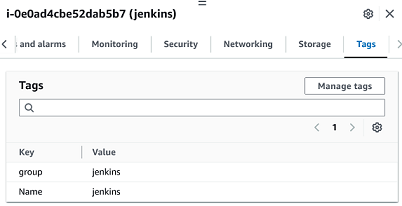
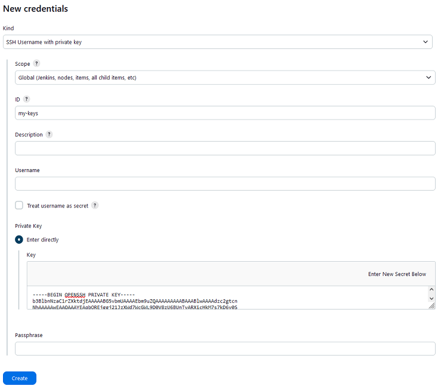
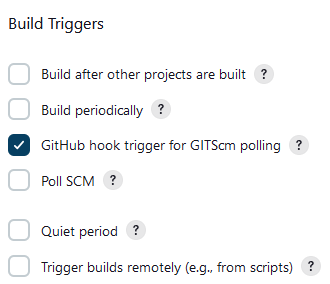

# Lab - Configuration of Jenkins pipeline

This lab will guide you through the process of setting up a Jenkins pipeline to automate the deployment of our application (StaycationX and myReactApp) using Ansible. The first step involves creating AWS credentials and SSH keys for the Jenkins user to interact with AWS resources and access the deployment machine. Next, the Ansible files will be configured to reference these credentials and perform the necessary tasks. Once the configuration is complete, the Jenkins pipeline will be created and configured to trigger a build whenever new code is pushed to the GitHub repository. This automated deployment process will streamline the development and deployment workflow, ensuring efficient and reliable updates to our application.

## Pre-requisites
1. Completed all the tasks in LAB_5A and LAB_5B

---

Before we continue, let's understand more about Jenkinsfile. A `Jenkinsfile` is a text based configuration file that defines the Jenkins pipeline using Groovy based (Domain-Specific Language) language. It enables developers to define, version control and automate workflows in a structured manner. The `Jenkinsfile` is usually stored in the root directory of the project. 

Some benefits of using Jenkinsfile are: 
* **Single source of truth**: The pipeline configuration can be viewed and edited by multiple team members.
* **Pipeline as Code**: The Jenkinsfile allows you to define your entire CI/CD pipeline as code, making it easier to version control, manage and collaborate.
* **Consistency across Builds**: The same Jenkinsfile can be used across different environments, ensuring consistent behavior in all stages of the pipeline.
* **Transparency**: The pipeline logic is written in a human readable format, doubling as documentation to understand the workflow.

Understanding the Jenkinsfile is crucial for this lab as it shows you the entire process of how the pipeline is executed. It is divided into different stages, each representing a step in the CI/CD process.

Let's take a look at the project's `Jenkinsfile` bit by bit:

The `pipeline` block is the root element of the Jenkinsfile. It defines the entire pipeline and its configuration. The `agent` directive specifies where the pipeline should run. In this case, `any` means it can run on any available agent.

```groovy
pipeline {
    agent any
}
```

Next would be the parameter block. This block defines the parameters that can be passed to the pipeline when it is triggered. In this case, we have a dropdown menu that allows the user to choose between two actions: `apply` or `destroy`. The selected action will then be used in the pipeline execution. `apply` refers to deploying the application, while `destroy` refers to tearing down the application and infrastructure.

```groovy
parameters {
   choice(
      name: 'Action',
      choices: 'apply\ndestroy',
      description: 'Apply or Destroy Instance'
   )
}
```

Next, we have divided the pipeline into different stages. Each stage represents a specific phase of the pipeline such as `Checkout`, `Docker`, `Terraform` and `Ansible` in our project. The stages are defined within the `stage` block. Each stage contains a sequence of steps. Steps are individual tasks performed within a stage. It could be running scripts or executing commands.

---

In this `Checkout` stage, if the action is `apply`, it will clone the `automation`, `StaycationX` and `myReactApp` repositories from GitHub using `my-keys` credential stored in Jenkins. You are required to create this credential in Jenkins using your SSH key. You need to follow the instructions outlined in the lab to do so.

```groovy
stages {
   stage('Checkout') {
      steps {
         script {
            if (params.Action == 'apply') {
               git branch: 'main', credentialsId: 'my-keys', url: 'git@github.com:GIT_USERNAME/automation.git'

               dir('StaycationX') {
                     git branch: 'main', credentialsId: 'my-keys', url: 'git@github.com:GIT_USERNAME/StaycationX.git'
               }

               dir('myReactApp') {
                     git branch: 'main', credentialsId: 'my-keys', url: 'git@github.com:GIT_USERNAME/myReactApp.git'
               }
            }
         }
      }
        }
}
```

---

In the `Docker` stage, in the withCredentials block, it retrieves the DockerHub username and password stored in Jenkins under the credential ID `docker-hub-credentials`. These credentials are then stored in the environment variables `DOCKER_USER` and `DOCKER_PASSWORD` respectively to be used in the pipeline. You are required to create the credentials in Jenkins by following the instructions outlined in the lab.

```groovy
stage('Docker') {
   steps {
         withCredentials([
            usernamePassword(credentialsId: 'docker-hub-credentials',
                           usernameVariable: 'DOCKER_USER',
                           passwordVariable: 'DOCKER_PASSWORD')
         ])
   }
}
```
In the script block, when the action is `apply`, Ansible will execute the playbook `build-docker.yaml` file which is located in the ansible directory. 
```groovy
script {
   if (params.Action == 'apply') {
         sh 'ansible-playbook ansible/build-docker.yaml'
   }
}
```

In the `build-docker.yaml` file, it reads the value of the environment variables `DOCKER_USER` and `DOCKER_PASSWORD` and stores it into the variable respectively under the set_fact task. Subsequently, it is used to login to DockerHub.

```bash
- name: Get Docker credentials from environment variables
  set_fact:
     DOCKER_USER: "{{ lookup('env', 'DOCKER_USER') }}"
     DOCKER_PASSWORD: "{{ lookup('env', 'DOCKER_PASSWORD') }}"
   no_log: true

- name: Login to DockerHub
  shell: "echo {{DOCKER_PASSWORD}} | docker login -u {{DOCKER_USER}} --password-stdin"
  no_log: true
```

The rest of the playbook involves building the docker images, tagging the images and pushing the images to DockerHub.

---

In the `Terraform` stage, depending on the selected action, it performs different tasks. If the action is `apply`, it initializes the Terraform working directory and creates the relevant infrastructure. One of the resources created includes a new production EC2 instance. This instance is tagged with labels `name=prod-ict381` and `group=web`.The `-var` flag is used to override the input variables (group and name) in the `variables.tf` file. Tagging the instance is essential because we use these tag values to query and identify the specific machines that can be managed.

If the action is `destroy`, terraform command is executed to destroy the relevant infrastructure that was created in the `apply` action.

```groovy
stage('Terraform') {
   steps {
         script {
            if (params.Action == 'apply') {
               sh 'terraform -chdir=terraform init'
               sh 'terraform -chdir=terraform apply -var="name=prod-ict381" -var="group=web" --auto-approve'
            }
            else {
               sh 'terraform -chdir=terraform destroy -var="name=prod-ict381" -var="group=web" --auto-approve'
            }
         }
   }
}
```
---

In the `Ansible` stage, Jenkins uses Ansible to run the `prod-application.yaml` playbook, which is located in the `ansible` folder. This playbook is executed against the production EC2 machine. In the Ansible command, we use the *-i* flag to specify the `aws_ec2.yaml` inventory file, which leverages an inventory plugin to dynamically discover and target hosts from AWS data sources.

```groovy
stage('Ansible') {
   steps {
         script {
            if (params.Action == 'apply') {
               sh 'ansible-playbook -i /etc/ansible/aws_ec2.yaml ansible/prod-application.yaml'
            }
         }
   }
}
```

The main tasks performed by the playbook (`prod-application.yaml`) include:
- Downloading and installing Docker
- Copying of `dockerhub.yaml` configuration file from jenkins to production machine
- Stopping any running containers
- Removing existing Docker images
- Starting the application using Docker Compose with the copied `dockerhub.yaml` configuration file

---

## Instructions

Configuration of SSH and AWS credentials for jenkins user
1. Create AWS credential for the jenkins user
2. Create SSH credental for the jenkins user
3. Configuration of files needed by Ansible to run in Jenkinsfile

Configuration for Jenkins
1. Adding SSH key to Jenkins to access the GitHub repository
2. Adding DockerHub credential to Jenkins
3. Saving all the changes and push to the automation repository
4. Creating the Jenkins Pipeline
5. Running the Jenkins Pipeline
6. Creating and configuring webhook in Github
7. Configure Jenkins to trigger a build when a new commit is pushed to the repository

## Configuration of SSH and AWS credentials for jenkins user

These credentials are required by Ansible when it is executed by Jenkins during the pipeline process.

## Task 1: Create AWS credential for the jenkins user

The AWS credential is required when accessed by the Ansible AWS EC2 inventory plugin, as configured in `aws_ec2.yaml`, whenever Ansible is run from the Jenkinsfile. The file `aws_ec2.yaml` is created in Task 3.

Please connect to your delivery machine via PuTTY before performing the tasks below.

1. Before you start to perform the following actions, switch to the jenkins user first.

   ```bash
   sudo su
   su jenkins
   ```

2. Create the `.aws` directory in the jenkins user folder.

   ```bash
   mkdir /var/lib/jenkins/.aws
   ```

3. Navigate back to AWS Academy Canvas LMS and click **AWS Details** at the top right hand corner of the header bar.

4. Under AWS CLI, click on the **Show** button.

5. Highlight and copy the contents in the box.

6. Navigate back to the terminal and run the following command:

   ```bash
   vi /var/lib/jenkins/.aws/credentials
   ```

7. Paste (by using your mouse right click) the contents into the file.

8. Press **ESC**

9. Type **:wq** and press **Enter** to save and close the file.

**NOTE**: Please perform these step at the start of each new lab session as the AWS credentials changes for every session.

## Task 2: Create SSH credential for the jenkins user

When Jenkins runs Ansible from the Jenkinsfile, Ansible needs SSH credentials to connect to the production EC2 server.

You need to create a file to store your SSH credentials in the jenkins folder.

1. Navigate back to AWS Academy Canvas LMS and click **Show** SSH key.

2. Highlight and copy the private key contents.

3. Navigate back to the terminal and run the following command:

   ```bash
   vi /var/lib/jenkins/.ssh/vockey
   ```

4. Paste (by using your mouse right click) the private key contents into the file.

5. Press **ESC**

6. Type **:wq** and press **Enter** to save and close the file.

7. After the above has been completed, we will change the permissions of the `vockey` to ensure that the owner having only read only access.

   ```bash
   chmod 400 /var/lib/jenkins/.ssh/vockey
   ```

## Task 3: Configuration of files needed by Ansible to run in Jenkinsfile

Create the following files with the following contents.

1. Use the `exit` command once to exit out of jenkins user and change to root user.

2. Create the `/etc/ansible` directory to store the inventory file and the group_vars folder.

   ```bash
   mkdir -p /etc/ansible
   ```

3. Create the `aws_ec2.yaml` dynamic inventory file in the `/etc/ansible/` directory.

   ```bash
   vi /etc/ansible/aws_ec2.yaml
   ```

   Add the following contents to the file.

   ```bash
   plugin: amazon.aws.aws_ec2
   regions:
     - us-east-1
   strict: False
   keyed_groups:
     - key: 'tags'
       prefix: tag
   compose:
     ansible_host: ip_address
   ```

   Press **ESC**

   Type **:wq** and press **Enter** to save and close the file.

   We are creating an inventory file named `aws_ec2.yaml` where it will define the configuration that uses the Ansible dynamic inventory plugin for AWS EC2 to automatically discover and manage EC2 instances in the `us-east-1` region. It groups instances by their tags with a prefix of 'tag' and specifies the connection details using their IP addresses. This setup streamlines automation tasks and simplifies the management of AWS resources using Ansible.

   For more information, you are encouraged to read up more at the [Ansible documentation](https://docs.ansible.com/ansible/latest/collections/amazon/aws/docsite/aws_ec2_guide.html#minimal-example)


4. Create the `tag_group_web.yaml` file in the `/etc/ansible/group_vars` directory.

   ```bash
   mkdir /etc/ansible/group_vars
   vi /etc/ansible/group_vars/tag_group_web.yaml
   ```

   Add the following contents to the file.

   ```bash
   ansible_ssh_private_key_file: /var/lib/jenkins/.ssh/vockey
   ansible_user: ubuntu
   ansible_ssh_common_args: '-o StrictHostKeyChecking=no'
   ```

   Press **ESC**

   Type **:wq** and press **Enter** to save and close the file.

   First we create the directory for Ansible group variables and defines specific connection settings for a group of hosts labelled `tag_group_web`. The host follows this format `tag_group_group-value` where the tag is the prefix value set in Step 3, and the group refers to the key assigned as one of the tags to EC2 instance.

   If you recall this line in Jenkinsfile:

   ```bash
   # Example: tag_group_web
   sh 'terraform -chdir=terraform apply -var="name=prod-ict381" -var="group=web" --auto-approve'
   ```
      
   Next, we create a YAML file that specifies the SSH private key and the default user ubuntu for connecting to these hosts. The setup simplifies the management of multiple servers by applying consistent variables across the group when running the playbook.

   For testing purposes, the argument `-o StrictHostKeyChecking=no` disables SSH's host key verification, allowing Ansible to connect to remote hosts without prompting for confirmation if the host key is new or has changed. This can be useful for automating connections to new or dynamic hosts.

   Do note that the names of the YAML files in group_vars must match the group defined in the inventory (`aws_ec2.yaml`). This ensure that Ansible can identify the relevant files and apply correct configurations to the servers.

5. (Demonstration) You can test the dynamic inventory configuration by listing the EC2 instances.

   ```bash
   # switch back to jenkins user
   su jenkins
   ansible-inventory -i /etc/ansible/aws_ec2.yaml --graph
   ```

   For example, you will notice that your jenkins EC2 is tagged with the following key value pairs and it matches what is queried using the ansible-inventory command.

   

   


## Configuration of Jenkins

## Task 1: Adding SSH key to Jenkins to access the GitHub repository

1. From the Jenkins dashboard, click on **Manage Jenkins** located on the left menu.

2. Click on **Credentials** under the Security section.

3. Click on the **global** link.

4. Click **+ Add Credentials**.

5. Under **Kind**, select **SSH Username with private key**.

6. Under **ID**, enter `my-keys`.

7. Under **Private Key**, select **Enter Directly**.

8. Click **Add**.

9. Paste in the contents of the private key file `id_rsa`. You can find the file located in your developer machine under `.ssh` folder.

   

10. Click **Create**.
    
11. You should see the credentials added to Jenkins.

    

## Task 2: Adding DockerHub credential to Jenkins

1. Continuing from the previous task, click on the **Add Credentials** button.

2. Ensure that the kind is **Username with password**.

3. Fill in the **Username** field with your DockerHub ID.

4. Fill in the **Password** field with your DockerHub password.

5. Under **ID**, enter **docker-hub-credentials**.

   

6. Click **Create** button to create the credential.

7. You should see the credentials added to Jenkins.

## Task 3: Saving all the changes and push to the automation repository

Please save and push all changes to your `automation` repository before proceeding, as the Jenkins pipeline will use these files. For instance, under the `Terraform` stage, Terraform will use your supplied credentials to create the production EC2 machine.

## Task 4: Creating the Jenkins Pipeline

1. Click on the Jenkins logo on the top left to show the Dashboard.

2. Click **+ New Item** on the left menu shown in the Dashboard.

3. Under item name, give it a name: `pipeline1`.

4. Select **Pipeline** and click **OK**.

5. Under **Pipeline** section, choose **Pipeline script from SCM** from the Definition drop down list.

6. Select **Git** from the SCM dropdown list.

7. Under Repository URL, enter your Git repository in this format: `git@github.com:GIT_USERNAME/automation`.

8. Under Credentials, select **jenkins** from the Credentials dropdown list.

9. Under Credentials, select **jenkins**.

10. Under the branch specifier, enter the branch name: `*/main`.

    

11. Leave the rest as default and scroll down to the end of page and click **Save**.

## Task 5: Running the Jenkins Pipeline

1. Click on **Build Now** on the left menu of the pipeline.
   > **NOTE**: The Build Now button appear once. The subsequent button text will be Build with Parameters.

2. Under Build History box, click on the Build Run # number to view more information.

3. You can click on the **Console Output** to view the build process.

4. If the build is successful, you should see a success message at the end of the pipeline or a green tick at the top of the page.

5. Go to the web browser and navigate to `http://DEPLOYMENT_EC2_IP`. Pleae ensure that you can view the application.

   

## Task 6: Creating and configuring webhook in Github

1. Navigate to your GitHub `myReactApp` repository.

2. Click on the **Settings** tab.

3. Under **Code and automation** section on the left, click **Webhooks**.

4. Click on **Add webhook**.

5. Enter the following details:
   - Payload URL: `http://<EC2_PUBLIC_IP>:8080/github-webhook/`
     > Replace the EC2_PUBLIC_IP with the jenkins machine public IP address
   - Content type: `application/json`
   - SSL verification: **Disable**. Click **Disable** for the prompt as well.
   - Which events would you like to trigger this webhook? Select `Just the push event`.

      

6. Click **Add webhook** to save the webhook.

7. You should see the webhook added to the repository.

Repeat the above steps if you want to create webhooks on the other repositories.

## Task 7: Configure Jenkins to trigger a build when a new commit is pushed to the repository

1. From the Jenkins dashboard, click on your created pipeline.

2. Click on **Configure** on the left menu.

3. Under the **Build Trigger** section, select **GitHub hook trigger for GITScm polling**.

   

4. Click **Save** at the bottom of the page.

To simulate the trigger, please make changes to the files and push it to your own GitHub repository.

You should see a new build being triggered in Jenkins automatically under the Build History box.

A quick way to verify:

*  Navigate to `App.js` in `myReactApp\src\App.js`.
*  On line 27, introduce a change. Before the end of the Link tag, replace **STX** to **STX1**.
*  Save and push the changes back to your own repository.
*  You should notice a new build being triggered automatically.

Visit the webpage to view the changes!

Screenshot showing after the change:


---

### Want to learn more about Jenkins?

Suggested Readings:

1. [Jenkins Documentation on using Jenkinsfile](https://www.jenkins.io/doc/book/pipeline/jenkinsfile/)

**Congratulations!** You have completed the lab exercise.
