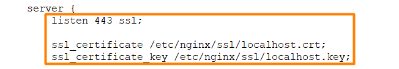
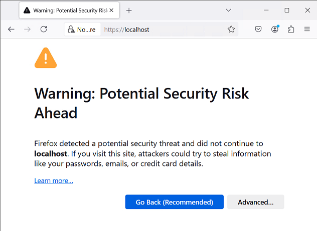
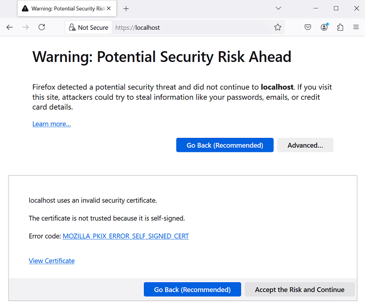
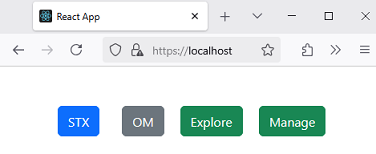
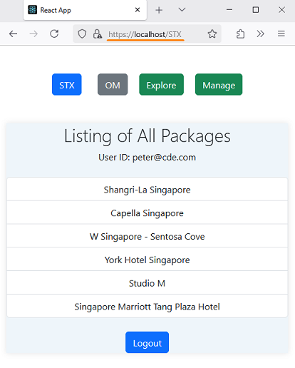
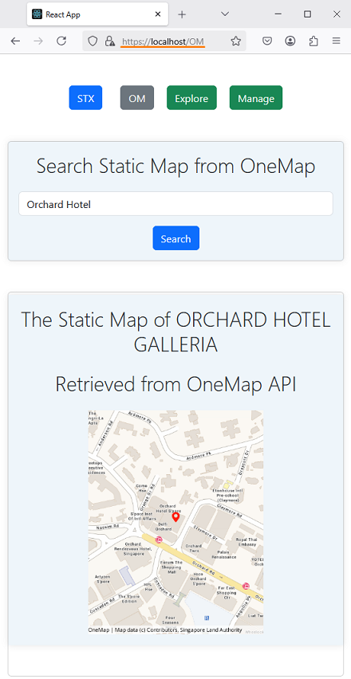
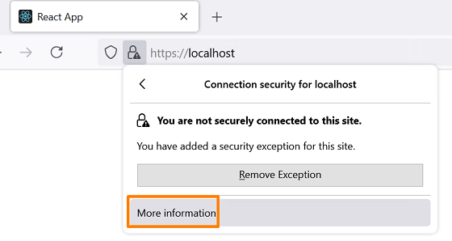
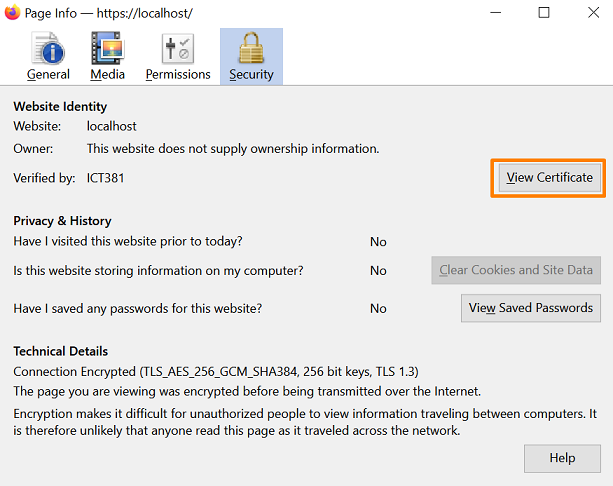
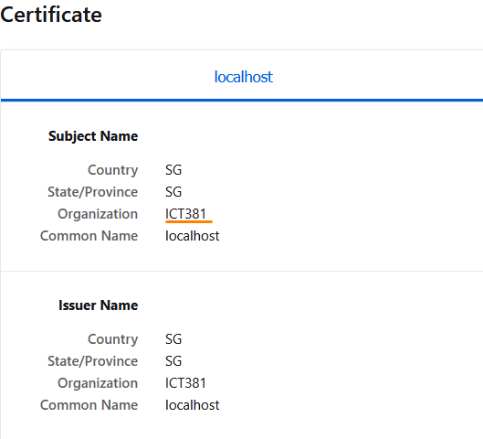

# Lab - Practice with SSL certificates

In this lab, you will learn to generate an self signed SSL certificate and insert it into an Nginx configuration. This will enable you to serve your website securely over HTTPS. We will extend this lab from the last exercise of LAB_3C task 3. Please perform all your work in the development machine.

## Pre-requisites
1. Completed LAB_3C

## Instructions
1. Generate the self signed SSL certificate
2. Review and edit the nginx configuration file
3. View the website over HTTPS
4. Verify the SSL certificate

## Task 1: Generate the self signed SSL certificate

Please follow the steps to generate the self-signed SSL certificate. The certificate will be used to secure the communication between the client and the server.

1. Open **Terminal**.

2. Run the following command to generate the self signed SSL certificate.

   ```bash
   sudo mkdir -p /etc/nginx/ssl && \
   sudo openssl req -x509 -nodes -days 365 -subj "/C=SG/ST=SG/O=ICT381/CN=localhost" \
        -newkey rsa:2048 -keyout /etc/nginx/ssl/localhost.key \
        -out /etc/nginx/ssl/localhost.crt
   ```

## Task 2: Review and edit the nginx configuration file

If you recall the last exercise in Lab3C, you have done the following from step 1-5.

* Create a production build of myReactApp
* Copying the production build files to the Nginx HTML folder
* Modifying the nginx default file to listen to port 80

Now, we will extend from this part. You would need to make changes to the `default` file to accomodate changes for SSL.

1. Run the following command to replace the contents in the `default` file.

   ```bash
   sudo tee /etc/nginx/sites-available/default <<EOF
   server {

   listen 443 ssl;
   ssl_certificate /etc/nginx/ssl/localhost.crt;
   ssl_certificate_key /etc/nginx/ssl/localhost.key;

   location / {
      root /usr/share/nginx/html;
      try_files \$uri /index.html;
      }
   }
   EOF
   ```
   
2. You can read more to find out the specific configurations needed to setup SSL for secure communications.

   `listen 443 ssl;`: This line tells Nginx to listen for incoming connections on port 443, which is the standard port for HTTPS (HTTP over SSL/TLS). The ssl keyword indicates that this server block is configured to handle SSL connections.

   `ssl_certificate /etc/nginx/ssl/localhost.crt;`: This line specifies the location of the SSL certificate file for the server. This certificate is used to establish the secure connection and verify the server's identity to clients.

   `ssl_certificate_key /etc/nginx/ssl/localhost.key;`: This line specifies the location of the SSL certificate's private key. This key is used to decrypt the secure connection and verify the server's identity to clients.

   `location /` block: This block defines how Nginx serve files for request to the root URL. It serves files from `/usr/share/nginx/html` directory, which is where the `myReactApp` build files were copied in the previous lab. The `try_files` directive attempts to serve the requested file. If the file is not found, it falls back to serving `index.html`.

   

3. Test the Nginx configuration files for errors and validity. Make sure there are no errors.

   ```bash
   sudo nginx -t
   ```

4. Restart the Nginx service.

    ```bash
    sudo systemctl restart nginx
    ```

5. Please do not forget to start your StaycationX application with Gunicorn.

   ```bash
   cd /home/ubuntu/StaycationX
   gunicorn --bind :5000 -m 007 --workers 3 -e FLASK_ENV=development "app:create_app()"
   ```

6. Do not forget to start your MongoDB as well.

   ```
   sudo systemctl start mongod
   ```

## Task 3: View myReactApp over HTTPS 

You should now be able to access the Nginx server with the self-signed certificate by opening a web browser and navigating to `https://localhost`. Since it's a self-signed certificate, your browser will show a security warning. You can proceed to the site, but keep in mind that this certificate won't be trusted by default.



Click **Advanced** and then click **Accept the Risk and Continue**.



The browser should display the myReactApp website with the HTTPS protocol.




> **TIP**: For production, you should use a trusted certificate authority (CA) to generate SSL certificates and configure NGINX accordingly. Self-signed certificates are not secure for production environments due to potential security risks.

Click on the **STX** button and once you have logged in successfully, you should get the list of packages as well.



Click on the **OM** button and once you have logged in successfully, you should get a static map after searching for a valid hotel name.




## Task 4: Verify the SSL certificate

1. Click on the avatar icon button on the Firefox browser URL bar.

2. Click **Connection not secure**

3. Click **More information**.

   

3. Click on **View certificate**.

   

3. Notice that the certificate is issued to `localhost` and the organization shows `ICT381` which was the value of what have been specified while generating the certificate.

   

---

**Congratulations!** You have completed the lab exercise.
