# Lab - SonarQube Integration with Jenkins

This lab will guide you through on integrating SonarQube with Jenkins. It covers the setup and configuration process, enabling you to leverage SonarQube's powerful code analysis capabilities within your Jenkins CI/CD pipeline. With SonarQube, you will be able to enhance the quality and maintainability of your codebase by automatically analyzing and tracking code issues, vulnerabilities and technical debt.

## Pre-requisites
1. A working Jenkins instance.
2. StaycationX repository.

---
Before we continue, let's understand more about SonarQube. SonarQube is an open-source platform for continuous inspection of code quality. It performs static code analysis to detect bugs, vulnerabilities, maintainability issues and other issues in your codebase. Sonarqube supports many programming languages and integrates with popular CI/CD pipelines making it a popular tool for maintaining code quality. Some benefits of using SonarQube include:
- **Improves Code Quality**: SonarQube helps developers write cleaner, more maintainable code by identifying issues early in the development process.
- **Detects Vulnerabilities**: It scans the code for security vulnerabilities and provides recommendations for remediation.
- **Supports Multiple Languages**: SonarQube supports a wide range of programming languages, making it suitable for diverse projects.

## Instructions
1. Run Sonarqube Docker container
2. Configure SonarQube
3. Create project token
4. Configure Jenkins
5. Configure StaycationX repo
6. Review Jenkins pipeline file
7. Create and configure webhook in Github
8. Create Jenkins Pipeline
9. Run Jenkins Pipeline and view Sonarqube Analysis

## Task 1: Run SonarQube Docker container

1. Login to your delivery machine (Jenkins) EC2 instance.

2. Create folders for SonarQube to store data and database files.

   ```bash
   mkdir -p ~/sonar
   cd /home/ubuntu/sonar
   mkdir data extensions logs pg_data pg_db
   ```

2. Run the following command to create a SonarQube docker container.

   ```bash
   cd /opt/StaycationX
   sudo docker compose -f docker-compose-sonar.yaml up -d
   ```

3. Navigate to the SonarQube website. Please allow some time for the page to be fully loaded.

   ```
   http://<JENKINS_EC2_IP>:9000
   ```

4. You should see the SonarQube login page.

   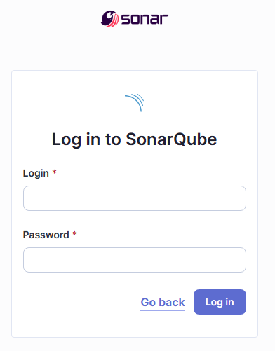

5. Login with the default login username and password: `admin`.

6. You will be prompted to change the password. Enter a new password. Press **Update** to continue.

   |Field|Value|
   |---|---|
   |Old Password| admin|
   |New Password| Your preferred password|
   |Confirm Password| Re-enter your preferred password|

   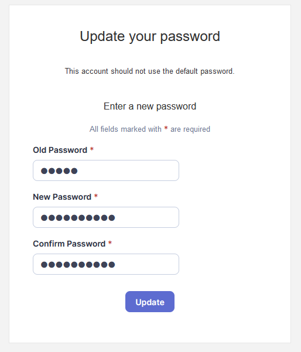

## Task 2: Configure SonarQube

1. On **How do you want to create your project?** page, click **Create a local project**.

2. On **Create a local project** page, enter the following.

   |Field|Value|
   |---|---|
   |Project display name| StaycationX|
   |Project key| StaycationX |
   |Main branch name| main|

   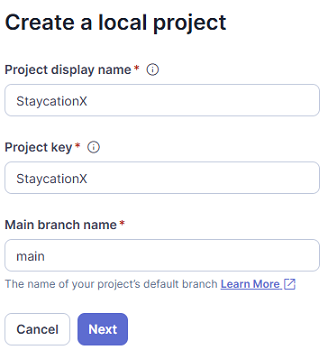

3. Click **Next** to continue.

4. On the **Set up project for Clean as You Code** page, click **Use the global setting** and **Create project**.

5. On **Analysis Method** page, click **With Jenkins**.

6. On **Select your DevOps platform**, click **Github**.

7. It will display the instructions on how to integrate SonarQube with Github. You may read the instructions shown.

## Task 3: Create project token

1. Click on **Account** logo on the top right corner.

2. Click **My Account**.

3. Click on **Security** tab.

4. Under **Generate Tokens** section, enter the following:

   |Field|Value|
   |---|---|
   |Name| staycationX-token|
   |Type| Select **Project Analysis Token** |

   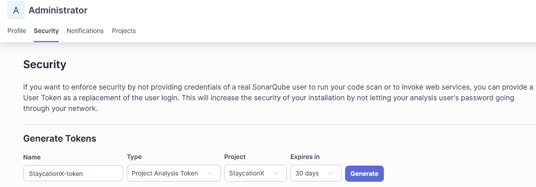

5. Click **Generate**.

6. The token will be displayed. Please be reminded to save the token for future use.

   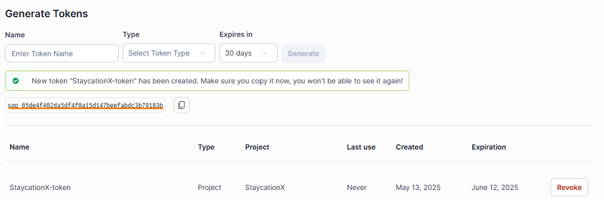


## Task 4: Configure Jenkins

#### Step 1: Install Plugin

1. Login to Jenkins.

2. From Dashboard, click **Manage Jenkins**.

3. Under **System Configuration**, click **Plugins**.

4. Click **Availabe Plugins** from the left menu, enter **Sonarqube Scanner** in the search box.

   

5. Check the checkbox and click **Install**.

6. Scroll down the page and ensure that you see **Success** for the plugin installation.

#### Step 2: Add SonarQube token to Jenkins

1. Click **Manage Jenkins** on the top menu breadcrumb.

2. Click **Credentials**.

3. Click **Global** link.

4. Click **+Add Credentials** button.

5. Under **Kind**, select **Secret text** from the dropdown list.

6. In the secret field, enter the value of the `StaycationX-token` which was previously created.

7. In ID field, enter `sonarqube-token`.

8. Click **Create** button.

    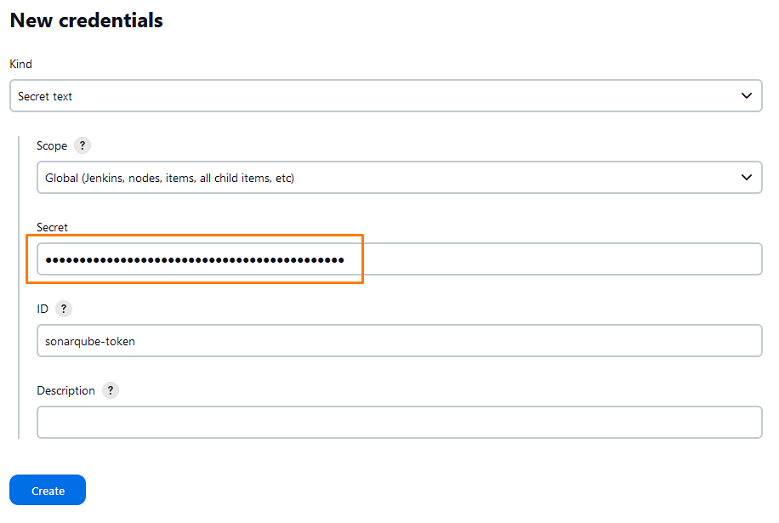

9. You should see `sonarqube-token` added to Jenkins.

    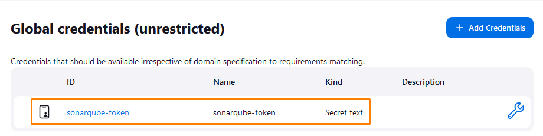


#### Step 3: Add Sonarqube server in Jenkins

1. Click **Manage Jenkins** on the top menu breadcrumb.

2. Under **System Configuration** section, click **System**.

3. Scroll down to **SonarQube servers** section, click **Add Sonarqube**.

4. Enter the following information.

   |Field|Value|
   |---|---|
   |Name| SonarServer|
   |Server URL| Enter the sonar IP address |
   |Server authentication token| Select `sonarqube-token` from the dropdown list|

   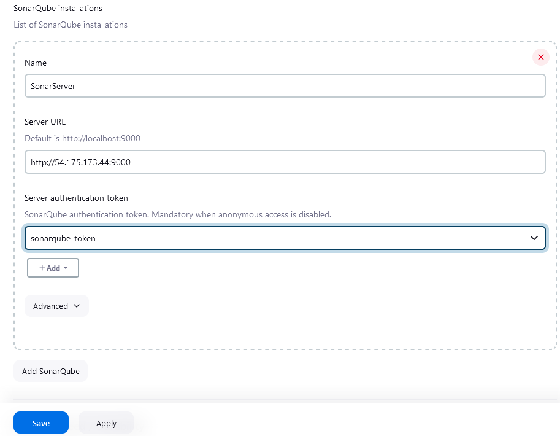

5. Click **Save**.

#### Step 4: Add SonarQube Scanner tool in Jenkins

1. Click **Manage Jenkins**.

2. Under **System Configuration** section, click **Tools**.

3. Under **SonarQube Scanner installations** section, click **Add SonarQube Scanner**

4. For **Name** field, enter **SonarScanner**.

   > **IMPORTANT**: The name should match the tool name in Jenkinsfile.
   
   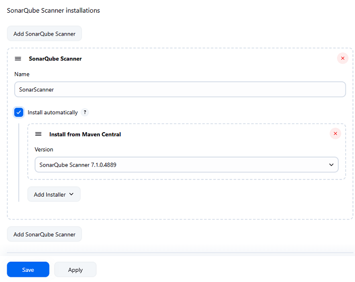

5. Click **Save**.


## Task 5: Configure StaycationX repo

**These steps are for your information only. The file has been populated in the repository.**

1. In the StaycationX repo, add the file: `sonar-project.properties` under the root directory.

2. In the **sonar-project.properties** file, add the following content:

   ```bash
   sonar.projectKey=StaycationX
   sonar.sources=.
   sonar.python.version=3.12
   ```
   These properties are added to the file for configuring how SonarQube analyzes the project.
    
3. Save and push the changes into the `StaycationX` repo.


## Task 6: Review Jenkins pipeline file

1. Notice in the StaycationX repo, there is a `Jenkinsfile` in the root directory with the following content.

   This code snippet is a Jenkins pipeline stage responsible for performing a SonarQube analysis on the project's code.

   ```groovy
   stage('SonarQube Analysis') {
         def scannerHome = tool 'SonarScanner';
         withSonarQubeEnv() {
         sh "${scannerHome}/bin/sonar-scanner"  #executes the SonarScanner command line tool to analyze source codes and send results to Sonarqube server.
         }
   }
   ```

## Task 7: Create and configure webhook in Github

When a new commit is pushed to the `StaycationX` repository, the Jenkins pipeline will be triggered and the SonarQube analysis will be performed.

In order to achieve this, you will need to create a webhook in the Github repository. 

If there is an existing webhook, you can skip this section.

1. Navigate to your Github `StaycationX` repository.

2. Click on the **Settings** tab.

3. Under **Code and automation** section on the left, click **Webhooks**.

4. Click on **Add webhook**.

5. Enter the following details:
   - Payload URL: `http://<EC2_PUBLIC_IP>:8080/github-webhook/`
     > Replace the EC2_PUBLIC_IP with the jenkins machine public IP address
   - Content type: `application/json`
   - Which events would you like to trigger this webhook? Select `Just the push event`.

6. Click **Add webhook** to save the webhook.

7. You should see the webhook added to the repository.


## Task 8: Create Jenkins Pipeline

1. Click on the Jenkins logo on the top left to show the Dashboard.

2. Click **+ New Item** on the left menu shown in the Dashboard.

3. Under item name, give it a name: `sonar-pipeline`.

4. Select **Pipeline** and click **OK**.

5. Under **Build Triggers** section, select **Github hook trigger for GITScm polling**.

5. Under **Pipeline** section, choose **Pipeline script from SCM** from the Definition drop down list.

6. Select **Git** from the SCM dropdown list.

7. Under Repository URL, enter your Git repository in this format: `git@github.com:GIT_USERNAME/StaycationX`.

8. Under Branch Specifier, enter `*/main`.

9. Leave the rest as default and scroll down to the end of page and click **Save**.


## Task 9: Run Jenkins Pipeline and view Sonarqube Analysis

1. Click **Build Now**.

2. Under Build History, click on Build Run # link.

3. Click **Console Output** to view the build process.

4. Ensure the Build is successful.

   Showing part of the console output:

   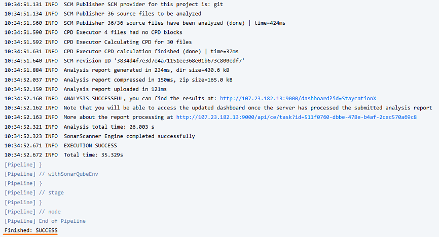


5. To view the results, head back to Sonarqube website. It should show you the analysis results.

If you are not able to get to this screen, click on the top left hand corner of the SonarQube logo, followed by clicking on `StaycationX` link.

**Sample Results:**

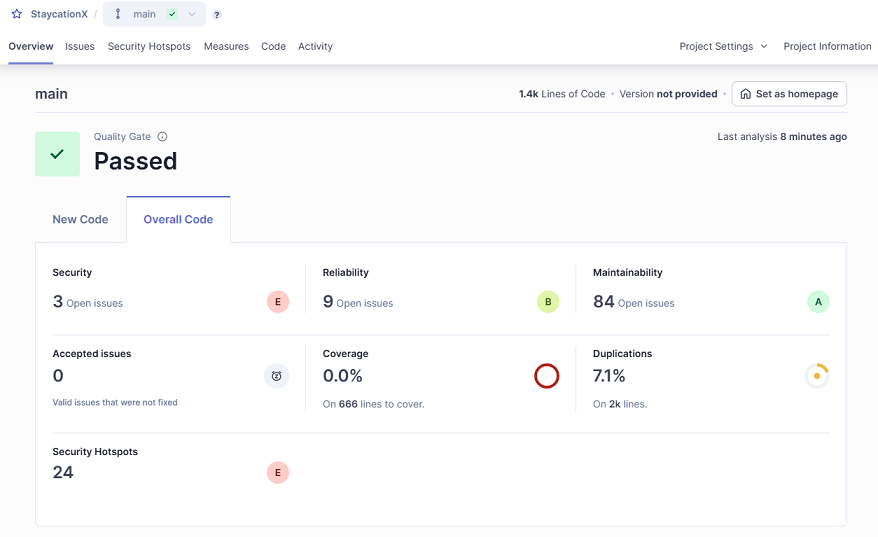


**Security Hotspots:**

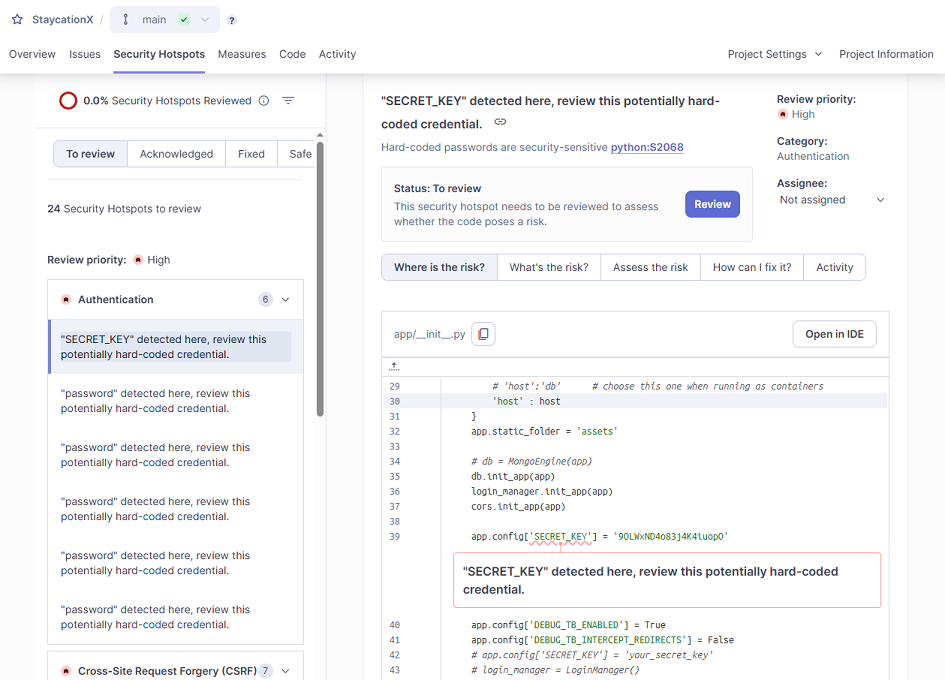


**Issues:**

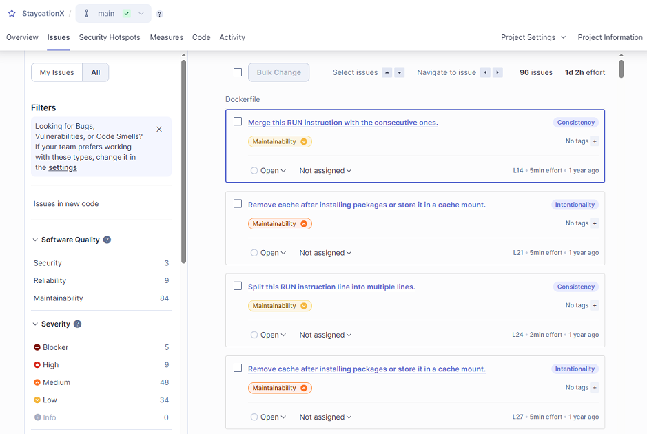

---

**Congratulations!** You have completed the lab exercise.