# Lab: SonarQube Integration with Jenkins

This lab will guide you through on integrating SonarQube with Jenkins. It covers the setup and configuration process, enabling you to leverage SonarQube's powerful code analysis capabilities within your Jenkins CI/CD pipeline. With SonarQube, you will be able to enhance the quality and maintainability of your codebase by automatically analyzing and tracking code issues, vulnerabilities and technical debt.

You will:
- Deploy SonarQube with Docker Compose.
- Create a SonarQube project and analysis token.
- Configure Jenkins to connect to SonarQube.
- Verify that your pipeline publishes analysis results to SonarQube.

## Prerequisites

Before you begin, make sure you have:

1. A working Jenkins EC2 instance.
2. The StaycationX repository.
   -  You will be using the `sonarqube` branch.
3. Network access to:
   - `http://<JENKINS_EC2_IP>:8080` (Jenkins)

## Overview

 SonarQube is an open-source platform for continuous inspection of code quality. It performs static code analysis to detect bugs, vulnerabilities, maintainability issues and other issues in your codebase. Sonarqube supports many programming languages and integrates with popular CI/CD pipelines making it a popular tool for maintaining code quality.

 Benefits of SonarQube includes:
 - **Improves Code Quality**: SonarQube helps developers write cleaner, more maintainable code by identifying issues early in the development process.
-  **Detects Vulnerabilities**: It scans the code for security vulnerabilities and provides recommendations for remediation.
-  **Supports Multiple Languages**: SonarQube supports a wide range of programming languages, making it suitable for diverse projects.

## Lab Tasks

1. Run a SonarQube Docker container.
2. Configure SonarQube.
3. Create a project analysis token.
4. Configure Jenkins.
5. Review repository configuration.
6. Review Jenkins pipeline configuration.
7. Configure a GitHub webhook.
8. Create a Jenkins pipeline job.
9. Run the pipeline and review SonarQube results.

## Task 1: Run SonarQube Docker Container

1. SSH in to your Jenkins EC2 instance.

2. Create directories for SonarQube data.

   ```bash
   mkdir -p ~/sonar
   cd ~/sonar
   mkdir -p data extensions logs pg_data pg_db
   ```

3. Start SonarQube with Docker Compose.

   ```bash
   sudo su
   cd /opt/StaycationX
   git switch sonarqube
   docker compose -f docker-compose-sonar.yaml up -d
   ```

4. Open SonarQube in a browser:

   ```text
   http://<JENKINS_EC2_IP>:9000
   ```

   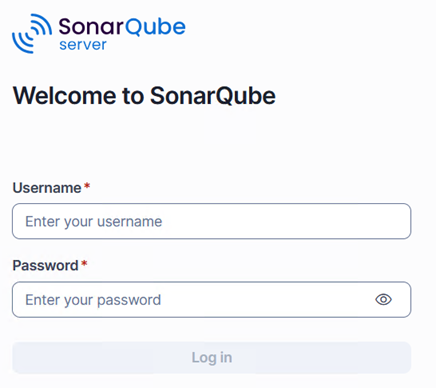

5. Sign in using the default credentials:
   - Username: `admin`
   - Password: `admin`

6. When prompted, update the password.

   | Field | Value |
   |---|---|
   | Old Password | `admin` |
   | New Password | Your preferred password |
   | Confirm Password | Re-enter your preferred password |

   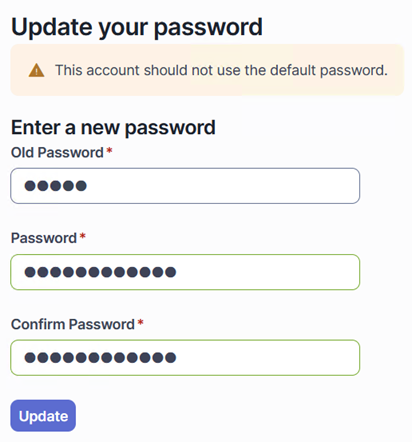

7. Click the **Update** button.

## Task 2: Configure SonarQube

1. On **How do you want to create your project?**, click **Create a local project**.

2. On **Create a local project**, enter:

   | Field | Value |
   |---|---|
   | Project display name | `StaycationX` |
   | Project key | `StaycationX` |
   | Main branch name | `main` |

   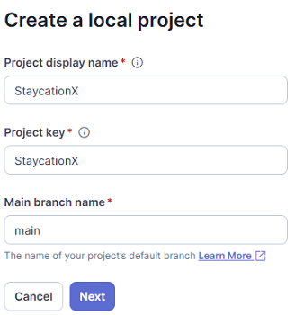

3. Click **Next**.

4. On **Set up new code for project**, select **Follows the instance's default**, then click **Create project**.

5. On **Analysis Method**, select **With Jenkins**.

6. On **Select your DevOps platform**, select **GitHub**.

7. It will display instructions on how to integrate SonarQube with GitHub. You may read the instructions shown.

## Task 3: Create Project Token

1. In SonarQube, click your account icon on the top right corner of the screen.
2. Click **My Account**.
3. Click the **Security** link on the left menu.

4. Under **Generate Tokens**, enter:

   | Field | Value |
   |---|---|
   | Name | `StaycationX-token` |
   | Type | `Project Analysis Token` |

   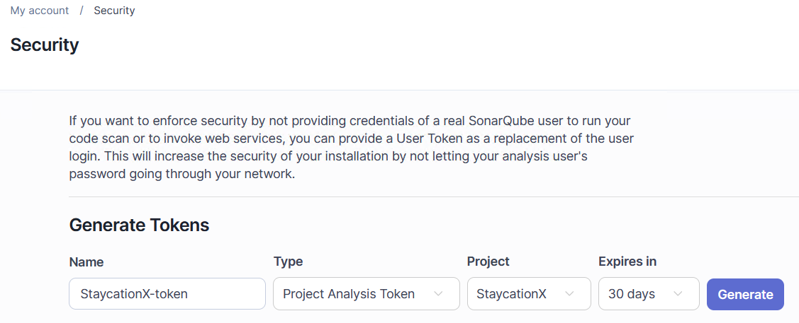

5. Click **Generate**.

6. Copy and store the token securely. You will need it in Jenkins.

   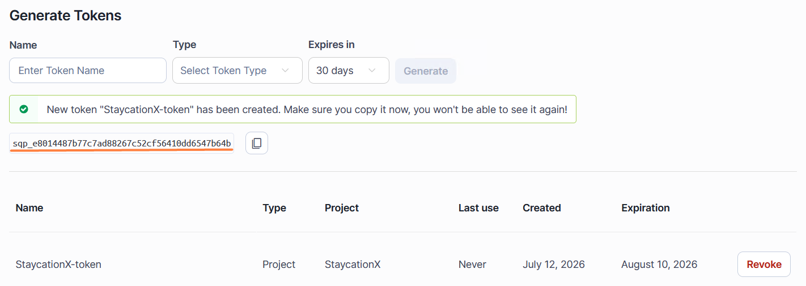

   > **Warning**
   > Treat the token like a password. Do not commit it to source control.

## Task 4: Configure Jenkins

### Step 1: Install SonarQube Plugin

1. Sign in to Jenkins.
2. Go to **Manage Jenkins**.
3. Under **System Configuration**, click **Plugins**.
4. In **Available plugins**, search for `SonarQube Scanner`.
5. Check the checkbox and click **Install**.
5. Install the plugin and wait until installation status is **Success**.

   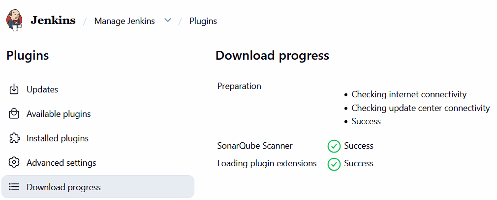

### Step 2: Add SonarQube Token to Jenkins Credentials

1. Go to **Manage Jenkins** > **Credentials**.

2. Click **+ Add Credentials**.
3. Click `Secret text` and click **Next**.

4. Enter the following details in the form.
   - Secret: value of `StaycationX-token`
   - ID: `sonarqube-token`

      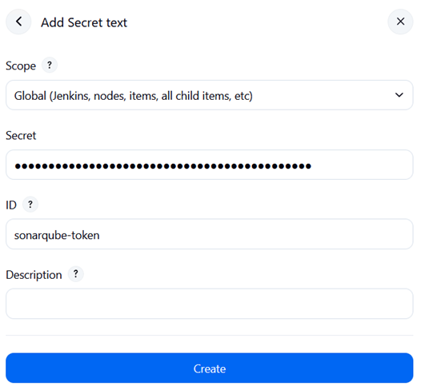

5. Click **Create**.

6. You should see the `sonarqube-token` added to Jenkins.

   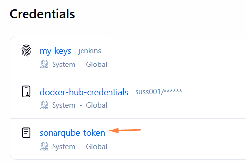

### Step 3: Configure SonarQube Server in Jenkins

1. Go to **Manage Jenkins** > **System**.
2. Scroll to **SonarQube servers**.
3. Click **Add SonarQube**.
4. Set:

   | Field | Value |
   |---|---|
   | Name | `SonarServer` |
   | Server URL | `http://<JENKINS_EC2_IP>:9000` |
   | Server authentication token | `sonarqube-token` |

   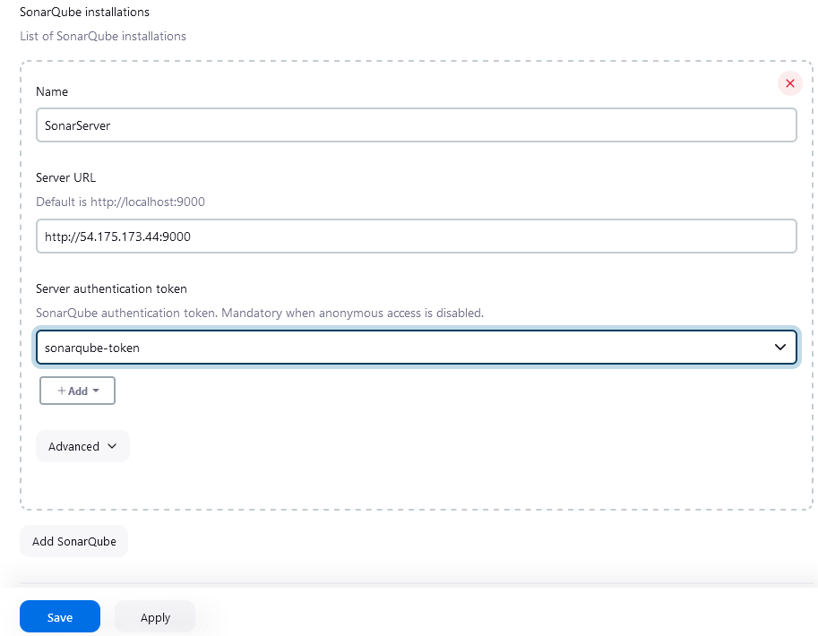

5. Scroll down to the end of the page and click **Save**.

### Step 4: Configure SonarScanner Tool in Jenkins

1. Go to **Manage Jenkins** > **Tools**.
2. Under **SonarQube Scanner installations**, click **Add SonarQube Scanner**.
3. Set **Name** to `SonarScanner`.

   > **Important:**
   > The scanner name must match the tool name used in your `Jenkinsfile`.

   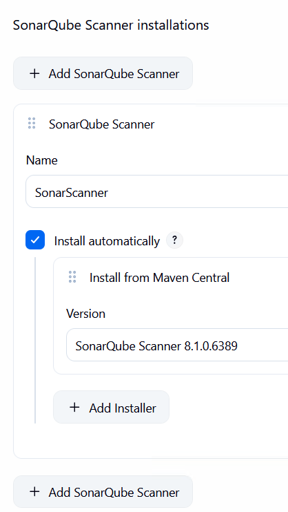

4. Scroll down to the end of the page and click **Save**.


## Task 5: Review StaycationX Repository Configuration

These steps are informational. The file has been populated in the repository.

1. In the repository root, ensure `sonar-project.properties` exists.

2. Confirm it contains:

   ```properties
   sonar.projectKey=StaycationX
   sonar.sources=.
   sonar.python.version=3.12
   ```

3. Commit and push changes if updates were required.

## Task 6: Review Jenkins Pipeline Configuration

Verify your `Jenkinsfile` includes a SonarQube analysis stage similar to:

```groovy
stage('SonarQube Analysis') {
    def scannerHome = tool 'SonarScanner'
    withSonarQubeEnv('SonarServer') {
        sh "${scannerHome}/bin/sonar-scanner"
    }
}
```

This stage uses the `SonarScanner` tool configured in Jenkins and publishes analysis results to the `SonarServer` SonarQube instance.

## Task 7: Create and Configure GitHub Webhook

If a working webhook already exists, you can skip this task.

1. Open your StaycationX GitHub repository.
2. Go to **Settings** > **Webhooks**.
3. Click **Add webhook**.
4. Set:
   - Payload URL: `http://<EC2_PUBLIC_IP>:8080/github-webhook/`
   - Content type: `application/json`
   - Events: `Just the push event`
5. Click **Add webhook**.

> **Note:**
> Replace `<EC2_PUBLIC_IP>` with your Jenkins server public IP.

## Task 8: Create Jenkins Pipeline Job

1. In Jenkins, click **New Item**.
2. Enter name: `sonar-pipeline`.
3. Select **Pipeline**, then click **OK**.
4. Under **Triggers**, select **GitHub hook trigger for GITScm polling**.
5. Under **Pipeline**:
   - Definition: `Pipeline script from SCM`
   - SCM: `Git`
   - Repository URL: `git@github.com:<GIT_USERNAME>/StaycationX`
   - Credentials: Choose **jenkins**.
   - Branch Specifier: `*/sonarqube`
6. Click **Save** button.

## Task 9: Run Pipeline and Review SonarQube Analysis

1. Click **Build Now**.
2. Click on the latest build from **Build History** panel.
3. Click **Console Output**.
4. Confirm the build completes successfully.

   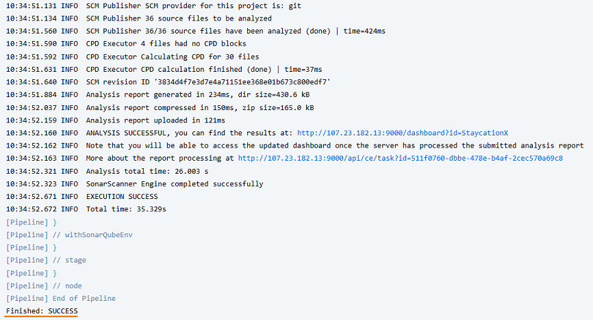

5. Open SonarQube and review analysis results for `StaycationX`.

If needed, click the SonarQube logo, then select the `StaycationX` project.

Sample result:

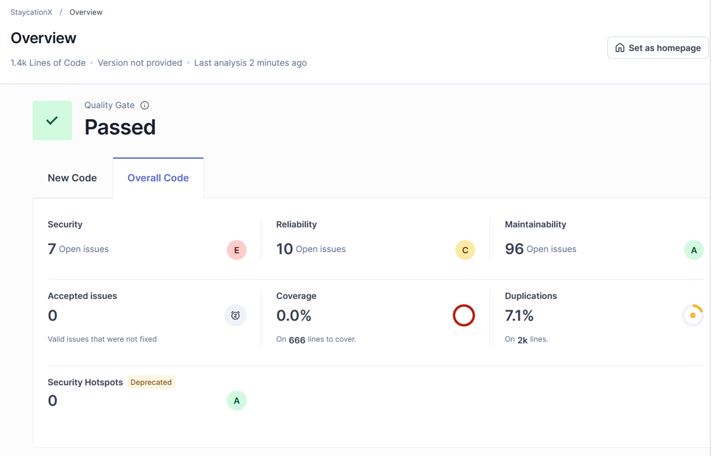


**Issues:**
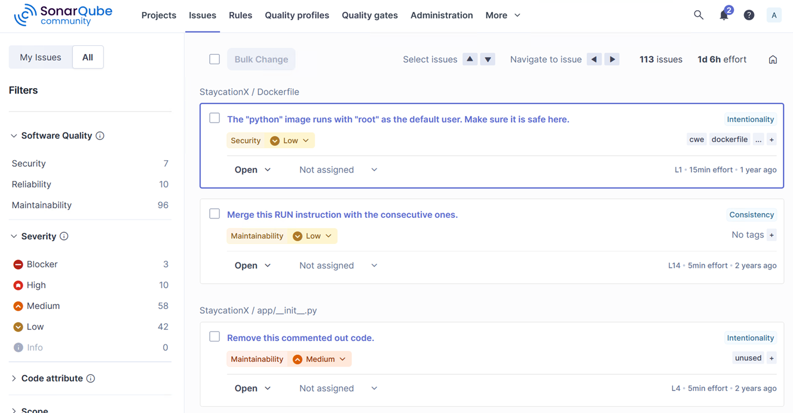

---
## 🎉 Congratulations!
You have completed the lab exercise.
