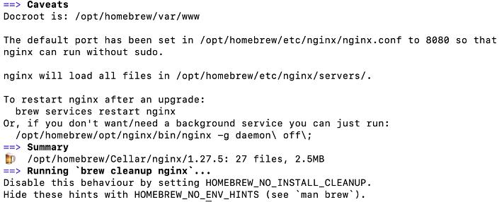

# Lab - Preparing the local lab environment (MAC OS)

This lab will walk you through setting up your MAC machine in preparation for the upcoming exercises.

## Instructions
The tasks for this lab are as follows:

#### Common tasks between ALS/WSL/MAC:
* Installing python pip and virtual environment
* Installing Firefox
* Installing MongoDB Community Edition
* Starting MongoDB and enabling it to start on boot
* Downloading and installing MongoDB Compass
* Downloading and installing VSCode
* Installing extensions in VSCode IDE
* Installing Docker Engine and Compose
* Installing Nginx
* Installing Geckodriver

## Task 1: Installing Homebrew - Package Manager for MACOS

1. Open **Terminal** and copy the command into it.

   ```bash
   /bin/bash -c "$(curl -fsSL https://raw.githubusercontent.com/Homebrew/install/HEAD/install.sh)"
   ```

   After successful installation, you should a similar output as shown in the screenshot.

   

2. Add Homebrew to your PATH.

   ```bash
   echo >> /Users/USERNAME/.zprofile
   echo 'eval "$(/opt/homebrew/bin/brew shellenv)"' >> /Users/USERNAME/.zprofile
   eval "$(/opt/homebrew/bin/brew shellenv)"
   ```

   > REPLACE USERNAME with your own MAC username.

3. Source your profile file.

   ```bash
   source ~/.zprofile
   ```

4. Verify that the Homebrew is sucessfully installed by checking its version number. The version number is `4.5.6` at point of writing.

   ```bash
   brew -v
   ```

## Task 2: Installing Python

1. Open **Terminal**.

2. Install Python.

   ```bash
   brew install python3
   ```

3. Close the existing terminal and open a new terminal.


4. Check that Python is installed.

   ```bash
   python3 -V
   ```

Please note that there is no need for you to install python pip and virtual environment. It comes together when Python is installed.

## Task 3: Installing Firefox

1. Enter the following command to install Firefox

   ```bash
   brew install --cask firefox
   ```

## Task 4: Installing MongoDB Community Edition

1. Open **Terminal**.

2. Download the official Homebrew formula for MongoDB and the Database Tools.

   ```bash
   brew tap mongodb/brew
   ```

3. Update Homebrew and existing formulae.

   ```bash
   brew update
   ```

4. Install MongoDB Community Server

   ```
   brew install mongodb-community@7.0
   ```

## Task 5: Running MongoDB as a macOS service

1. In Terminal, enter the following command to start running mongod as a macOS service.

   ```bash
   brew services start mongodb-community@7.0
   ```

2. To stop mongod running as a macOS service, enter the following command.

   ```bash
   brew services stop mongodb-community@7.0
   ```
3. To check the mongod status, enter the following command.

   ```bash
   brew services info mongodb-community@7.0
   ```

## Task 6: Downloading and installing MongoDB Compass

1. Enter the following command to install MongoDB Compass.

   ```bash
   brew install --cask mongodb-compass
   ```

## Task 7: Downloading and installing VSCode

1. Enter the following command to install VSCode.

   ```bash
   brew install --cask visual-studio-code
   ```

## Task 8: Installing extensions in VSCode IDE

1. Click **Extensions** on the left menu bar.

   -  Search for **Python** and click **Install** if it is not installed.
   -  Search for **Jupyter** and click **Install** if it is not installed.

2. You may consider installing other extensions that may help you in the subsequent labs.
    -   [Live Share by Microsoft](https://marketplace.visualstudio.com/items?itemName=MS-vsliveshare.vsliveshare)
    -   [YAML by Red Hat](https://marketplace.visualstudio.com/items?itemName=redhat.vscode-yaml)
    -   [Ansible by Red Hat](https://marketplace.visualstudio.com/items?itemName=redhat.ansible)
    -   [HashiCorp Terraform by HashiCorp](https://marketplace.visualstudio.com/items?itemName=HashiCorp.terraform)
    -   [Git Graph by mhutchie](https://marketplace.visualstudio.com/items?itemName=mhutchie.git-graph)
    -   [GitHub Pull Requests by Github](https://marketplace.visualstudio.com/items?itemName=GitHub.vscode-pull-request-github)

## Task 9: Installing Docker Engine and Compose in MAC

1. Navigate to [Docker Desktop website](https://docs.docker.com/desktop/install/mac-install/) to download and install Docker Desktop.

   *  Open the DMG file and drag Docker to Applications folder.

2. Run the Docker application.

3. If you encounter this prompt to install Rosetta, please click **Install**.

   

4. After installation is complete, exit and restart Docker Desktop.

5. The version installed may not be the latest. To update to the latest version, click on the version number at the bottom right of the application.

   

6. Click **Check for Updates** followed by **Download update** and lastly **Update and restart**.

7. To verify that docker engine and docker compose have been installed successfully, you can run the following commands.

   ```bash
   docker -v
   docker compose version
   docker info
   ```

## Task 10: Installing Nginx

1. Enter the following command in **Terminal** to install Nginx.

   ```bash
   brew install nginx
   ```

   

2. To start Nginx service, run the following command.

   ```bash
   brew services start nginx
   ```

3. Open web browser and navigate to `http://localhost:8080`. Please ensure that you can view "Welcome to nginx!" home page.

   


## Task 11: Installing Geckodriver

1. Enter the following command in **Terminal** to install Geckodriver.

   ```bash
   brew install geckodriver
   ```

---

**Congratulations!** You have completed the lab exercise.
