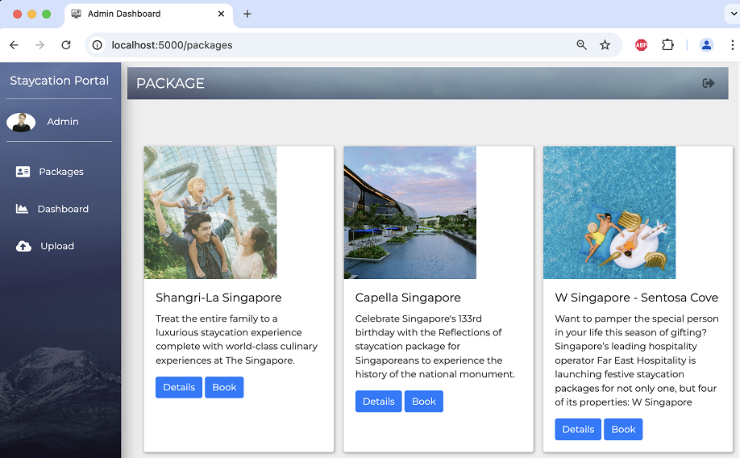
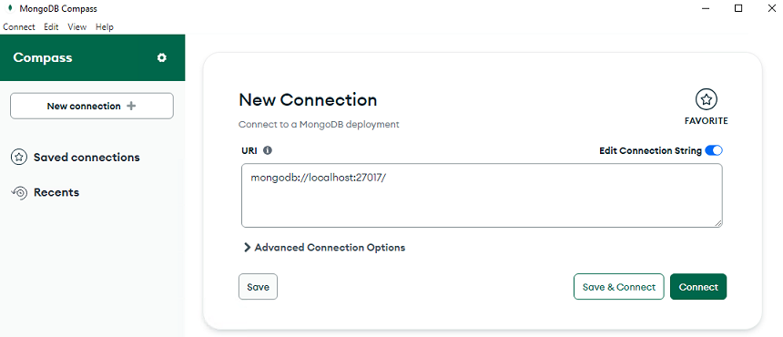
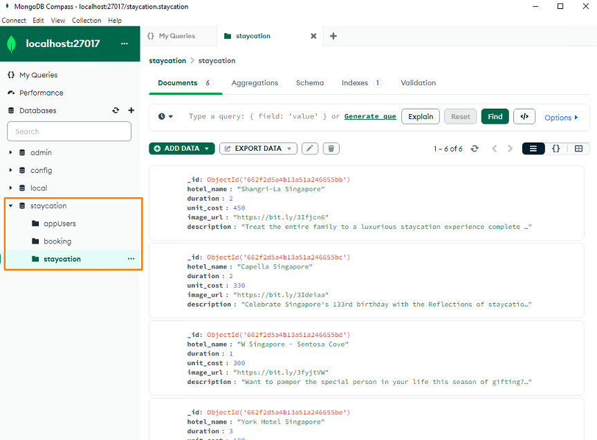

# Lab - How to Run StaycationX?

In this lab, you will create a Python virtual environment, install the required dependencies, start the application, load sample data, and view the database in MongoDB Compass.

## Prerequisites
- Have completed `LAB_0A_MAC` or `LAB_0B_MAC`, depending on your platform.
- Have added your generated SSH public key to your GitHub account.
- Have cloned the course repositories to your MAC environment.
   - The `StaycationX` repository will be used for this lab exercise.


## Lab Tasks
We will be performing these tasks in your local development environment.

1. Creating the virtual environment.
2. Installing the required dependencies in the virtual environment.
3. Starting the StaycationX application.
4. Populating the database with sample data.
5. Viewing the MongoDB database in MongoDB Compass.


## Task 1: Create virtual environment

1. Navigate the StaycationX folder.

   ```bash
   cd ~/StaycationX
   ```

2. Create virtual environment.

   ```
   python3.11 -m venv venv
   ```

3. Activate virtual environment.

   ```
   source venv/bin/activate
   ```

## Task 2: Install libraries dependencies in virtual environment

1. Install the packages listed in `requirements.txt`.

   ```bash
   pip install -r requirements.txt
   ```

## Task 3: Starting the StaycationX application

1. Run `start.sh` file in the folder to start the StaycationX app.

   ```bash
   ./start.sh
   ```

   ---
   **Note**: The StaycationX application requires MongoDB to be running. Before you start the application, verify the MongoDB service status:

   ```bash
   brew services info mongodb-community@7.0
   ```

   If the service is not running, start it with:

   ```bash
   brew services start mongodb-community@7.0
   ```

2. Open a web browser and go to `http://localhost:5000`. You should see the StaycationX website.

## Task 4: Populate data in the database

### Step 1: Register an admin user

1. Click **Register** on the home page.

2. Fill in the register form with the following details and click **Submit**.

   |Field|Value|
   |---|---|
   |Email| admin@abc.com|
   |Password| 12345|
   |Name| Admin|

3. On the login page, enter the email and password you used in the previous step and click **Submit**.

### Step 2: Populate the database with data

Upload the following CSV files: `booking.csv`, `users.csv`, and `staycation.csv`.

These files are located in the StaycationX `app/assets/js` folder.

1. Click **Upload** on the left menu.
2. On the upload page, import the CSV files one at a time:

   - Select **Users** from the dropdown list, choose `users.csv`, and click **Upload**.
   - Select **Package** from the dropdown list, choose `staycation.csv`, and click **Upload**.
   - Select **Booking** from the dropdown list, choose `booking.csv`, and click **Upload**.

3. Click **Packages** on the left menu. The package list should appear.

   Sample screenshot:

   


## Task 5: View the MongoDB database via MongoDB Compass

1. Launch the MongoDB Compass application.

2. Click **+Add new connection**.

3. Connect to the MongoDB database with the following URI: `mongodb://localhost:27017`.

   

4. Click **Connect**.

5. You should now be able to view the StaycationX database and its collections.

   


---

## 🎉 Congratulations!

You have completed the lab exercise. Move on to the next lab exercise!