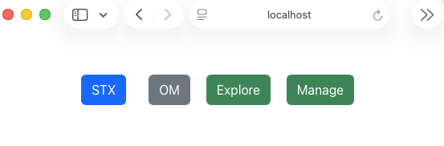
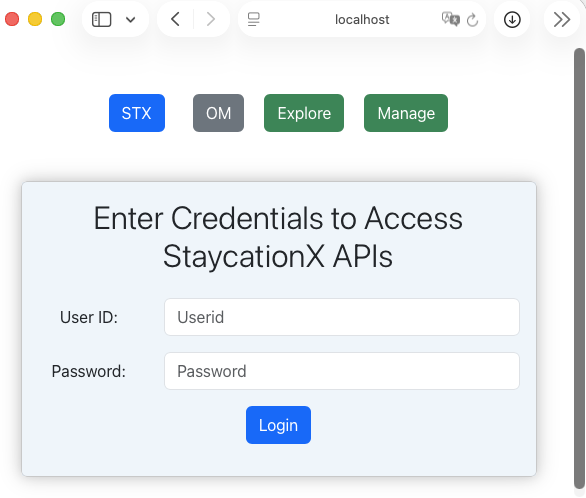
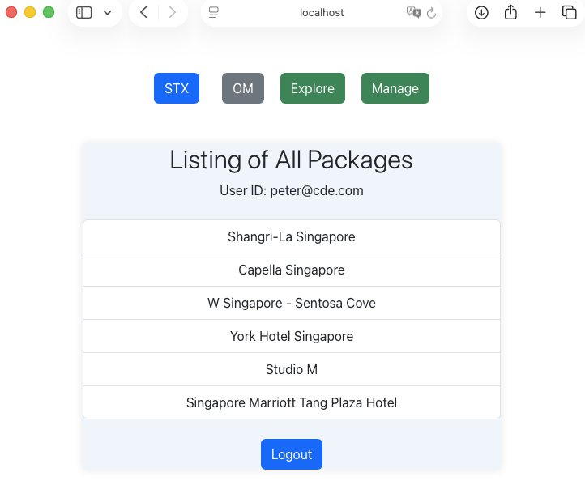
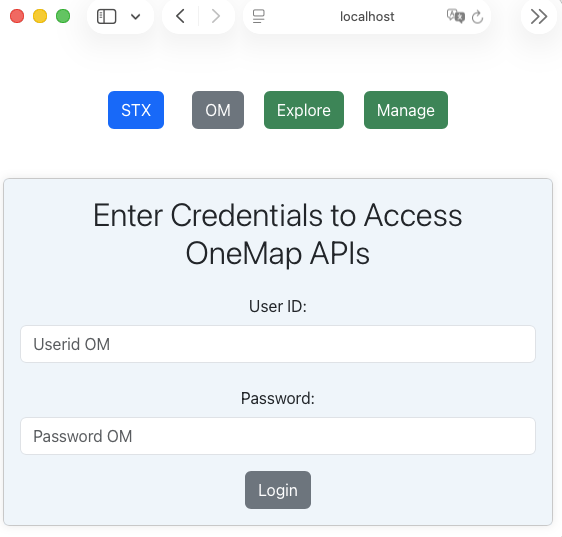
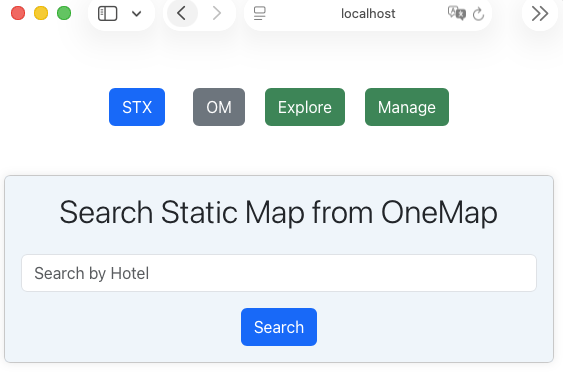
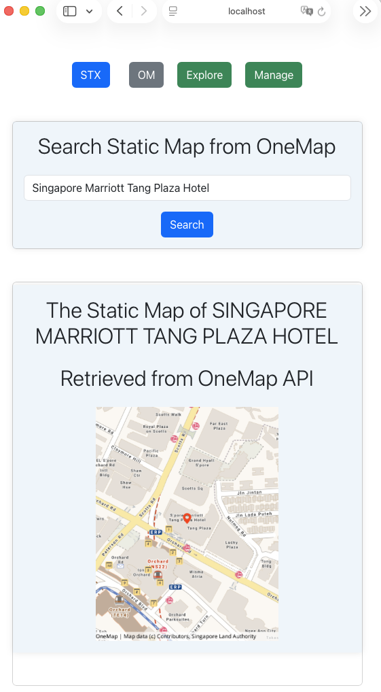

# Lab - Running ReactJS as the API frontend for StaycationX

In this lab, you will run the React frontend for the StaycationX API and use the OneMap API to display static map images of hotels in Singapore.

## Before you Begin

Make sure the following prerequisites are met:

- Completed `LAB_1A_MAC` lab
- Access to the `myReactApp` repository
- StaycationX backend application running and reachable (required for Task 5)

## Lab Tasks

1. Create OneMap API account
2. Install Node.js and project dependencies
3. Start the React application
4. Test StaycationX API integration
5. Test OneMap API integration

## Task 1: Create OneMap API account

1. Visit the [OneMap API Registration](https://www.onemap.gov.sg/apidocs/register) website.
2. Fill in the required details and click **Register**.
3. On the **Confirm your OneMap API account** page:
    - Check your email inbox for the **Confirmation Code**.
    - Create a password that meets the criteria listed on the website.
    - Click **Register**.
4. Confirm that you see the message **Registration Successful!**.

   

## Task 2: Install NodeJS and Project Dependencies

Open a terminal and follow the steps given.

1. Download Node Version Manager (NVM).

   ```bash
   curl -o- https://raw.githubusercontent.com/nvm-sh/nvm/v0.40.5/install.sh | bash
   ```

2. Close the existing terminal and open a new terminal.

3. Download and install Node.js.

    ```bash
    nvm install 16
    ```

4. You can verify the installation by checking the version of Node.js and npm.

    ```bash
    node -v
    npm -v
    ```

5. Navigate to the myReactApp directory.

    ```bash
    cd /Users/USERNAME/myReactApp
    ```

6. Install ReactJS package necessary for creating ReactJS projects.

    ```bash
    npm install create-react-app
    ```

## Task 4: Run the ReactJS app

1. To start myReactApp, run this command.

    ```bash
    npm start
    ```

2. The web browser will automatically open and navigate to `http://localhost:3000`.

   

## Task 5: Test StaycationX API Integration

Before you start, please ensure the following:
- StaycationX app and mongoDB is running.
- Database has been seeded with data.

1. On the home page, click on the **STX** button.

2. Enter your credentials to access the StaycationX API.

   

3. After logging in successfully, you will be able to view the listings of all packages.

   

## Task 6: Interact with the app for OneMap API

1. On the home page, click on the **OM** button.

2. Enter your credentials in Task 1 to access the OneMap API.

   

3. After logging in successfully, you will be able to search static map using OneMap API.

   

4. You can search for any hotel name in Singapore. For instance `Singapore Marriott Tang Plaza Hotel`.

   

---

**Congratulations!** You have completed the lab exercise.