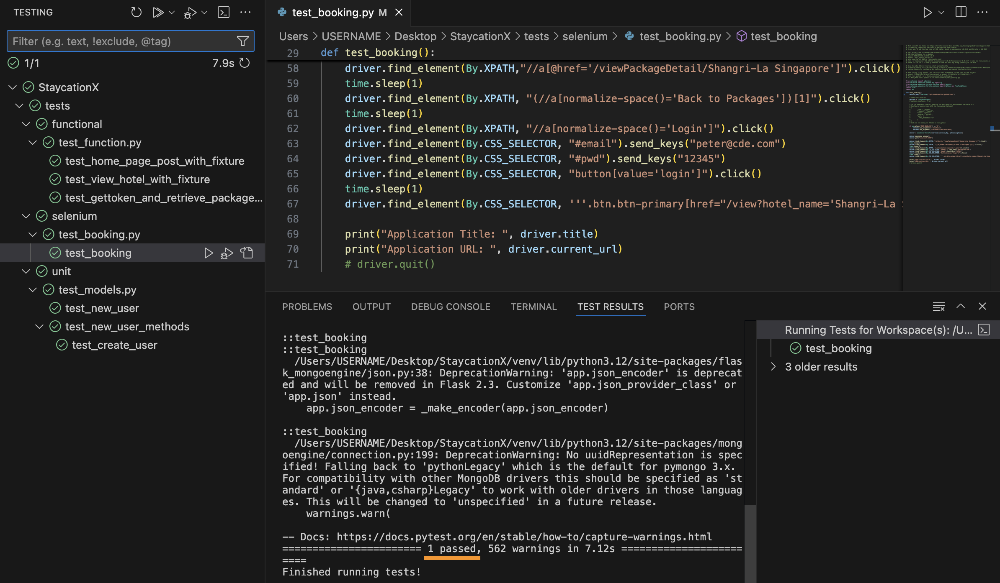

# Lab - Practice Selenium for System Testing

In this lab, we will practice using Selenium. Selenium is a versatile tool for automating web browser interactions, crucial for system testing to ensure web applications meet requirements consistently. Geckodriver serves as a vital bridge between Selenium and Gecko-based browsers like Firefox, enabling seamless automation of Firefox browser actions. It ensures efficient communication between Selenium WebDriver and Firefox instances, streamlining testing processes.

## Pre-requisites
- Completed Lab_0A or Lab_0B depending on your platform.
- `StaycationX` repository.
- Database is populated with data.

We will be working this lab within your local development environment.

## Instructions
1. Running of StaycationX and MongoDB
2. Setup and Run Selenium Test

## Task 1: Running of StaycationX and MongoDB

1. Launch VSCode, open folder and point to the StaycationX application.

2. Ensure that you are on the `main` branch of the StaycationX repo.

3. Start both the StaycationX application and MongoDB before proceeding with the next task.

## Task 2: Setup and Run Selenium Test

Please refer to your study guide for a better understanding and explanation of the test case and their relevant codes for Selenium testing.

1. Expand the `tests` folder.

2. Under the selenium sub-folder, open and study the `test_booking.py` file.

3. When running the Selenium test in the `test_booking.py` file, you need to tell Selenium where to find the geckodriver file. The code snippet shows how this is being handled.

   ```bash
   path=os.getenv('GECKODRIVER_PATH')
   service_obj = Service(path) if os.getenv('FLASK_ENV') == 'development' else Service ("/opt/geckodriver")
   ```

   The code looks for the environment variable called `GECKODRIVER_PATH`. This variable should contain the full path to the Geckodriver file on your system.

   * If `FLASK_ENV` is set to `development`, the service object is created using the path from the `GECKODRIVER_PATH` environment variable.
   * If `FLASK_ENV` is not set or has any other value, the service object defaults to using the hardcoded path `/opt/geckodriver`.
   * This code is designed to dynamically determine the location of the geckodriver based on the environment in which it is running. This effect can be seen when you are running the StaycationX inside containers.

4. In order to resolve this, you need to add the `GECKODRIVER_PATH` environment variable into your `.env` file. The value for the environment variable should be the full path of where the geckodriver file is resided.

   ```bash
   # We will use echo command to add the line into the .env file
   # This is the default path of where it is residing
   # You need to modify it accordingly when necessary
   echo 'GECKODRIVER_PATH=/opt/homebrew/bin/geckodriver' >> /Users/USERNAME/StaycationX/.env
   ```

5. To run the test, click **Testing** icon on the left panel of VSCode. (It looks like a flask icon)

6. Expand the `selenium` sub-folder, hover your mouse and click on the run button under `test_booking.py` to run the test function.

7. You will notice a Firefox browser window opening and performing the browser actions automatically.

8. Once the test is completed, you will see that the test function has passed successfully.

   

9. You may close the Firefox browser window after the test is completed.

---

**Congratulations!** You have completed this lab exercise.