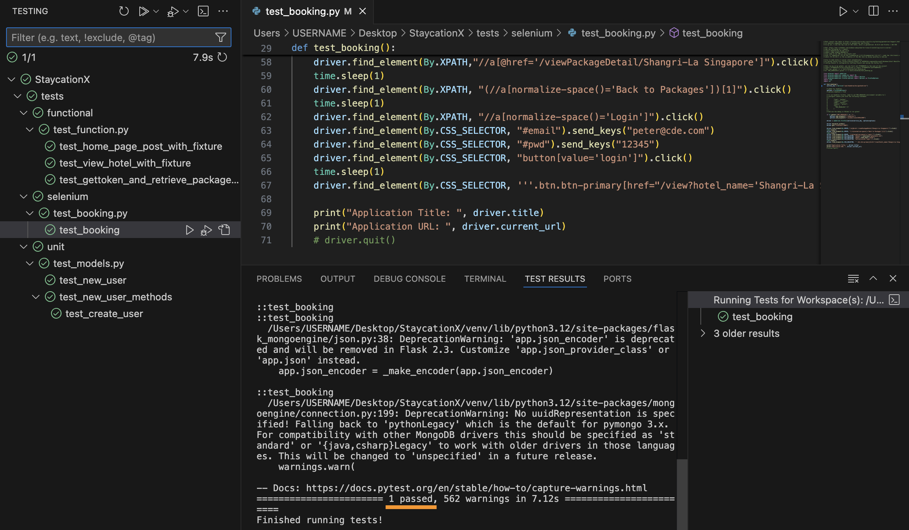

# Lab - Practice Selenium for System Testing

In this lab, we will practice using Selenium. Selenium is a versatile tool for automating web browser interactions, crucial for system testing to ensure web applications meet requirements consistently. Geckodriver serves as a vital bridge between Selenium and Gecko-based browsers like Firefox, enabling seamless automation of Firefox browser actions. It ensures efficient communication between Selenium WebDriver and Firefox instances, streamlining testing processes.

## Pre-requisites
- Completed `Lab_0A_MAC` or `Lab_0B_MAC` depending on your platform.
- Access to the `StaycationX` repository.
   -  The main branch will be used.
- The database is populated with data.

**NOTE:** All steps in this lab are performed inside your **local development environment**.


## Instructions
1. Running of StaycationX and MongoDB
2. Setup and Run Selenium Test

## Task 1: Running of StaycationX and MongoDB

1. Open VS Code and open the StaycationX project folder.

2. Confirm that the active branch is `main`.

3. Start both the StaycationX application and MongoDB.

## Task 2: Setup and Run Selenium Test

Please refer to your study guide for a better understanding and explanation of the test case and their relevant codes for Selenium testing.

### Step 1 — Review and study the test file

1. In the VS Code Explorer, expand the `tests` folder.

2. Open `tests/selenium/test_booking.py` and review its contents.

### Step 2 — Understand the Geckodriver path resolution

When running the Selenium test in the `test_booking.py` file, you need to tell Selenium where to find the geckodriver file. The code snippet shows how this is being handled.

```bash
path=os.getenv('GECKODRIVER_PATH')
service_obj = Service(path) if os.getenv('FLASK_ENV') == 'development' else Service ("/opt/geckodriver")
```

| Condition | Geckodriver path used |
|-----------|----------------------|
| `FLASK_ENV=development` | Value of the `GECKODRIVER_PATH` environment variable |
| Any other value (including unset) | Hardcoded path `/opt/geckodriver` (used in containerised deployments) |

This allows the same code to run in both local development and containerised environments without modification. This effect can be observed when you are running StaycationX inside containers.

### Step 3 — Set the `GECKODRIVER_PATH` environment variable

Add `GECKODRIVER_PATH` to the project's `.env` file, setting its value to the full path of the `geckodriver` binary on your system.

The following command uses the default path. Modify the path if your `geckodriver` binary is located elsewhere.

```bash
: We will use echo command to add the line into the .env file
: This is the default path of where it is residing
: You need to modify it accordingly when necessary
echo 'GECKODRIVER_PATH=/opt/homebrew/bin/geckodriver' >> ~/StaycationX/.env
```

### Step 4 — Run the test

1. In VS Code, click the **Testing** icon in the Activity Bar (the beaker icon).

2. Expand the `selenium` folder in the Test Explorer.

3. Click the **Run** button next to `test_booking.py`.

4. A Firefox window will open and automatically execute the workflow defined in test file.

5. When the test completes, confirm that the test result shows **passed**.

   

6. You may close the Firefox browser window after the test is completed.

---
## 🎉 Congratulations!

You have completed this lab exercise.