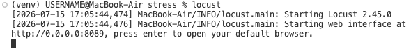
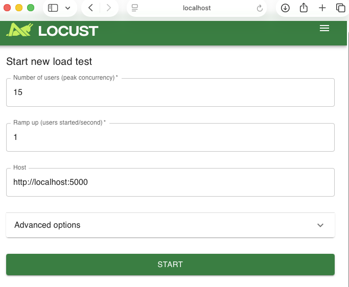
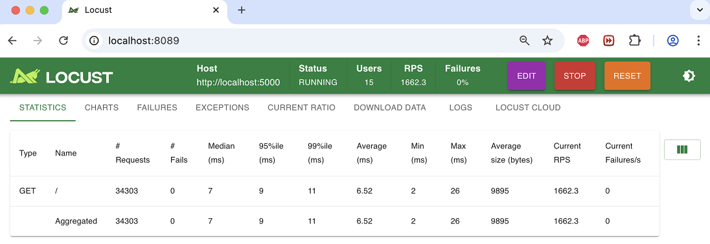
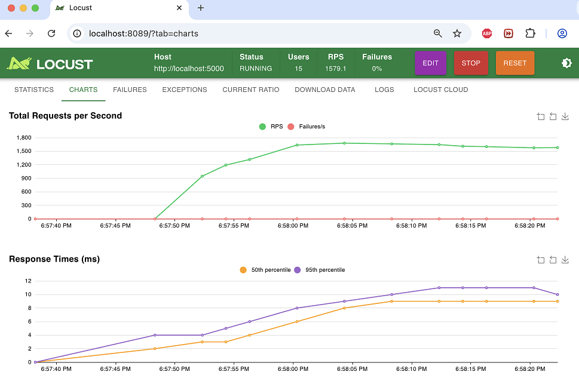
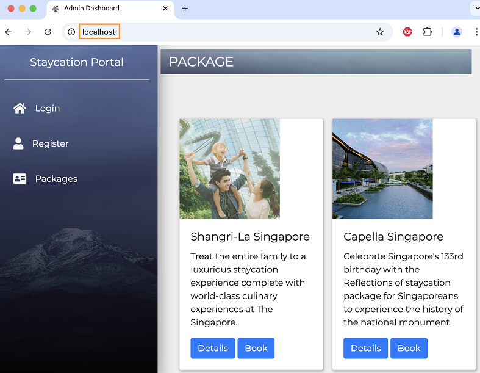
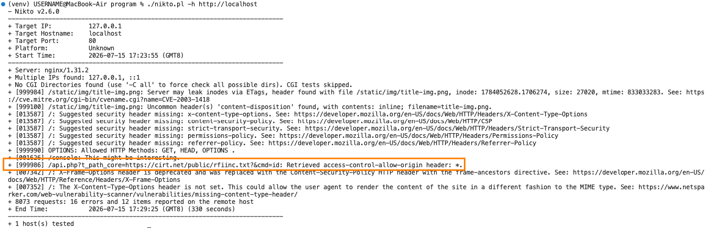
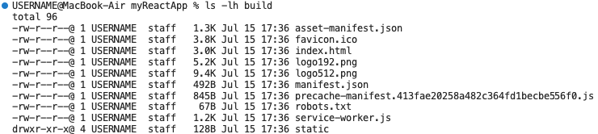
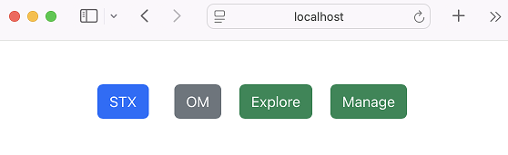
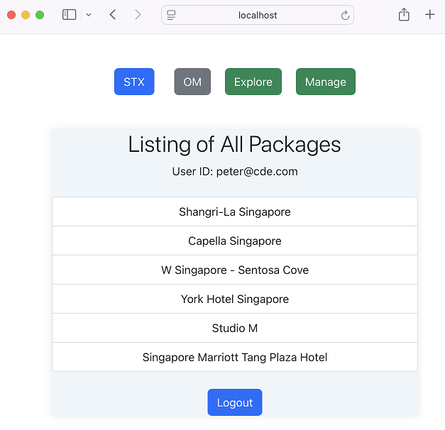

# Lab - Exploring Web and Application Server

This lab has three exercises:

1. Deploying StaycationX with Gunicorn and running load tests with Locust.

2. Deploying Nginx in front of StaycationX with Gunicorn and scanning the site with Nikto.

3. Deploying StaycationX with Gunicorn with Nginx serving as the frontend to deliver myReactApp wuth files from the build directory.


## Prerequisites

Before you begin, confirm the following:

1. The MongoDB database is populated and the `mongodb` service is running.
2. The StaycationX and myReactApp repositories are cloned on your machine.
3. Both Nginx and Node.js are installed.


## Exercise 1: Run StaycationX and test it with Locust

For background on load testing with [Locust](https://locust.io/), refer to the study guide and the [youtube video](https://www.youtube.com/watch?v=uvs4cq6JCeU) that is provided under the course syllabus page.

This exercise is to showcase how to setup StaycationX application with Gunicorn and conduct load testing using Locust.

To get started, please follow the steps below:

1. Open a terminal and go to the StaycationX repository.

2. Activate your virtual environment used by the project.

3. Start StaycationX with Gunicorn.

   ```bash
   gunicorn --bind :5000 -m 007 --workers 3 -e FLASK_ENV=development "app:create_app()"
   ```

   Gunicorn does not read `.env` files automatically. Use `-e` to set any required environment variables for the process.

4. Go to the `stress` sub-folder under the tests directory.

   ```bash
   cd ~/StaycationX/tests/stress
   ```

5. Start the Locust load testing tool.

   ```bash
   locust
   ```

   

6. Open `http://localhost:8089` in a web browser.

7. Set the test parameters in the form.

   -  Number of users: `15`
   -  Host: `http://localhost:5000`

      

8. Select **Start** to begin the test.

9. Review the **Statistics** page. Switch to **Charts** to inspect the results as well.

    Sample Screenshots:

    

    

10. If you prefer a non-interactive run, you can use the terminal mode.

    ```bash
    locust -f locustfile.py --headless -u 10 -r 1 -t 30s -H http://localhost:5000 --html=report.html
    ```

      *  `-f locustfile.py`: Specifies the locustfile to use.
      *  `--headless`: Runs Locust without the web UI.
      *  `-u 10`: Simulates 10 users.
      *  `-r 1`: Spawns 1 user per second.
      *  `-t 30s`: Run the tests for 30 seconds.
      *  `-H http://localhost:5000`: Specifies the specific host to load the test.
      *  `--html=report.html`: Generates an HTML report named `report.html`.
      *  `--csv=report`: Generates three CSV files: report_stats.csv, report_stats_history.csv and report_failures.csv.

This exercise was performed on a development machine. You can repeat it on an EC2 instance to compare local and remote performance.

## Exercise 2:  Put Nginx in front of StaycationX and scan it with Nikto

For background on Nikto, refer to the study guide and the [youtube video](https://www.youtube.com/watch?v=K78YOmbuT48) provided in the course syllabus page.

Nikto is an open-source web scanner used for identifying vulnerabilties and security issues with web applications.

1. Ensure that the gunicorn application server is still running. If not, repeat steps 1 to 3 from Exercise 1.

2. Navigate to the nginx directory which stores the configuration files.

   ```bash
   cd /opt/homebrew/etc/nginx
   ```

3. Backup the default nginx file.

   ```bash
   cp nginx.conf nginx.conf.bak
   ```

4. Create the cache directory.

   ```bash
   mkdir -p /opt/homebrew/var/nginx/cache
   ```

5. Ensure the correct permissions are set.

   ```bash
   sudo chown -R $(whoami):admin /opt/homebrew/var/run
   ```

6. Copy the following contents to replace the `nginx.conf` file. This configuration block is used to setup Nginx to act as a reverse proxy for the StaycationX application served by Gunicorn.

   ```bash
   tee /opt/homebrew/etc/nginx/nginx.conf <<EOF
   events {
      worker_connections 1024;
   }
   
   http {
   proxy_cache_path /opt/homebrew/var/nginx/cache levels=1:2 keys_zone=my_cache:10m max_size=10g inactive=60m use_temp_path=off;

   server {

    listen 80;

    location / {
        proxy_pass http://localhost:5000;
        proxy_set_header X-Forwarded-For \$proxy_add_x_forwarded_for;
        proxy_set_header Host \$host;
        proxy_redirect off;
        proxy_cache my_cache;
         }
      }
   }
   EOF
   ```

7. Validate the Nginx configuration files for errors and validity. Make sure there are no errors.

   ```bash
   nginx -t
   ```

8. Restart the Nginx service.

    ```bash
    brew services restart nginx
    ```

9. Open `http://localhost` in a web browser and confirm that the StaycationX application loads.

    

---

In the next few steps, we will download the Nikto tool and perform a security scan on the StaycationX application.

1. Download Nikto in the home directory.

   ```bash
   cd ~
   git clone https://github.com/sullo/nikto
   ```

2. Go to the Nikto program directory.

   ```bash
   cd nikto/program
   ```

3. You may check out the version of the Nikto program.

   ```bash
   ./nikto.pl -Version
   ```

4. Scan the StaycationX application.

   ```bash
   ./nikto.pl -h http://localhost
   ```

   


   The scan output may report `Access-Control-Allow-Origin: *`. This header allows any website origin to read permitted responses in the browser, but it does not restrict which IP addresses or clients can send requests. If the application exposes sensitive data, configure CORS to allow only trusted origins instead of using `*`.

## Exercise 3: Serve myReactApp from Nginx

This exercise shows how to build myReactApp and serve the compiled files through Nginx while StaycationX remains served behind Gunicorn.

1. Open a terminal and go to the myReactApp repository.

   ```bash
   cd ~/myReactApp
   ```

2. Create a production build of myReactApp.

   ```bash
   npm run build
   ```

3. Check that the build folder was created.

   ```bash
   ls -lh build
   ```

   

4. Copy the build files to the Nginx HTML folder.

   ```bash
   cp -R ~/myReactApp/build/* /opt/homebrew/var/www
   ```

5. Copy the following contents to replace the `nginx.conf` file.

   ```bash
   sudo tee /opt/homebrew/etc/nginx/nginx.conf <<EOF
   events {
      worker_connections 1024;
   }

   http {
      server {

      listen 80;

      location / {
         root html;
         index index.html;
         }
      }
   }
   EOF
   ```

6. Test the Nginx configuration files for errors and validity. Make sure there are no errors.

   ```bash
   sudo nginx -t
   ```

7. Restart the Nginx service.

    ```bash
    brew services restart nginx
    ```

8. Open the web browser and browse to `http://localhost`. You should see **myReactApp** application.

    


9. If you have not run the StaycationX with Gunicorn application server, open a new terminal and run the following command.

    ```bash
    cd ~/StaycationX
    gunicorn --bind :5000 -m 007 --workers 3 -e FLASK_ENV=development "app:create_app()"
    ```

10. Click on the **STX** button.

11. Sign in with your StaycationX credentials.

12. After sign-in, confirm that the staycation package list appears.

    

13. Click **OM** button to access the OneMap API feature.

14. Once login successfully, enter a hotel name in the search field and click on **Search** button. For instance, enter `shangri-la singapore`.

15. Verify that the static map appears.

    

---

## 🎉 Congratulations!

You have completed the lab exercise.