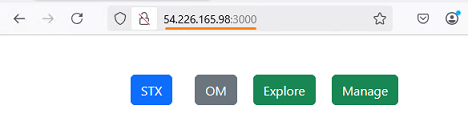

# Lab - Practice deploying StaycationX and myReactApp on Virtual Machine

This lab will guide you through the process of manually deploying both StaycationX and myReactApp application on an EC2 instance in AWS.

## Pre-requisites
- Completed all the tasks in LAB_4A

## Instructions
The main tasks for this lab are as follows:
1. Starting the EC2 instance if it is not running
2. Generate SSH keys and add to Github
3. Cloning StaycationX repository
4. Setting up virtual environment
5. Running the StaycationX application with Flask
6. Running StaycationX application with Gunicorn
7. Running myReactApp application


## Task 1: Starting EC2 instance if it is not running

1.  From the EC2 console dashboard, in the **Resources** box, click on the **Instances** link.

2.  In the **Instances** page, select the instance with the name **staycationX**.

3.  Click **Instance state** and select **Start instance**.

    

4. Please allow some time for the EC2 instance to get started and running.

## Exercise 2: Generate SSH keys and add to Github

You need to generate a SSH key in the EC2 instance and add the public key (`id_rsa.pub`) to your Github account. This will allow you to clone your repositories from Github to the EC2 instance.

Please refer to [Lab_0C Task 4](LAB_0C.md#exercise-4-github-ssh-keys) if you need the detailed steps.

## Task 3: Cloning StaycationX repository

1. Change the current working directory to the `ubuntu` home folder.

    ```bash
    cd /home/ubuntu
    ```

2. Run the following command to clone your own StaycationX repository.

    ```bash
    git clone git@github.com:GIT_USERNAME/StaycationX
    ```

## Task 4: Setting up virtual environment

1.  Run the following commands to setup virtual environment.
    
    ```bash
    cd /home/ubuntu/StaycationX
    python3 -m venv venv
    ```

2.  Install the python libraries in the virtual environment.
    
    ```bash
    source venv/bin/activate
    pip install -r requirements.txt
    ```

## Task 5: Running the StaycationX application with Flask
1. Before running the application, you need to ensure that the MongoDB database is running. Run the following to start the MongoDB service.

    ```bash
    sudo systemctl start mongod
    ```

    > **TIP**: You can use the command **sudo systemctl status mongod** to check whether the service is running.

2. Start the StaycationX application.

    ```bash
    ./start.sh
    ```

3. Ensure that there are no errors in terminal when starting the application.

4. To exit the running application, press `Ctrl+C` in terminal.

## Task 6: Running StaycationX application with Gunicorn

1. Run the StaycationX application using gunicorn.

   ```bash
   gunicorn --bind :5000 -m 007 -e FLASK_ENV=development --workers 3 "app:create_app()"
   ```

2. To access the StaycationX application, open a web browser and enter the public IP address of the EC2 instance followed by port `5000`.

   A sample screenshot is shown below.

   
   

7. To stop the running application, press `Ctrl+C` in terminal.


## Task 7: Running myReactApp application

1. Download and install NodeJS.

    ```bash
    curl -sL https://deb.nodesource.com/setup_16.x -o nodesource_setup.sh
    chmod +x nodesource_setup.sh
    sudo ./nodesource_setup.sh
    rm -rf nodesource_setup.sh
    sudo apt install nodejs -y
    ```

2. Ensure that you are still at myReactApp folder.

    ```bash
    cd /home/ubuntu/myReactApp
    ```

3. Install package dependencies for application.

    ```bash
    npm install
    ```

4. Run the following command to start myReactApp.

    ```bash
    npm start
    ```

5.  Open your web browser and enter the public IP address of the EC2 and followed by port `3000`.

    A sample screenshot is shown below.

    

    > **NOTE**: For myReactApp to function properly, please ensure both `StaycationX` app and `mongoDB` are running.

---

**Congratulations!** You have completed this lab exercise. Move on to the next exercise for deployment using containers.