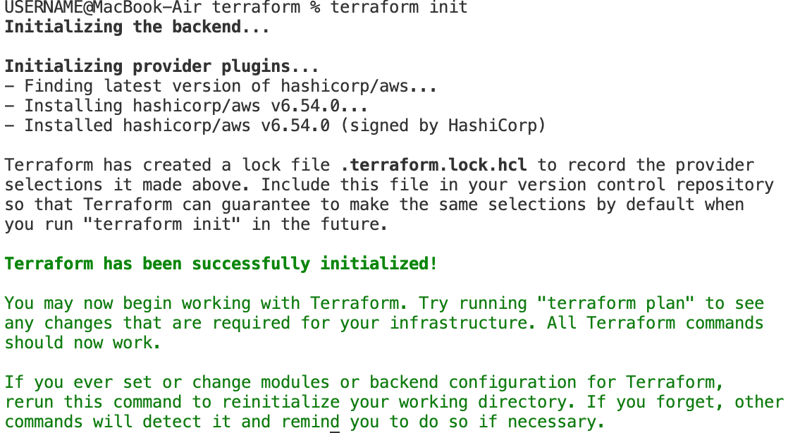
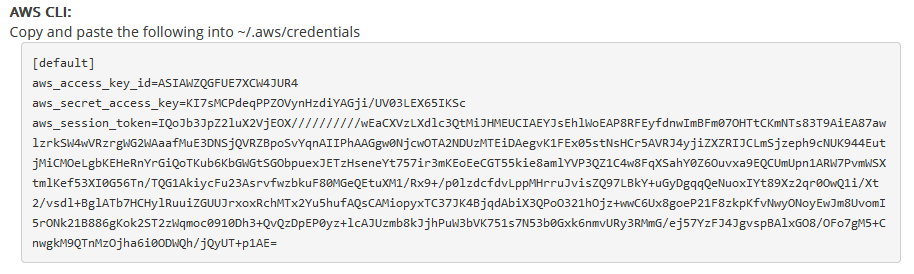
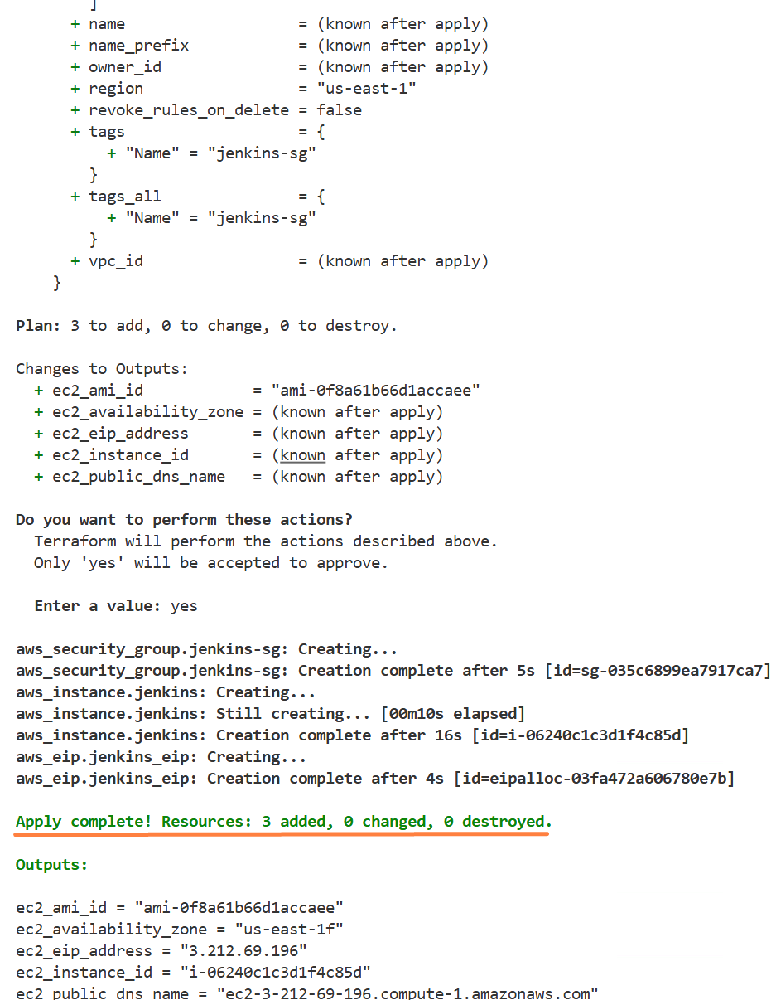

# Lab - Automate Provisioning Virtual Servers Using Terraform

This lab guides you through installing Terraform and using it to provision an EC2 instance in AWS Academy Learner Lab.

## Prerequisites

Before you begin, ensure the following:

- SSH key authentication to GitHub is configured.
- You have access to AWS Academy Learner Lab.
- You have mirrored and cloned the course repositories.
    -   You will be using the `automation` repository in this lab exercise.

---

Terraform is a popular source-available Infrastructure as Code (IaC) tool. It allows you to define and provision infrastructure using a declarative configuration language. It enables you to create, manage, and version your infrastructure in a consistent and repeatable manner. You will need to write configuration files in HashiCorp Configuration Language (HCL) that describes the desired state of your infrastructure (eg, servers, networks, security groups, etc). Terraform takes care of the provisioning and manage these resources for you.

Key benefits include:

- **Automation**: Reduces manual provisioning effort and human error.
- **Version control**: Stores infrastructure definitions in Git for change tracking and collaboration.
- **Reproducibility**: Creates consistent environments from the same configuration.
- **Modularity**: Supports reusable modules for scalable infrastructure design.
- **State management**: Tracks real infrastructure in state, enabling incremental updates.
- **Provider ecosystem**: Supports AWS and many other cloud providers.


## Lab Tasks

In this lab, you will:

1. Install Terraform
2. Initialize Terraform
3. Retrieve AWS credentials from Learner Lab.
4. Apply Terraform configuration to provision a Jenkins machine 
6. Review the Terraform file structure and components

All tasks are performed on your MAC development machine.

## Task 1: Download and install Terraform

1. Open a MAC **Terminal**.

2. Enter the following to download and install Terraform.
   ```bash
   brew tap hashicorp/tap
   brew install hashicorp/tap/terraform
   ```

3. Verify the installation by entering the following:

   ```bash
   terraform -version
   ```

## Task 2: Initialize Terraform

`terraform init` initializes a Terraform working directory. It downloads the necessary provider plugins (in our lab, the AWS provider) and sets up the backend for storing Terraform's state data. This is crucial first step before you can use any other Terraform commands like `plan` or `apply`. Without initiailizing, Terraform won't haave the necessary components to interact with the infrastructure provider.

1. Navigate to the `terraform` directory, run the following to initialize a Terraform working directory.

    ```bash
    cd ~/automation/terraform
    terraform init
    ```

    

## Task 3: Configure AWS Access Credentials

Terraform needs your AWS access key ID, secret access key and session token to authenticate with AWS through the AWS provider. These credentials grant Terraform (via the provider) the necessary permissions to create, modify, and delete resources on your behalf. Without valid AWS credentials, Terraform cannot call the AWS APIs and therefore cannot perform the actions defined in your Terraform configuration files.

For more details on how Terraform evaluates AWS credentials, click [here](https://registry.terraform.io/providers/hashicorp/aws/latest/docs#authentication-and-configuration).


1. Create an `.aws` folder in your home directory.

    ```bash
    mkdir -p ~/.aws
    ```
2. Go to the AWS Academy LMS.
3. Click **AWS Details** at the top right hand corner of the header bar.
4. Under AWS CLI, click **Show** to reveal `Access Key`, `Secret Key`, `Session Token` and copy the contents.

   Sample Screenshot:

   

5. Create the `credentials` file and paste (using right mouse click) the content into the file.

   ```bash
   vi ~/.aws/credentials
   ```

6. Press **Esc**.

7. Type **:wq** and press **Enter** to save and close the file.

## Task 4: Apply Terraform configuration to create Jenkins EC2 machine

1. (Optional but recommended) Preview the execution plan:

    ```bash
    terraform plan
    ```

2.  Apply the Terraform configuration:

    ```bash
    terraform apply
    ```

3. Enter **yes** to confirm the action.

   > **TIP**: You can use `terraform apply --auto-approve` to skip manual confirmation.

4. Review the output for the created EC2 instance.

   


## Task 5: Review the Terraform configuration files

Review the Terraform source code used to provision Jenkins.

Under the `terraform` directory, we have defined the typical file structure as follows:

```md
terraform/
├── main.tf
├── output.tf
└── variables.tf
```

- **main.tf**: This is the main configuration file where you define your infrastructure resources.
- **output.tf**: This file is used to define output variables. It displays information about the resources deployed.
- **variables.tf**: This file is used to define input variables that can be passed to the configuration. It allows you to parameterize your configuration to make it more flexible.

---

The `main.tf` file provisions AWS resources for deploying Jenkins. Typical components include:

- **AWS provider configuration**: Sets region to (`us-east-1`).
- **Data source (AWS AMI)**: Looks up the most recent Ubuntu 24.04 AMI with specific filters.
- **Security group**:
  - Creates `jenkins-sg` with ingress rules.
    - Allows TCP traffic on ports 5000, 22, 80, 27017, 8080, 9000, and 3000 defined in the variable `var.source_ip_block`.
    - Allows all outbound traffic (egress).
- **AWS EC2 instance**:
  - Uses the Ubuntu AMI from the data source.
  - Uses instance type `t3.large`.
  - Uses key pair `vockey` (provided in AWS Academy Lab).
  - Attaches security group `jenkins-sg`.
  - Attaches IAM instance profile `LabInstanceProfile`.
  - Configures with a 32 GB root EBS volume.
  - Applies tags using variables (group and name) defined in `variables.tf`.

- **Elastic IP (EIP)**: Allocates an elastic IP named `jenkins_eip` and associates it with the Jenkins EC2 instance.

---

The `variables.tf` file defines inputs for the Terraform configuration. The variables include:

- **Source IP Block**: Used by security group ingress rules. To allow all IPv4 addresses, use `0.0.0.0/0`. This is acceptable for temporary learning environments, but **not recommended for production**.
- **Group and Name variables**: Used to tag AWS resources for identification.

---

The `output.tf` file defines output values based on the Terraform resources defined in the configuration. For instance, it can expose instance details such as public IP address and DNS name for access after provisioning.

---

### Want to know more about Terraform?

Suggested Readings:
1. [Terraform Tutorial](https://spacelift.io/blog/terraform-tutorial)
2. [Terraform, Up and Running, 3rd Edition (Oreilly)](https://learning.oreilly.com/library/view/terraform-up-and/9781098116736/)

---

## 🎉 Congratulations!

You have completed the lab exercise. Move on to the next exercise for configuring the EC2 instance using Ansible.