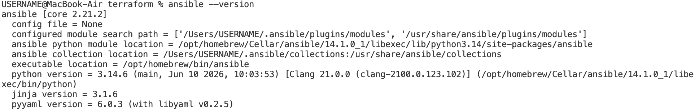
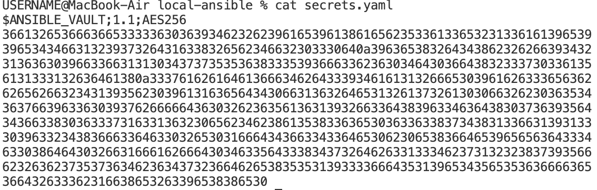
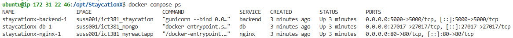
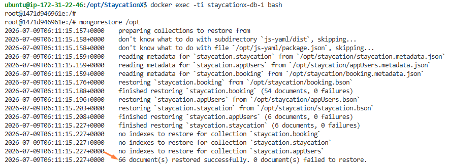
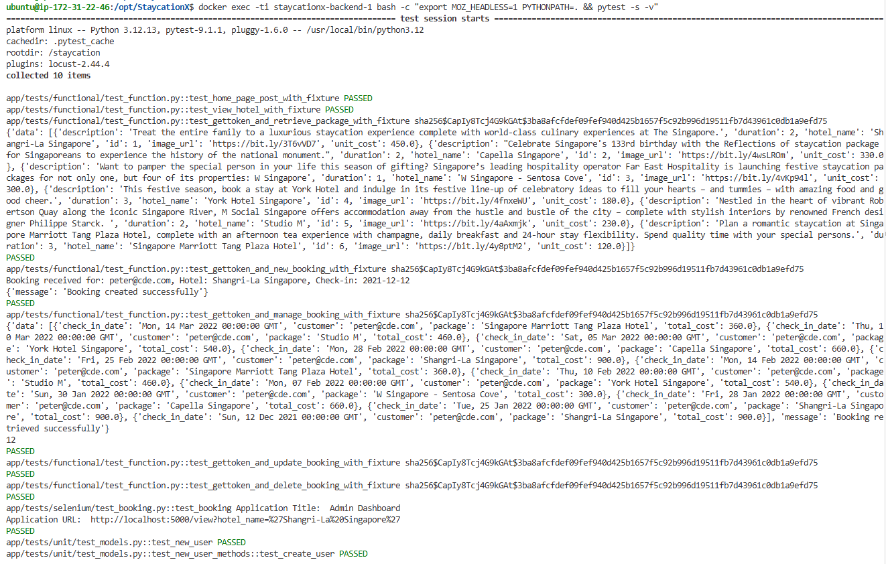
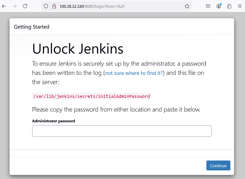
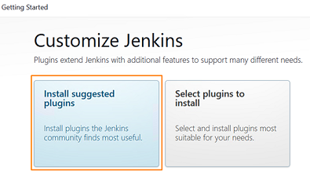
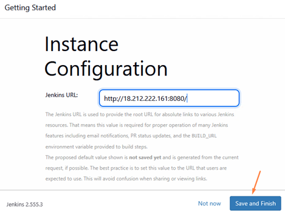
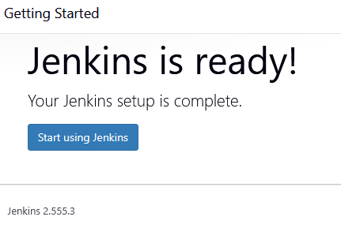
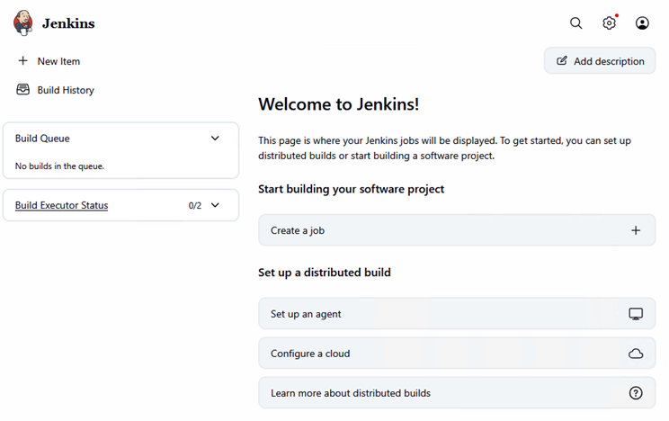

# Lab - Automate configuring delivery server using Ansible and release testing

This lab will guide you through downloading and installing Ansible in your development environment. You will then use Ansible to configure the delivery server (EC2 instance) that was created with Terraform in the previous lab. Next, you will perform release testing on the deployed StaycationX application. Finally, you will install Jenkins using an Ansible playbook and access Jenkins through a web browser to install the suggested plugins and create your first user.

## Pre-requisites
1. Completed all the tasks in LAB_5A
2. Access to the AWS Academy lab environment

## Introduction to Ansible

Ansible is an open-source automation tool for configuration management, application deployment, and task automation. You define the desired state of your systems using simple, human-readable YAML files called playbooks.

Key benefits include:
* **Agentless** — Ansible does not require any special software on target machines. It uses SSH for connections and task execution.
* **Idempotent** — Running the same playbook multiple times produces the same result, with no unintended changes after the initial run.
* **Declarative** — You describe the desired system state, not the steps to achieve it.
* **Simple and easy to learn** — Ansible uses YAML syntax, which is readable and straightforward to write.
* **Extensible** — Ansible provides modules for managing diverse systems and services.

## Lab Tasks

1. Install Ansible
2. Set up the Ansible environment
3. Review the playbooks
4. Generate a GitHub Personal Access Token (PAT)
5. Store credentials securely using Ansible Vault
6. Run the Ansible playbooks
7. Conduct release testing on the StaycationX application
8. Install Jenkins using an Ansible playbook
9. Access Jenkins in a web browser

## Task 1: Install Ansible

1. Open a **Terminal** in your development environment.

2. Run the following command to install Ansible.
   ```bash
   brew install ansible -y
   ```

3. Verify the installation by entering the following:
   ```bash
   ansible --version
   ```

   

## Task 2: Setup Ansible environment

The `local-ansible` directory contains several configuration files and playbooks. Three key files are essential for Ansible to function. The remaining files in the directory are primarily playbooks.

- `ansible.cfg` — Ansible configuration file
- `inventory` — List of target hosts
- `labsuser.pem` — Private SSH key for authentication

```md
local-ansible/
├── ansible.cfg
├── application1.yaml
├── application2.yaml
├── common.yaml
├── gen-gpgkey-ubuntu.yaml
├── inventory
└── labsuser.pem
```

The `ansible.cfg` file defines environment-specific settings across two main sections:

**`[defaults]` section:**
* `inventory` — Specifies the inventory file path, eliminating the need for the `-i` flag when running Ansible commands
* `ask_pass` — Disabled for SSH key-based authentication (no password prompts).
* `private_key_file` — Path to the private SSH key for authentication.
* `interpreter_python` - Configures Ansible to automatically detect and use an appropriate python interpreter on managed host and suppresses warning messages.

**`[ssh_connection]` section:**
* `retries` — Number of connection attempts before giving up. This is essential for cloud environments where newly provisioned servers may require time to become reachable.

**`inventory` file:**
* Lists the target hosts (servers) that Ansible will manage.
* Specifies which machines receive task execution.


**`labsuser.pem` file:**
* Private SSH key for secure EC2 instance authentication.
* Provided by your AWS Academy lab.
* Remains consistent for your lab account (you would be required to copy the key contents into this file).

### Ansible Environment Setup Steps

Follow these steps to prepare your Ansible environment to run the playbooks:

1. Change to the `local-ansible` directory:

   ```bash
   cd ~/automation/local-ansible
   ```

2. Copy the private SSH key from AWS Academy Canvas:
   - Navigate to AWS Academy Canvas LMS and click **Show** for the SSH key
   - Copy the private key contents
   - Open the `labsuser.pem` file:

      ```bash
      nano labsuser.pem
      ```
   - Paste (right-click to paste) the private key contents into the file. 
   - Press **Ctrl+O**, then **Enter** to save with the default filename
   - Press **Ctrl+X** to exit the editor

3. Change the PEM file permissions to read-only:

   ```bash
   chmod 400 labsuser.pem
   ```

4. Update the `inventory` file with your EC2 instance IP address:
   - Open the inventory file:
     ```bash
     nano inventory
     ```

   - On line 2, enter your EC2 instance public IP address. You can find this IP in:
     - The output from `LAB_5A_MAC`, or
     - [AWS EC2 Console](https://us-east-1.console.aws.amazon.com/ec2/home?region=us-east-1#Instances)
   - If using a non-default username in MAC (not `ubuntu`), specify the user:
     ```bash
     # Custom username in MAC:
     1.2.3.4 ansible_user=ubuntu

     # Default ubuntu username in MAC:
     1.2.3.4
     ```
   - Press **Ctrl+O**, then **Enter** to save with the default filename
   - Press **Ctrl+X** to exit the editor

5. Add the EC2 IP address to your known hosts file:

   ```bash
   ssh-keyscan -t rsa EC2_PUBLIC_IP >> ~/.ssh/known_hosts
   ```

   Replace `EC2_PUBLIC_IP` with the public IP address of your EC2 instance.

## Task 3: Reviewing the playbooks

Before running the playbooks, review what each playbook does. You will run them in this order:
1. `common.yaml`
2. `application1.yaml`
3. `application2.yaml`
4. `gen-gpgkey-ubuntu.yaml`

### common.yaml Playbook

The `common.yaml` playbook performs the following tasks on both the `jenkins` host and `localhost`:

* Includes the `vars_files` section to load the encrypted `secrets.yaml` file and make sensitive variables available during playbook execution.
* Installs essential packages: `python3-pip`, `python3-venv`, `gnupg`, `software-properties-common`, `unzip`, `pass`, `git`, `acl`, and `rng-tools`.
* Configures Ansible by:
  - Adding the Ansible PPA GPG key and repository.
  - Updating the package cache
  - Installing the latest Ansible version.
* Configures Docker by:
  - Adding the official Docker GPG key and repository.
  - Updating the package cache.
  - Installing the latest Docker version.
* Downloads the Docker credential helper.
* Adds the GitHub SSH public key to `known_hosts` to prevent SSH warnings.
* Generates SSH deploy keys for `StaycationX` and `myReactApp` repositories.
* Retrieves and uploads the public keys to the respective GitHub repositories.
* Creates the `.ansible/roles` folder and clones the `juju4.gpgkey_generate` Ansible role from GitHub for use in subsequent playbooks.

On **localhost**, the playbook also:
* Creates the `.ansible/roles` folder and clones the `juju4.gpgkey_generate` Ansible role from GitHub (required for `application1.yaml`).

In `LAB_4C_MAC`, you generated GPG keys manually. This lab automates GPG key generation for the user using the [`juju4.gpgkey_generate`](https://galaxy.ansible.com/ui/standalone/roles/juju4/gpgkey_generate/documentation/) Ansible role from [Ansible Galaxy](https://galaxy.ansible.com/ui/). Using a well-maintained, existing role avoids duplication and leverages proven solutions.

## Task 4: Generating GitHub PAT Token

1. Generate a GitHub Personal Access Token (PAT) for authentication when uploading deploy keys to the respective repositories on your behalf:
   - Go to [GitHub Personal Access Tokens](https://github.com/settings/personal-access-tokens).
   - Under **Fine-grained tokens**, click **Generate new token**.
   - Configure the token:
     - **Token name** — Enter a descriptive name.
     - **Resource owner** — Select your account.
     - **Expiration date** — Set an expiration date.
     - **Repository access** — Select only your `StaycationX` and `myReactApp` repositories.
   - **Repository permissions:**
     - Click **+ Add permissions**.
     - Select **Administration**.
     - Change Administration access to **Access: Read and write**.

2. Click **Generate token** to create the token.

3. Copy and securely save the generated token immediately — it is shown only once. You must regenerate it if it is lost.

## Task 5: Storing credentials with Ansible Vault

Ansible Vault securely stores sensitive data (passwords, API keys, credentials) using AES-256 encryption, preventing plain-text storage in playbooks.

Benefits of Ansible Vault:
* **Security** — Protects sensitive information with AES-256 encryption
* **Seamless integration** — Works natively with Ansible workflows without external tools
* **Flexible encryption** — Encrypts entire files or specific variables

**Common Ansible Vault Commands:**
* `ansible-vault create <filename>` — Create a new encrypted file
* `ansible-vault edit <filename>` — Edit an encrypted file
* `ansible-vault encrypt <filename>` — Encrypt an existing file
* `ansible-vault decrypt <filename>` — Decrypt an existing file
* `ansible-vault view <filename>` — View encrypted file contents without decrypting
* `ansible-vault rekey <filename>` — Change the encryption password

Now you will create an encrypted file to store your sensitive credentials.

1. Create a new encrypted file named `secrets.yaml`:

   ```bash
   cd ~/automation/local-ansible
   ansible-vault create secrets.yaml
   ```
   When prompted, enter a vault password for encrypting/decrypting the file.

   > **Important:** Remember your vault password. If you forget or lose it, you cannot access the encrypted file contents.

2. Add your credentials to the encrypted file:

   ```yaml
   GITHUB_PAT: <GITHUB_TOKEN>
   DOCKER_USERNAME: <DOCKERHUB_USERNAME>
   DOCKER_PASS: <DOCKERHUB_PASSWWORD>
   GIT_USERNAME: <GIT_USERNAME>
   ```
   
   Replace the placeholder values with your actual credentials.

   > **Note:** The `secrets.yaml` file is included in `.gitignore` and will not be committed to the repository.

3. Save and exit the editor. The file is now encrypted with Ansible Vault.

4. Verify by viewing the file contents:

   ```bash
   cat secrets.yaml
   ```

   The output will show encrypted, non-readable content.

   A sample screenshot:
   
   

5. To view the encrypted file contents (with password prompt):

   ```bash
   ansible-vault view secrets.yaml
   ```

6. Create a vault password file to automate vault operations:

   ```bash
   cd ~/automation/local-ansible
   echo 'VAULT_PASSWORD' > vault-pwd-file
   chmod 600 vault-pwd-file
   ```
   - Replace `VAULT_PASSWORD` with your vault password.
   - The `600` file permission ensures others cannot read this file.
   - This file is included in `.gitignore` and will not be committed to the repository.

## Task 6: Run the Ansible Playbooks

### Run common.yaml

1. Run the `common.yaml` playbook:
   ```bash
   cd ~/automation/local-ansible
   ansible-playbook --vault-password-file=vault-pwd-file common.yaml
   ```

3. Verify successful execution with no errors.

### Run application1.yaml

The `application1.yaml` playbook performs these tasks on the `jenkins` host:

**Part 1:**
* Adds the `var_files` section to include the encrypted `secrets.yaml` file to make sensitive variables available during playbook execution.
* Imports and runs playbook `gen-gpgkey-ubuntu.yaml` to generate GPG keys.
* Clones `StaycationX` and `myReactApp` repositories to `/opt/` using SSH deploy keys.
* Stops and removes any running StaycationX Docker containers.
* Adds the `ubuntu` user to the `docker` group (for non-root Docker access)
* Reboots the system to apply user group changes.

**Part 2:**
* Includes the encrypted `secrets.yaml` file.
* Creates the `.docker` directory in the `ubuntu` user's home directory.
* Configures Docker to use the `pass` password manager by adding `"credsStore":"pass"` to `config.json`.
* Retrieves existing Docker images and excludes key images (node, python, nginx, mongo) from removal.
* Logs into DockerHub using the `DOCKER_USERNAME` and `DOCKER_PASS` variables stored in the `secrets.yaml` file.
* Builds, tags, and pushes Docker images (StaycationX, myReactApp, MongoDB) to DockerHub.
* Prunes unused Docker images, containers, volumes, and networks.
* Deploys the StaycationX application using Docker Compose with `dockerhub.yml` file

---

The `gen-gpgkey-ubuntu.yaml` playbook (imported by application1.yaml) performs these tasks:
* Uses the `juju4.gpgkey_generate` role to generate GPG keys
* Lists GPG keys and extracts the generated key fingerprint
* Sets the GPG key trust level to `ultimate` (complete trust)
* Initializes the password store with the email address

**Before running application1.yaml:**
1. Review the `gen-gpgkey-ubuntu.yaml` file:
   - Default values are defined in the `vars` section; modify them if needed.
   - If you are not using the default `ubuntu` username, you need to update the `gpg_home` variable path.

2. Run the `application1.yaml` playbook:
   ```bash
   ansible-playbook --vault-password-file=vault-pwd-file application1.yaml
   ```

3. Verify successful execution with no errors.
   > **Tip:** Use `-v`, `-vv`, or `-vvv` flags for increased verbosity. Example: `ansible-playbook -vv application1.yaml`

4. Verify the deployed applications by visiting:
   - **myReactApp** — `http://EC2_IP_ADDRESS`
   - **StaycationX** — `http://EC2_IP_ADDRESS:5000`
   - **MongoDB** (via Mongo Compass) — `mongodb://EC2_IP_ADDRESS:27017`

## Task 7: Conduct Release Testing on StaycationX

Perform these testing tasks on the EC2 instance deployed in LAB_5A_MAC. To access the Jenkins machine, you can SSH directly using the public IP address for the EC2 instance.

```bash
# For instance
cd ~/automation/local-ansible
ssh -i labsuser.pem EC2_PUBLIC_IP
```

### Step 1: Seed Data in MongoDB

1. Change to the StaycationX directory:

   ```
   cd /opt/StaycationX
   ```

2. Display the Docker Compose container status:
   
   ```bash
   docker compose ps
   ```

   You should see 3 running containers.

   

3. Seed the database with initial test data by connecting to the MongoDB container:

   ```bash
   docker exec -ti staycationx-db-1 bash
   ```

4. Restore the MongoDB database from a pre-prepared binary backup:

   ```bash
   mongorestore /opt
   ```

5. After seeding completes, you should see a message indicating 66 documents were successfully restored.

   

6. Exit the mongoDB container.

   ```bash
   exit
   ```

7. Alternatively, running the seeding as a single command on the host would work as well:

   ```bash
   docker exec -ti staycationx-db-1 bash -c "mongorestore /opt"
   ```

### Step 2: Test the StaycationX Application

1. Connect to the StaycationX application container:
   
   ```bash
   docker exec -ti staycationx-backend-1 bash
   ```

2. Set required environment variables for testing:

   ```bash
   export MOZ_HEADLESS=1
   export PYTHONPATH=.
   ```

   - `MOZ_HEADLESS=1` — Enables Firefox headless mode (no graphics interface) for automated testing.
   - `PYTHONPATH=.` — Directs Python to search for modules in the current directory.

3. Run pytest from the application root directory:

   ```bash
   pytest -s -v
   ```

   pytest automatically discovers and executes defined test cases.

4. Verify all test cases pass in the output.

   

5. Exit the container.

   ```bash
   exit
   ```

6. Alternatively, running tests as a single command on the host would work as well: 

   ```bash
   docker exec -ti staycationx-backend-1 bash -c "export MOZ_HEADLESS=1 PYTHONPATH=. && pytest -s -v"
   ```

## Task 8: Install Jenkins Using Ansible

The `application2.yaml` playbook performs these tasks on the `jenkins` host:

* Configures Terraform by:
  - Adding the official Hashicorp GPG key and repository.
  - Updating the package cache.
  - Installing the latest Terraform version.
* Installs Java (openjdk-21-jre and openjdk-21-jdk) — required for Jenkins.
* Configures Jenkins by:
  - Adding the Jenkins GPG key and repository.
  - Updating the package cache
  - Installing the latest Jenkins version.
* Adds the `jenkins` user to the `docker` group (non-root Docker access).
* Reboots the system to apply group changes.
* Creates `.ssh` directory in the `jenkins` home directory.
* Ensures that the `known_hosts` file exists and adds the GitHub SSH public key.
* Creates `/etc/ansible/` directory with an `ansible.cfg` file, which disables host key checking and configures SSH retries.
* Clones the `juju4.gpgkey_generate` Ansible role to the jenkins user's `.ansible/roles/` directory.

**To run the playbook:**

1. Ensure you are still at the `local-ansible` directory in your terminal.

2. Run the `application2.yaml` playbook:

   ```bash
   cd ~/automation/local-ansible
   ansible-playbook application2.yaml
   ```

3. Verify successful execution with no errors.

## Task 9: Accessing Jenkins in a Web Browser

1. Open a web browser tab and navigate to `http://EC2_PUBLIC_IP:8080`.

   Replace `<EC2_PUBLIC_IP>` with your EC2 instance's public IP address.

2. Retrieve the initial admin password.

   Note: You need to SSH into the Jenkins EC2 machine to retrieve the administrator password.

   ```bash
   ssh -i labsuser.pem ubuntu@EC2_PUBLIC_IP "sudo cat /var/lib/jenkins/secrets/initialAdminPassword"
   ```

3. Copy and paste the password into the **Administrator password** field and click **Continue**.

   

4. Click **Install suggested plugins** on the Customize Jenkins screen.

   

5. Wait for plugin installation to complete.

6. On the **Create First Admin User** page, enter:

   | Field | Value |
   |-------|-------|
   | Username | Your preferred username |
   | Password | Your preferred password |
   | Confirm password | Re-enter same password |
   | Full name | Your full name |
   | Email address | Your SUSS email address |

7. Click **Save and Continue**.

8. On the **Instance Configuration** page, click **Save and Finish**.

   

9. On the **Jenkins is ready!** page, click **Start using Jenkins**.

   

10. You will be redirected to the Jenkins dashboard.

    


## Additional Resources

Suggested Readings:

1. [Ansible Tutorial for Beginners - A Step by Step Guide](https://www.ssdnodes.com/blog/step-by-step-ansible-guide/)
2. [Ansible Tutorial for Beginners: Ultimate Playbook and Examples](https://spacelift.io/blog/ansible-tutorial)
3. [Ansible: Up and Running, 3rd Edition, Oreilly](https://learning.oreilly.com/library/view/ansible-up-and/9781098109141/)
4. [Brief Introduction to Ansible Vault](https://www.redhat.com/en/blog/introduction-ansible-vault)

---
## 🎉 Congratulations!

You have completed the lab exercise. Move on to the next exercise to learn more about creating pipelines with Jenkins.