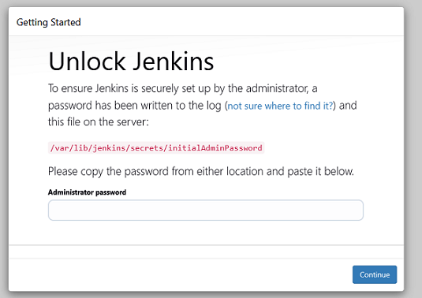
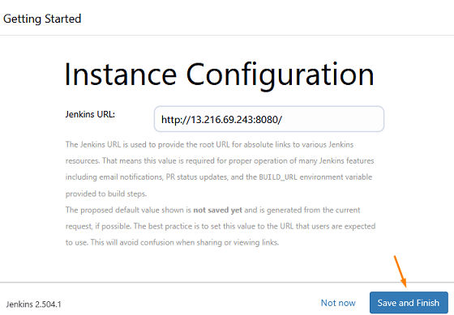
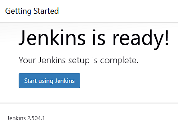

# Lab - Automate configuring delivery server using Ansible and release testing

This lab will guide you through downloading and installing Ansible in your development environment. You will then use Ansible to configure the delivery server (EC2 instance) that was created with Terraform in the previous lab. Next, a release testing process will be conducted on the deployed StaycationX application. Then, Jenkins will be installed using an Ansible playbook, and finally, you will access Jenkins through a web browser to install the suggested plugins and create your first user.


## Pre-requisites
1. Completed all the tasks in LAB_5A

---

Before we continue, let's understand more about Ansible. Ansible is an open source automation tool used for configuration management, application deployment and task automation. It allows you to define the desired state of your systems (like installing packages, updating configuration files or starting services) using simple, human-readable YAML files called playbooks. Some of the key benefits of using Ansible includes:

*  **Agentless**: Ansible does not require any special software (agent) to be installed on the target machines. It uses SSH to connect and execute tasks.
*  **Idempotency**: Running the same playbook multiple times will not change the system after the first run, unless something needs to be updated.
* **Declarative**: You describe what you want the system to look like, not how to get there.
* **Simple and Easy to Learn**: Ansible uses YAML for its playbooks, which is easy to read and write.
* **Extensible**: Supports modules for managing a wide variety of systems and services.

## Instructions
1. Install Ansible
2. Setup Ansible environment
3. Reviewing the playbooks
4. Generate GitHub PAT Token
5. Storing credentials with Ansible Vault
6. Running the Ansible Playbooks
7. Release testing of deployed StaycationX
8. Install Jenkins via Ansible Playbook
9. Accessing Jenkins on the browser

## Task 1: Install Ansible

1. Open a **Terminal** in your development environment.

2. Run the following command to install Ansible.
   ```bash
   brew install ansible
   ```

3. Verify the installation by entering the following:
   ```bash
   ansible --version
   ```

   

## Task 2: Setup Ansible environment

Inside the `local-ansible` directory, you will find several files. The three key files we will focus on are `ansible.cfg`, `inventory`, and `labsuser.pem`. These are the minimum required for Ansible to function. The remaining files in the directory are primarily playbooks.

```md
local-ansible/
├── ansible.cfg
├── application1.yaml
├── application2.yaml
├── common.yaml
├── gen-gpgkey-ubuntu.yaml
├── inventory
└── labsuser.pem
```

In Ansible, we use a configuration file named `ansible.cfg` to define environment specific settings. This file includes two main sections: `defaults` and `ssh_connection`. Under the `defaults` section, we have specified the following options:
   *  `inventory`: Specifies the path of the inventory file, so you don't need to use the *-i* argument to provide the inventory when running Ansible commands.
   *  `ask_pass`: Disables the SSH password prompt, as we are using key based authentication.
   *  `private_key_file`: Indicates the path to the private key file used for authentication.

In the `ssh_connection` section, the `retries` option defines how many times Ansible should attempt to connect to a remote host before giving up. This is particularly useful in cloud environments, where newly provisioned servers may take a short time to become reachable. If the initial connection fails due to network issues or the server not being ready, Ansible will retry up to the number of times specified by `retries`.

`inventory` file:
*  List the hosts (servers) that Ansible will manage.
*  Ansible uses this file to know which machine(s) to connect to and run tasks on.

`labsuser.pem`:
*  This is your private SSH key file.
*  It is used to securely connect to your EC2 instance.
*  The key is provided by AWS Academy lab. You would need to copy the private key content into this file.
*  The key content is always the same for your lab account.

---

The steps outlined in this section are necessary to prepare the Ansible environment to run the playbooks.

1. Change the current working directory to the `local-ansible` directory where the playbooks and related files are stored.

   ```bash
   cd /Users/USERNAME/automation/local-ansible
   ```

2. Navigate to the AWS Academy Canvas LMS and click **Show** SSH key.
      - Highlight and copy the private key contents
      - Open the labsuser.pem file
        ```bash
        nano labsuser.pem
        ```
      - Paste (by using your mouse right click) the private key contents into the file.
      - Press **Ctrl+O** to save the file and press **Enter** to leave the filename as default.
      - Press **Ctrl+X** close the file.

3. Run the following command to change the permissions of the PEM file to be read-only.

   ```bash
   chmod 400 labsuser.pem
   ```

4. Open the **inventory** file and insert the delivery machine EC2 IP address on line 1.

   -  Open the inventory file.
      ```bash
      nano inventory
      ```

   - Enter the public IP address of your EC2 instance (delivery machine) on Line 2. You can find this IP address either in the final output of LAB_5A or by viewing your instance details on the [AWS EC2 console webpage](https://us-east-1.console.aws.amazon.com/ec2/home?region=us-east-1#Instances).

      **NOTE**: 
      -  If you are not using the default username `ubuntu` in your MAC, you need to specify the correct user in the inventory file. enter the following instead: <br>

         EC2_IP_ADDRESS ansible_user=ubuntu

         > Replace EC2_IP_ADDRESS with your own EC2 IP address.

         ```bash
         # Example:
         1.2.3.4 ansible_user=ubuntu
         ```

   - Press **Ctrl+O** to save the file and press **Enter** to leave the filename as default.
   - Press **Ctrl+X** close the file.

5. Add the EC2 IP address to the list of known hosts.

   ```bash
   ssh-keyscan -t rsa EC2_PUBLIC_IP >> /Users/USERNAME/.ssh/known_hosts
   ```

   Replace `EC2_PUBLIC_IP` with the public IP address of your EC2 instance.

## Task 3: Reviewing the playbooks

Before we start to run the ansible playbooks, let's take a moment to review so that you understand what is being done in the playbooks.

We will be running the playbooks in this order:
1. `common.yaml`
2. `application1.yaml`
3. `application2.yaml`
4. `gen-gpgkey-ubuntu.yaml`

---

In the `common.yaml` playbook, here is the summary of the tasks that will be performed on both `jenkins` host and `localhost`.
* Add a `vars_files` section to include the encrypted `secrets.yaml` file, making sensitive variables available during playbook execution.
* Installs essential system packages like `python3-pip`, `gnupg`, `software-properties-common`, `unzip`, `pass`, `git`, `acl` and `rng-tools`.
* Installs python libraries such as `ansible` and `docker`.
* Setups `docker` by adding the official Docker GPG key and repository, updates the package cache and installs the latest version of Docker.
* Downloading of Docker credential helper.
* Adds GitHub SSH public key to the `known_hosts` file to avoid SSH warning.
* Generate SSH deploy keys for the two repositories: `StaycationX` and `myReactApp`.
* Retrieves the public keys for both repositories and upload the public keys to the respective GitHub repositories from remote `jenkins` machine.
* Upload the generated deploy keys to the respective GitHub repositories.
* Creates the `.ansible` roles folder for an Ansible role (`juju4.gpgkey_generate`) and clones the role from GitHub into the directory. This is also to setup the role which can be called in the another playbooks to generate GPG keys.

There will be another task performed on **localhost**. It will be required when you run the `application1.yaml` playbook.
* Creates the `.ansible` roles folder for an Ansible role (`juju4.gpgkey_generate`) and clones the role from GitHub into the directory. 

In LAB_4C, you have manually generated the GPG key. In this lab, however, we will use Ansible to automate the GPG key generation for the `ubuntu` user. Rather than writing our own playbooks for this task, we will leverage an existing, well-maintained Ansible role to avoid reinventing the wheel. A quick search on [Ansible Galaxy](https://galaxy.ansible.com/ui/) for a `gpgkey_generate` role led us to [`juju4.gpgkey_generate`](https://galaxy.ansible.com/ui/standalone/roles/juju4/gpgkey_generate/documentation/), which is specifically designed for generating GPG keys.

## Task 4: Generating GitHub PAT Token

1. Generate GitHub PAT Token. It is used to authenticate with GitHub when uploading the deploy keys to the respective repositories on your behalf.

   -  Go to your [GitHub account](https://github.com/settings/personal-access-tokens) and generate a new Personal Access Token (PAT) under **Fine-grained tokens**.
   
   -  You would need to input information such as the token name, resource owner, expiration date and repository access. For repository access, please only select your own `StaycationX` and `myReactApp` repositories.

   -  For permissions, select the following:
      -  Repository permissions:
         - **Administration**: Read and write
      
2. Click **Generate token** button to create the token.

3. Copy the generated token and save it in a secure location as it is only shown once. You need to regenerate the token if you lose it.

## Task 5: Storing credentials with Ansible Vault

Ansible Vault is a feature within Ansible that allows users to securely store sensitive data, such as passwords, API keys, and other credentials. This ensures that sensitive information is not stored in plain text within playbooks.

Some of the benefits of using Ansible Vault include:
*  **Security**: Protects sensitive information using AES256 encryption, preventing credentials from being stored in plain text across your playbooks.
*  **Seamless Integration**: Works natively with existing Ansible workflows without requiring external tools or complex setup procedures.
*  **Flexible Encryption**: Can encrypt entire files or specific variables.

Here are some of the commands you can use to manage Ansible Vault:
*  `ansible-vault create <filename>`: Create a new encrypted file.
*  `ansible-vault edit <filename>`: Edit an existing encrypted file.
*  `ansible-vault encrypt <filename>`: Encrypt an existing file.
*  `ansible-vault decrypt <filename>`: Decrypt an existing file.
*  `ansible-vault view <filename>`: View the contents of an encrypted file without decrypting it.
*  `ansible-vault rekey <filename>`: Change the password of an encrypted file.

With the benefits of Ansible Vault in mind, you will now store your GitHub PAT token, GitHub username, Docker username and password in a YAML file using Ansible Vault.

1. Enter the following command to create a new encrypted file named `secrets.yaml` using Ansible Vault. Enter your Vault password when prompted. This password will be used to encrypt and decrypt the file.

   ```bash
   cd /Users/USERNAME/automation/local-ansible
   ansible-vault create secrets.yaml
   ```

   > NOTE: **DO NOT** forget the vault password. If you forget the vault password, you will not be able to decrypt or access the vault contents.

2. Enter the following contents in the secrets.yaml file:

   ```yaml
   GITHUB_PAT: XXX
   DOCKER_USERNAME: XXX
   DOCKER_PASS: XXX
   GIT_USERNAME: XXX
   ```

   > **NOTE 1**: Replace XXX with the actual values respectively. <br>
   > **NOTE 2**: The `secrets.yaml` file is included in `.gitignore`, so it will not be committed to the repository.

3. Save the file and exit the editor. The file is now encrypted with Ansible Vault.

4. To demonstrate that the file is encrypted, you can use the following command to view the contents of the `secrets.yaml` file:

   ```bash
   cat secrets.yaml
   ```

   You will see that the contents are encrypted and not human-readable.

   A sample screenshot:
   
   

5. To view the contents of the encrypted file, you can use the following command:

   ```bash
   ansible-vault view secrets.yaml
   ```

   You will be prompted to enter the vault password to view the contents.

6. You need to create a vault password file to store your vault password. You need to protect this file using file permissions to ensure that others cannot read the file.

   ```bash
   cd /Users/USERNAME/automation/local-ansible
   echo 'VAULT_PASSWORD' > vault-pwd-file
   chmod 600 vault-pwd-file
   ```
   > **NOTE 1**: Replace `VAULT_PASSWORD` with your personal vault password. <br>
   > **NOTE 2**: The `vault-pwd-file` is included in `.gitignore`, so it will not be committed to the repository.

## Task 6: Running the Ansible Playbooks

1. Before you run the `common.yaml` file, please take note of the following:

   *  You would need to modify the path and owner for the last two tasks accordingly.

      ```bash
      - name: create ansible roles folder in home directory
        file:
          path: /Users/USERNAME/.ansible/roles/juju4.gpgkey_generate/
          state: directory
          mode: '0755'
          owner: USERNAME
          group: staff

      - name: git clone juju4 role
        git:
          repo: "https://github.com/imhl/ansible-gpgkey_generate.git"
          dest: /Users/USERNAME/.ansible/roles/juju4.gpgkey_generate
          version: main
      ```

      > REPLACE USERNAME with your own MAC username

2. Use the ansible command to run the `common.yaml` playbook file.

   ```bash
   ansible-playbook --vault-password-file=vault-pwd-file common.yaml
   ```

3. Ensure that you do not have any errors from the execution of the playbook.

---

In the `application1.yaml` playbook, here is the summary of the tasks that will be performed on the `jenkins` host.

Part 1 of the playbook:
* Add a `vars_files` section to include the encrypted `secrets.yaml` file, making sensitive variables available during playbook execution.
* Import and run the playbook `gen-gpgkey-ubuntu.yaml` to generate GPG keys.
* Clones the `StaycationX` and `myReactApp` repositories into the /opt/StaycationX and /opt/MyReactApp respectively using the SSH deploy keys.
* Stops any running Docker containers for StaycationX and remove them.
* Add `ubuntu` user to the `docker` group to allow non-root users to run Docker commands without `sudo`.
* Reboot the system to allow the changes to take effect.

Part 2 of the playbook:
* Add a `vars_files` section to include the encrypted `secrets.yaml` file, making sensitive variables available during playbook execution.
* Create the .docker directory in the home directory of the `ubuntu` user.
* Add "credsStore":"pass" to the `config.json` file to configure Docker to use the `pass` password manager for storing credentials.
* Retrieves existing Docker images and and exclude specific images (node, python, nginx, mongo) from being removed. This is to ensure that we do not need to pull the images again.
* Login to DockerHub using the `DOCKER_USERNAME` and `DOCKER_PASS` variables stored in the `secrets.yaml` file.
* Build, tag and push the respective Docker images for `StaycationX`, `myReactApp` and `mongoDB` to DockerHub.
* Prunes unused Docker images, containers, volumes and networks to free up space.
* Deploy the `StaycationX` application using Docker Compose with the `dockerhub.yml` file.

---

In the `gen-gpgkey-ubuntu.yaml` playbook, here is the summary of the tasks that will be performed on the `jenkins` host.
* Uses the `juju4.gpgkey_generate` role to generate GPG keys for the user.
* Runs command to list GPG keys and extracts the fingerprint of the generated key.
* Sets the trust level of the GPG key to `ultimate`. It shows that you trust the key completely and is considered valid.
* Initialize the password store with the email address.

---

1. Open the `gen-gpgkey-ubuntu.yaml` file, you can opt to do the following:

   *  We have defined the default values in the `vars` section to be used in the playbook. If you want to change it, you can do so by modifying the values in the `vars` section.

2. Use the Ansible command to run the `application1.yaml` playbook.

   ```bash
   ansible-playbook --vault-password-file=vault-pwd-file application1.yaml
   ```
3. Ensure that you do not have any errors from the execution of the playbook.

      > **TIP**: To get a more verbose output, you can use the `-v` flag. You can use `-vv` or `-vvv` for more verbosity.
      > For example: `ansible-playbook -vv application1.yaml`.

4. StaycationX and myReactApp are deployed. To verify it, open a web browser and browse to `http://EC2 IP ADDRESS`.

    * To view myReactApp, visit `http://EC2_IP_ADDRESS`.
    * To view StaycationX, visit `http://EC2_IP_ADDRESS:5000`.
    * To access MongoDB via Mongo Compass, the URI is `mongodb://EC2_IP_ADDRESS:27017`.

## Task 7: Release testing of deployed StaycationX

The following tasks in the section below are to be performed on the EC2 instance deployed by Terraform in LAB_5A.

Before you can perform the release testing on the containers, you will need to access the delivery machine where the containers are deployed.

To do that, you need to get the delivery machine IP address and use PuTTY to connect to the delivery machine.

### Step 1: Connecting to mongoDB container to seed data

1. Change the current path to the StaycationX directory in `/opt`.

   ```
   cd /opt/StaycationX
   ```

2. Run the following command to display the status of containers defined in the docker compose file.
   
   ```bash
   sudo docker compose ps
   ```

   You should be able to see `3` containers.

   

3. Before testing can be done, seeding of data in database is required. Seeding refers to the process of populating a database with initial data that is necessary for testing or development purposes.

   To seed the data, we need to first connect to the mongo database container.

   To connect to the database container, run the following command:

   ```bash
   sudo docker exec -ti staycationx-db-1 bash
   ```

4. Once connection is successful, run the following command to restore the mongoDB database from a binary backup that has been pre-prepared.

   ```bash
   mongorestore --nsInclude 'staycation.*' /opt
   ```

5. Once seeding is completed, you should see the message showing `66` documents successfully restored.

   

6. Enter **exit** to exit the mongoDB container.

7. Alternatively, a single line command on the host machine would work as well: 
   ```bash
   sudo docker exec -ti staycationx-db-1 bash -c "mongorestore --nsInclude 'staycation.*' /opt"
   ```


### Step 2: Connect to the StaycationX application container to perform testing.

1. Run the following to connect to the staycation container.
   
   ```bash
   sudo docker exec -ti staycationx-frontend-1 bash
   ```

2. Set the following environment variables.
   -  MOZ_HEADLESS
   -  PYTHONPATH

   MOZ_HEADLESS is used in Firefox browser to enable headless mode. Headless mode allows Firefox to run without graphics interface, making it suitable for automated testing in a headless environment.

   PYTHONPATH is used to specify additional directories where Python should look for modules and packages.

   Run the following to export the environment variables.

   ```bash
   export MOZ_HEADLESS=1
   export PYTHONPATH=.
   ```

3. Run pytest from the root directory of the staycation app. pytest will automatically discover and run the defined test cases.

   ```bash
   pytest -s -v
   ```

4. You should see that the test results indicate that all test cases have passed.

   

5. Enter **exit** to exit the container.

6. Alternatively, a single line command on the host machine would work as well: 
   ```bash
   sudo docker exec -ti staycationx-frontend-1 bash -c "export MOZ_HEADLESS=1 PYTHONPATH=. && pytest -s -v"
   ```

## Task 8: Installing Jenkins via Ansible Playbook

In the `application2.yaml` playbook, here is the summary of the tasks that will be performed on `jenkins` host.
* Install Java (`openjdk-21-jre` and `openjdk-21-jdk`) as Jenkins requires Java to run.
* Downloads the GPG key from Hashicorp to verify the authenticity of packages from the Hashicorp repository.
* Add the official Hashicorp APT repository to the system's package sources.
* Adds the Jenkins keys and repository to the system.
* Installs the latest version of Jenkins.
* Add `jenkins` user to the `docker` group to allow it to run Docker commands without `sudo`.
* Reboot the system for the changes to take effect.
* Ensures both `.ssh` and `.aws` folder is available in the `jenkins` home directory.
* Ensures that the `known_hosts` file exist and adds the GitHub SSH public key.
* Creates the `/etc/ansible` directory and an `ansible.cfg` file with settings to disable host key checking and set the number of SSH retries.
* Clones the `juju4.gpgkey_generate` Ansible role into the jenkins user .ansible roles directory which will be used in the Jenkins pipeline when importing the `gen-gpgkey-ubuntu.yaml` playbook.

---

1. Ensure that you are still at `/home/ubuntu/automation/local-ansible` directory in your terminal.

2. Run ansible playbook command to run `application2.yaml` to install Jenkins.

   ```bash
   cd /home/ubuntu/automation/local-ansible
   ansible-playbook application2.yaml
   ```

3. Ensure there are no errors from the execution of the playbook.

## Task 9: Accessing Jenkins on the browser

In this task, we will be accessing Jenkins on the browser to install the suggested plugins and create our first user.

1. Open a new browser tab and enter the following URL `http://EC2_PUBLIC_IP:8080`.

   Replace `<EC2_PUBLIC_IP>` with the public IP address of your EC2 instance.

2. You will be prompted to enter the initial admin password. Run the following command to retrieve the initial admin password.

   ```bash
   sudo cat /var/lib/jenkins/secrets/initialAdminPassword
   ```

   


3. Copy the password and paste it into the **Administrator password** field. Click **Continue** to proceed.

   

4.  Under Customize Jenkins, click **Install suggested plugins**.

    

5. Wait for the installation to complete.

6. On the **Create First Admin User** page, enter the following:

   |Field|Value|
   |---|---|
   |Username| Your Student Portal User ID|
   |Password| Your preferred password|
   |Confirm Password| Your preferred password|
   |Full Name| Your full name|
   |Email Address| Your SUSS email address|

7. Click **Save and Continue**.

8. On the **Instance Configuration** page, click **Save and Finish**.

   

9. On the **Jenkins is ready!** page, click **Start using Jenkins**.

   

10. You will be redirected to the Jenkins dashboard.

    

---

### Want to know more about Ansible?

Suggested Readings:

1. [Ansible Tutorial for Beginners - A Step by Step Guide](https://www.ssdnodes.com/blog/step-by-step-ansible-guide/)
2. [Ansible Tutorial for Beginners: Ultimate Playbook and Examples](https://spacelift.io/blog/ansible-tutorial)
3. [Ansible: Up and Running, 3rd Edition, Oreilly](https://learning.oreilly.com/library/view/ansible-up-and/9781098109141/)
4. [Brief Introduction to Ansible Vault](https://www.redhat.com/en/blog/introduction-ansible-vault)

---

**Congratulations!** You have completed the lab exercise. Move on to the next exercise to learn more about creating pipelines with Jenkins.