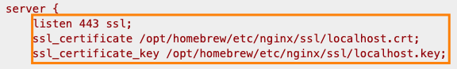
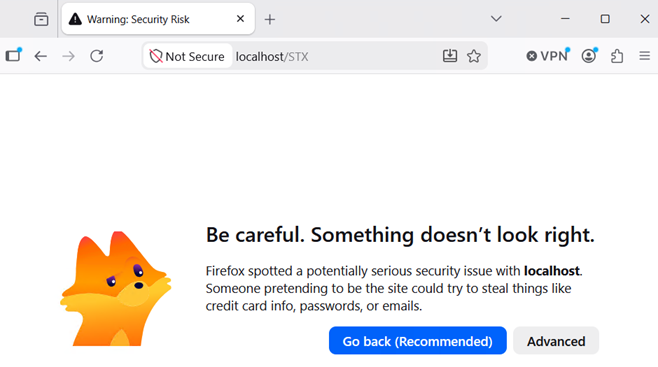
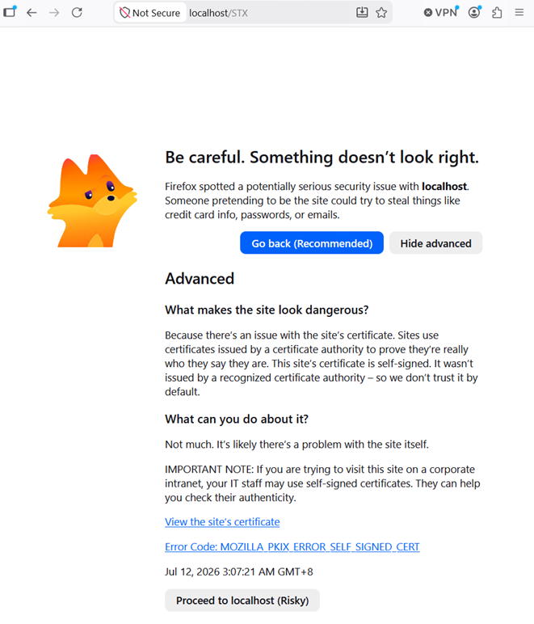
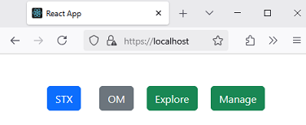
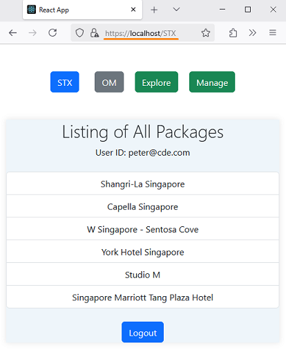
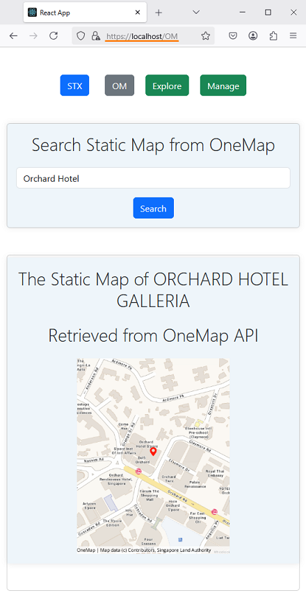
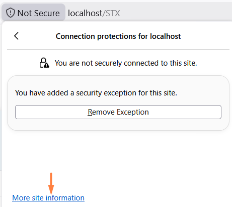
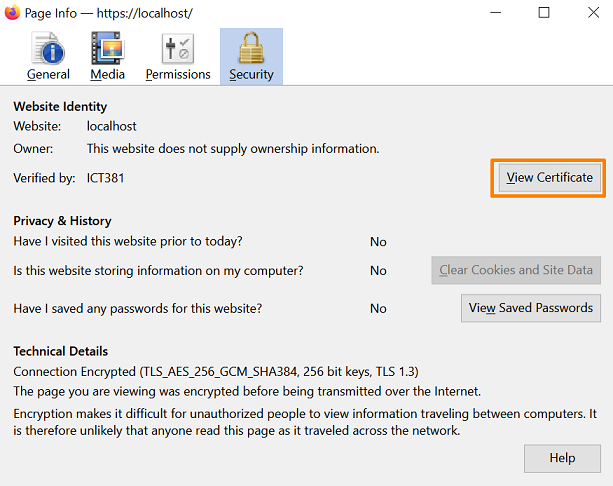
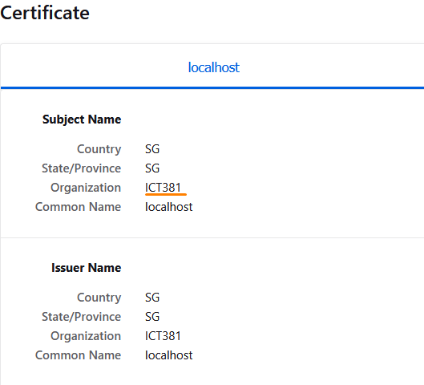

# Lab: Practice with Self-Signed TLS Certificates in Nginx

In this lab, you will generate a self-signed certificate and configure Nginx to serve your site over HTTPS.

This lab continues from **LAB 3C_MAC Task 3**. Complete all steps on your development machine.

## Prerequisites

1. Completed **LAB_3C_MAC**.
2. Nginx is installed and running.
3. OpenSSL is installed (required to generate certificates).
4. The `myReactApp` production build is already copied to `/opt/homebrew/var/www` from LAB_3C.

## What You Will Do

1. Generate a self-signed TLS certificate.
2. Update the Nginx site configuration to enable HTTPS.
3. Validate and restart Nginx.
4. Access the application over HTTPS.
5. Verify certificate details in Firefox.

## Task 1: Generate a Self-Signed Certificate

1. Open a terminal.

2. Run the following command to generate a certificate and private key:

   ```bash
   mkdir -p /opt/homebrew/etc/nginx/ssl
   openssl req -x509 -nodes -days 365 \
   -subj "/C=SG/ST=SG/O=ICT381/CN=localhost" \
   -newkey rsa:2048 \
   -keyout /opt/homebrew/etc/nginx/ssl/localhost.key \
   -out /opt/homebrew/etc/nginx/ssl/localhost.crt
   ```

   This command creates:

   - `/opt/homebrew/etc/nginx/ssl/localhost.crt` (certificate)
   - `/opt/homebrew/etc/nginx/ssl/localhost.key` (private key)

## Task 2: Update Nginx for HTTPS

From LAB_3C_MAC, you have already:

- Built `myReactApp` for production
- Copied the build output into the Nginx HTML directory
- Updated the default Nginx site to listen on port 80

Now replace the nginx configuration with an HTTPS server block.

1. Replace `/opt/homebrew/etc/nginx/nginx.conf`:

   ```bash
   tee /opt/homebrew/etc/nginx/nginx.conf <<EOF
   events {
      worker_connections 1024;
   }
   http{
      server {
         listen 443 ssl;
         ssl_certificate /opt/homebrew/etc/nginx/ssl/localhost.crt;
         ssl_certificate_key /opt/homebrew/etc/nginx/ssl/localhost.key;

         location / {
            root html;
            try_files \$uri /index.html;
         }
      }
   }
   EOF
   ```

2. Understand the key directives:

   - `listen 443 ssl;`: Configures Nginx to accept HTTPS connections on port 443, the standard port for secure web traffic.
   - `ssl_certificate`: Specifies the server certificate file that Nginx presents to clients during the TLS handshake so that clients can identify the server.
   - `ssl_certificate_key`: Specifies the private key that matches the certificate. Nginx uses this key to prove server identity and establish encrypted session.
   - `location /` with `try_files`: Serves static files from the `/opt/homebrew/var/www`. The `try_files` directive first checks for the requested path. If no matching file exists, it returns `index.html`. This fallback is required for React single-page app routing.

      

3. Test the Nginx configuration:

   ```bash
   nginx -t
   ```

4. Restart Nginx:

   ```bash
   brew services restart nginx
   ```

5. Start the StaycationX backend with Gunicorn:

   ```bash
   cd ~/StaycationX
   gunicorn --bind :5000 -m 007 --workers 3 -e FLASK_ENV=development "app:create_app()"
   ```

6. Start MongoDB:

   ```bash
   brew services start mongodb-community@7.0
   ```

## Task 3: Access the Site Over HTTPS

1. Open Firefox and browse to `https://localhost`.

2. Because the certificate is self-signed, Firefox will show a warning page.

   

3. Click **Advanced**, then click **Proceed to localhost (Risky)**.

   

4. Confirm the site loads over HTTPS.

   

5. Verify key application flows:

- Click **STX** and log in. You should see the package list.

   

- Click **OM** and log in. Search for a valid hotel name and verify the static map appears.

   

> **Tip:** In production, use certificates issued by a trusted Certificate Authority (CA). Self-signed certificates still provide encryption, but clients cannot automatically trust the server identity.

## Task 4: Verify Certificate Details in Firefox

1. Click the lock/site information icon in the Firefox address bar.
2. Click **Connection not secure**.
3. Click **More site information**.

   

4. Click **View certificate**.

   

5. Verify the certificate details:

   - Issued to: `localhost`
   - Organization: `ICT381`

   These values match the subject used in the OpenSSL command.

   

---
## 🎉 Congratulations!
You have completed the lab exercise.
